# Instructions! Read this first.

The exam is open note, open course website, open class-related code repositories 
(mine and those you produced in class). However, you may not get external help (
from other students, directed internet searches, etc.).  Please update the statement
below to acknowledge these instructions (and that you can use git).

I, INSERT YOUR NAME HERE, promise to not seek external help on the exam. I 
understand any academic issues will result in a D or F on the exam or in the class
and be reported to the Dean of Students. 

Good luck!

# Werewolf (Halloween Redux!) 


Many cultures have stories of people transforming into animals. Lycanthropy, or 
people becoming (or thinking they become) wolves is a common example that connects 
to the mythos around werewolves.

Imagine werewolves are actually real and are caused by a virus that quickly spreads 
in communities. However, not everyone who has the virus transforms into werewolves
for a number of reasons.  While society has ways to deal with the virus (and werewolves),
the virus that causes people to transform is continuously evolving and thus must
be studied (does all this sound familiar?). A recent strain of concern has been noted.  

# #1

1. Following up on the 78001 exam, conduct the analysis you recommended for the 
sleep tracker study.  As a reminder, 
a study is done to determine if the new strain leads to more people becoming 
werewolves. Historically,
10% of people in the focal town transformed during full moons. Last month, a study 
using sleep trackers found 17 out of 110 subjects infected with the new strain
became werewolves.  Is there 
evidence that transformations are becoming more common with this strain?  Make 
sure you include

* null hypothesis (1 pt)
  * *H~0~: # of people transforming is no different with new strain/is equal to 10%*
* alternative hypothesis (1 pt)
  * *H~A~: # of people transforming is  different with new strain/is not equal to 10%*
* explanation for test you will use (1 pt)
  * *I will use a binomial test to compare the calculated transformation rate to a 
  a given value.*
* results from statistical test (1 pt)


```r
binom.test(17,110, p=.1)
```

```
## 
## 	Exact binomial test
## 
## data:  17 and 110
## number of successes = 17, number of trials = 110, p-value = 0.07742
## alternative hypothesis: true probability of success is not equal to 0.1
## 95 percent confidence interval:
##  0.09268325 0.23587260
## sample estimates:
## probability of success 
##              0.1545455
```

```r
#or 

binom.test(17,110, p=.1, alternative = "greater")
```

```
## 
## 	Exact binomial test
## 
## data:  17 and 110
## number of successes = 17, number of trials = 110, p-value = 0.04652
## alternative hypothesis: true probability of success is greater than 0.1
## 95 percent confidence interval:
##  0.10093 1.00000
## sample estimates:
## probability of success 
##              0.1545455
```
* clear explanation of how results relate to your stated hypotheses (2 pt)
  * *I found a p-value of .03 (<.05), so I reject the null hypothesis. The 
  number of people transforming has changed. **BONUS/not required** It appears to 
  be increasing.*

# #2

2. Develop confidence intervals to match this data and explain what they mean. (2 pts) 


```r
library(binom)
```

```
## Warning: package 'binom' was built under R version 4.2.2
```

```r
binom.confint(17,110)
```

```
##           method  x   n      mean      lower     upper
## 1  agresti-coull 17 110 0.1545455 0.09781965 0.2345853
## 2     asymptotic 17 110 0.1545455 0.08699551 0.2220954
## 3          bayes 17 110 0.1576577 0.09272043 0.2260930
## 4        cloglog 17 110 0.1545455 0.09444402 0.2281922
## 5          exact 17 110 0.1545455 0.09268325 0.2358726
## 6          logit 17 110 0.1545455 0.09828990 0.2346209
## 7         probit 17 110 0.1545455 0.09660140 0.2317486
## 8        profile 17 110 0.1545455 0.09529930 0.2296965
## 9            lrt 17 110 0.1545455 0.09529030 0.2296962
## 10     prop.test 17 110 0.1545455 0.09516327 0.2387607
## 11        wilson 17 110 0.1545455 0.09878652 0.2336184
```

```r
#or
binom.confint(17,110, conf.level = .9)
```

```
##           method  x   n      mean      lower     upper
## 1  agresti-coull 17 110 0.1545455 0.10563277 0.2200437
## 2     asymptotic 17 110 0.1545455 0.09785575 0.2112352
## 3          bayes 17 110 0.1576577 0.10100471 0.2130993
## 4        cloglog 17 110 0.1545455 0.10304472 0.2156210
## 5          exact 17 110 0.1545455 0.10092996 0.2227526
## 6          logit 17 110 0.1545455 0.10590646 0.2200254
## 7         probit 17 110 0.1545455 0.10464904 0.2180591
## 8        profile 17 110 0.1545455 0.10368463 0.2166490
## 9            lrt 17 110 0.1545455 0.10367873 0.2166468
## 10     prop.test 17 110 0.1545455 0.09516327 0.2387607
## 11        wilson 17 110 0.1545455 0.10622246 0.2194540
```

*The 95% confidence interval is 10.6 - 22.0% using the Agresti-Coull method (1 pts). A 
95% confidence interval means if we sampled the population many times and 
constructed confidence intervals for each sample, 95% of the time the interval 
would contain the true population parameter. (1 pts)*

# #3

3.  Analyze the data from the class question on vaccine impacts. As a reminder,
as one attempt at controlling the outbreak, a company has developed a drug
that it claims reduces the chances of people transforming.  150 participants, all
of who transformed during the last full moon, are selected to take part in clinical 
trials.  A third (the control group) receive a  placebo, a third receive a single 
dose of the new drug, and a third receive 2 doses.  During the next full moon, 33 out of 50 individuals in the control
group transform into wolves.  43 out of 50 in the single dose group transform, and 
45 out of 50 in the 2-dose group transform. (6 pts) 

Use this data
to investigate the impact of the drug. Make sure you include

* null hypothesis (1 pt)
  * *H~0~: the proportion of people transforming is the same regardless of drug 
  dosage*
* alternative hypothesis (1 pt)
  * *H~A~: the proportion of people transforming is not the same regardless of 
  drug dosage*
* explanation for test you will use (1 pt)
  * I will use a goodness of fit test/contingency analysis. Data are count-based.
  I will check assumptions once model is created.
* results from statistical test (1 pt)


```r
outcomes <- matrix(c(33, 50-33, 43, 50 - 43, 45, 50-45), nrow = 3, byrow = T)
colnames(outcomes) <- c("change", "not change")
rownames(outcomes)<- c("control", "single", "double")

chisq.test(outcomes)
```

```
## 
## 	Pearson's Chi-squared test
## 
## data:  outcomes
## X-squared = 10.601, df = 2, p-value = 0.004988
```

```r
library(rcompanion)
```

```
## Warning: package 'rcompanion' was built under R version 4.2.2
```

```r
pairwiseNominalIndependence(outcomes, compare = "row", method = "holm")
```

```
##         Comparison p.Fisher p.adj.Fisher p.Gtest p.adj.Gtest p.Chisq
## 1 control : single   0.0338       0.0676 0.01780     0.03560 0.03510
## 2 control : double   0.0070       0.0210 0.00306     0.00918 0.00792
## 3  single : double   0.7600       0.7600 0.53700     0.53700 0.75800
##   p.adj.Chisq
## 1      0.0702
## 2      0.0238
## 3      0.7580
```

Data were analyzed using a /chi^2 test given we are comparing proportions among 
groups.  A low p-value (p<.001) indicated a difference existed among the groups. 
I followed this up with pair-wise comparisons where I controlled for FWER using the
sequential Bonferroni method.  Results indicated a significant difference 
existed among between the control and double dose group (p = .008) and control and single
dose groups (p=.035).  Notably, vaccinated groups were more likely to transform.

# #4

Make the data


```r
set.seed(13)
height <- data.frame(Gender = c(rep("M", 150), rep("F", 150)), 
                     Treatment = rep(c(rep("control", 50), rep("single", 50), 
                                   rep("double", 50)),2),
                     change = rnorm(300, 0, .1)+ # no impact
                       c(rep(0,150), rnorm(150,2,.5))+ # impact on F 
                       c(rep(0,250),rnorm(50, 2, .5))) #impact of double dose larger

write.csv(height, "vaccine_height.csv", row.names = F)
```

Analyze the data from the follow-up vaccine study. As a reminder,
In later correspondence, the company scientist note they also tracked adverse 
reactions including changes in height in a follow-up study because people are 
concerned werewolf vaccines can do strange things.  The dataset includes information
on participant gender (M, F); treatment (Control (no vaccine), single or double 
dose; and change in height in mm. Data can be downloaded using.


```r
height <- read.csv("https://raw.githubusercontent.com/jsgosnell/CUNY-BioStats/master/datasets/vaccine_height.csv", stringsAsFactors = T)
```

Use this data
to investigate the impact of the drug on changes in height. Make sure you include

* null hypothesis (1 pt)
  * does does not impact change in height following vaccination
  * gender does not impact change in height following vaccination
  * gender and dose do not interact to impact change in height following vaccination
* alternative hypothesis (1 pt)
  * does does impact change in height following vaccination
  * gender does impact change in height following vaccination
  * gender and dose do interact to impact change in height following vaccination
* explanation for test you will use (1 pt)

I will use a factorial ANOVA to consider these hypotheses. The outcome is numeric 
and the explanatory variables (2) are categorial. The design is crossed so I can
also consider interactions

* results from statistical test (1 pt)

```r
height_lm <- lm(change ~ Gender*Treatment, height)
plot(height_lm)
```

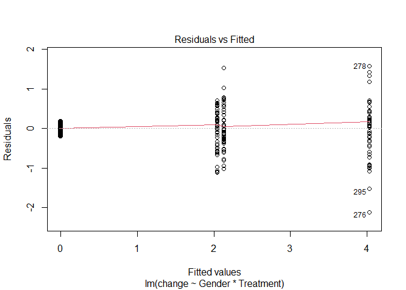<!-- -->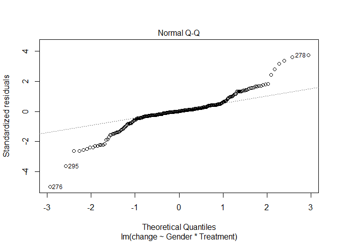<!-- -->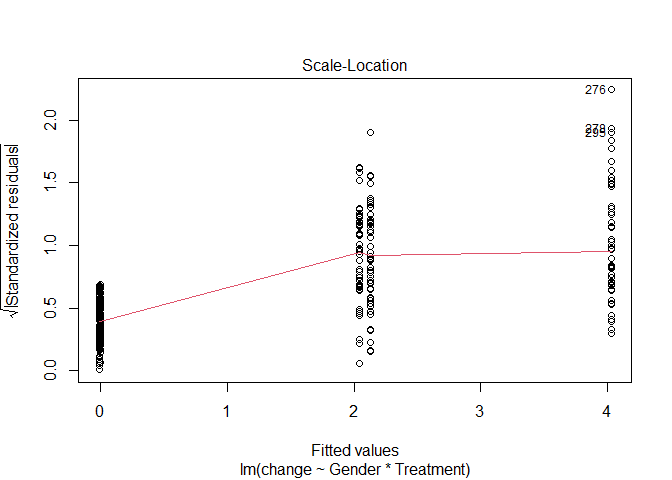<!-- -->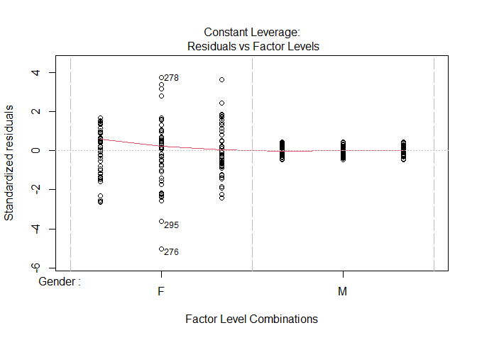<!-- -->

I first check assumptions. Even though there is some evidence of variance increasing 
with mean, I think a linear model is ok.


```r
library(car)
```

```
## Loading required package: carData
```

```r
Anova(height_lm, type="III")
```

```
## Anova Table (Type III tests)
## 
## Response: change
##                  Sum Sq  Df F value    Pr(>F)    
## (Intercept)      209.41   1 1155.11 < 2.2e-16 ***
## Gender           104.98   1  579.05 < 2.2e-16 ***
## Treatment        125.48   2  346.09 < 2.2e-16 ***
## Gender:Treatment  62.73   2  173.01 < 2.2e-16 ***
## Residuals         53.30 294                      
## ---
## Signif. codes:  0 '***' 0.001 '**' 0.01 '*' 0.05 '.' 0.1 ' ' 1
```
* clear explanation of how results relate to your stated hypotheses (2 pt)
  * *the outcomes suggest significant interaction between gender and dosage (F~2,294~=173,
  p<0.001), so I compared each gender separately.
  

```r
height_lm_m <- lm(change ~ Treatment, height[height$Gender == "M",])
plot(height_lm_m)
```

<!-- -->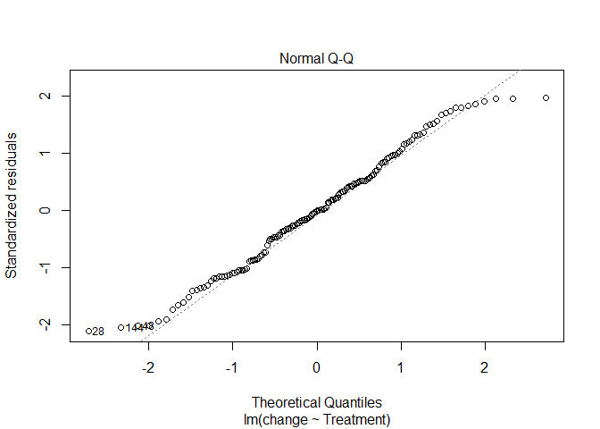<!-- -->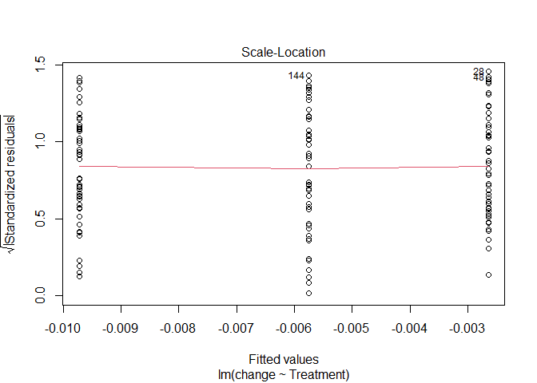<!-- -->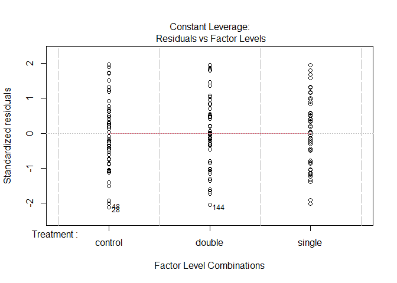<!-- -->

```r
Anova(height_lm_m, type = "III")
```

```
## Anova Table (Type III tests)
## 
## Response: change
##              Sum Sq  Df F value Pr(>F)
## (Intercept) 0.00035   1  0.0382 0.8453
## Treatment   0.00126   2  0.0689 0.9334
## Residuals   1.34302 147
```
  
There is no evidence (p=.9334) for impact of drug on male height. Assumptions again
appear to be valid.


```r
height_lm_f <- lm(change ~ Treatment, height[height$Gender == "F",])
plot(height_lm_f)
```

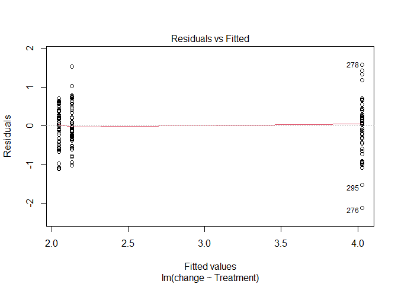<!-- -->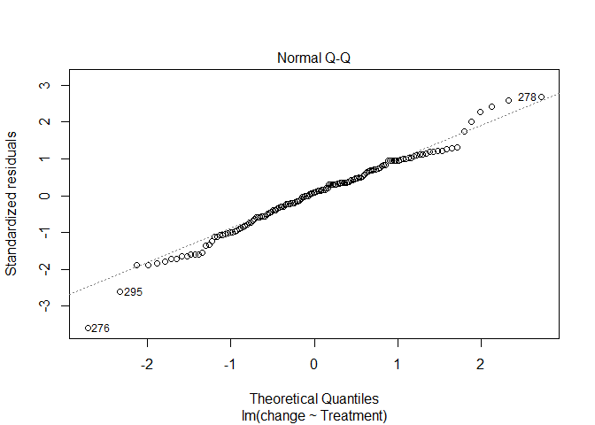<!-- -->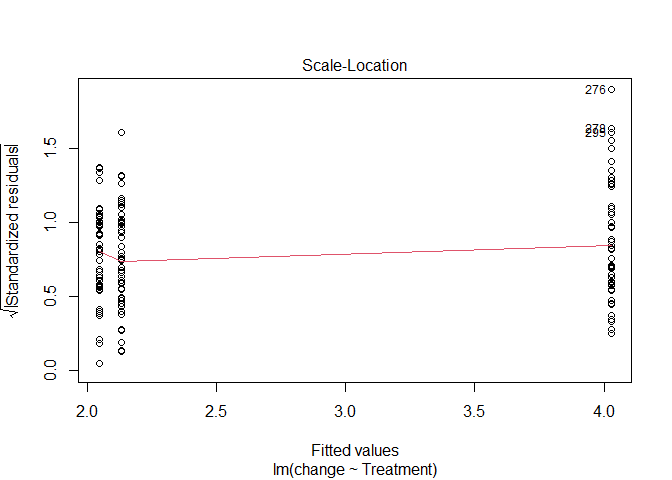<!-- -->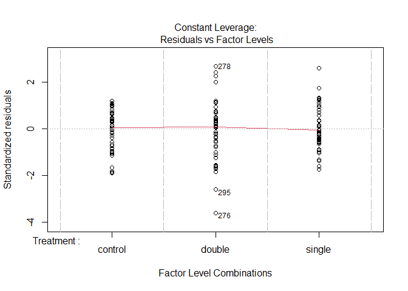<!-- -->

```r
Anova(height_lm_f, type = "III")
```

```
## Anova Table (Type III tests)
## 
## Response: change
##              Sum Sq  Df F value    Pr(>F)    
## (Intercept) 209.411   1  592.48 < 2.2e-16 ***
## Treatment   125.485   2  177.52 < 2.2e-16 ***
## Residuals    51.957 147                      
## ---
## Signif. codes:  0 '***' 0.001 '**' 0.01 '*' 0.05 '.' 0.1 ' ' 1
```

There is strong evidence for impact of dosage on female height (p<.001), so I 
conducted post-hoc tests using sequential Bonferroni methods to control the FWER.


```r
library(multcomp)
```

```
## Loading required package: mvtnorm
```

```
## Loading required package: survival
```

```
## Loading required package: TH.data
```

```
## Loading required package: MASS
```

```
## 
## Attaching package: 'TH.data'
```

```
## The following object is masked from 'package:MASS':
## 
##     geyser
```

```r
summary(glht(height_lm_f, linfct = mcp(Treatment = "Tukey")))
```

```
## 
## 	 Simultaneous Tests for General Linear Hypotheses
## 
## Multiple Comparisons of Means: Tukey Contrasts
## 
## 
## Fit: lm(formula = change ~ Treatment, data = height[height$Gender == 
##     "F", ])
## 
## Linear Hypotheses:
##                       Estimate Std. Error t value Pr(>|t|)    
## double - control == 0  1.98119    0.11890  16.662   <1e-04 ***
## single - control == 0  0.08466    0.11890   0.712    0.757    
## single - double == 0  -1.89653    0.11890 -15.950   <1e-04 ***
## ---
## Signif. codes:  0 '***' 0.001 '**' 0.01 '*' 0.05 '.' 0.1 ' ' 1
## (Adjusted p values reported -- single-step method)
```

Results indicates the double dosage differs from both other groups (p<.05).

# #5

Make the data


```r
set.seed(25)
moonlight <- data.frame(lunar_intensity = runif(60, 0, 1))
moonlight$heart_rate <- rnorm(60, 75,5)
write.csv(moonlight, "moonlight.csv", row.names = F)
```

5. 60 participants were randomly selected from the nation wide (United States)
transformation registry.  Each individual was outfitted with heart rate and lux
(light intensity) monitors to study relationship between maximum observed heart
rate and light intensity .  Data is available @ 


```r
moonlight <- read.csv("https://raw.githubusercontent.com/jsgosnell/CUNY-BioStats/master/datasets/moonlight.csv", stringsAsFactors = T)
```


Analyze the data. Make sure to include

* null hypothesis (1 pt)
  * *H~0~: there is no relationship between lunar light intensity and heart 
  rate*
* alternative hypothesis (1 pt)
  * *H~A~: # there is a relationship between lunar light intensity and heart 
  rate*
* explanation for test you will use (1 pt)
  * *I will use linear regression. I'm assuming light intensity might drive heart
  rate, and both variables are continuous.  Correlation/association is another 
  option.*
* results from statistical test (1 pt)


```r
moonlight_lm <- lm(heart_rate~lunar_intensity, moonlight)
plot(moonlight_lm)
```

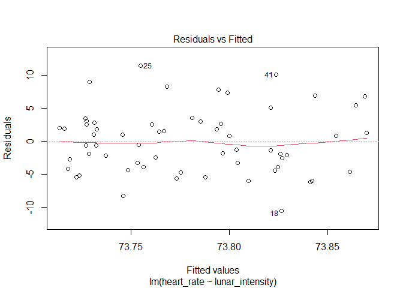<!-- -->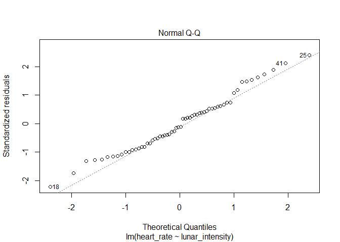<!-- -->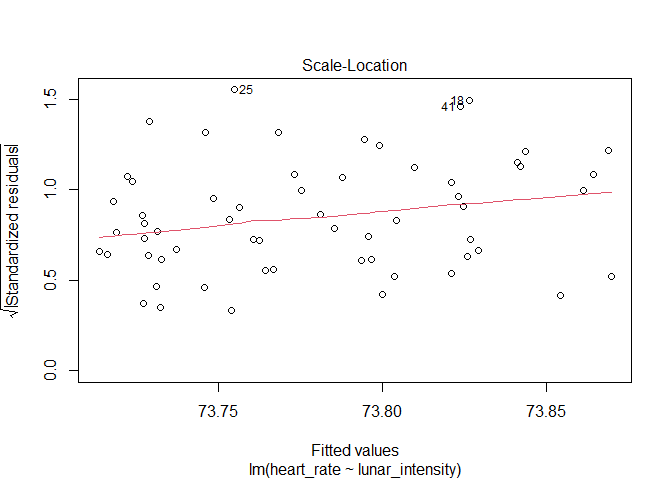<!-- -->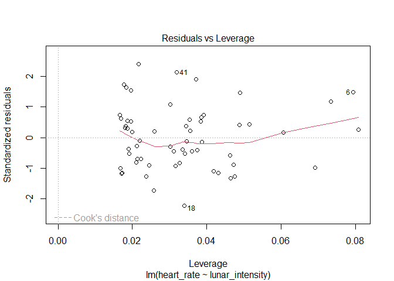<!-- -->

```r
summary(moonlight_lm)
```

```
## 
## Call:
## lm(formula = heart_rate ~ lunar_intensity, data = moonlight)
## 
## Residuals:
##      Min       1Q   Median       3Q      Max 
## -10.5512  -3.9096  -0.5589   2.6699  11.4861 
## 
## Coefficients:
##                 Estimate Std. Error t value Pr(>|t|)    
## (Intercept)      73.7068     1.1710  62.944   <2e-16 ***
## lunar_intensity   0.1645     2.2331   0.074    0.942    
## ---
## Signif. codes:  0 '***' 0.001 '**' 0.01 '*' 0.05 '.' 0.1 ' ' 1
## 
## Residual standard error: 4.825 on 58 degrees of freedom
## Multiple R-squared:  9.353e-05,	Adjusted R-squared:  -0.01715 
## F-statistic: 0.005425 on 1 and 58 DF,  p-value: 0.9415
```
* clear explanation of how results relate to your stated hypotheses (2 pt)

  * Assumptions appear to be met. Lunar intensity is not related to heart rate
  (p=.942).

# #6

6. Graph the data used in question 5 in an appropriate way (5 pts)


```r
library(ggplot2)
ggplot(moonlight,aes(lunar_intensity,heart_rate))+
  geom_point()+
  geom_smooth(color="blue",size=1, method = "lm")+
  xlab("maximum lunar intensity (lux)")+
  ylab("maximum heart rate (bpm)")+
  ggtitle("maximum heart rate is independent of maximum light intensity")
```

```
## `geom_smooth()` using formula 'y ~ x'
```

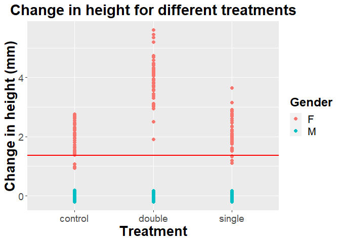<!-- -->


```r
ggplot(height, aes(Treatment,change)) + 
  geom_point(aes(colour=Treatment), size = 2) +
  ylab("Change in height (mm)")+ggtitle("Change in height for different treatments")+
  theme(axis.title.x = element_text(face="bold", size=20), 
        axis.title.y = element_text(face="bold", size=20), 
        axis.text.y  = element_text(size=14),
        axis.text.x  = element_text(size=14), 
        legend.text = element_text(size=16),
        legend.title = element_text(size=18, face="bold"),
        plot.title = element_text(hjust = 0.5, face="bold", size=22))+
  geom_hline(aes(yintercept = mean(change)), size = 1, color = "red")
```

<!-- -->


```r
library(ggplot2)
ggplot(height, aes(Treatment,change)) + 
  geom_boxplot(aes(colour=Treatment), size = 2) +
  ylab("Change in height (mm)")+ggtitle("Change in height for different treatments")+
  theme(axis.title.x = element_text(face="bold", size=20), 
        axis.title.y = element_text(face="bold", size=20), 
        axis.text.y  = element_text(size=14),
        axis.text.x  = element_text(size=14), 
        legend.text = element_text(size=16),
        legend.title = element_text(size=18, face="bold"),
        plot.title = element_text(hjust = 0.5, face="bold", size=22))
```

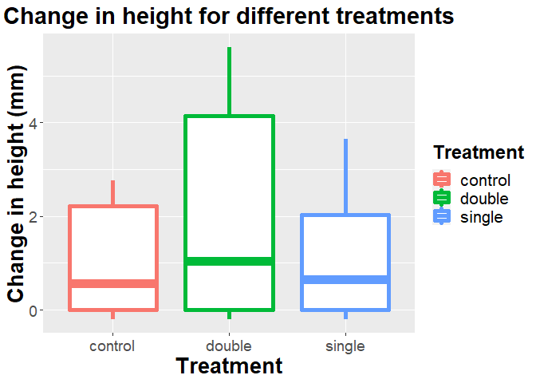<!-- -->


```r
ggplot(height, aes(Treatment,change)) + 
  geom_point(aes(colour=Gender), size = 2) +
  ylab("Change in height (mm)")+ggtitle("Change in height for different treatments")+
  theme(axis.title.x = element_text(face="bold", size=20), 
        axis.title.y = element_text(face="bold", size=20), 
        axis.text.y  = element_text(size=14),
        axis.text.x  = element_text(size=14), 
        legend.text = element_text(size=16),
        legend.title = element_text(size=18, face="bold"),
        plot.title = element_text(hjust = 0.5, face="bold", size=22))+
  geom_hline(aes(yintercept = mean(change)), size = 1, color = "red")
```

<!-- -->


