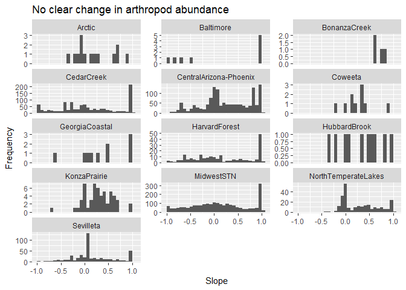
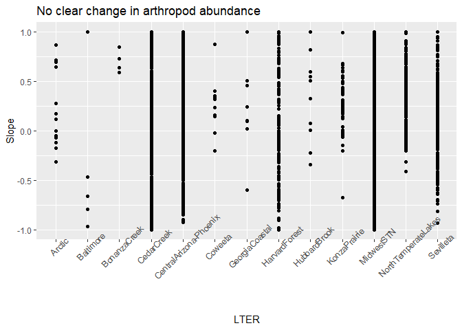
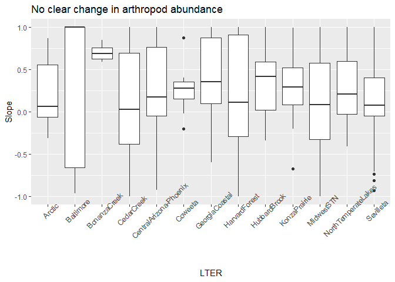
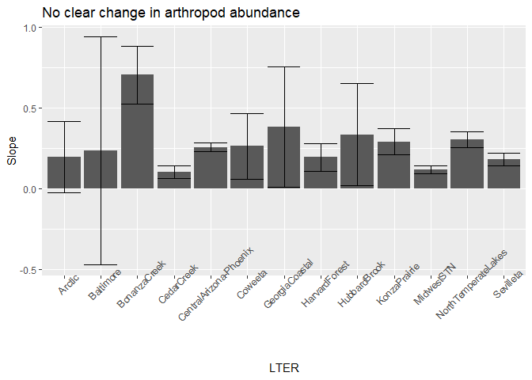

# Investigating insect declines

Recent studies have noted large declines in insect abundances, but these studies have mainly
focused on evidence from Europe.  Crossley at al (2021) investigated this issue using 
publicly-available data from Long-term Ecological Research (LTER) projects.

Data can be loaded using 


```r
time_series <- read.csv("https://raw.githubusercontent.com/jsgosnell/CUNY-BioStats/master/datasets/data_from_crossley_et_al_2021.csv",
                       stringsAsFactors = T)
```

Create a properly-labeled plot that shows how change over time (measured as slope, we'll get 
to that later in class) compares among LTERs. Make sure you show variation somehow!
Note the column of interest is **b** and groups are defined in the **LTER** 
column. Multiple options exist.


### histogram options


```r
library(ggplot2)
ggplot(time_series, aes(x = b)) +
  geom_histogram() +
  ylab("Frequency")+
  xlab("Slope") +
  ggtitle("No clear change in arthropod abundance") +
  facet_wrap(~LTER, ncol = 3, scales = "free_y")
```

```
## `stat_bin()` using `bins = 30`. Pick better value with `binwidth`.
```

```
## Warning: Removed 16 rows containing non-finite values (stat_bin).
```

<!-- -->

### raw data


```r
ggplot(time_series, aes(x = LTER, y = b)) +
  geom_point() +
  ylab("Slope")+
  xlab("LTER") +
  ggtitle("No clear change in arthropod abundance") +
  theme(axis.text.x = element_text(angle=45))
```

```
## Warning: Removed 16 rows containing missing values (geom_point).
```

<!-- -->

### box plot


```r
ggplot(time_series, aes(x = LTER, y = b)) +
  geom_boxplot() +
  ylab("Slope")+
  xlab("LTER") +
  ggtitle("No clear change in arthropod abundance") +
  theme(axis.text.x = element_text(angle=45))
```

```
## Warning: Removed 16 rows containing non-finite values (stat_boxplot).
```

<!-- -->

### bar charts


```r
library(Rmisc)
```

```
## Loading required package: lattice
```

```
## Loading required package: plyr
```

```r
summary_time <- summarySE(time_series, measurevar = "b", groupvars = "LTER", na.rm = T)
ggplot(summary_time, aes(x=LTER,y=b))+
  geom_col()+
  geom_errorbar(aes(ymin=b-ci, ymax=b+ci))+
  ylab("Slope")+
  xlab("LTER") +
  ggtitle("No clear change in arthropod abundance") +
  theme(axis.text.x = element_text(angle=45))
```

<!-- -->

