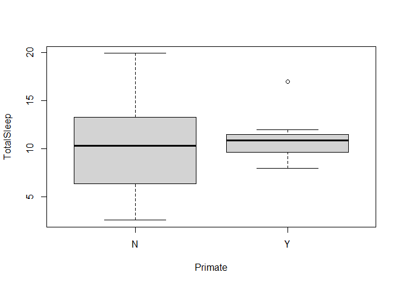
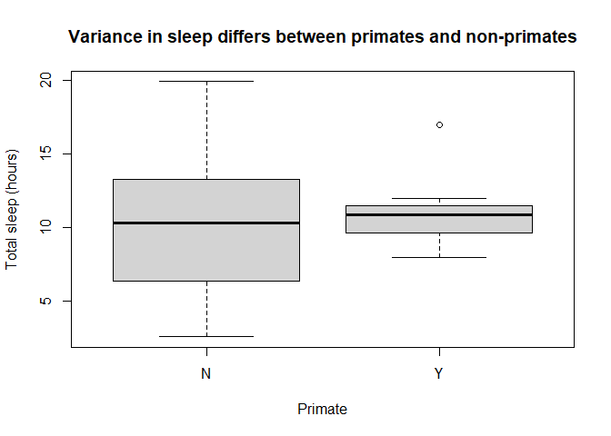
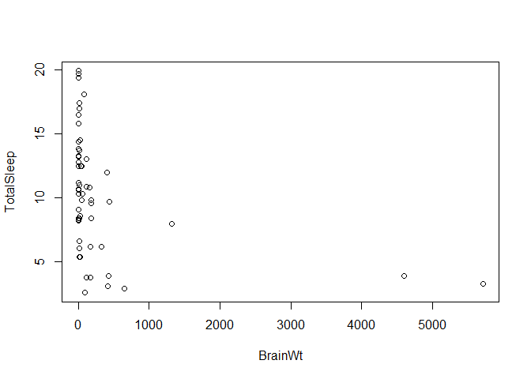

### Overview

#### Rmd basics


Rmd files differ from R files in that they combine regular text with code chunks.
This is a code chunk


```r
print("this is a chunk")
```

```
## [1] "this is a chunk"
```

Code chunks combine code with output. When combined with regular text/prose, 
this makes it easier to produce a range of documents.  You set the output in 
the YAML header (the stuff between the 3 dashes you see at top of this document).

After you write the file, you **Knit** it to turn the Rmd file into the selected 
output.  Try it now.  Note the first time you do this in a project you may be
prompted to install a number of packages!  If you are using a webservice you may
also need to allow pop-ups in your browser. Don't be surprised if a new window 
pops up (it should). 


The **Knit** button saves the .Rmd file and renders a new version whose output 
depends on what you selected in the header. Here we have html_document,
so if everything works a preview of a webpage like document should appear. The file
also produces a github friendly .md file. **This means you should only edit the 
Rmd file (leave the md and output files alone! They are automatically produced
any changes you make there will be overwritten by your next knit)**.  

When you **Knit** a file, it runs in a totally new R instance. this means anything
you only added in your instance (like working in the console) won't be available.
In other words, its the best way to see what a "new" user gets when they use your
code.

however, you don't have to knit the file every time. if you just want to see output,
note you can press the green button next to an R chunk.


```r
print("this is a chunk")
```

```
## [1] "this is a chunk"
```

Now we'll start changing the file to show you how rmarkdown works.
First, amend the file by replacing the **NAME** and **DATE** spots in the header
(top of the
file between the --- markers) with your name and the real date.  Then **Knit** the
file again. You should see your name in the new preview. 

Rstudio has a **Markdown Quick Reference** guide (look under the help tab), but 
some general notes. 

* Pound/Hashtag signs denote headers
* you can surround something double asterisks for bold or single asterisks for italics
* lists are denoted by numbers or asterisks at beginning of line (followed by space!)
  * and can be indented for sublevels
* R code can be done inline, but is generally placed in stand-alone chunks
  * these will, by default, show the code and output
* lots of other options exist!

The main idea is Rmd files allow you to combine code, text, graphs, etc into 
multiple outputs that you can share (including with coding illiterate colleagues
who just want output).

To practice working with Rmd files and R, work through the questions below. You 
can also get more help with [this video](https://www.youtube.com/watch?v=shs95EH4EhY&list=PLmnVhyQ-20EUFRmsjpYTyB5--zyolr6-o&index=9&t=24s){target="_blank"}

### Practice in R 

#### 1

1. Let x be defined by


```r
x <- 5:15
```
Try executing this chunk (in R studio, not the webview) by clicking the *Run* 
button within the chunk or by placing your cursor inside it and pressing 
*Ctrl+Shift+Enter*.

This will run the code in the Console.  You may need to switch to Console (from
Rmarkdown) in the lower right window area to see this.   The executed code is 
also displayed in your processed file (hit **Knit** again to see this!).  

Note running this chunk has added an object named `x` to the **Environment** tab
area (top right area of screen).  But nothing was "returned" in the console.  You
prove this by typing `x` in the console. What does it return?

Determine what the “:” does!  Complete the following sentence:


```r
x <- 5:15
```


*The : means "create a sequence counting by 1's from a to b  (in a:b)".*

#### 2

2. Now try to guess the output of these commands

* length(x)
* max(x)
* x[x < 5]
* x^2
* x[ x < 8 & x > 2]


INSERT AN R CHUNK HERE AND RUN EACH OF THESE COMMANDS.  Add a new chunk by clicking the *Insert Chunk* button on the toolbar or by pressing *Ctrl+Alt+I*. Then state what
each of these does.


```r
length(x)
```

```
## [1] 11
```

```r
max(x)
```

```
## [1] 15
```

```r
x[x < 5]
```

```
## integer(0)
```

```r
x^2
```

```
##  [1]  25  36  49  64  81 100 121 144 169 196 225
```

```r
x[ x < 8 & x > 2]
```

```
## [1] 5 6 7
```

*Length of x returns the number of elements in a vector.  max returns the highest 
value. square brackets allows you to return (or work with) only portions of a vector.
^2 squares a value.*

#### 3

3.  Is `-1:2` the same as `(-1):2` or `-(1:2)`? INSERT AN R CHUNK HERE AND RUN EACH OF 
THESE COMMANDS. Then state what each of these does.


```r
-1:2
```

```
## [1] -1  0  1  2
```

```r
(-1):2
```

```
## [1] -1  0  1  2
```

```r
-(1:2)
```

```
## [1] -1 -2
```
*The first creates a sequence from -1 to 2 by ones (see question 1).  The second
does the same. The third creates a sequence from 1 to 2 then applies a negative to it.*

### Data input, plotting, and tests

You can read in a dataset from the internet following this protocol.


```r
sleep <- read.csv("http://raw.githubusercontent.com/jsgosnell/CUNY-BioStats/master/datasets/sleep.csv", stringsAsFactors = T)
```

Run this chunk and note it has added an object named `sleep` to the environment. 

*Make sure you see the object in the environment tab!*

Info on the dataset is viewable @ http://www.statsci.org/data/general/sleep.html.


#### 4

4. How many rows does the **sleep** data set have (hint: `?dim`)?  What kind of data is stored in each variable?

ENTER ANSWERS HERE. ADD ANY R CHUNKS YOU USED TO FIND THE ANSWER.


```r
dim(sleep)
```

```
## [1] 62 12
```
*dim returns the number of rows and columns (IN THAT ORDER) in a dataframe! So 
sleep has 62 rows. NOTE: If you look at the .Rmd code here, you can
see how to put R output inline (instead of in chunks).*


```r
str(sleep)
```

```
## 'data.frame':	62 obs. of  12 variables:
##  $ Species    : Factor w/ 62 levels "Africanelephant",..: 1 2 3 4 5 6 7 8 9 10 ...
##  $ BodyWt     : num  6654 1 3.38 0.92 2547 ...
##  $ BrainWt    : num  5712 6.6 44.5 5.7 4603 ...
##  $ NonDreaming: num  NA 6.3 NA NA 2.1 9.1 15.8 5.2 10.9 8.3 ...
##  $ Dreaming   : num  NA 2 NA NA 1.8 0.7 3.9 1 3.6 1.4 ...
##  $ TotalSleep : num  3.3 8.3 12.5 16.5 3.9 9.8 19.7 6.2 14.5 9.7 ...
##  $ LifeSpan   : num  38.6 4.5 14 NA 69 27 19 30.4 28 50 ...
##  $ Gestation  : num  645 42 60 25 624 180 35 392 63 230 ...
##  $ Predation  : int  3 3 1 5 3 4 1 4 1 1 ...
##  $ Exposure   : int  5 1 1 2 5 4 1 5 2 1 ...
##  $ Danger     : int  3 3 1 3 4 4 1 4 1 1 ...
##  $ Primate    : Factor w/ 2 levels "N","Y": 1 1 1 1 1 1 1 1 1 2 ...
```

*the str function returns the size of the dataset and the class of each column.
Note how we use the the $ notation to select columns.*


#### 5

5.  Change the column named *BodyWt* to *Body_weight*”* in the sleep dataset.

ADD ANY R CHUNKS YOU USED TO COMPLETE THE TASK.


```r
names(sleep)[names(sleep) %in% "BodyWt"] <- "Body_weight"
```

#### 6

6.  Produce a plot of how *TotalSleep* differs between primates and other species. What is this plot showing?

Note, as of early 2020 R no longer reads in strings as factors! This means the 
Primate column, which is full of "Yes"s and "No"s, reads in as words and R doesn't
know how to plot them. There are many ways to handle this. You can modify the 
read.csv command (add  stringsAsFactors = T option), eg*

```r
sleep <- read.csv("http://raw.githubusercontent.com/jsgosnell/CUNY-BioStats/master/datasets/sleep.csv", stringsAsFactors = T)
```
If you do this, you'll need to rechange anything you previously updated to the
object (like renaming the BodyWt column).

You can also modify a single column for the 
actual object 


```r
sleep$Primate <- factor (sleep$Primate)
```

or for a single command, eg (plot not actually shown!)


```r
plot(BodyWt ~ factor(Primate), data = sleep)
```


NOTE YOU CAN ADD A PLOT TO THE DOCUMENT TOO! AMEND THE BELOW AS NEEDED.  

```r
plot(cars)
```

<!-- -->

*Answer is*


```r
plot(TotalSleep ~ Primate, sleep)
```

<!-- -->

*or to clean it up (we'll introduce ggplot2 in a few sessions to help with this)*


```r
plot(TotalSleep ~ factor(Primate), sleep, main = "Variance in sleep differs between primates and non-primates", 
     xlab = "Primate", ylab = "Total sleep (hours)")
```

<!-- -->

#### 7

7.  The **sleep** dataset begs to have a linear model fit for it. Let’s consider. First plot how *TotalSleep* is explained by *BrainWt*. Are there any issues with the data? Exclude any outlier and fit a linear model to obtain the p-value for the model (hint: summary()).  What does this imply?  

ENTER ANSWERS HERE. ADD ANY R CHUNKS YOU USED TO FIND THE ANSWER.

*First look for outliers (before fitting a model)*

```r
plot(TotalSleep ~ BrainWt, sleep)
```

<!-- -->

*We have few measurements where BrainWt >1000, so let's exclude those for the model*


```r
sleep_fit <- lm(TotalSleep ~ BrainWt, sleep[sleep$BrainWt<1000,])
summary(sleep_fit)
```

```
## 
## Call:
## lm(formula = TotalSleep ~ BrainWt, data = sleep[sleep$BrainWt < 
##     1000, ])
## 
## Residuals:
##     Min      1Q  Median      3Q     Max 
## -8.0342 -2.8719  0.1718  2.0426  7.8037 
## 
## Coefficients:
##              Estimate Std. Error t value Pr(>|t|)    
## (Intercept) 12.099991   0.632611  19.127  < 2e-16 ***
## BrainWt     -0.014926   0.003833  -3.894 0.000278 ***
## ---
## Signif. codes:  0 '***' 0.001 '**' 0.01 '*' 0.05 '.' 0.1 ' ' 1
## 
## Residual standard error: 4.021 on 53 degrees of freedom
##   (4 observations deleted due to missingness)
## Multiple R-squared:  0.2224,	Adjusted R-squared:  0.2078 
## F-statistic: 15.16 on 1 and 53 DF,  p-value: 0.0002782
```
*We see a significant (p <.05, don't worry, we'll see this later) relationship 
between BrainWt and TotalSleep, and it appears that TotalSleep decreases as BrainWt
increases (note the negative estimate). We can visualize this using*


```r
plot(TotalSleep ~ BrainWt, data = sleep[sleep$BrainWt <  1000, ])
abline(sleep_fit)
```

<!-- -->

### EXTRA QUESTIONS
*not required*


**Dow Puffin** *Matthew Zalewski / CC BY (https://creativecommons.org/licenses/by/3.0)*

#### 8

8.  Sometimes data doesn’t have headers (column names),so you have to add them.
Download a dataset on alcids (birds like puffins and auklets)  from 
https://raw.githubusercontent.com/jsgosnell/CUNY-BioStats/master/datasets/alcids55.csv.  
You’ll need to modify the read.csv function by specifying `header = False`, 
then use the `names` function to name the columns ["year", "a1_abund", "NAO", "a2_abund", "a3_abund", "a4_abund", "a5_abund", "a6_abund"]. 
Try it and check your input using the `head` command.

ENTER ANSWERS HERE. ADD ANY R CHUNKS YOU USED TO FIND THE ANSWER.


```r
alcids <- read.csv("https://raw.githubusercontent.com/jsgosnell/CUNY-BioStats/master/datasets/alcids55.csv",header = F, stringsAsFactors = T)
names(alcids) <- c("year", "a1_abund", "NAO", "a2_abund", "a3_abund", "a4_abund", "a5_abund", "a6_abund")
head(alcids)
```

```
##   year a1_abund   NAO a2_abund a3_abund a4_abund a5_abund a6_abund
## 1 1954       55 -2.52      100        1        0        8        0
## 2 1955       44 -1.73      100        1        0       10        0
## 3 1956       50  1.52      100        1        0        7        1
## 4 1957      100 -1.02    18000        2       50        8        0
## 5 1958        5 -0.37     1000        2       15       10        0
## 6 1959      400 -1.54     1500        3      190        6        3
```

#### 9

9.  Here’s a sample dataset:

Date | greenness| Richness| habitat
---|---|---|---
12-25-2009| 13766| 46| forest
01-01-2010| 50513| 60| forest
01-15-2010| 25084| 60| grassland

Enter it into R (manually or via a .csv). (Hint: you have a piece of this in the code already).  Check your input using the head() command.

ENTER ANSWERS HERE. ADD ANY R CHUNKS YOU USED TO FIND THE ANSWER.

*I did this by putting the data in a spreadsheet, saving it as a .csv file, and 
uploading it. You can see an example spreadsheet at
https://docs.google.com/spreadsheets/d/1nOpd6QkJRG8tdn1b-Mmx8AVdwUIFAzzLw3SlJGb_LWA/edit?usp=sharing.  From there you can download the file OR publish it to the web as a .csv 
(look under File > Publish to web in the Google Sheets), and then read in the .csv 
file to R. Note I used **stringAsFactors = T** to have the habitat column read in
as factors.*


```r
example_sheet <- read.csv("https://docs.google.com/spreadsheets/d/e/2PACX-1vRsRUBNxda2SEyfti8fAlGLbXjilR1SWYdmkOh1ZEIhadaqwkH6fP9aoWSPgIQEh0dd0isOxONTeAQc/pub?gid=0&single=true&output=csv",
                          stringsAsFactors = T)
```

```
## Warning in read.table(file = file, header = header, sep
## = sep, quote = quote, : incomplete final line found by
## readTableHeader on 'https://docs.google.com/spreadsheets/d/e/
## 2PACX-1vRsRUBNxda2SEyfti8fAlGLbXjilR1SWYdmkOh1ZEIhadaqwkH6fP9aoWSPgIQEh0dd0isOxONTeAQc/
## pub?gid=0&single=true&output=csv'
```

```r
# so you can see it
head(example_sheet)
```

```
##         Date greenness Richness   habitat
## 1 12-25-2009     13766       46    forest
## 2 01-01-2010     50513       60    forest
## 3 01-15-2010     25084       60 grassland
```


