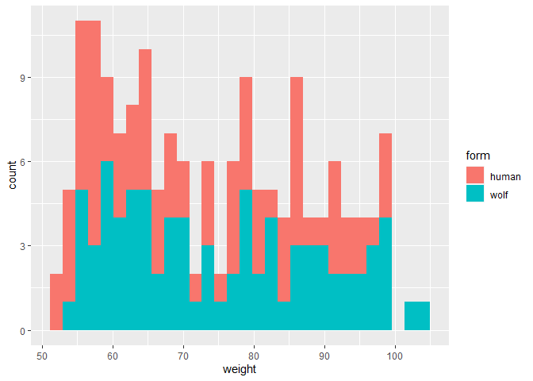
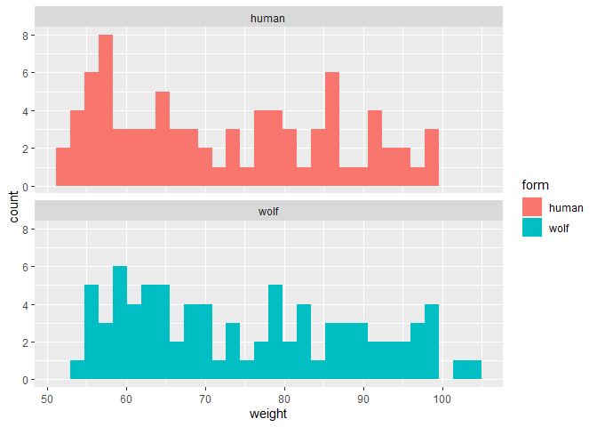
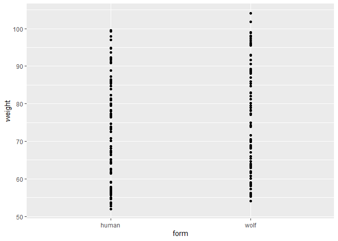
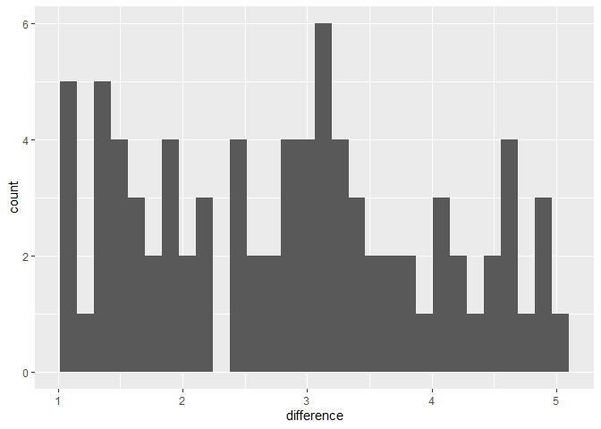

# Instructions! Read this first.

The exam is open note, open course website, open class-related code repositories 
(mine and those you produced in class). However, you may not get external help (
from other students, directed internet searches, etc.).  Please update the statement
below to acknowledge these instructions (and that you can use git).

I, INSERT YOUR NAME HERE, promise to not seek external help on the exam. I 
understand any academic issues will result in a D or F on the exam or in the class
and be reported to the Dean of Students.  Infractions will also result in me 
being unable to obtain a letter of recommendation from the department for 
professional school applications.

Good luck!

# Werewolves!


Many cultures have stories of people transforming into animals. Lycanthropy, or 
people becoming (or thinking they become) wolves is a common example that connects 
to the mythos around werewolves.

Imagine werewolves are actually real and are caused by a virus that quickly spreads 
in communities. However, not everyone who has the virus transforms into werewolves
for a number of reasons.  While society has ways to deal with the virus (and werewolves),
the virus that causes people to transform is continuously evolving and thus must
be studied (does all this sound familiar?). A recent strain of concern has been noted.  

# #1

1. A study is done to determine if the new strain leads to more people becoming 
werewolves. Historically,
10% of people in the focal town transformed during full moons. Last month, a study 
using sleep trackers found 17 out of 111 subjects infected with the new strain
became werewolves.  Is there 
evidence that transformations are becoming more common with this strain?

* null hypothesis (1 pt)
  * *H~0~: # of people transforming is no different with new strain/is equal to 10%*
* alternative hypothesis (1 pt)
  * *H~A~: # of people transforming is  different with new strain/is not equal to 10%*
* explanation for test you will use (1 pt)
  * *I will use a binomial test to compare the calculated transformation rate to a 
  a given value.*
* results from statistical test (1 pt)


```r
binom.test(17,111, p=.1)
```

```
## 
## 	Exact binomial test
## 
## data:  17 and 111
## number of successes = 17, number of trials = 111, p-value = 0.07899
## alternative hypothesis: true probability of success is not equal to 0.1
## 95 percent confidence interval:
##  0.09182302 0.23385176
## sample estimates:
## probability of success 
##              0.1531532
```

```r
#or 

binom.test(17,111, p=.1, alternative = "greater")
```

```
## 
## 	Exact binomial test
## 
## data:  17 and 111
## number of successes = 17, number of trials = 111, p-value = 0.05001
## alternative hypothesis: true probability of success is greater than 0.1
## 95 percent confidence interval:
##  0.09999738 1.00000000
## sample estimates:
## probability of success 
##              0.1531532
```
* clear explanation of how results relate to your stated hypotheses (2 pt)
  * *I found a p-value of .07 (<.05), so I fail to reject the null hypothesis. The 
  number of people transforming has not changed. **BONUS/not required** It appears to 
  be increasing.*

# #2

2. A local agency wants to know how many people they might predict will transform 
as the new strain spreads.  What would you tell them? (2 pts) 


```r
library(binom)
binom.confint(17,111)
```

```
##           method  x   n      mean      lower     upper
## 1  agresti-coull 17 111 0.1531532 0.09690907 0.2326014
## 2     asymptotic 17 111 0.1531532 0.08615667 0.2201496
## 3          bayes 17 111 0.1562500 0.09184534 0.2241365
## 4        cloglog 17 111 0.1531532 0.09357770 0.2262487
## 5          exact 17 111 0.1531532 0.09182302 0.2338518
## 6          logit 17 111 0.1531532 0.09738342 0.2326298
## 7         probit 17 111 0.1531532 0.09570835 0.2297693
## 8        profile 17 111 0.1531532 0.09441152 0.2277211
## 9            lrt 17 111 0.1531532 0.09440270 0.2277208
## 10     prop.test 17 111 0.1531532 0.09428549 0.2367357
## 11        wilson 17 111 0.1531532 0.09787476 0.2316357
```

*The 95% confidence interval is 9.7-23.3% using the Agresti-Coull method (1 pts). A 
95% confidence interval means if we sampled the population many times and 
constructed confidence intervals for each sample, 95% of the time the interval 
would contain the true population parameter. (1 pts)*


# #3

Make the data (not evaluating as already made!)


```r
set.seed(25)
size_wide <- data.frame(subject = 1:82, weight_human_form = c(runif(82, 50, 100)))
size_wide$weight_wolf_form <- size_wide$weight_human_form +3 +runif(82,-2,2)
write.csv(size_wide, "wolf_human_weight_wide.csv", row.names = F)
```

make long (not evaluating as already made!)


```r
library(reshape2)
size_long <- melt(size_wide, id.vars = "subject", variable.name = "form", 
                  value.name = "weight")
library(plyr)
size_long$form <- revalue(size_long$form, c("weight_human_form" = "human", 
                                            "weight_wolf_form" = "wolf"))
write.csv(size_long, "wolf_human_weight_long.csv", row.names = F)
```

Now testing below


```r
t.test(size_wide$weight_wolf_form, size_wide$weight_human_form, paired = T)
t.test(size_wide$weight_human_form, size_wide$weight_wolf_form, paired = T)

t.test(weight~form, size_long, paired = T)

t.test(size_wide$weight_wolf_form, size_wide$weight_human_form)
t.test(weight~form, size_long)
```


3. There is also concern tbat the new strain of lycanthropic virus is leading
to not just more werewolves, but also to larger werewolves. In the past, people 
were the same weight in their
human and wolf forms.  Recent data on peoples weight in human and wolf form was collected 
at a secure facility.  

Data is available using (wide format)


```r
size_wide <- read.csv("https://docs.google.com/spreadsheets/d/e/2PACX-1vQPEgn69EFpp6-FLOCuMjBHQg2de2eufsk1tot5_pet4PBWw7LONCpzHRgV9F7o4_qR8lxAjhfltCjK/pub?gid=1132258987&single=true&output=csv", 
                      stringsAsFactors = T)
```

or (long format)


```r
size_long <- read.csv("https://docs.google.com/spreadsheets/d/e/2PACX-1vTuKbRFnuaRITxnQXmeTBzlBVtJYcRYH50MFrvhXnud8PevFo2E-eTeqvqqZvrSNp0iV-R96YZub0Du/pub?gid=528744338&single=true&output=csv",
                      stringsAsFactors = T)
```


What does it suggest?  (6 pts)

Investigate the question. Make sure you include

* null hypothesis (1 pt)
  * *H~0~: the weight of people is same/no different in wolf and human forms*
* alternative hypothesis (1 pt)
  * *H~A~: the weight of people is not the same/is different in wolf and human forms*
* explanation for test you will use (1 pt)
  * *I will use a paired t-test. We are focused on differences individuals (paired
  data). We have a large sample and weight is typically normally distributed, thus
  assumptions are appropriate.*
* results from statistical test (1 pt)


```r
t.test(size_wide$weight_wolf_form, size_wide$weight_human_form, paired = T)
```

```
## 
## 	Paired t-test
## 
## data:  size_wide$weight_wolf_form and size_wide$weight_human_form
## t = 22.532, df = 81, p-value < 2.2e-16
## alternative hypothesis: true mean difference is not equal to 0
## 95 percent confidence interval:
##  2.612064 3.118066
## sample estimates:
## mean difference 
##        2.865065
```

```r
t.test(weight~form, size_long, paired = T)
```

```
## 
## 	Paired t-test
## 
## data:  weight by form
## t = -22.532, df = 81, p-value < 2.2e-16
## alternative hypothesis: true mean difference is not equal to 0
## 95 percent confidence interval:
##  -3.118066 -2.612064
## sample estimates:
## mean difference 
##       -2.865065
```
or (note order matters!)


```r
t.test(size_wide$weight_wolf_form, size_wide$weight_human_form, paired = T,
       alternative = "greater")
```

```
## 
## 	Paired t-test
## 
## data:  size_wide$weight_wolf_form and size_wide$weight_human_form
## t = 22.532, df = 81, p-value < 2.2e-16
## alternative hypothesis: true mean difference is greater than 0
## 95 percent confidence interval:
##  2.653492      Inf
## sample estimates:
## mean difference 
##        2.865065
```

```r
t.test(weight~form, size_long, paired = T, alternative = "less")
```

```
## 
## 	Paired t-test
## 
## data:  weight by form
## t = -22.532, df = 81, p-value < 2.2e-16
## alternative hypothesis: true mean difference is less than 0
## 95 percent confidence interval:
##       -Inf -2.653492
## sample estimates:
## mean difference 
##       -2.865065
```

Not 


```r
t.test(size_wide$weight_wolf_form, size_wide$weight_human_form)
```

```
## 
## 	Welch Two Sample t-test
## 
## data:  size_wide$weight_wolf_form and size_wide$weight_human_form
## t = 1.2992, df = 161.97, p-value = 0.1957
## alternative hypothesis: true difference in means is not equal to 0
## 95 percent confidence interval:
##  -1.489576  7.219705
## sample estimates:
## mean of x mean of y 
##  75.15196  72.28690
```

```r
t.test(weight~form, size_long)
```

```
## 
## 	Welch Two Sample t-test
## 
## data:  weight by form
## t = -1.2992, df = 161.97, p-value = 0.1957
## alternative hypothesis: true difference in means between group human and group wolf is not equal to 0
## 95 percent confidence interval:
##  -7.219705  1.489576
## sample estimates:
## mean in group human  mean in group wolf 
##            72.28690            75.15196
```


* clear explanation of how results relate to your stated hypotheses (2 pts)
  * *I found a p-value <.001 associatd with a t~81~=-22.532, so I reject the null 
  hypothesis. The 
 weight of individuals appear to change between forms. **BONUS/not required** It appears to 
  be increasing.*
  
# #4

4. Graph the data used in question 3 in an appropriate way (several options here!) (5 pts)


```r
library(ggplot2)
ggplot(size_long, aes(x=weight, fill=form))+
  geom_histogram()
```

```
## `stat_bin()` using `bins = 30`. Pick better value with `binwidth`.
```

<!-- -->

```r
ggplot(size_long, aes(x=weight, fill=form))+
  geom_histogram() +
  facet_wrap(~form, ncol=1)
```

```
## `stat_bin()` using `bins = 30`. Pick better value with `binwidth`.
```

<!-- -->

```r
ggplot(size_long, aes(x=form, y=weight))+
  geom_point()
```

<!-- -->

```r
size_wide$difference <- size_wide$weight_wolf_form - size_wide$weight_human_form
ggplot(size_wide, aes(x=difference))+
  geom_histogram()
```

```
## `stat_bin()` using `bins = 30`. Pick better value with `binwidth`.
```

<!-- -->


# #5

5.  As one attempt at controlling the outbreak, a company has developed a drug
that it claims reduces the chances of people transforming.  100 participants, all
of who transformed during the last full moon, are selected to take part in clinical 
trials.  Half (the control group) receive a  placebo, and the other half receive
the new drug. During the next full moon, 38 out of 50 individuals in the control
group transform into wolves.  43 out of 50 in the drug group transform. (6 pts) 

Use this data
to investigate the impact of the drug. Make sure you include

* null hypothesis (1 pt)
  * *H~0~: the proportion of people transforming is the same with and without the drug*
* alternative hypothesis (1 pt)
  * *H~A~: the proportion of people transforming is the same with and without the drug*
* explanation for test you will use (1 pt)
  * I will use a goodness of fit test/contingency analysis. Data are count-based.
  I will check assumptions once model is created.
* results from statistical test (1 pt)


```r
#note order doesn't matter here!
chisq.test(matrix(c(43,38, 50-43, 50-38), nrow = 2, byrow = T))
```

```
## 
## 	Pearson's Chi-squared test with Yates' continuity correction
## 
## data:  matrix(c(43, 38, 50 - 43, 50 - 38), nrow = 2, byrow = T)
## X-squared = 1.0396, df = 1, p-value = 0.3079
```

```r
chisq.test(matrix(c(43,50-43, 38, 50-38), nrow = 2, byrow = T))
```

```
## 
## 	Pearson's Chi-squared test with Yates' continuity correction
## 
## data:  matrix(c(43, 50 - 43, 38, 50 - 38), nrow = 2, byrow = T)
## X-squared = 1.0396, df = 1, p-value = 0.3079
```

```r
chisq.test(matrix(c(43,38, 50-43, 50-38), nrow = 2))
```

```
## 
## 	Pearson's Chi-squared test with Yates' continuity correction
## 
## data:  matrix(c(43, 38, 50 - 43, 50 - 38), nrow = 2)
## X-squared = 1.0396, df = 1, p-value = 0.3079
```

```r
chisq.test(matrix(c(43,50-43, 38, 50-38), nrow = 2))
```

```
## 
## 	Pearson's Chi-squared test with Yates' continuity correction
## 
## data:  matrix(c(43, 50 - 43, 38, 50 - 38), nrow = 2)
## X-squared = 1.0396, df = 1, p-value = 0.3079
```

* clear explanation of how results relate to your stated hypotheses (2 pts)
  * *I found a p-value <.05 (.035) associatd with a /chi^2~1~=4.44, so I reject the null 
  hypothesis. The drug appears to be impacting the number of people who transform.
  **BONUS/not required** It appears increase the number of werewolves!.*
  
# #6

6. Given your answer to #5, what is your recommendation regarding the drug? In 
your answer, make sure to include the p-value and explain what it means. 

*A p-value is the probability you would see the signal you saw or something
more extreme if the null hypothesis was true and you repeated the test many times. 
Given our p value was >.05, the new drug appears to have no effect, thus I don't 
recommend it.*


