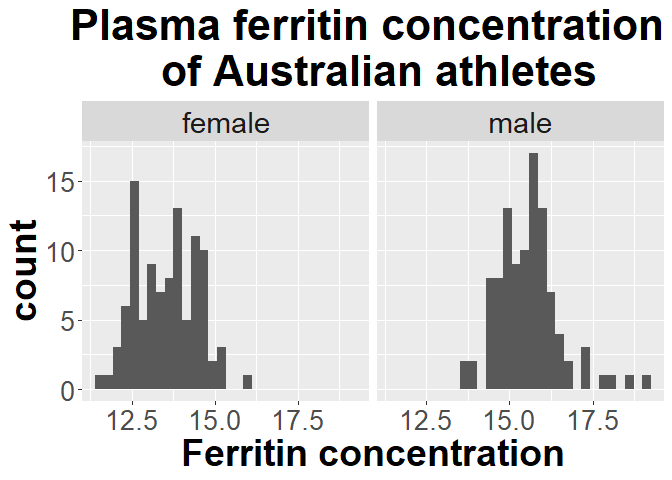
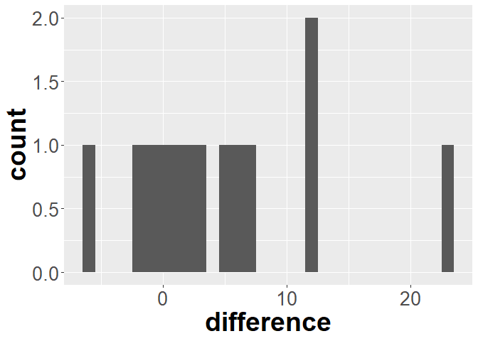
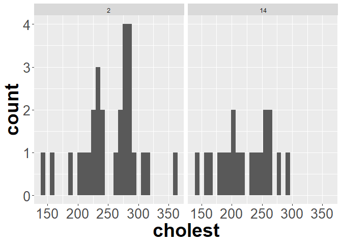

Before doing this, review the **Extending continuous tests to 2 samples** lecture set slides from 
https://sites.google.com/view/biostats/lessons/2-sample-tests-for-continuous-data and
the  **6_2_sample_continuous tests.R** script in the lecture_files folder of the
[CUNY-BioStats github repository](https://github.com/jsgosnell/CUNY-BioStats).


Remember you should

* add code chunks by clicking the *Insert Chunk* button on the toolbar or by
pressing *Ctrl+Alt+I* to answer the questions!
* **knit** your file to produce a markdown version that you can see!
* save your work often 
  * **commit** it via git!
  * **push** updates to github

## Examples

### Paired tests and rearranging data

Paired tests assume there is a one-to-one relationship between measurements in each
group (before/after, twin 1/twin 2, etc).
Note for paired tests the arrangement of the data matters. For example, if paired
data is stored so that each row has information from a single pair, we need a
different test format than if each row only has information from a single unit. 
In general, when a row only has information from one unit, we call it long-formatted
data. Wide-formatted data has information from multiple units on each row.  This
will get more complicated when we measure multiple traits/things on each unit, 
but its a start.

#### t-test

Let's first load a long-formatted dataset.


```r
cholesterol <- read.table("http://www.statsci.org/data/general/cholestg.txt", header = T,
                          stringsAsFactors = T)
head(cholesterol)
```

```
##   patient group day cholest
## 1       1     1   2     270
## 2       2     1   2     236
## 3       3     1   2     210
## 4       4     1   2     142
## 5       5     1   2     280
## 6       6     1   2     272
```

```r
str(cholesterol)
```

```
## 'data.frame':	114 obs. of  4 variables:
##  $ patient: int  1 2 3 4 5 6 7 8 9 10 ...
##  $ group  : int  1 1 1 1 1 1 1 1 1 1 ...
##  $ day    : int  2 2 2 2 2 2 2 2 2 2 ...
##  $ cholest: int  270 236 210 142 280 272 160 220 226 242 ...
```

Note this is long format data.  Day is also an integer here. For our purposes, lets consider it a factor (near/far
from heart attack).


```r
cholesterol$day <- as.factor(cholesterol$day)
library(plyr)
cholesterol$when <- revalue(cholesterol$day, c("2"="soon_after", "4" = "few_days",
                                               "14" = "weeks_later"))
```

To run a t-test on this format, we would use the formula notation and only focus 
on 2 periods (since its a t-test!). Note the *%in%* operator lets us search for 
a list of outcomes to match (instead of *==*, which matches one).


```r
t.test(cholest ~ when, cholesterol[cholesterol$when %in% c("soon_after", 
                                                           "weeks_later"),],
       paired = T)
```

```
## Error in complete.cases(x, y): not all arguments have the same length
```
This does not work (note I had to add an R chunk option, *error = T *, to make it
knit!).  Why?  The error mentions an issues with length.  Look at each piece


```r
 cholesterol[cholesterol$when %in% c("soon_after"), "cholest"]
```

```
##  [1] 270 236 210 142 280 272 160 220 226 242 186 266 206 318 294 282 234 224 276
## [20] 282 360 310 280 278 288 288 244 236
```

```r
 cholesterol[cholesterol$when %in% c("weeks_later"), "cholest"]
```

```
##  [1] 156  NA 242  NA  NA 256 142 216 248  NA 168 236  NA 200 264  NA 264  NA 188
## [20] 182 294 214  NA 198  NA 256 280 204
```

Note we have many NAs. Further inspection (look at the whole cholesterol dataset
by clicking on it in environment) shows we have 2 groups, which isn't helping. 
R often exclude's NAs by default. Try


```r
options("na.action")
```

```
## $na.action
## [1] "na.omit"
```

It likely says "na.omit".  For paired tests in formula format this is an issue because
it looks for matched pairs and *then* excludes NAs. To make this work, let's 
make sure to send the function everything using the added na.action argument set to
"na.pass". 


```r
t.test(cholest~day, cholesterol[cholesterol$when %in% c("soon_after","weeks_later"),],
       paired = T, na.action = "na.pass")
```

```
## 
## 	Paired t-test
## 
## data:  cholest by day
## t = 3.2883, df = 18, p-value = 0.004085
## alternative hypothesis: true mean difference is not equal to 0
## 95 percent confidence interval:
##  13.7215 62.2785
## sample estimates:
## mean difference 
##              38
```

Note this is same as 


```r
t.test(cholesterol[cholesterol$day == "2", "cholest"], 
       cholesterol[cholesterol$day == "14", "cholest"],
       paired = T)
```

```
## 
## 	Paired t-test
## 
## data:  cholesterol[cholesterol$day == "2", "cholest"] and cholesterol[cholesterol$day == "14", "cholest"]
## t = 3.2883, df = 18, p-value = 0.004085
## alternative hypothesis: true mean difference is not equal to 0
## 95 percent confidence interval:
##  13.7215 62.2785
## sample estimates:
## mean difference 
##              38
```

which does not have the *NA* issue.  This setup is better for wide format data.

#### long to wide 

Let's make the cholesterol dataset wide usin the dcast function from the *reshape2* 
package. The formula notes row ~ columns.  


```r
library(reshape2)
#formula gives row ~ columns
#get daily cholesterol for every patient
cholesterol_wide <- dcast(data = cholesterol, formula = patient ~ day, 
                          value.var ="cholest" )
head(cholesterol_wide)
```

```
##   patient   2   4  14 NA
## 1       1 270 218 156 NA
## 2       2 236 234  NA NA
## 3       3 210 214 242 NA
## 4       4 142 116  NA NA
## 5       5 280 200  NA NA
## 6       6 272 276 256 NA
```

We could evaluate this using


```r
t.test(cholesterol_wide$2, cholesterol_wide$14, paired = T)
```

```
## Error: <text>:1:25: unexpected numeric constant
## 1: t.test(cholesterol_wide$2
##                             ^
```
Another error!  R doesn't like columns to be named with numbers. Let's fix this.


```r
names(cholesterol_wide)[2:5] <- paste ("day", names(cholesterol_wide)[2:5], 
                                       sep="_")
head(cholesterol_wide)
```

```
##   patient day_2 day_4 day_14 day_NA
## 1       1   270   218    156     NA
## 2       2   236   234     NA     NA
## 3       3   210   214    242     NA
## 4       4   142   116     NA     NA
## 5       5   280   200     NA     NA
## 6       6   272   276    256     NA
```

Now try


```r
t.test(cholesterol_wide$day_2, cholesterol_wide$day_14, paired = T)
```

```
## 
## 	Paired t-test
## 
## data:  cholesterol_wide$day_2 and cholesterol_wide$day_14
## t = 3.2883, df = 18, p-value = 0.004085
## alternative hypothesis: true mean difference is not equal to 0
## 95 percent confidence interval:
##  13.7215 62.2785
## sample estimates:
## mean difference 
##              38
```
#### Wilcoxon test

Compare these to Wilcoxon test


```r
wilcox.test(cholest~day, cholesterol[cholesterol$when %in% c("soon_after","weeks_later"),],
       paired = T, na.action = "na.pass")
```

```
## Warning in wilcox.test.default(x = DATA[[1L]], y = DATA[[2L]], ...): cannot
## compute exact p-value with ties
```

```
## 
## 	Wilcoxon signed rank test with continuity correction
## 
## data:  cholest by day
## V = 156, p-value = 0.01481
## alternative hypothesis: true location shift is not equal to 0
```

```r
wilcox.test(cholesterol_wide$day_2, cholesterol_wide$day_14, paired = T)
```

```
## Warning in wilcox.test.default(cholesterol_wide$day_2,
## cholesterol_wide$day_14, : cannot compute exact p-value with ties
```

```
## 
## 	Wilcoxon signed rank test with continuity correction
## 
## data:  cholesterol_wide$day_2 and cholesterol_wide$day_14
## V = 156, p-value = 0.01481
## alternative hypothesis: true location shift is not equal to 0
```

#### Sign test

or Sign tests (which only take wide format and only work with paired data!)


```r
library(BSDA)
```

```
## Loading required package: lattice
```

```
## 
## Attaching package: 'BSDA'
```

```
## The following object is masked from 'package:datasets':
## 
##     Orange
```

```r
SIGN.test(cholesterol_wide$day_2, cholesterol_wide$day_14)
```

```
## 
## 	Dependent-samples Sign-Test
## 
## data:  cholesterol_wide$day_2 and cholesterol_wide$day_14
## S = 15, p-value = 0.01921
## alternative hypothesis: true median difference is not equal to 0
## 95 percent confidence interval:
##  12.32941 82.44706
## sample estimates:
## median of x-y 
##            30 
## 
## Achieved and Interpolated Confidence Intervals: 
## 
##                   Conf.Level  L.E.pt  U.E.pt
## Lower Achieved CI     0.9364 16.0000 80.0000
## Interpolated CI       0.9500 12.3294 82.4471
## Upper Achieved CI     0.9808  4.0000 88.0000
```

### Not paired

What if we had measured different people a few days before and several weeks after
a heart attack?  Then the data is not paired! Examples for all tests shown here.

#### t-tests

Note by default we get a Welsh test, which assumes variance is not the same among
the groups.


```r
t.test(cholest~day, cholesterol[cholesterol$when %in% c("soon_after","weeks_later"),])
```

```
## 
## 	Welch Two Sample t-test
## 
## data:  cholest by day
## t = 2.4228, df = 41.285, p-value = 0.01987
## alternative hypothesis: true difference in means between group 2 and group 14 is not equal to 0
## 95 percent confidence interval:
##   5.407416 59.502358
## sample estimates:
##  mean in group 2 mean in group 14 
##         253.9286         221.4737
```

```r
t.test(cholesterol_wide$day_2, cholesterol_wide$day_14)
```

```
## 
## 	Welch Two Sample t-test
## 
## data:  cholesterol_wide$day_2 and cholesterol_wide$day_14
## t = 2.4228, df = 41.285, p-value = 0.01987
## alternative hypothesis: true difference in means is not equal to 0
## 95 percent confidence interval:
##   5.407416 59.502358
## sample estimates:
## mean of x mean of y 
##  253.9286  221.4737
```
#### Wilcoxon test


```r
wilcox.test(cholest~day, cholesterol[cholesterol$when %in% c("soon_after","weeks_later"),])
```

```
## Warning in wilcox.test.default(x = DATA[[1L]], y = DATA[[2L]], ...): cannot
## compute exact p-value with ties
```

```
## 
## 	Wilcoxon rank sum test with continuity correction
## 
## data:  cholest by day
## W = 374.5, p-value = 0.01917
## alternative hypothesis: true location shift is not equal to 0
```

```r
wilcox.test(cholesterol_wide$day_2, cholesterol_wide$day_14)
```

```
## Warning in wilcox.test.default(cholesterol_wide$day_2, cholesterol_wide$day_14):
## cannot compute exact p-value with ties
```

```
## 
## 	Wilcoxon rank sum test with continuity correction
## 
## data:  cholesterol_wide$day_2 and cholesterol_wide$day_14
## W = 374.5, p-value = 0.01917
## alternative hypothesis: true location shift is not equal to 0
```
#### Bootstrap

We also have options that don't rely on repeated sampling.  My bootstrap function
only works for wide format data (unless you manually subtract outcomes... and omit
NAs...)


```r
source("https://raw.githubusercontent.com/jsgosnell/CUNY-BioStats/master/code_examples/bootstrapjsg.R")
bootstrapjsg(cholesterol_wide$day_2, cholesterol_wide$day_14)
```

```
## 
## Attaching package: 'boot'
```

```
## The following object is masked from 'package:lattice':
## 
##     melanoma
```

```
## Simple Bootstrap Routines (1.1-7)
```

```
## Warning in boot.ci(a, conf): bootstrap variances needed for studentized
## intervals
```

```
##                                                                       
##                             "0.95" "% Percentile Confidence Interval" 
##                                                                       
##                 "6.96625955200732"                  "57.943326607136" 
##                                                                       
##                          "p-value"                           "0.0123"
```

```r
cholesterol_difference <- na.omit(cholesterol_wide$day_2 - cholesterol_wide$day_14)
bootstrapjsg(cholesterol_difference)
```

```
## Warning in boot.ci(a, conf): bootstrap variances needed for studentized
## intervals
```

```
##                                                                         
##                  "0.95" "% Confidence Interval"      "16.2105263157895" 
##                                                                         
##      "60.2105263157895"               "p-value"                 "2e-04"
```
Note again how pairing helps!

#### Permutation

Note the permutation tests only works on unpaired data.


```r
library(coin)
```

```
## Loading required package: survival
```

```
## 
## Attaching package: 'survival'
```

```
## The following object is masked from 'package:boot':
## 
##     aml
```

```r
independence_test(cholest~day, 
                  cholesterol[cholesterol$when %in% c("soon_after","weeks_later"),])
```

```
## 
## 	Asymptotic General Independence Test
## 
## data:  cholest by day (2, 14)
## Z = 2.2645, p-value = 0.02354
## alternative hypothesis: two.sided
```
### More on rearranging data

If you need to re-arrange data **AND** summarize it in same step (not one-to-one
match when you rearrange), you'll need to tell R how to summarize it. For example,
we could find the average cholesterol for each patient (note there are 2 groups that
label each patient 1 ). Note I made a function to remove NAs, which otherwise cause
issues.


```r
#use fun.aggregate to get other option
#get average cholesterol per patient
#simple function to exclude na's (other option is to melt first and then drop them)
meannona <- function (x) mean(x, na.rm=T)
cholesterol_wide_summary <- dcast(data = cholesterol, formula = patient ~ ., #. means no variable, ... means all variables
                          value.var ="cholest", fun.aggregate = meannona )
head(cholesterol_wide_summary)
```

```
##   patient        .
## 1       1 214.6667
## 2       2 235.0000
## 3       3 222.0000
## 4       4 129.0000
## 5       5 240.0000
## 6       6 268.0000
```

You can also name output column by putting in quotes in formula


```r
cholesterol_wide_summary <- dcast(data = cholesterol, formula = patient ~ "average_cholest", #. means no variable, ... means all variables
                          value.var ="cholest", fun.aggregate = meannona )
head(cholesterol_wide_summary)
```

```
##   patient average_cholest
## 1       1        214.6667
## 2       2        235.0000
## 3       3        222.0000
## 4       4        129.0000
## 5       5        240.0000
## 6       6        268.0000
```


#### Wide to long

If you have data in wide format


```r
cholesterol <- read.table("http://www.statsci.org/data/general/cholestr.txt", header = T)
head(cholesterol)
```

```
##   Day2 Day4 Day14
## 1  270  218   156
## 2  236  234    NA
## 3  210  214   242
## 4  142  116    NA
## 5  280  200    NA
## 6  272  276   256
```

you can instead use the *melt* function (also in the *reshape2* package).  The
id.vars argument lists independent values to keep. The 
measure.vars variable is what you are measuring (not used here, and used rarely). 
The variable.name argument lists what to label things you group, and the value.name 
arguments gives name to value output


```r
cholesterol_long <- melt(cholesterol, id.vars =c())
head(cholesterol_long)
```

```
##   variable value
## 1     Day2   270
## 2     Day2   236
## 3     Day2   210
## 4     Day2   142
## 5     Day2   280
## 6     Day2   272
```

```r
#name outcomes
cholesterol_long <- melt(cholesterol, id.vars =c(), variable.name = "day", 
                         value.name = "cholesterol")
head(cholesterol_long)
```

```
##    day cholesterol
## 1 Day2         270
## 2 Day2         236
## 3 Day2         210
## 4 Day2         142
## 5 Day2         280
## 6 Day2         272
```

If you have more variables, you can melt them all to a single column (most useful
when faceting plots!).


```r
sport <- read.table("http://www.statsci.org/data/oz/ais.txt", header = T)
sport_melted <- melt(sport, id.vars = c("Sex", "Sport"),
                     variable.name = "measure", 
                     value.name = "value")
head(sport_melted)
```

```
##      Sex Sport measure value
## 1 female BBall     RCC  3.96
## 2 female BBall     RCC  4.41
## 3 female BBall     RCC  4.14
## 4 female BBall     RCC  4.11
## 5 female BBall     RCC  4.45
## 6 female BBall     RCC  4.10
```

## Practice

### For the following problems, use the data to conduct each noted test (note some sample sizes may be too small for these to all be good ideas!)


#### 1

1. The following data are human blood clotting times (in minutes) of individuals
given one of two different drugs. 

|Drug B | Drug G
|:-: |:-:
|8.8 | 9.9
|8.4 | 9.0
|7.9 | 11.1
|8.7 | 9.6
|9.1 | 8.7
|9.6 | 10.4 
|    | 9.5

Test the hypothesis that the mean clotting times
are equal for the two groups
*  Estimating the variance from the data 

```r
drug_b <- c( 8.8, 8.4, 7.9, 8.7, 9.1, 9.6)
drug_g <- c(9.9, 9.0, 11.1, 9.6, 8.7, 10.4, 9.5)
t.test(drug_b, drug_g)
```

```
## 
## 	Welch Two Sample t-test
## 
## data:  drug_b and drug_g
## t = -2.5454, df = 10.701, p-value = 0.02774
## alternative hypothesis: true difference in means is not equal to 0
## 95 percent confidence interval:
##  -1.8543048 -0.1314095
## sample estimates:
## mean of x mean of y 
##  8.750000  9.742857
```
*Using a un-paired t-test, since the experimental units were not matched and I 
assumed the means of each group would follow a normal distribution of unknown 
variance,  I found a test statistics of t~10.701~=-2.544.  This corresponds to a 
p-value of 0.02. This p-value is <.05, so I reject the null hypothesis that 
the mean clotting times are the same for the two drugs.*

* Using rank transform analysis 

```r
wilcox.test(drug_b, drug_g)
```

```
## Warning in wilcox.test.default(drug_b, drug_g): cannot compute exact p-value
## with ties
```

```
## 
## 	Wilcoxon rank sum test with continuity correction
## 
## data:  drug_b and drug_g
## W = 7, p-value = 0.05313
## alternative hypothesis: true location shift is not equal to 0
```
 
*Using a un-paired rank-based test, which is appropriate when normality assumptions 
can't be met and I assumed the means of each group would follow a similar distribution, 
I found a test statistics of W=7.  This corresponds to a 
p-value of 0.05.  This p-value is >.05, so I fail to reject the null hypothesis that 
the mean clotting times are the same for the two drugs.*

* Using a permutation test


```r
require(coin) #requires data_frame
clotting <- data.frame(drug = c(rep("drug_b", length(drug_b)), rep("drug_g", 
                                                                   length(drug_g))),
                       clotting = c(drug_b, drug_g))
clotting$drug <- factor(clotting$drug)
independence_test(clotting ~ drug, clotting)
```

```
## 
## 	Asymptotic General Independence Test
## 
## data:  clotting by drug (drug_b, drug_g)
## Z = -2.0726, p-value = 0.03821
## alternative hypothesis: two.sided
```
*Using a permutation test, which is not fully appropriate here due to small sample 
sizes (and that also assumes similar distributions for each group), 
I found a test statistics of Z=-2.0726..  This corresponds to a 
p-value of 0.038.  This p-value is >.05, so I fail to reject the null hypothesis that 
the mean clotting times are the same for the two drugs.*

* Using a bootstrap test 


```r
source("https://raw.githubusercontent.com/jsgosnell/CUNY-BioStats/master/code_examples/bootstrapjsg.R")
bootstrapjsg(drug_b, drug_g)
```

```
## Warning in boot.ci(a, conf): bootstrap variances needed for studentized
## intervals
```

```
##                                                                       
##                             "0.95" "% Percentile Confidence Interval" 
##                                                                       
##                "-1.70708323610965"               "-0.299999999999999" 
##                                                                       
##                          "p-value"                           "0.0053"
```
*Using a bootstrap test with 10000 samples, which is not fully appropriate here 
due to small sample sizes, 
I found a p value of 0.0047.  This p-value is <.05, so I reject the null 
hypothesis that 
the mean clotting times are the same for the two drugs.*

#### 2


2. Data on plant heights (in cm) for plants grown with a new and old formulation 
of fertilizer can be found at
https://raw.githubusercontent.com/jsgosnell/CUNY-BioStats/master/datasets/fertilizer.csv . 
Use the data to test the hypothesis that there is no difference in mean plant
heights for the two groups 

*  Estimating the variance from the data 

```r
fertilizer <- read.csv("https://raw.githubusercontent.com/jsgosnell/CUNY-BioStats/master/datasets/fertilizer.csv", stringsAsFactors = T)
t.test(height ~ fertilizer, fertilizer)
```

```
## 
## 	Welch Two Sample t-test
## 
## data:  height by fertilizer
## t = 3.013, df = 15.559, p-value = 0.008458
## alternative hypothesis: true difference in means between group new and group old is not equal to 0
## 95 percent confidence interval:
##  1.367809 7.912191
## sample estimates:
## mean in group new mean in group old 
##             56.55             51.91
```
*Using a un-paired t-test, since the experimental units were not matched and I 
assumed the means of each group would follow a normal distribution of unknown 
variance,  I found a test statistics of t~15.559~=3.01.  This corresponds to a 
p-value of 0.008. This p-value is <.05, so I  to reject the null hypothesis that 
the impact on plant growth doesn not differ between the two fertilizer formulations.*

* Using rank transform analysis 

```r
wilcox.test(height ~ fertilizer, fertilizer)
```

```
## 
## 	Wilcoxon rank sum exact test
## 
## data:  height by fertilizer
## W = 68, p-value = 0.01166
## alternative hypothesis: true location shift is not equal to 0
```
*Using a un-paired rank-based test, which is appropriate when normality assumptions 
can't be met and I assumed the means of each group would follow a similar distribution, 
I found a test statistics of W=68.  This corresponds to a 
p-value of 0.012.  This p-value is <.05, so I  to reject the null hypothesis that 
the impact on plant growth doesn not differ between the two fertilizer formulations.*

* Using a permutation test 

```r
independence_test(height ~ factor(fertilizer), fertilizer)
```

```
## 
## 	Asymptotic General Independence Test
## 
## data:  height by factor(fertilizer) (new, old)
## Z = 2.4677, p-value = 0.0136
## alternative hypothesis: two.sided
```
*Using a permutation test, which is appropriate given the sample sizes and fact 
I assume similar distributions for each group, 
I found a test statistics of Z=2.47.  his corresponds to a 
p-value of 0.01.  This p-value is <.05, so I  to reject the null hypothesis that 
the impact on plant growth doesn not differ between the two fertilizer formulations.*

* Using a bootstrap test 

*This is where you may need the different (wide) format of data! As always, multiple
options exist in R*


```r
require(reshape2)
fertilizer$ID <- 1:nrow(fertilizer)
fertilizer_wide <- dcast(fertilizer, ID~fertilizer, value.var = "height")
#subsetting the long-form data
bootstrapjsg(fertilizer[fertilizer$fertilizer =="old", "height"],
              fertilizer[fertilizer$fertilizer =="new", "height"])
```

```
## Warning in boot.ci(a, conf): bootstrap variances needed for studentized
## intervals
```

```
##                                                                       
##                             "0.95" "% Percentile Confidence Interval" 
##                                                                       
##                "-7.49743739791514"                          "-1.8075" 
##                                                                       
##                          "p-value"                           "0.0011"
```

```r
#is same as using the wide data
bootstrapjsg(fertilizer_wide$new, fertilizer_wide$old)
```

```
## Warning in boot.ci(a, conf): bootstrap variances needed for studentized
## intervals
```

```
##                                                                       
##                             "0.95" "% Percentile Confidence Interval" 
##                                                                       
##                 "1.81999999999999"                             "7.41" 
##                                                                       
##                          "p-value"                           "0.0012"
```
*Using a bootstrap test with 10000 samples, 
I found a p value of 0.013.  This p-value is <.05, so I  to reject the null hypothesis that 
the impact on plant growth doesn not differ between the two fertilizer formulations.*

Note you may need to cast this dataframe into a dataframe with a column for 
old and new outcomes.  You’ll have to add a unique identifier. Try something like


```r
fertilizer$ID <- 1:nrow(fertilizer)
fertilizer_wide <- dcast(fertilizer, ID~fertilizer, value.var = "height")
```


#### 3

3. Metabolic rates were measured in animals before and after administering a drug. Data is
available at 

https://raw.githubusercontent.com/jsgosnell/CUNY-BioStats/master/datasets/metabolic_rates.csv

Test the hypothesis that the drug has no effect on metabolic rate with using 
*  a Student's t test

```r
metabolic <- read.csv("https://raw.githubusercontent.com/jsgosnell/CUNY-BioStats/master/datasets/metabolic_rates.csv", stringsAsFactors = T)
t.test(metabolic$before, metabolic$after, paired = T)
```

```
## 
## 	Paired t-test
## 
## data:  metabolic$before and metabolic$after
## t = -3.3875, df = 8, p-value = 0.009536
## alternative hypothesis: true mean difference is not equal to 0
## 95 percent confidence interval:
##  -19.982241  -3.795537
## sample estimates:
## mean difference 
##       -11.88889
```
*I used a paired t-test because the same animals were measured before and after 
the drug was administered.  I also assumed the difference in means was normally
distributed given the trait and sample size.  The test resulted in a statistic of
t~8~ = -3.39. This corresponds to a p-value of <.001.  Since the p-value is <.05,
I reject the null hypothesis that the drug has no effect on metabolic rate.*

* a rank test

```r
wilcox.test(metabolic$before, metabolic$after, paired = T)
```

```
## Warning in wilcox.test.default(metabolic$before, metabolic$after, paired = T):
## cannot compute exact p-value with ties
```

```
## 
## 	Wilcoxon signed rank test with continuity correction
## 
## data:  metabolic$before and metabolic$after
## V = 3, p-value = 0.02427
## alternative hypothesis: true location shift is not equal to 0
```
*I used a paired rank-based test because the same animals were measured before and after 
the drug was administered.  I did not assume the difference in means was normally
distributed but did assume it followed a symmetic distribution.  The test resulted in a statistic of
V = 3.   This corresponds to a p-value of .02.  Since the p-value is <.05,
I reject the null hypothesis that the drug has no effect on metabolic rate.*

* a binary test

```r
library(BSDA)
SIGN.test(metabolic$before, metabolic$after)
```

```
## 
## 	Dependent-samples Sign-Test
## 
## data:  metabolic$before and metabolic$after
## S = 2, p-value = 0.1797
## alternative hypothesis: true median difference is not equal to 0
## 95 percent confidence interval:
##  -24.6111111   0.6111111
## sample estimates:
## median of x-y 
##           -10 
## 
## Achieved and Interpolated Confidence Intervals: 
## 
##                   Conf.Level   L.E.pt  U.E.pt
## Lower Achieved CI     0.8203 -20.0000 -4.0000
## Interpolated CI       0.9500 -24.6111  0.6111
## Upper Achieved CI     0.9609 -25.0000  1.0000
```

*I used a sign test (always paired!) because the same animals were measured before and after 
the drug was administered.  I did not assume the difference in means was normally
distributed or that the differences followed a symmetic distribution.  The test resulted in a statistic of
s = 2.   This corresponds to a p-value of .18.  Since the p-value is >.05,
I fail to reject the null hypothesis that the drug has no effect on metabolic rate.*

* bootstrapping

```r
bootstrapjsg(metabolic$before - metabolic$after)
```

```
## Warning in boot.ci(a, conf): bootstrap variances needed for studentized
## intervals
```

```
##                                                                         
##                  "0.95" "% Confidence Interval"     "-18.3333333333333" 
##                                                                         
##     "-5.44444444444444"               "p-value"                     "0"
```
*Since the same animals were measured before and after the drug was administered,
I used a bootstrap (10,000 samples) focused on the difference in rates.  This 
resulted in a p-value of <.001. Since the p-value is <.05,
I reject the null hypothesis that the drug has no effect on metabolic rate.*

#### 4

4. Endurance of the above animals was also measured. Data is available at

https://raw.githubusercontent.com/jsgosnell/CUNY-BioStats/master/datasets/endurance.csv

Test the hypothesis that the drug has no effect on using 
*  a Student's t test

```r
endurance <- read.csv("https://raw.githubusercontent.com/jsgosnell/CUNY-BioStats/master/datasets/endurance.csv", stringsAsFactors = T)
head(endurance)
```

```
##   Subject   time endurance
## 1       A before        28
## 2       B before        34
## 3       C before        30
## 4       D before        27
## 5       E before        32
## 6       F before        38
```

```r
t.test(endurance ~ time, endurance, paired = T)
```

```
## 
## 	Paired t-test
## 
## data:  endurance by time
## t = -1.1195, df = 8, p-value = 0.2954
## alternative hypothesis: true mean difference is not equal to 0
## 95 percent confidence interval:
##  -15.639650   5.417428
## sample estimates:
## mean difference 
##       -5.111111
```

```r
#or
t.test(endurance[endurance$time == "before", "endurance"],
       endurance[endurance$time == "after", "endurance"],
       paired = T)
```

```
## 
## 	Paired t-test
## 
## data:  endurance[endurance$time == "before", "endurance"] and endurance[endurance$time == "after", "endurance"]
## t = 1.1195, df = 8, p-value = 0.2954
## alternative hypothesis: true mean difference is not equal to 0
## 95 percent confidence interval:
##  -5.417428 15.639650
## sample estimates:
## mean difference 
##        5.111111
```
*I used a paired t-test because the same animals were measured before and after 
the drug was administered.  I also assumed the difference in means was normally
distributed given the trait and sample size.  The test resulted in a statistic of
t~8~ = -3.39. This corresponds to a p-value of .29.  Since the p-value is >.05,
I fail to reject the null hypothesis that the drug has no effect on metabolic rate.*
* a rank test

```r
wilcox.test(endurance ~ time, endurance, paired = T)
```

```
## 
## 	Wilcoxon signed rank exact test
## 
## data:  endurance by time
## V = 13, p-value = 0.3008
## alternative hypothesis: true location shift is not equal to 0
```
*I used a paired rank-based test because the same animals were measured before and after 
the drug was administered.  I did not assume the difference in means was normally
distributed but did assume it followed a symmetic distribution.  The test resulted in a statistic of
V = 13.   This corresponds to a p-value of .30.  Since the p-value is >.05,
I fail to reject the null hypothesis that the drug has no effect on metabolic rate.*

* a binary test

```r
SIGN.test(endurance[endurance$time == "before", "endurance"],
          endurance[endurance$time == "after", "endurance"])
```

```
## 
## 	Dependent-samples Sign-Test
## 
## data:  endurance[endurance$time == "before", "endurance"] and endurance[endurance$time == "after", "endurance"]
## S = 7, p-value = 0.1797
## alternative hypothesis: true median difference is not equal to 0
## 95 percent confidence interval:
##  -4.455556 17.766667
## sample estimates:
## median of x-y 
##             4 
## 
## Achieved and Interpolated Confidence Intervals: 
## 
##                   Conf.Level  L.E.pt  U.E.pt
## Lower Achieved CI     0.8203  2.0000 15.0000
## Interpolated CI       0.9500 -4.4556 17.7667
## Upper Achieved CI     0.9609 -5.0000 18.0000
```
*I used a sign test (always paired!) because the same animals were measured before and after 
the drug was administered.  I did not assume the difference in means was normally
distributed or that the differences followed a symmetric distribution.  The test resulted in a statistic of
s = 7.   This corresponds to a p-value of .17.  Since the p-value is >.05,
I fail to reject the null hypothesis that the drug has no effect on metabolic rate.*

* bootstrapping

```r
bootstrapjsg(endurance[endurance$time == "before", "endurance"]-
             endurance[endurance$time == "after", "endurance"])
```

```
## Warning in boot.ci(a, conf): bootstrap variances needed for studentized
## intervals
```

```
##                                                                         
##                  "0.95" "% Confidence Interval"     "-3.66666666666667" 
##                                                                         
##      "12.8888888888889"               "p-value"                "0.2324"
```
*Since the same animals were measured before and after the drug was administered,
I used a bootstrap (10,000 samples) focused on the difference in rates.  This 
resulted in a p-value of 0.23. Since the p-value is >.05,
I fail to reject the null hypothesis that the drug has no effect on metabolic rate.*


### For the following problems, make sure you can justify the test you choose to use and carry it out

#### 5

5. Using data from Australian athletes (http://www.statsci.org/data/oz/ais.html 
for details), determine if the average male training at the Australian Institute 
of Sport differs in from the average female training at the site in mercury
concentration (Hg). 


```r
sport <- sport <- read.table("http://www.statsci.org/data/oz/ais.txt", header = T, stringsAsFactors = T)
t.test(Hg ~ Sex, sport)
```

```
## 
## 	Welch Two Sample t-test
## 
## data:  Hg by Sex
## t = -15.248, df = 199.99, p-value < 2.2e-16
## alternative hypothesis: true difference in means between group female and group male is not equal to 0
## 95 percent confidence interval:
##  -2.250666 -1.735216
## sample estimates:
## mean in group female   mean in group male 
##             13.56000             15.55294
```
*I used a t-test (not paired) since mercury concentration can be assumed to follow
a normal distribution at this sample size.  This resulted in a test statistic of 
t~199.99~ = -15.25, with a corresponding p-value of <.001. Since this p-value is 
<.05, I reject the null hypothesis that there is no difference in average mercury 
concentration between males and females.  If I wanted to graph this, I might use*


```r
library(ggplot2)
ggplot(sport, aes_string("Hg"))+
  geom_histogram() +
  facet_wrap(~Sex) +
  ggtitle("	Plasma ferritin concentration \n of Australian athletes") +
  xlab("Ferritin concentration")+
  theme(axis.title.x = element_text(face="bold", size=28), 
        axis.title.y = element_text(face="bold", size=28), 
        axis.text.y  = element_text(size=20),
        axis.text.x  = element_text(size=20), 
        legend.text =element_text(size=20),
        legend.title = element_text(size=20, face="bold"),
        plot.title = element_text(hjust = 0.5, face="bold", size=32),
        strip.text.x = element_text(size = 22))
```

```
## `stat_bin()` using `bins = 30`. Pick better value with `binwidth`.
```

<!-- -->

*which suggests males tend to have a higher Hg concentration.*

#### 6

6. Laureysens et al. (2004) measured metal content in the wood of 13 poplar 
clones growing in a polluted area, once in August and once in November.
Concentrations of aluminum (in micrograms of Al per gram of wood) are shown 
below. (From Handbook of Biological Statistics). Has metal content changed over
time?

| Clone | August | November
|:-:| :-:|:-:
|Columbia River | 18.3 |12.7
|Fritiz Pauley | 13.3 |11.1
|Hazendas | 16.5 |15.3
|Primo | 12.6 | 12.7
|Raspalje | 9.5 |10.5
|Hoogvorst |13.6 |15.6
|Balsam Spire | 8.1 |11.2
|Gibecq   |8.9 |14.2
|Beaupre | 10.0 |16.3
|Unal |8.3 |15.5
|Trichobel |7.9 | 19.9
|Gaver | 8.1 | 20.4
|Wolterson | 13.4 |36.8


```r
poplar <- read.table("https://raw.githubusercontent.com/jsgosnell/CUNY-BioStats/master/datasets/poplar.csv",
                   stringsAsFactors = T, header = T)
poplar$difference <- poplar$November - poplar$August

#plot to consider distribution
ggplot(poplar, aes_string("difference"))+
  geom_histogram() +
  theme(axis.title.x = element_text(face="bold", size=28), 
        axis.title.y = element_text(face="bold", size=28), 
        axis.text.y  = element_text(size=20),
        axis.text.x  = element_text(size=20), 
        legend.text =element_text(size=20),
        legend.title = element_text(size=20, face="bold"),
        plot.title = element_text(hjust = 0.5, face="bold", size=32),
        strip.text.x = element_text(size = 22))
```

```
## `stat_bin()` using `bins = 30`. Pick better value with `binwidth`.
```

<!-- -->

```r
#lots of holes, but fairly symmetric
wilcox.test(poplar$August, poplar$November, paired=TRUE)
```

```
## 
## 	Wilcoxon signed rank exact test
## 
## data:  poplar$August and poplar$November
## V = 16, p-value = 0.03979
## alternative hypothesis: true location shift is not equal to 0
```

```r
#also could do
bootstrapjsg(poplar$difference)
```

```
## Warning in boot.ci(a, conf): bootstrap variances needed for studentized
## intervals
```

```
##                                                                         
##                  "0.95" "% Confidence Interval"      "1.20769230769231" 
##                                                                         
##      "9.23846153846154"               "p-value"                "0.0162"
```

*I plotted the paired data to consider its distribution.  Given its shape and a 
lack of knowledge regarding metal concentration distribution, I used a rank-based
test for paired data. This led to a statistic of V = 17 and p-value of 0.04. Since
this is < .05, I reject the null hypothesis that average metal concentration did not differ
between the two measurements.  Similar results were reached used a bootstrapping 
approach.*

#### 7

7. Data was collected on cholesterol levels following heart attacks.  Data
available at 
http://www.statsci.org/data/general/cholestg.txt 

Note to read a .txt file you use,
read.table("http://www.statsci.org/data/general/cholestg.txt", header = T, 
stringsAsFactors = T)
Check the defaults to understand the argument.  
More info on the data is @
http://www.statsci.org/data/general/cholest.html
Is there evidence cholesterol levels changed between day 2 and day 14?  
**THINK ABOUT RELABELLING DAY AS A FACTOR (WHY?)?**


```r
cholesterol <- read.table("http://www.statsci.org/data/general/cholestg.txt", header = T)
cholesterol$day <- as.factor(cholesterol$day)
head(cholesterol)
```

```
##   patient group day cholest
## 1       1     1   2     270
## 2       2     1   2     236
## 3       3     1   2     210
## 4       4     1   2     142
## 5       5     1   2     280
## 6       6     1   2     272
```

```r
summary(cholesterol)
```

```
##     patient          group         day        cholest     
##  Min.   : 1.00   Min.   :1.000   2   :28   Min.   :116.0  
##  1st Qu.:10.00   1st Qu.:1.000   4   :28   1st Qu.:188.0  
##  Median :19.50   Median :1.000   14  :28   Median :220.0  
##  Mean   :22.13   Mean   :1.263   NA's:30   Mean   :224.5  
##  3rd Qu.:29.75   3rd Qu.:2.000             3rd Qu.:256.0  
##  Max.   :58.00   Max.   :2.000             Max.   :360.0  
##                                            NA's   :9
```

```r
ggplot(cholesterol[cholesterol$day %in% c("2", "14"),], aes_string("cholest")) +
  geom_histogram() +
  theme(axis.title.x = element_text(face="bold", size=28), 
        axis.title.y = element_text(face="bold", size=28), 
        axis.text.y  = element_text(size=20),
        axis.text.x  = element_text(size=20), 
        legend.text =element_text(size=20),
        legend.title = element_text(size=20, face="bold"),
        plot.title = element_text(hjust = 0.5, face="bold", size=32))+
  facet_wrap(~day)
```

```
## `stat_bin()` using `bins = 30`. Pick better value with `binwidth`.
```

```
## Warning: Removed 9 rows containing non-finite values (stat_bin).
```

<!-- -->

```r
t.test(cholesterol[cholesterol$day == "2", "cholest"], 
       cholesterol[cholesterol$day == "14", "cholest"],
       paired = T)
```

```
## 
## 	Paired t-test
## 
## data:  cholesterol[cholesterol$day == "2", "cholest"] and cholesterol[cholesterol$day == "14", "cholest"]
## t = 3.2883, df = 18, p-value = 0.004085
## alternative hypothesis: true mean difference is not equal to 0
## 95 percent confidence interval:
##  13.7215 62.2785
## sample estimates:
## mean difference 
##              38
```

*I used a paired t-test since each individual was tested twice (experimental 
unit); this is an example of blocking!  I had to relabel days as a factor because
otherwise R will do regression (which we haven't covered yet). This is important 
because if we label something we want to be a factor with numbers R will assume
its a number!  After running the test I found a test statistic of t~18~=3.28,
which corresponds to a p-value of .004. Given this I reject the null hypothesis 
that there is no difference among days in average cholesterol levels. The 
alternative hypothesis is there is a difference among days.*
