Before doing this, review the **9. Linear Regression and Correlation** lecture set slides from 
https://sites.google.com/view/biostats/lessons/linear-regression-and-correlation and
the  **9_Regression_and_correlation.R** script in the lecture files folder of the
[CUNY-BioStats github repository](https://github.com/jsgosnell/CUNY-BioStats). 
Make sure you are comfortable with null and alternative hypotheses and appropriate plots
for all examples. Also make sure you understand the difference between
correlation and regression.


Remember you should

* add code chunks by clicking the *Insert Chunk* button on the toolbar or by
pressing *Ctrl+Alt+I* to answer the questions!
* **knit** your file to produce a markdown version that you can see!
* save your work often 
  * **commit** it via git!
  * **push** updates to github
  
  
## Example

Following the iris dataset from class


```r
library(ggplot2)
ggplot(iris, aes(x=Petal.Length, y=Sepal.Length)) +
  geom_point(size = 3) +
  ylab("Sepal Length")+ggtitle("Sepal length increases with petal length")+
  theme(axis.title.x = element_text(face="bold", size=28), 
        axis.title.y = element_text(face="bold", size=28), 
        axis.text.y  = element_text(size=20),
        axis.text.x  = element_text(size=20), 
        legend.text =element_text(size=20),
        legend.title = element_text(size=20, face="bold"),
        plot.title = element_text(hjust = 0.5, face="bold", size=32))+
  xlab("Petal length (cm)") +
  ylab("Sepal length (cm)")
```

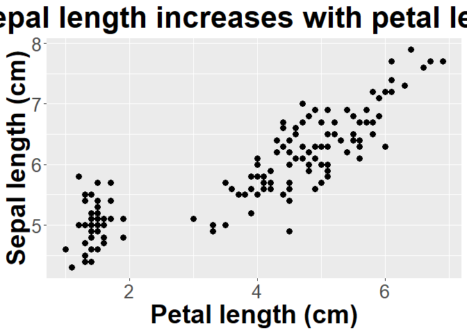<!-- -->

```r
iris_regression <- lm(Sepal.Length ~ Petal.Length, iris)
par(mfrow = c(2,2))
plot(iris_regression)
```

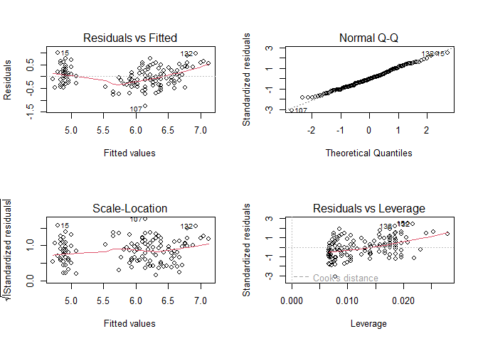<!-- -->

```r
library(car)
```

```
## Loading required package: carData
```

```r
Anova(iris_regression, type = "III")
```

```
## Anova Table (Type III tests)
## 
## Response: Sepal.Length
##              Sum Sq  Df F value    Pr(>F)    
## (Intercept)  500.16   1 3018.28 < 2.2e-16 ***
## Petal.Length  77.64   1  468.55 < 2.2e-16 ***
## Residuals     24.53 148                      
## ---
## Signif. codes:  0 '***' 0.001 '**' 0.01 '*' 0.05 '.' 0.1 ' ' 1
```

```r
summary(iris_regression)
```

```
## 
## Call:
## lm(formula = Sepal.Length ~ Petal.Length, data = iris)
## 
## Residuals:
##      Min       1Q   Median       3Q      Max 
## -1.24675 -0.29657 -0.01515  0.27676  1.00269 
## 
## Coefficients:
##              Estimate Std. Error t value Pr(>|t|)    
## (Intercept)   4.30660    0.07839   54.94   <2e-16 ***
## Petal.Length  0.40892    0.01889   21.65   <2e-16 ***
## ---
## Signif. codes:  0 '***' 0.001 '**' 0.01 '*' 0.05 '.' 0.1 ' ' 1
## 
## Residual standard error: 0.4071 on 148 degrees of freedom
## Multiple R-squared:   0.76,	Adjusted R-squared:  0.7583 
## F-statistic: 468.6 on 1 and 148 DF,  p-value: < 2.2e-16
```


```r
cor.test(~ Sepal.Length + Petal.Length, data = iris)
```

```
## 
## 	Pearson's product-moment correlation
## 
## data:  Sepal.Length and Petal.Length
## t = 21.646, df = 148, p-value < 2.2e-16
## alternative hypothesis: true correlation is not equal to 0
## 95 percent confidence interval:
##  0.8270363 0.9055080
## sample estimates:
##       cor 
## 0.8717538
```

```r
cor.test(~ Sepal.Length + Petal.Length, data = iris,
         method="spearman")
```

```
## Warning in cor.test.default(x = mf[[1L]], y = mf[[2L]], ...): Cannot compute
## exact p-value with ties
```

```
## 
## 	Spearman's rank correlation rho
## 
## data:  Sepal.Length and Petal.Length
## S = 66429, p-value < 2.2e-16
## alternative hypothesis: true rho is not equal to 0
## sample estimates:
##       rho 
## 0.8818981
```


## Practice

### 1
  
  

1.  A professor carried out a long-term study to see how various factors impacted
pulse rate before and after exercise.  Data can be found at 

http://www.statsci.org/data/oz/ms212.txt

With more info at 

http://www.statsci.org/data/oz/ms212.html.

Is there evidence that age, height, or weight impact change in pulse rate for students who ran (Ran column = 1)?  For each of these, how much variation in pulse rate do they explain?


```r
pulse <- read.table("http://www.statsci.org/data/oz/ms212.txt", header = T, stringsAsFactors = T)
pulse$change <- pulse$Pulse2 - pulse$Pulse1
#need to make columns entered as numeral change to factor, although it doesn't 
#really matter when only 2 groups (why?)
pulse$Exercise <-as.factor(pulse$Exercise)
pulse$Gender <- as.factor(pulse$Gender)

#age
exercise <- lm(change ~ Age, pulse[pulse$Ran == 1, ])
par(mfrow =c (2,2))
plot(exercise)
```

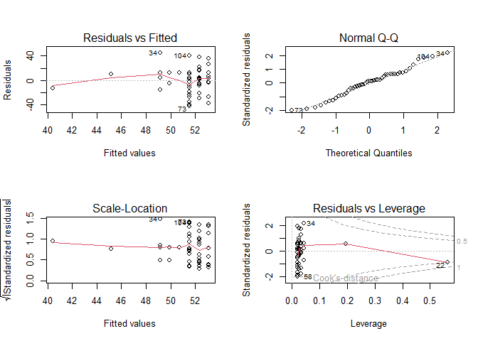<!-- -->

```r
require(car)
Anova(exercise, type = "III")
```

```
## Anova Table (Type III tests)
## 
## Response: change
##              Sum Sq Df F value   Pr(>F)   
## (Intercept)  3882.7  1  8.6317 0.005242 **
## Age           222.7  1  0.4950 0.485395   
## Residuals   19792.3 44                    
## ---
## Signif. codes:  0 '***' 0.001 '**' 0.01 '*' 0.05 '.' 0.1 ' ' 1
```

```r
summary(exercise)
```

```
## 
## Call:
## lm(formula = change ~ Age, data = pulse[pulse$Ran == 1, ])
## 
## Residuals:
##     Min      1Q  Median      3Q     Max 
## -41.512 -12.183   2.591  12.893  44.868 
## 
## Coefficients:
##             Estimate Std. Error t value Pr(>|t|)   
## (Intercept)  67.3759    22.9328   2.938  0.00524 **
## Age          -0.7932     1.1274  -0.704  0.48539   
## ---
## Signif. codes:  0 '***' 0.001 '**' 0.01 '*' 0.05 '.' 0.1 ' ' 1
## 
## Residual standard error: 21.21 on 44 degrees of freedom
## Multiple R-squared:  0.01113,	Adjusted R-squared:  -0.01135 
## F-statistic: 0.495 on 1 and 44 DF,  p-value: 0.4854
```

*First we need to make a column that shows change in pulse rate. We also should 
change Exercise and gender to factors.*  

*For age we note the model meets assumptions (no patterns in residuals and 
residuals follow a normal distribution). We also find no evidence that 
age impacts change (F~1,44~ = .4950, p = 0.49). We fail to reject our null 
hypothesis that there is no relationship between age and change in pulse rate. We
also note that age only explains 1.1% of the variation in change in pulse rate 
(likely due to chance!).*  


```r
#weight
exercise <- lm(change ~ Weight, pulse[pulse$Ran == 1, ])
par(mfrow =c (2,2))
plot(exercise)
```

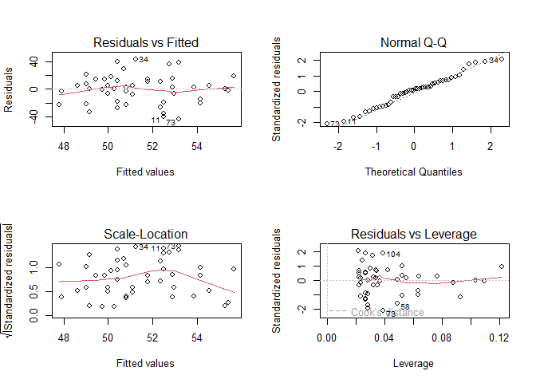<!-- -->

```r
Anova(exercise, type = "III")
```

```
## Anova Table (Type III tests)
## 
## Response: change
##              Sum Sq Df F value   Pr(>F)   
## (Intercept)  3588.9  1  7.9618 0.007143 **
## Weight        181.5  1  0.4027 0.528990   
## Residuals   19833.4 44                    
## ---
## Signif. codes:  0 '***' 0.001 '**' 0.01 '*' 0.05 '.' 0.1 ' ' 1
```

```r
summary(exercise)
```

```
## 
## Call:
## lm(formula = change ~ Weight, data = pulse[pulse$Ran == 1, ])
## 
## Residuals:
##     Min      1Q  Median      3Q     Max 
## -43.173 -17.343   1.967  13.503  42.760 
## 
## Coefficients:
##             Estimate Std. Error t value Pr(>|t|)   
## (Intercept)  42.1276    14.9300   2.822  0.00714 **
## Weight        0.1381     0.2176   0.635  0.52899   
## ---
## Signif. codes:  0 '***' 0.001 '**' 0.01 '*' 0.05 '.' 0.1 ' ' 1
## 
## Residual standard error: 21.23 on 44 degrees of freedom
## Multiple R-squared:  0.009069,	Adjusted R-squared:  -0.01345 
## F-statistic: 0.4027 on 1 and 44 DF,  p-value: 0.529
```
*For weight we note the model meets assumptions. We also find no evidence that 
weight impacts change (F~1,44~ = .4027, p = 0.53). We fail to reject our null 
hypothesis that there is no relationship between weight and change in pulse rate.
 We
also note that weight only explains 1% of the variation in change in pulse rate 
(likely due to chance!).*    


```r
#height
exercise <- lm(change ~ Height, pulse[pulse$Ran == 1, ])
par(mfrow =c (2,2))
plot(exercise)
```

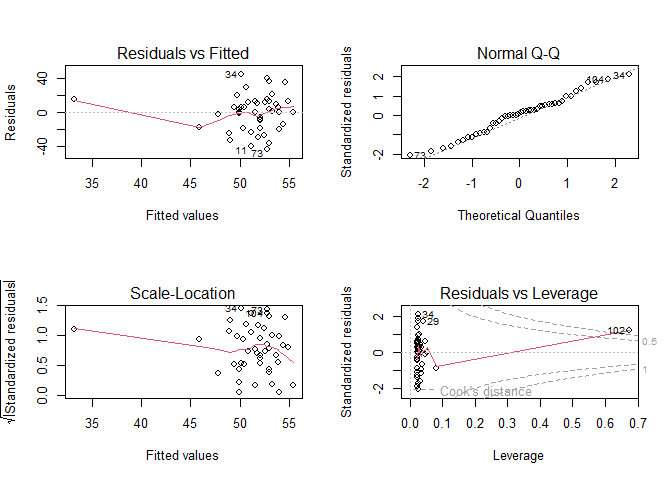<!-- -->

```r
Anova(exercise, type = "III")
```

```
## Anova Table (Type III tests)
## 
## Response: change
##              Sum Sq Df F value Pr(>F)
## (Intercept)   243.9  1  0.5503 0.4621
## Height        511.4  1  1.1536 0.2886
## Residuals   19503.6 44
```

```r
summary(exercise)
```

```
## 
## Call:
## lm(formula = change ~ Height, data = pulse[pulse$Ran == 1, ])
## 
## Residuals:
##     Min      1Q  Median      3Q     Max 
## -42.798 -17.012   1.848  12.177  43.861 
## 
## Coefficients:
##             Estimate Std. Error t value Pr(>|t|)
## (Intercept)  21.0688    28.4017   0.742    0.462
## Height        0.1773     0.1650   1.074    0.289
## 
## Residual standard error: 21.05 on 44 degrees of freedom
## Multiple R-squared:  0.02555,	Adjusted R-squared:  0.003402 
## F-statistic: 1.154 on 1 and 44 DF,  p-value: 0.2886
```
*For height we note the model meets assumptions. We also find no evidence that 
weight impacts change (F~1,44~ = 1.15, p = 0.29). We fail to reject our null 
hypothesis that there is no relationship between height and change in pulse rate.
 We
also note that age only explains 2.5% of the variation in change in pulse rate 
(likely due to chance!).*   

### 2 

2. (from OZDASL repository, http://www.statsci.org/data/general/stature.html; reference for more information)

When anthropologists analyze human skeletal remains, an important piece of
information is living stature. Since skeletons are commonly based on
statistical methods that utilize measurements on small bones. The following
data was presented in a paper in the American Journal of Physical
Anthropology to validate one such method.
Data is available @

http://www.statsci.org/data/general/stature.txt

as a tab-delimted file (need to use read.table!)
Is there evidence that metacarpal bone length is a good predictor of
stature? If so, how much variation does it account for in the response
variable?


```r
height <- read.table("http://www.statsci.org/data/general/stature.txt", 
                     header = T, stringsAsFactors = T)
head(height)
```

```
##   MetaCarp Stature
## 1       45     171
## 2       51     178
## 3       39     157
## 4       41     163
## 5       48     172
## 6       49     183
```

```r
metacarp_relationship <- lm(Stature ~ MetaCarp, height)
plot(metacarp_relationship)
```

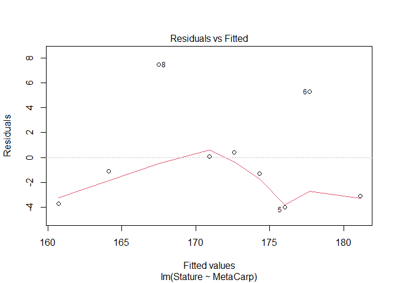<!-- -->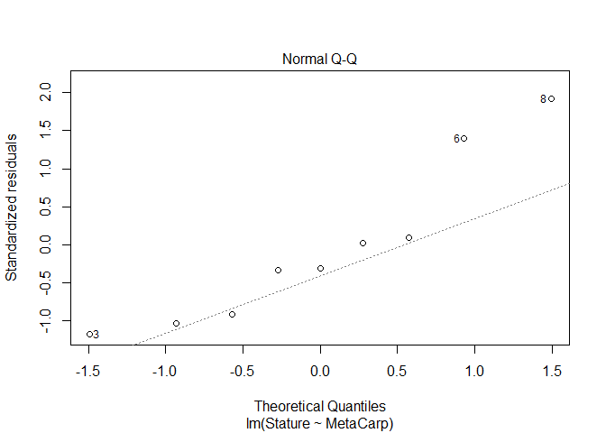<!-- -->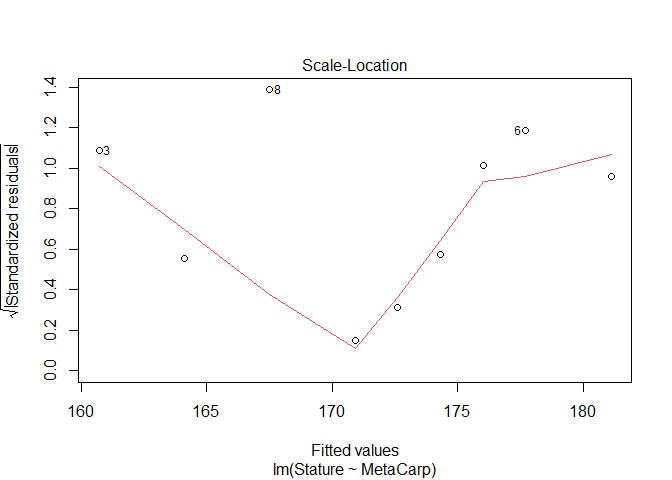<!-- -->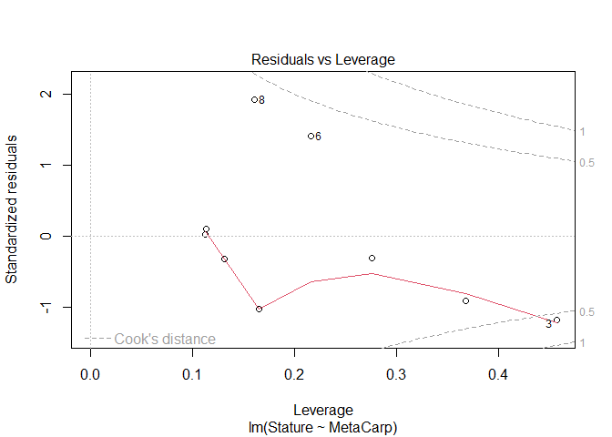<!-- -->

```r
Anova(metacarp_relationship, type = "III")
```

```
## Anova Table (Type III tests)
## 
## Response: Stature
##             Sum Sq Df F value   Pr(>F)   
## (Intercept) 515.73  1  28.491 0.001078 **
## MetaCarp    347.29  1  19.186 0.003234 **
## Residuals   126.71  7                    
## ---
## Signif. codes:  0 '***' 0.001 '**' 0.01 '*' 0.05 '.' 0.1 ' ' 1
```

```r
summary(metacarp_relationship)
```

```
## 
## Call:
## lm(formula = Stature ~ MetaCarp, data = height)
## 
## Residuals:
##     Min      1Q  Median      3Q     Max 
## -4.0102 -3.1091 -1.1128  0.3891  7.4880 
## 
## Coefficients:
##             Estimate Std. Error t value Pr(>|t|)   
## (Intercept)   94.428     17.691   5.338  0.00108 **
## MetaCarp       1.700      0.388   4.380  0.00323 **
## ---
## Signif. codes:  0 '***' 0.001 '**' 0.01 '*' 0.05 '.' 0.1 ' ' 1
## 
## Residual standard error: 4.255 on 7 degrees of freedom
## Multiple R-squared:  0.7327,	Adjusted R-squared:  0.6945 
## F-statistic: 19.19 on 1 and 7 DF,  p-value: 0.003234
```
*To consider the relationship among these continuous variables, we used linear regression. 
Analysis of model assumptions suggest assumptions are met, although the dataset is 
small.  Analysis suggests there is a significant positive relationship between 
metacarpal length and stature (F~1,7~ = 19.19, p = 0.003). The R^2^ value indicates
that metacarpal length explains 73% of the variation in stature. Coefficients 
indicate that stature increases with increasing metacarpal length.*

### 3


3. Data on medals won by various countries in the 1992 and 1994 Olympics is
available in a tab-delimited file at 

http://www.statsci.org/data/oz/medals.txt

More information on the data can be found at: 

http://www.statsci.org/data/oz/medals.html

Is there any relationship between a country’s population and the total
number of medals they win?


```r
medals <- read.table(header = T, "http://www.statsci.org/data/oz/medals.txt", 
                     stringsAsFactors = T)
head(medals)
```

```
##        Country Summer Winter Population Latitude
## 1  UnifiedTeam    112     34      231.5       61
## 2 UnitesStates    108     13      260.7       38
## 3      Germany     82     24       81.1       51
## 4        China     54      3     1190.4       36
## 5         Cuba     31      0       11.1       22
## 6      Hungary     30      0       10.3       46
```

```r
medals$total <- medals$Summer + medals$Winter
population_medals <- lm(total ~ Population, medals)
plot(population_medals)
```

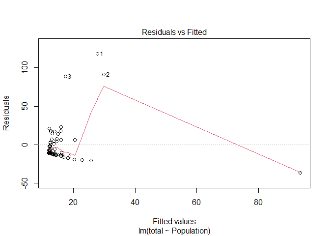<!-- -->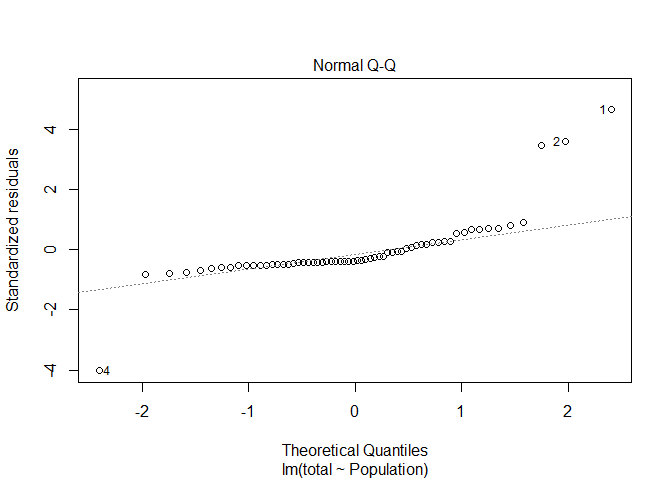<!-- -->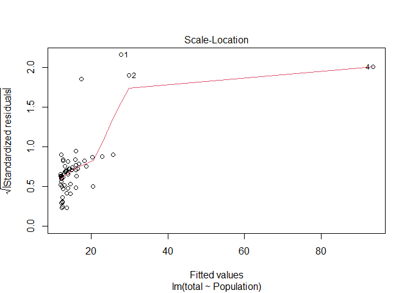<!-- -->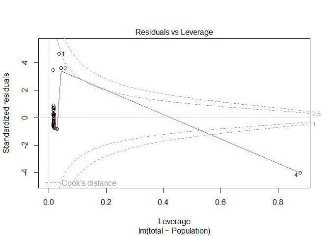<!-- -->

```r
summary(population_medals)
```

```
## 
## Call:
## lm(formula = total ~ Population, data = medals)
## 
## Residuals:
##     Min      1Q  Median      3Q     Max 
## -36.470 -12.303  -9.525   4.379 118.141 
## 
## Coefficients:
##             Estimate Std. Error t value Pr(>|t|)   
## (Intercept) 12.01849    3.51123   3.423  0.00112 **
## Population   0.06842    0.02117   3.233  0.00199 **
## ---
## Signif. codes:  0 '***' 0.001 '**' 0.01 '*' 0.05 '.' 0.1 ' ' 1
## 
## Residual standard error: 25.8 on 60 degrees of freedom
## Multiple R-squared:  0.1483,	Adjusted R-squared:  0.1341 
## F-statistic: 10.45 on 1 and 60 DF,  p-value: 0.001994
```

```r
Anova(population_medals, type = "III")
```

```
## Anova Table (Type III tests)
## 
## Response: total
##             Sum Sq Df F value   Pr(>F)   
## (Intercept)   7799  1  11.716 0.001122 **
## Population    6957  1  10.450 0.001994 **
## Residuals    39942 60                    
## ---
## Signif. codes:  0 '***' 0.001 '**' 0.01 '*' 0.05 '.' 0.1 ' ' 1
```

```r
cor.test(~total + Population, medals, method = "spearman")
```

```
## Warning in cor.test.default(x = mf[[1L]], y = mf[[2L]], ...): Cannot compute
## exact p-value with ties
```

```
## 
## 	Spearman's rank correlation rho
## 
## data:  total and Population
## S = 29456, p-value = 0.04271
## alternative hypothesis: true rho is not equal to 0
## sample estimates:
##       rho 
## 0.2582412
```
*There is a high leverage point in the dataset (row 4), but residuals appear to 
be fairly normally distributed and little structure exists in the graph of Residuals 
vs. Fitted Values.  Analysis using linear regression suggests a significant (
F~1,60~ = 10.45, p = 0.002) positive relationship between population size and 
medal count that explains ~15% of the variation in the response variable.  Rank-
correlation analysis also indicated this relationship exists.*

### 4


4. Continuing with the Olympic data, is there a relationship between the
latitude of a country and the number of medals won in summer or winter
Olympics?


```r
#still using medals
summer_medals <- lm(Summer ~ Latitude, medals)
plot(summer_medals)
```

<!-- -->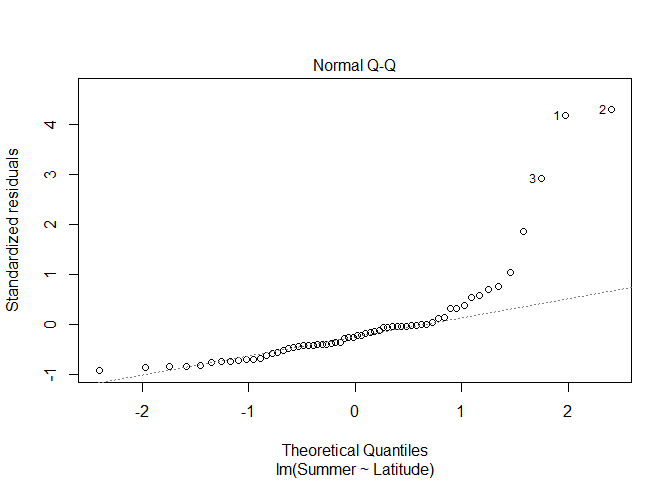<!-- -->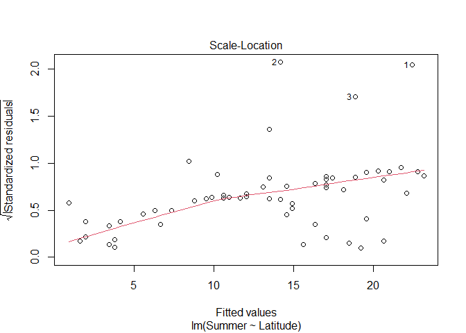<!-- --><!-- -->

```r
Anova(summer_medals, type = "III")
```

```
## Anova Table (Type III tests)
## 
## Response: Summer
##              Sum Sq Df F value  Pr(>F)  
## (Intercept)     3.6  1  0.0075 0.93143  
## Latitude     2440.3  1  5.0389 0.02848 *
## Residuals   29057.2 60                  
## ---
## Signif. codes:  0 '***' 0.001 '**' 0.01 '*' 0.05 '.' 0.1 ' ' 1
```

```r
summary(summer_medals)
```

```
## 
## Call:
## lm(formula = Summer ~ Latitude, data = medals)
## 
## Residuals:
##     Min      1Q  Median      3Q     Max 
## -19.707 -10.856  -4.922   0.352  93.827 
## 
## Coefficients:
##             Estimate Std. Error t value Pr(>|t|)  
## (Intercept)   0.5403     6.2531   0.086   0.9314  
## Latitude      0.3588     0.1598   2.245   0.0285 *
## ---
## Signif. codes:  0 '***' 0.001 '**' 0.01 '*' 0.05 '.' 0.1 ' ' 1
## 
## Residual standard error: 22.01 on 60 degrees of freedom
## Multiple R-squared:  0.07747,	Adjusted R-squared:  0.0621 
## F-statistic: 5.039 on 1 and 60 DF,  p-value: 0.02848
```

```r
winter_medals <- lm(Winter ~ Latitude, medals)
plot(winter_medals)
```

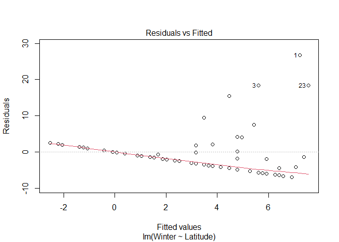<!-- -->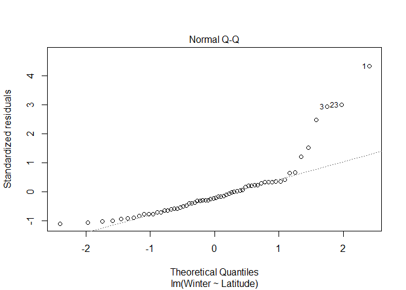<!-- -->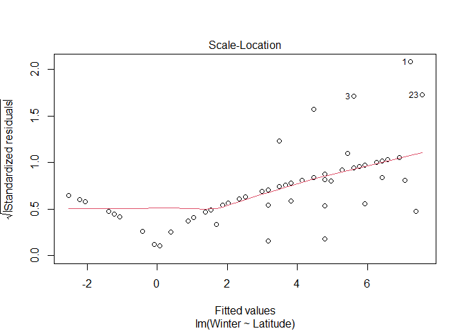<!-- -->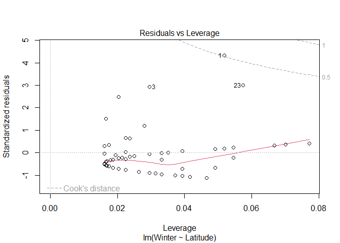<!-- -->

```r
Anova(winter_medals, type = "III")
```

```
## Anova Table (Type III tests)
## 
## Response: Winter
##              Sum Sq Df F value    Pr(>F)    
## (Intercept)   90.07  1  2.2353 0.1401300    
## Latitude     502.29  1 12.4652 0.0008035 ***
## Residuals   2417.71 60                      
## ---
## Signif. codes:  0 '***' 0.001 '**' 0.01 '*' 0.05 '.' 0.1 ' ' 1
```

```r
summary(winter_medals)
```

```
## 
## Call:
## lm(formula = Winter ~ Latitude, data = medals)
## 
## Residuals:
##    Min     1Q Median     3Q    Max 
## -6.906 -3.773 -1.383  1.395 26.768 
## 
## Coefficients:
##             Estimate Std. Error t value Pr(>|t|)    
## (Intercept)  -2.6967     1.8037  -1.495 0.140130    
## Latitude      0.1628     0.0461   3.531 0.000803 ***
## ---
## Signif. codes:  0 '***' 0.001 '**' 0.01 '*' 0.05 '.' 0.1 ' ' 1
## 
## Residual standard error: 6.348 on 60 degrees of freedom
## Multiple R-squared:  0.172,	Adjusted R-squared:  0.1582 
## F-statistic: 12.47 on 1 and 60 DF,  p-value: 0.0008035
```

*Visual analysis of residuals from both models show some structure in the residual
and deviations from normality, but we continue on with linear regression given the 
small sample size.  Both summer and winter medal counts are positively (surpisingly)
and significantly (both p <.05)
related to latitude, with latitude explaining ~17% of the variation in winter medal
count and ~8% of the data in summer medal count.*

### 5


5. Data on FEV (forced expiratory volume), a measure of lung function, can
be found at 

http://www.statsci.org/data/general/fev.txt

More information on the dataset is available at 

http://www.statsci.org/data/general/fev.html.

Is there evidence that FEV depends on age or height? If so, how do these
factors impact FEV, and how much variance does each explain? 


```r
fev <- read.table("http://www.statsci.org/data/general/fev.txt", header = T, 
                  stringsAsFactors = T)
head(fev)
```

```
##     ID Age   FEV Height    Sex Smoker
## 1  301   9 1.708   57.0 Female    Non
## 2  451   8 1.724   67.5 Female    Non
## 3  501   7 1.720   54.5 Female    Non
## 4  642   9 1.558   53.0   Male    Non
## 5  901   9 1.895   57.0   Male    Non
## 6 1701   8 2.336   61.0 Female    Non
```

```r
fev_height <- lm(FEV ~ Height, fev)
plot(fev_height)
```

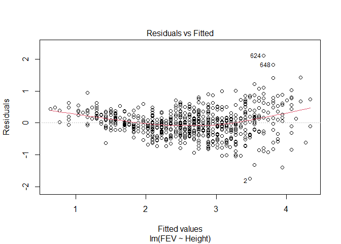<!-- -->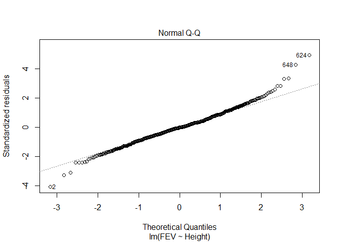<!-- -->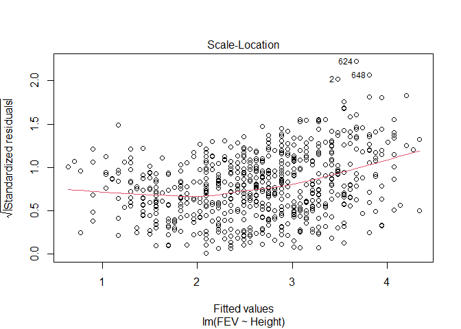<!-- -->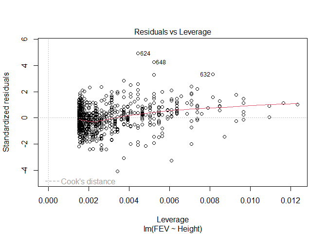<!-- -->

```r
Anova(fev_height, type = "III")
```

```
## Anova Table (Type III tests)
## 
## Response: FEV
##             Sum Sq  Df F value    Pr(>F)    
## (Intercept) 166.25   1  896.33 < 2.2e-16 ***
## Height      369.99   1 1994.73 < 2.2e-16 ***
## Residuals   120.93 652                      
## ---
## Signif. codes:  0 '***' 0.001 '**' 0.01 '*' 0.05 '.' 0.1 ' ' 1
```

```r
summary(fev_height)
```

```
## 
## Call:
## lm(formula = FEV ~ Height, data = fev)
## 
## Residuals:
##      Min       1Q   Median       3Q      Max 
## -1.75167 -0.26619 -0.00401  0.24474  2.11936 
## 
## Coefficients:
##              Estimate Std. Error t value Pr(>|t|)    
## (Intercept) -5.432679   0.181460  -29.94   <2e-16 ***
## Height       0.131976   0.002955   44.66   <2e-16 ***
## ---
## Signif. codes:  0 '***' 0.001 '**' 0.01 '*' 0.05 '.' 0.1 ' ' 1
## 
## Residual standard error: 0.4307 on 652 degrees of freedom
## Multiple R-squared:  0.7537,	Adjusted R-squared:  0.7533 
## F-statistic:  1995 on 1 and 652 DF,  p-value: < 2.2e-16
```
Model assumptions appear to be met. Height appears to have a positive relationship
with FEV (F~1,652~ = 1995, p<.001).  


```r
fev_age <- lm(FEV ~ Age, fev)
plot(fev_age)
```

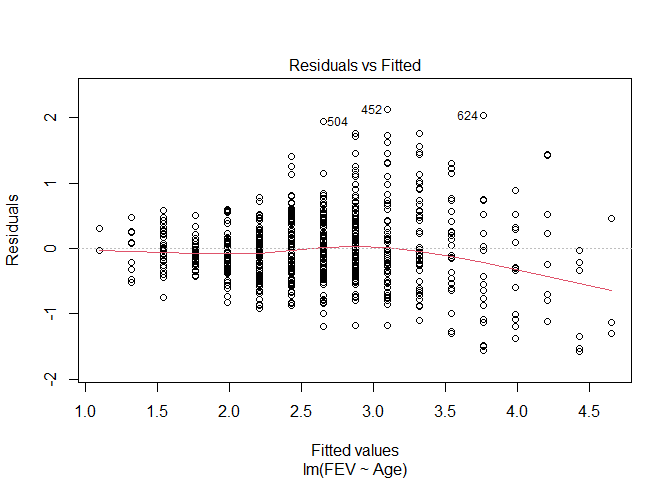<!-- -->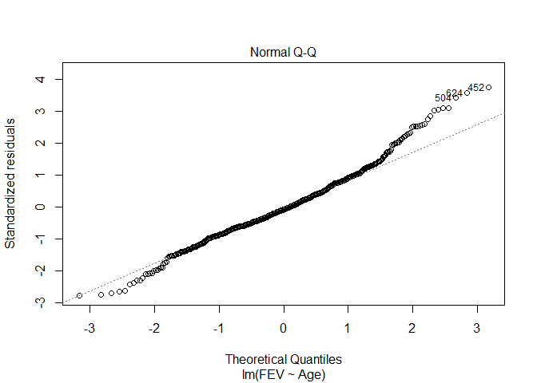<!-- -->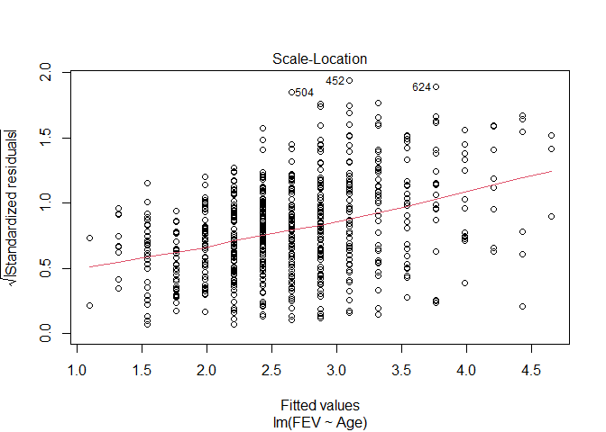<!-- -->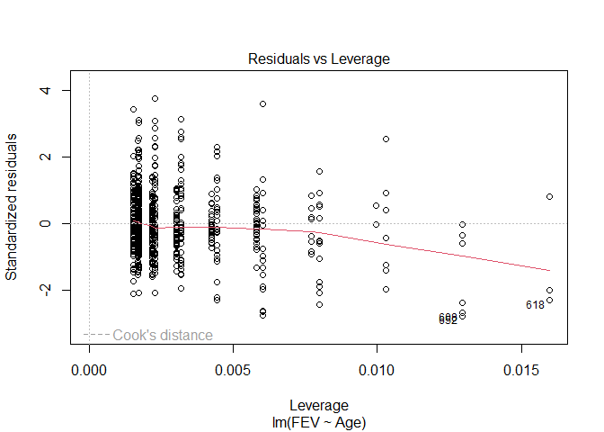<!-- -->

```r
Anova(fev_age, type = "III")
```

```
## Anova Table (Type III tests)
## 
## Response: FEV
##             Sum Sq  Df F value    Pr(>F)    
## (Intercept)   9.89   1  30.707 4.359e-08 ***
## Age         280.92   1 872.184 < 2.2e-16 ***
## Residuals   210.00 652                      
## ---
## Signif. codes:  0 '***' 0.001 '**' 0.01 '*' 0.05 '.' 0.1 ' ' 1
```

```r
summary(fev_age)
```

```
## 
## Call:
## lm(formula = FEV ~ Age, data = fev)
## 
## Residuals:
##      Min       1Q   Median       3Q      Max 
## -1.57539 -0.34567 -0.04989  0.32124  2.12786 
## 
## Coefficients:
##             Estimate Std. Error t value Pr(>|t|)    
## (Intercept) 0.431648   0.077895   5.541 4.36e-08 ***
## Age         0.222041   0.007518  29.533  < 2e-16 ***
## ---
## Signif. codes:  0 '***' 0.001 '**' 0.01 '*' 0.05 '.' 0.1 ' ' 1
## 
## Residual standard error: 0.5675 on 652 degrees of freedom
## Multiple R-squared:  0.5722,	Adjusted R-squared:  0.5716 
## F-statistic: 872.2 on 1 and 652 DF,  p-value: < 2.2e-16
```

Model assumptions appear to be met. Age appears to have a positive relationship
with FEV (F~1,652~ = 872.2, p<.001). 

### 6 


6. Continuing with the FEV data, produce plots that illustrate how height, age, 
and gender each impact FEV.  


```r
library(ggplot2)
#age plot####
ggplot(fev, aes(x=Age, y=FEV)) +
  geom_point(size = 3) +
  geom_smooth(method = "lm") +
  ylab("FEV (L)")+ggtitle("FEV increases with age")+
  theme(axis.title.x = element_text(face="bold", size=28), 
        axis.title.y = element_text(face="bold", size=28), 
        axis.text.y  = element_text(size=20),
        axis.text.x  = element_text(size=20), 
        legend.text =element_text(size=20),
        legend.title = element_text(size=20, face="bold"),
        plot.title = element_text(hjust = 0.5, face="bold", size=32))
```

```
## `geom_smooth()` using formula 'y ~ x'
```

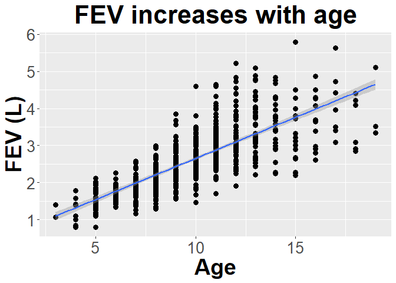<!-- -->

```r
#height plot####
ggplot(fev, aes(x=Height, y=FEV)) +
  geom_point(size = 3) +
  geom_smooth(method = "lm") +
  ylab("FEV (L)")+ggtitle("FEV increases with height")+
  theme(axis.title.x = element_text(face="bold", size=28), 
        axis.title.y = element_text(face="bold", size=28), 
        axis.text.y  = element_text(size=20),
        axis.text.x  = element_text(size=20), 
        legend.text =element_text(size=20),
        legend.title = element_text(size=20, face="bold"),
        plot.title = element_text(hjust = 0.5, face="bold", size=32))
```

```
## `geom_smooth()` using formula 'y ~ x'
```

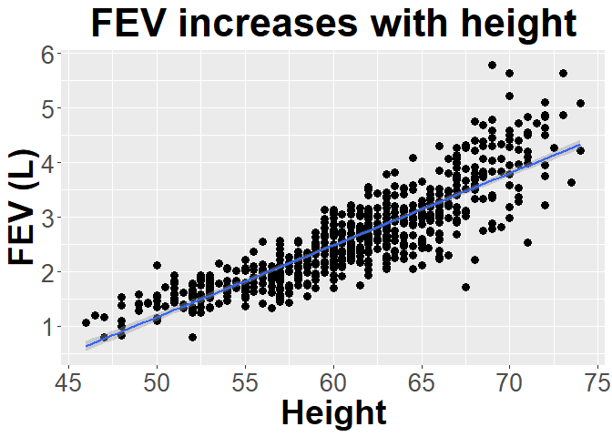<!-- -->

```r
#gender plot ####

#bar chart with error bars ####
library(Rmisc)
```

```
## Loading required package: lattice
```

```
## Loading required package: plyr
```

```r
function_output <- summarySE(fev, measurevar="FEV", groupvars =
                               c("Sex"))

ggplot(function_output, aes(x=Sex, y=FEV)) +
  geom_col(size = 3) +
  ylab("FEV (L)") +
  ggtitle("FEV is higher in males ")+
  geom_errorbar(aes(ymin=FEV-ci, ymax=FEV+ci), size=1.5) +
  theme(axis.title.x = element_text(face="bold", size=28), 
        axis.title.y = element_text(face="bold", size=28), 
        axis.text.y  = element_text(size=20),
        axis.text.x  = element_text(size=20), 
        legend.text =element_text(size=20),
        legend.title = element_text(size=20, face="bold"),
        plot.title = element_text(hjust = 0.5, face="bold", size=32))
```

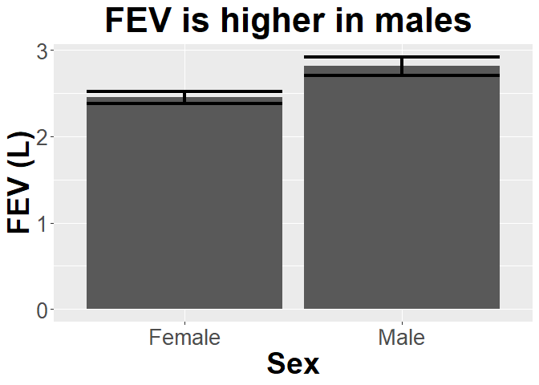<!-- -->
