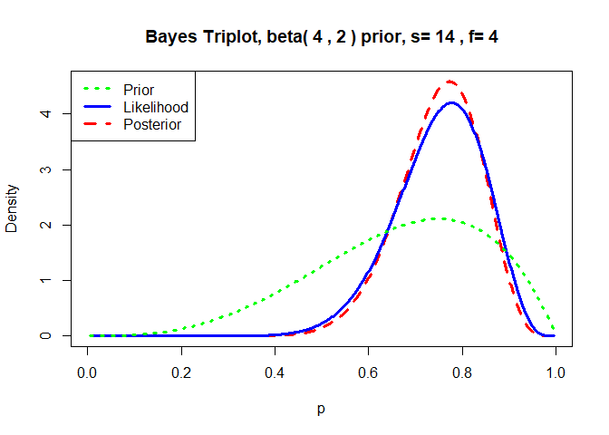

11\. Gamma and Bayes intro
================
jsg
11/4/2020

Before doing this, review the **Week 11** lecture set slides from
<https://sites.google.com/view/biostats/bio-7800178002/week-11> and the
**112\_more\_model\_extensions.R** and \*15\_a\_bayes\_standalone.R\*\*
script in the lecture files folder of the [CUNY-BioStats github
repository](https://github.com/jsgosnell/CUNY-BioStats). Make sure you
are comfortable with null and alternative hypotheses for all examples.

Remember you should

  - add code chunks by clicking the *Insert Chunk* button on the toolbar
    or by pressing *Ctrl+Alt+I* to answer the questions\!
  - **knit** your file to produce a markdown version that you can see\!
  - save your work often
      - **commit** it via git\!
      - **push** updates to github

<!-- end list -->

1.  Make sure you can describe the main differences between Frequentist,
    Likelihood, and Bayesian approaches.

2.  Review the video we watched in class to make sure you understand the
    Bayesian connection. You can also read a related post @
    <https://brilliant.org/wiki/monty-hall-problem/>.

<!-- end list -->

  - <https://www.youtube.com/watch?v=mhlc7peGlGg>

<!-- end list -->

3.  I’ve shared a script in R that lets you test the Monty Hall idea
    (like in the video\!). It’s the chivers\_monty\_hall\_script from
    the [code\_examples
    folder](https://github.com/jsgosnell/CUNY-BioStats/tree/master/code_examples)code\_examples  
    on github. For this question, its easiest to just source the main
    file and see what happens. When you source a script, it is run in R
    without showing any console output (but graphs and objects are still
    produced\!). Try
    *source(“<https://raw.githubusercontent.com/jsgosnell/CUNY-BioStats/master/code_examples/chivers_monty_hall_script.R>”)*
    , then test out the idea here using the following functions which
    calculate outcomes under each strategy.

<!-- end list -->

  - monty(strat=“stay”, print\_games=F)
  - monty(strat=“switch”, print\_games=F)
  - monty(strat=“random”, print\_games=F)

<!-- end list -->

``` r
source("https://raw.githubusercontent.com/jsgosnell/CUNY-BioStats/master/code_examples/chivers_monty_hall_script.R")
monty(strat="stay", print_games=F)
```

    ## Using the stay strategy, your win percentage was 32.8%

``` r
monty(strat="switch", print_games=F)
```

    ## Using the switch strategy, your win percentage was 66.4%

``` r
monty(strat="random", print_games=F)
```

    ## Using the random strategy, your win percentage was 49.2%

4.  Setup the Monty Hall problem as probabilities and convince yourself
    how it works. You may want to remember to think about prior and new
    information (likelihoods).

5.  Run the frog analysis (14/18 frogs are right-pawed) assuming an
    “uninformed” prior (is this really possible?) and priors that
    predict frogs are likely to be left- or right-handed (look under
    Bayesian analysis in script for functions such as triplot and
    qbeta). Vary both the relationship among the shape variables and the
    magnitude (weighting) to understand how the prior impacts your
    posterior.

<!-- end list -->

``` r
library(LearnBayes)
#even, uniform (uninformed) prior
triplot(prior = c(1,1), data = c(14,4), where = "topleft")
```

<!-- -->

``` r
#prior assumes left handed
triplot(prior = c(5,20), data = c(14,4), where = "topleft")
```

<!-- -->

``` r
#prior assumes right handed 
triplot(prior = c(20,5), data = c(14,4), where = "topleft")
```

<!-- -->

``` r
#less sure right handed
triplot(prior = c(4,2), data = c(14,4), where = "topleft")
```

<!-- -->
*This is the “big picture” of Bayesian analysis. We combined our prior
beliefs and data to update our beliefs (the posterior). We
sample/describe the posterior for our answer. Everything else is “how do
we do that?”.*

6.  Data on plant heights (in cm) for plants grown with a new and old
    formulation of fertilizer can be found at

<https://raw.githubusercontent.com/jsgosnell/CUNY-BioStats/master/datasets/fertilizer.csv>

Use the data to test the hypothesis that there is no difference in mean
plant heights for the two groups A) Using frequentist methods B) Using
Bayesian approaches.

``` r
#fertilizer####
fertilizer <- read.csv("https://raw.githubusercontent.com/jsgosnell/CUNY-BioStats/master/datasets/fertilizer.csv")

t.test(height ~ fertilizer, fertilizer)
```

    ## 
    ##  Welch Two Sample t-test
    ## 
    ## data:  height by fertilizer
    ## t = 3.013, df = 15.559, p-value = 0.008458
    ## alternative hypothesis: true difference in means is not equal to 0
    ## 95 percent confidence interval:
    ##  1.367809 7.912191
    ## sample estimates:
    ## mean in group new mean in group old 
    ##             56.55             51.91

``` r
library(BayesFactor)
```

    ## Loading required package: coda

    ## Loading required package: Matrix

    ## ************
    ## Welcome to BayesFactor 0.9.12-4.2. If you have questions, please contact Richard Morey (richarddmorey@gmail.com).
    ## 
    ## Type BFManual() to open the manual.
    ## ************

``` r
ttestBF(formula = height ~ fertilizer, data = fertilizer)
```

    ## Bayes factor analysis
    ## --------------
    ## [1] Alt., r=0.707 : 5.748667 ±0%
    ## 
    ## Against denominator:
    ##   Null, mu1-mu2 = 0 
    ## ---
    ## Bayes factor type: BFindepSample, JZS

7.Develop a Bayesian model to determine if sepal width (from the iris
dataset in R) differs among populations.

  - compare models that parameterize each population as different vs one
    that only examines difference between I. setosa and other species.
      - making a new dummy variable is one way to do this\!
