3\. Continuous tests for 1 or 2 populations
================
jsg
9/8/2020

Before doing this, review the **Week 3** lecture set slides from
<https://sites.google.com/view/biostats/bio-7800178002/week-3> and the
**Week\_3.R** script in the grad\_files\_2020 folder of the
[CUNY-BioStats github
repository](https://github.com/jsgosnell/CUNY-BioStats). You’ll also use
the qqplot\_example.R and central\_limit\_theorem.R script from the
[code\_examples
folder](https://github.com/jsgosnell/CUNY-BioStats/tree/master/code_examples).

Remember you should \* add code chunks by clicking the *Insert Chunk*
button on the toolbar or by pressing *Ctrl+Alt+I* to answer the
questions\! \* **knit** your file to produce a markdown version that you
can see\! \* save your work often \* **commit** it via git\! **push**
updates to github

## Recognizing and assessing normality

1.  Using the qqplot\_example.R code, examine the following
    distributions and, for the continuous distributions (marked with a
    “\*”), observe how a normal probability plot (qqplot) can be used
    to visually test for approximate normality.

<!-- end list -->

  - \*Normal (u= 0; σ<sup>2</sup>=1, 10, 100)
  - \*Student’s t (df = 1, 10, 30, & 100)
  - \*Chi-square (df= 1, 2, 5, 30, 50)
  - Bernoulli (P=0.1, 0.5, & 0.9)
  - Binomial (P=0.05; N= 2, 5, 25, & 50); (P=0.25; N= 2, 5, 25, & 50);
    (P=0.50; N= 2, 5, 25, & 50); (P=0.75; N= 2, 5, 25, & 50); (P=0.95;
    N= 2, 5, 25, & 50)
  - Poisson ( u= 2, 5, 10, 30, & 50)

For this question, its easiest to just source the main file and see what
happens. When you source a script, it is run in R without showing any
console output (but graphs and objects are still produced\!). Try
*source("<https://raw.githubusercontent.com/jsgosnell/CUNY-BioStats/master/code_examples/qqplot_example.R>*

``` r
source("https://raw.githubusercontent.com/jsgosnell/CUNY-BioStats/master/code_examples/qqplot_example.R")
```

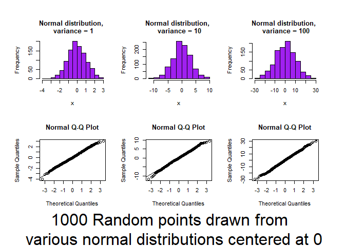<!-- -->

    ## Press [enter] to continue

<!-- -->

    ## Press [enter] to continue

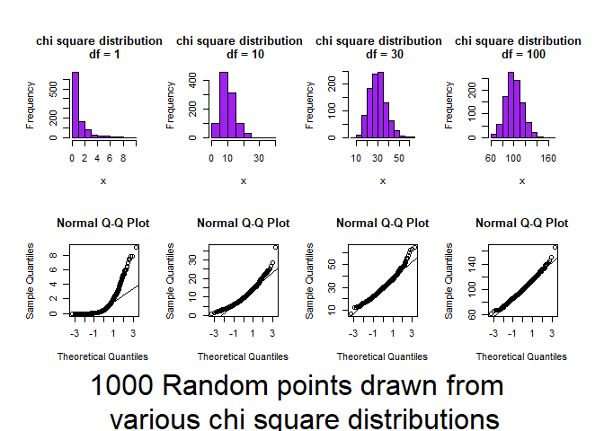<!-- -->

    ## Press [enter] to continue

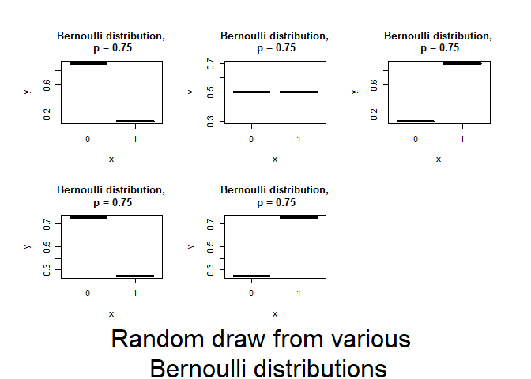<!-- -->

    ## Press [enter] to continue

<!-- -->

    ## Press [enter] to continue

<!-- -->

    ## Press [enter] to continue

<!-- -->

    ## Press [enter] to continue

<!-- -->

    ## Press [enter] to continue

<!-- -->

    ## Press [enter] to continue

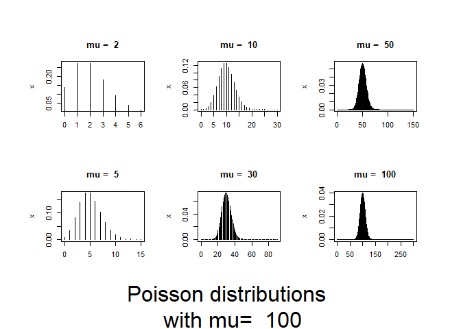<!-- -->

*Notice the spread of DATA of every distribution tend towards normality
as sample size increases*

2.  Review the central\_limit\_theorem.R code if you need to
    convince/remind yourself how common normality of means is for even
    non-normal data. You can source the code using the same approach
    noted in Question 1.

*Here we are focused on how the means look as sample size increases*

``` r
#make sure you have VGAM library installed
source("https://raw.githubusercontent.com/jsgosnell/CUNY-BioStats/master/code_examples/central_limit_theorem.R")
```

    ## Press [enter] to continue

    ## Loading required package: VGAM

    ## Loading required package: stats4

    ## Loading required package: splines

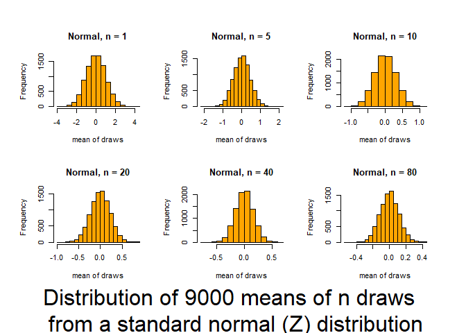<!-- -->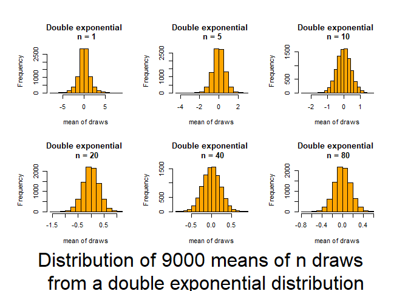<!-- -->

    ## Press [enter] to continue

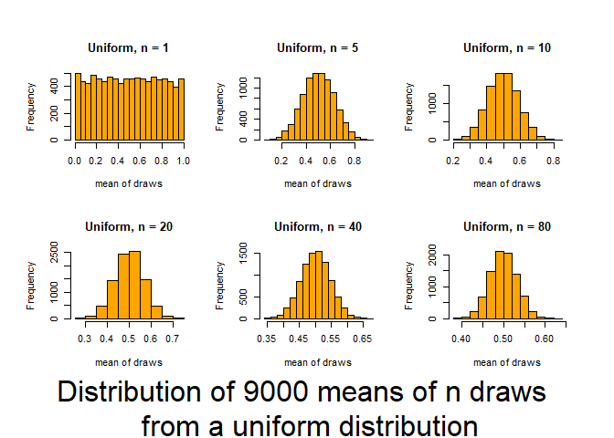<!-- -->

    ## Press [enter] to continue

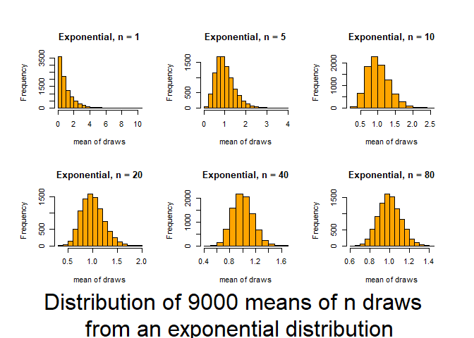<!-- -->

    ## Press [enter] to continue

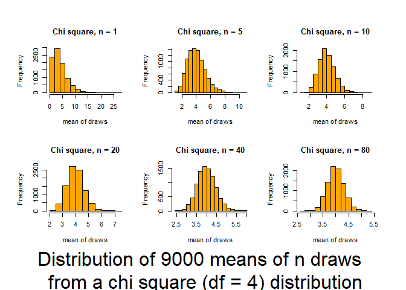<!-- -->

    ## Press [enter] to continue

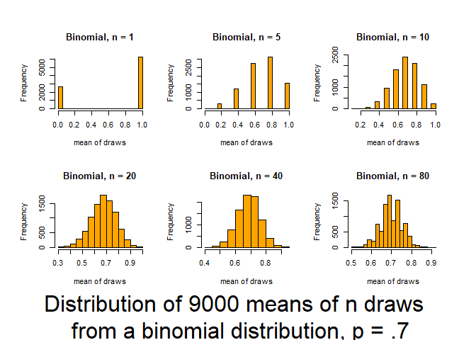<!-- -->

## Just for practice (note some sample sizes may be too small for these to all be good ideas\!)

3.  Seven observers were shown, for a brief period, a grill with 161
    flies impaled and were asked to estimate the number. The results are
    given by Cochran (1954). Based on five estimates, they were 183.2,
    149.0, 154.0, 167.2, 187.2, 158.0, and 143.0. Test the null
    hypothesis that the mean of the estimates is 161 flies.

<!-- end list -->

  - Assuming variance = 275

<!-- end list -->

``` r
flies <- c(183.2, 149.0, 154.0, 167.2, 187.2, 158.0, 143.0)
library(BSDA)
```

    ## Loading required package: lattice

    ## 
    ## Attaching package: 'BSDA'

    ## The following object is masked from 'package:datasets':
    ## 
    ##     Orange

``` r
z.test(x=flies, mu = 161, sigma.x=sqrt(275))
```

    ## 
    ##  One-sample z-Test
    ## 
    ## data:  flies
    ## z = 0.33276, p-value = 0.7393
    ## alternative hypothesis: true mean is not equal to 161
    ## 95 percent confidence interval:
    ##  150.8010 175.3704
    ## sample estimates:
    ## mean of x 
    ##  163.0857

*Using a z-test, I found a test statistics of z\~=0.33 .This corresponds
to a p-value of 0.73. This p value is \>.05, so I fail to reject the
null hypothesis that the mean of the estimates is 161 flies.*

  - Estimating the variance from the data

<!-- end list -->

``` r
t.test(x=flies,mu = 161)
```

    ## 
    ##  One Sample t-test
    ## 
    ## data:  flies
    ## t = 0.32656, df = 6, p-value = 0.7551
    ## alternative hypothesis: true mean is not equal to 161
    ## 95 percent confidence interval:
    ##  147.4576 178.7138
    ## sample estimates:
    ## mean of x 
    ##  163.0857

*Using a t-test, which is appropriate when the variance must be
estimated from the sample and the means of the data may be assumed to
follow a normal distribution, I found a test statistics of
t<sub>6</sub>=0.32. This corresponds to a p-value of 0.76. This p-value
is \>.05, so I fail to reject the null hypothesis that the mean of the
estimates is 161 flies.*

  - Using rank transform analysis

<!-- end list -->

``` r
wilcox.test(flies, mu=161)
```

    ## 
    ##  Wilcoxon signed rank exact test
    ## 
    ## data:  flies
    ## V = 15, p-value = 0.9375
    ## alternative hypothesis: true location is not equal to 161

*Using a Wilcoxon signed rank test, which is appropriate when normality
assumptions can’t be met and the distribution of the data appears to be
symmetric, I found a test statistics of V = 15 .This corresponds to a
p-value of 0.94. This p-value is \>.05, so I fail to reject the null
hypothesis that the mean of the estimates is 161 flies.*

  - Using binary transform analysis

<!-- end list -->

``` r
SIGN.test(flies, md=161)
```

    ## 
    ##  One-sample Sign-Test
    ## 
    ## data:  flies
    ## s = 3, p-value = 1
    ## alternative hypothesis: true median is not equal to 161
    ## 95 percent confidence interval:
    ##  144.8857 185.9429
    ## sample estimates:
    ## median of x 
    ##         158 
    ## 
    ## Achieved and Interpolated Confidence Intervals: 
    ## 
    ##                   Conf.Level   L.E.pt   U.E.pt
    ## Lower Achieved CI     0.8750 149.0000 183.2000
    ## Interpolated CI       0.9500 144.8857 185.9429
    ## Upper Achieved CI     0.9844 143.0000 187.2000

*Using a sign test, which is appropriate when the data is continuous and
other assumptions can’t be met, I found a test statistics of s = 3 .This
corresponds to a p-value of 1. This p-value is \>.05, so I fail to
reject the null hypothesis that the median (**Note change here**) of the
estimates is 161 flies.*

4.  Yields of 10 strawberry plants in a uniformity trial are given by
    Baker and Baker (1953) as 239, 176, 235, 217, 234, 216, 318, 190,
    181, and 225 g. Test the hypothesis that µ = 205

<!-- end list -->

  - Assuming variance = 1500

<!-- end list -->

``` r
strawberries <- c(239, 176, 235, 217, 234, 216, 318, 190, 181, 225)
z.test(x=strawberries,mu = 205, sigma.x=sqrt(1500))
```

    ## 
    ##  One-sample z-Test
    ## 
    ## data:  strawberries
    ## z = 1.4779, p-value = 0.1394
    ## alternative hypothesis: true mean is not equal to 205
    ## 95 percent confidence interval:
    ##  199.0954 247.1046
    ## sample estimates:
    ## mean of x 
    ##     223.1

*Using a z-test, I found a test statistics of z=1.48. This corresponds
to a p-value of 0.14. This p-value is \>.05, so I fail to reject the
null hypothesis that the population mean is equal to 205.*

  - Estimating the variance from the data

<!-- end list -->

``` r
t.test(x=strawberries,mu = 205)
```

    ## 
    ##  One Sample t-test
    ## 
    ## data:  strawberries
    ## t = 1.4164, df = 9, p-value = 0.1903
    ## alternative hypothesis: true mean is not equal to 205
    ## 95 percent confidence interval:
    ##  194.1922 252.0078
    ## sample estimates:
    ## mean of x 
    ##     223.1

*Using a t-test, which is appropriate when the variance must be
estimated from the sample and the means of the data may be assumed to
follow a normal distribution, I found a test statistics of
t<sub>9</sub>=1.42. This corresponds to a p-value of 0.19. This p-value
is \>.05, so I fail to reject the null hypothesis that the population
mean is equal to 205.*

  - Using rank transform analysis

<!-- end list -->

``` r
wilcox.test(strawberries, mu=205)
```

    ## Warning in wilcox.test.default(strawberries, mu = 205): cannot compute exact p-
    ## value with ties

    ## 
    ##  Wilcoxon signed rank test with continuity correction
    ## 
    ## data:  strawberries
    ## V = 40.5, p-value = 0.2023
    ## alternative hypothesis: true location is not equal to 205

*Using a Wilcoxon signed rank test, which is appropriate when normality
assumptions can’t be met and the distribution of the data appears to be
symmetric, I found a test statistics of V=40.5. This corresponds to a
p-value of 0.20. This p-value is \>.05, so I fail to reject the null
hypothesis that the population mean is equal to 205.*

  - Using binary transform analysis

<!-- end list -->

``` r
SIGN.test(strawberries, md=205)
```

    ## 
    ##  One-sample Sign-Test
    ## 
    ## data:  strawberries
    ## s = 7, p-value = 0.3437
    ## alternative hypothesis: true median is not equal to 205
    ## 95 percent confidence interval:
    ##  183.9200 237.7022
    ## sample estimates:
    ## median of x 
    ##         221 
    ## 
    ## Achieved and Interpolated Confidence Intervals: 
    ## 
    ##                   Conf.Level L.E.pt   U.E.pt
    ## Lower Achieved CI     0.8906 190.00 235.0000
    ## Interpolated CI       0.9500 183.92 237.7022
    ## Upper Achieved CI     0.9785 181.00 239.0000

*Using a sign test, which is appropriate when the data is continuous and
other assumptions can’t be met, I found a test statistics of s= 7. This
corresponds to a p-value of 0.34. This p-value is \>.05,so I fail to
reject the null hypothesis that the population median (**Note change
here**) is equal to 205.*

5.  Studies of flying snakes have led researchers to posit the mean
    undulation rate is 1.4 Hz. You wish to test this hypothesis using
    the small sample of undulation rates shown below. Create a small
    dataset of the paradise tree snake undulation rates and choose and
    justify a test you can use to assess the data.  
    Undulation rates (in Hz): 0.9, 1.4, 1.2, 1.2, 1.3, 2.0, 1.4, 1.6

<!-- end list -->

``` r
snakes <- c(0.9, 1.4, 1.2, 1.2, 1.3, 2.0, 1.4, 1.6)
t.test(snakes, mu=1.4)
```

    ## 
    ##  One Sample t-test
    ## 
    ## data:  snakes
    ## t = -0.21822, df = 7, p-value = 0.8335
    ## alternative hypothesis: true mean is not equal to 1.4
    ## 95 percent confidence interval:
    ##  1.104098 1.645902
    ## sample estimates:
    ## mean of x 
    ##     1.375

*Using a t-test, which is appropriate when the variance must be
estimated from the sample and the means of the data may be assumed to
follow a normal distribution, I found a test statistics of
t<sub>7</sub>=-.22. This corresponds to a p-value of 0.83. This p-value
is \>.05, so I fail to reject the null hypothesis that the mean
undulation rate is 1.4 Hz.*

6.  Using data from Australian athletes
    (<http://www.statsci.org/data/oz/ais.html> for details), determine
    if the average male training at the Australian Institute of Sport
    differs in weight from the average Australian male (85.9 kg) using
    bootstrapping techniques. Data at

<!-- end list -->

``` r
sport <- read.table("http://www.statsci.org/data/oz/ais.txt", header = T)
```

Remember you can source the bootstrapjsg function using

``` r
source("https://raw.githubusercontent.com/jsgosnell/CUNY-BioStats/master/code_examples/bootstrapjsg.R")
```

*Answer*

``` r
sport <- read.table("http://www.statsci.org/data/oz/ais.txt", header = T)
source("https://raw.githubusercontent.com/jsgosnell/CUNY-BioStats/master/code_examples/bootstrapjsg.R")
bootstrapjsg(data1=sport[sport$Sex == "male", "Wt"], null=85.9)
```

    ## 
    ## Attaching package: 'boot'

    ## The following object is masked from 'package:lattice':
    ## 
    ##     melanoma

    ## The following objects are masked from 'package:VGAM':
    ## 
    ##     logit, simplex

    ## Simple Bootstrap Routines (1.1-7)

    ## Warning in boot.ci(a, conf): bootstrap variances needed for studentized
    ## intervals

    ##                                                                         
    ##                  "0.95" "% Confidence Interval"      "80.1696814926489" 
    ##                                                                         
    ##       "84.946066156454"               "p-value"                "0.0051"

``` r
#to get estimates!
summary(sport[sport$Sex == "male",])
```

    ##      Sex               Sport                RCC             WCC        
    ##  Length:102         Length:102         Min.   :4.130   Min.   : 3.900  
    ##  Class :character   Class :character   1st Qu.:4.862   1st Qu.: 6.025  
    ##  Mode  :character   Mode  :character   Median :5.015   Median : 7.100  
    ##                                        Mean   :5.027   Mean   : 7.221  
    ##                                        3rd Qu.:5.178   3rd Qu.: 8.375  
    ##                                        Max.   :6.720   Max.   :14.300  
    ##        Hc              Hg             Ferr            BMI       
    ##  Min.   :40.30   Min.   :13.50   Min.   :  8.0   Min.   :19.63  
    ##  1st Qu.:44.23   1st Qu.:14.93   1st Qu.: 55.0   1st Qu.:22.29  
    ##  Median :45.50   Median :15.50   Median : 89.5   Median :23.56  
    ##  Mean   :45.65   Mean   :15.55   Mean   : 96.4   Mean   :23.90  
    ##  3rd Qu.:46.80   3rd Qu.:15.90   3rd Qu.:123.5   3rd Qu.:25.16  
    ##  Max.   :59.70   Max.   :19.20   Max.   :234.0   Max.   :34.42  
    ##       SSF             X.Bfat            LBM               Ht       
    ##  Min.   : 28.00   Min.   : 5.630   Min.   : 48.00   Min.   :165.3  
    ##  1st Qu.: 37.52   1st Qu.: 6.968   1st Qu.: 68.00   1st Qu.:179.8  
    ##  Median : 47.70   Median : 8.625   Median : 74.50   Median :185.6  
    ##  Mean   : 51.42   Mean   : 9.251   Mean   : 74.66   Mean   :185.5  
    ##  3rd Qu.: 58.15   3rd Qu.:10.010   3rd Qu.: 80.75   3rd Qu.:191.0  
    ##  Max.   :113.50   Max.   :19.940   Max.   :106.00   Max.   :209.4  
    ##        Wt        
    ##  Min.   : 53.80  
    ##  1st Qu.: 73.95  
    ##  Median : 83.00  
    ##  Mean   : 82.52  
    ##  3rd Qu.: 90.30  
    ##  Max.   :123.20

``` r
hist(sport[sport$Sex == "male", "Ht"])
```

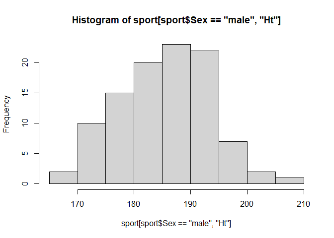<!-- -->

*Using a bootstrap approach with 10,000 samples (default in the
bootstrapjsg function), I found a p-value of 0.0065; this is \<.05, so I
reject the null hypothesis that the mean weight of male athletes at the
AIS is equal to 85.9 kg (the average weight of an Australian male).
Estimates from the da suggest the mean weight of males at the AIS is
82.52 kg, which is less than 85.9 kg.*

7.  The following data are human blood clotting times (in minutes) of
    individuals given one of two different drugs.

| Drug B | Drug G |
| ------ | ------ |
| 8.8    | 9.9    |
| 8.4    | 9.0    |
| 7.9    | 11.1   |
| 8.7    | 9.6    |
| 9.1    | 8.7    |
| 9.6    | 10.4   |
|        | 9.5    |

Test the hypothesis that the mean clotting times are equal for the two
groups \* Estimating the variance from the data

``` r
drug_b <- c( 8.8, 8.4, 7.9, 8.7, 9.1, 9.6)
drug_g <- c(9.9, 9.0, 11,1, 9.6, 8.7, 10.4, 9.5)
t.test(drug_b, drug_g)
```

    ## 
    ##  Welch Two Sample t-test
    ## 
    ## data:  drug_b and drug_g
    ## t = 0.098143, df = 7.6216, p-value = 0.9244
    ## alternative hypothesis: true difference in means is not equal to 0
    ## 95 percent confidence interval:
    ##  -2.553864  2.778864
    ## sample estimates:
    ## mean of x mean of y 
    ##    8.7500    8.6375

*Using a un-paired t-test, since the experimental units were not matched
and I assumed the means of each group would follow a normal distribution
of unknown variance, I found a test statistics of t<sub>7.62</sub>=0.10.
This corresponds to a p-value of 0.92. This p-value is \>.05, so I fail
to reject the null hypothesis that the mean clotting times are the same
for the two drugs.*

  - Using rank transform analysis

<!-- end list -->

``` r
wilcox.test(drug_b, drug_g)
```

    ## Warning in wilcox.test.default(drug_b, drug_g): cannot compute exact p-value
    ## with ties

    ## 
    ##  Wilcoxon rank sum test with continuity correction
    ## 
    ## data:  drug_b and drug_g
    ## W = 13, p-value = 0.1743
    ## alternative hypothesis: true location shift is not equal to 0

*Using a un-paired rank-based test, which is appropriate when normality
assumptions can’t be met and I assumed the means of each group would
follow a similar distribution, I found a test statistics of W=13. This
corresponds to a p-value of 0.17. This p-value is \>.05, so I fail to
reject the null hypothesis that the mean clotting times are the same for
the two drugs.*

  - Using a permutation test

<!-- end list -->

``` r
require(coin) #requires data_frame
```

    ## Loading required package: coin

    ## Loading required package: survival

    ## 
    ## Attaching package: 'survival'

    ## The following object is masked from 'package:boot':
    ## 
    ##     aml

``` r
clotting <- data.frame(drug = c(rep("drug_b", length(drug_b)), rep("drug_g", 
                                                                   length(drug_g))),
                       clotting = c(drug_b, drug_g))
clotting$drug <- factor(clotting$drug)
independence_test(clotting ~ drug, clotting)
```

    ## 
    ##  Asymptotic General Independence Test
    ## 
    ## data:  clotting by drug (drug_b, drug_g)
    ## Z = 0.088418, p-value = 0.9295
    ## alternative hypothesis: two.sided

*Using a permutation test, which is not fully appropriate here due to
small sample sizes (and that also assumes similar distributions for each
group), I found a test statistics of Z=0.09. This corresponds to a
p-value of 0.92. This p-value is \>.05, so I fail to reject the null
hypothesis that the mean clotting times are the same for the two drugs.*

  - Using a bootstrap test

<!-- end list -->

``` r
bootstrapjsg(drug_b, drug_g)
```

    ## Warning in boot.ci(a, conf): bootstrap variances needed for studentized
    ## intervals

    ##                                                                       
    ##                             "0.95" "% Percentile Confidence Interval" 
    ##                                                                       
    ##                          "-1.4875"                             "2.45" 
    ##                                                                       
    ##                          "p-value"                           "0.9031"

*Using a bootstrap test with 10000 samples, which is not fully
appropriate here due to small sample sizes, I found a p value of 0.90.
This p-value is \>.05, so I fail to reject the null hypothesis that the
mean clotting times are the same for the two drugs.*

8.  Data on plant heights (in cm) for plants grown with a new and old
    formulation of fertilizer can be found at
    <https://raw.githubusercontent.com/jsgosnell/CUNY-BioStats/master/datasets/fertilizer.csv>
    . Use the data to test the hypothesis that there is no difference in
    mean plant heights for the two groups

<!-- end list -->

  - Estimating the variance from the data

<!-- end list -->

``` r
fertilizer <- read.csv("https://raw.githubusercontent.com/jsgosnell/CUNY-BioStats/master/datasets/fertilizer.csv")
t.test(height ~ fertilizer, fertilizer)
```

    ## 
    ##  Welch Two Sample t-test
    ## 
    ## data:  height by fertilizer
    ## t = 3.013, df = 15.559, p-value = 0.008458
    ## alternative hypothesis: true difference in means is not equal to 0
    ## 95 percent confidence interval:
    ##  1.367809 7.912191
    ## sample estimates:
    ## mean in group new mean in group old 
    ##             56.55             51.91

*Using a un-paired t-test, since the experimental units were not matched
and I assumed the means of each group would follow a normal distribution
of unknown variance, I found a test statistics of
t<sub>15.559</sub>=3.01. This corresponds to a p-value of 0.008. This
p-value is \<.05, so I to reject the null hypothesis that the impact on
plant growth doesn not differ between the two fertilizer formulations.*

  - Using rank transform analysis

<!-- end list -->

``` r
wilcox.test(height ~ fertilizer, fertilizer)
```

    ## 
    ##  Wilcoxon rank sum exact test
    ## 
    ## data:  height by fertilizer
    ## W = 68, p-value = 0.01166
    ## alternative hypothesis: true location shift is not equal to 0

*Using a un-paired rank-based test, which is appropriate when normality
assumptions can’t be met and I assumed the means of each group would
follow a similar distribution, I found a test statistics of W=68. This
corresponds to a p-value of 0.012. This p-value is \<.05, so I to reject
the null hypothesis that the impact on plant growth doesn not differ
between the two fertilizer formulations.*

  - Using a permutation test

<!-- end list -->

``` r
independence_test(height ~ factor(fertilizer), fertilizer)
```

    ## 
    ##  Asymptotic General Independence Test
    ## 
    ## data:  height by factor(fertilizer) (new, old)
    ## Z = 2.4677, p-value = 0.0136
    ## alternative hypothesis: two.sided

*Using a permutation test, which is appropriate given the sample sizes
and fact I assume similar distributions for each group, I found a test
statistics of Z=2.47. his corresponds to a p-value of 0.01. This p-value
is \<.05, so I to reject the null hypothesis that the impact on plant
growth doesn not differ between the two fertilizer formulations.*

  - Using a bootstrap test

*This is where you may need the different (wide) format of data\! As
always, multiple options exist in R*

``` r
require(reshape2)
```

    ## Loading required package: reshape2

``` r
fertilizer$ID <- 1:nrow(fertilizer)
fertilizer_wide <- dcast(fertilizer, ID~fertilizer, value.var = "height")
#subsetting the long-form data
bootstrapjsg(fertilizer[fertilizer$fertilizer =="old", "height"],
              fertilizer[fertilizer$fertilizer =="new", "height"])
```

    ## Warning in boot.ci(a, conf): bootstrap variances needed for studentized
    ## intervals

    ##                                                                       
    ##                             "0.95" "% Percentile Confidence Interval" 
    ##                                                                       
    ##                "-7.46243739791513"                          "-1.8175" 
    ##                                                                       
    ##                          "p-value"                           "0.0012"

``` r
#is same as using the wide data
bootstrapjsg(fertilizer_wide$new, fertilizer_wide$old)
```

    ## Warning in boot.ci(a, conf): bootstrap variances needed for studentized
    ## intervals

    ##                                                                       
    ##                             "0.95" "% Percentile Confidence Interval" 
    ##                                                                       
    ##                 "1.72499999999999"                             "7.45" 
    ##                                                                       
    ##                          "p-value"                            "9e-04"

*Using a bootstrap test with 10000 samples, I found a p value of 0.013.
This p-value is \<.05, so I to reject the null hypothesis that the
impact on plant growth doesn not differ between the two fertilizer
formulations.*

Note you may need to cast this dataframe into a dataframe with a column
for old and new outcomes. You’ll have to add a unique identifier. Try
something like

``` r
fertilizer$ID <- 1:nrow(fertilizer)
fertilizer_wide <- dcast(fertilizer, ID~fertilizer, value.var = "height")
```

9.  Metabolic rates were measured in animals before and after
    administering a drug. Data is available at

<https://raw.githubusercontent.com/jsgosnell/CUNY-BioStats/master/datasets/metabolic_rates.csv>

Test the hypothesis that the drug has no effect on metabolic rate with
using

  - a Student’s t test

<!-- end list -->

``` r
metabolic <- read.csv("https://raw.githubusercontent.com/jsgosnell/CUNY-BioStats/master/datasets/metabolic_rates.csv")
t.test(metabolic$before, metabolic$after, paired = T)
```

    ## 
    ##  Paired t-test
    ## 
    ## data:  metabolic$before and metabolic$after
    ## t = -3.3875, df = 8, p-value = 0.009536
    ## alternative hypothesis: true difference in means is not equal to 0
    ## 95 percent confidence interval:
    ##  -19.982241  -3.795537
    ## sample estimates:
    ## mean of the differences 
    ##               -11.88889

*I used a paired t-test because the same animals were measured before
and after the drug was administered. I also assumed the difference in
means was normally distributed given the trait and sample size. The test
resulted in a statistic of t<sub>8</sub> = -3.39. This corresponds to a
p-value of \<.001. Since the p-value is \<.05, I reject the null
hypothesis that the drug has no effect on metabolic rate.*

  - a rank test

<!-- end list -->

``` r
wilcox.test(metabolic$before, metabolic$after, paired = T)
```

    ## Warning in wilcox.test.default(metabolic$before, metabolic$after, paired = T):
    ## cannot compute exact p-value with ties

    ## 
    ##  Wilcoxon signed rank test with continuity correction
    ## 
    ## data:  metabolic$before and metabolic$after
    ## V = 3, p-value = 0.02427
    ## alternative hypothesis: true location shift is not equal to 0

*I used a paired rank-based test because the same animals were measured
before and after the drug was administered. I did not assume the
difference in means was normally distributed but did assume it followed
a symmetic distribution. The test resulted in a statistic of V = 3. This
corresponds to a p-value of .02. Since the p-value is \<.05, I reject
the null hypothesis that the drug has no effect on metabolic rate.*

  - a binary test

<!-- end list -->

``` r
SIGN.test(metabolic$before, metabolic$after)
```

    ## 
    ##  Dependent-samples Sign-Test
    ## 
    ## data:  metabolic$before and metabolic$after
    ## S = 2, p-value = 0.1797
    ## alternative hypothesis: true median difference is not equal to 0
    ## 95 percent confidence interval:
    ##  -24.6111111   0.6111111
    ## sample estimates:
    ## median of x-y 
    ##           -10 
    ## 
    ## Achieved and Interpolated Confidence Intervals: 
    ## 
    ##                   Conf.Level   L.E.pt  U.E.pt
    ## Lower Achieved CI     0.8203 -20.0000 -4.0000
    ## Interpolated CI       0.9500 -24.6111  0.6111
    ## Upper Achieved CI     0.9609 -25.0000  1.0000

*I used a sign test (always paired\!) because the same animals were
measured before and after the drug was administered. I did not assume
the difference in means was normally distributed or that the differences
followed a symmetic distribution. The test resulted in a statistic of s
= 2. This corresponds to a p-value of .18. Since the p-value is \>.05, I
fail to reject the null hypothesis that the drug has no effect on
metabolic rate.*

  - bootstrapping

<!-- end list -->

``` r
bootstrapjsg(metabolic$before - metabolic$after)
```

    ## Warning in boot.ci(a, conf): bootstrap variances needed for studentized
    ## intervals

    ##                                                                         
    ##                  "0.95" "% Confidence Interval"     "-18.3333333333333" 
    ##                                                                         
    ##     "-5.44444444444444"               "p-value"                     "0"

*Since the same animals were measured before and after the drug was
administered, I used a bootstrap (10,000 samples) focused on the
difference in rates. This resulted in a p-value of \<.001. Since the
p-value is \<.05, I reject the null hypothesis that the drug has no
effect on metabolic rate.*

10. Endurance of the above animals was also measured. Data is available
    at

<https://raw.githubusercontent.com/jsgosnell/CUNY-BioStats/master/datasets/endurance.csv>

Test the hypothesis that the drug has no effect on using \* a Student’s
t test

``` r
endurance <- read.csv("https://raw.githubusercontent.com/jsgosnell/CUNY-BioStats/master/datasets/endurance.csv")
head(endurance)
```

    ##   Subject   time endurance
    ## 1       A before        28
    ## 2       B before        34
    ## 3       C before        30
    ## 4       D before        27
    ## 5       E before        32
    ## 6       F before        38

``` r
t.test(endurance ~ time, endurance, paired = T)
```

    ## 
    ##  Paired t-test
    ## 
    ## data:  endurance by time
    ## t = -1.1195, df = 8, p-value = 0.2954
    ## alternative hypothesis: true difference in means is not equal to 0
    ## 95 percent confidence interval:
    ##  -15.639650   5.417428
    ## sample estimates:
    ## mean of the differences 
    ##               -5.111111

``` r
#or
t.test(endurance[endurance$time == "before", "endurance"],
       endurance[endurance$time == "after", "endurance"],
       paired = T)
```

    ## 
    ##  Paired t-test
    ## 
    ## data:  endurance[endurance$time == "before", "endurance"] and endurance[endurance$time == "after", "endurance"]
    ## t = 1.1195, df = 8, p-value = 0.2954
    ## alternative hypothesis: true difference in means is not equal to 0
    ## 95 percent confidence interval:
    ##  -5.417428 15.639650
    ## sample estimates:
    ## mean of the differences 
    ##                5.111111

*I used a paired t-test because the same animals were measured before
and after the drug was administered. I also assumed the difference in
means was normally distributed given the trait and sample size. The test
resulted in a statistic of t<sub>8</sub> = -3.39. This corresponds to a
p-value of .29. Since the p-value is \>.05, I fail to reject the null
hypothesis that the drug has no effect on metabolic rate.* \* a rank
test

``` r
wilcox.test(endurance ~ time, endurance, paired = T)
```

    ## 
    ##  Wilcoxon signed rank exact test
    ## 
    ## data:  endurance by time
    ## V = 13, p-value = 0.3008
    ## alternative hypothesis: true location shift is not equal to 0

*I used a paired rank-based test because the same animals were measured
before and after the drug was administered. I did not assume the
difference in means was normally distributed but did assume it followed
a symmetic distribution. The test resulted in a statistic of V = 13.
This corresponds to a p-value of .30. Since the p-value is \>.05, I fail
to reject the null hypothesis that the drug has no effect on metabolic
rate.*

  - a binary test

<!-- end list -->

``` r
SIGN.test(endurance[endurance$time == "before", "endurance"],
          endurance[endurance$time == "after", "endurance"])
```

    ## 
    ##  Dependent-samples Sign-Test
    ## 
    ## data:  endurance[endurance$time == "before", "endurance"] and endurance[endurance$time == "after", "endurance"]
    ## S = 7, p-value = 0.1797
    ## alternative hypothesis: true median difference is not equal to 0
    ## 95 percent confidence interval:
    ##  -4.455556 17.766667
    ## sample estimates:
    ## median of x-y 
    ##             4 
    ## 
    ## Achieved and Interpolated Confidence Intervals: 
    ## 
    ##                   Conf.Level  L.E.pt  U.E.pt
    ## Lower Achieved CI     0.8203  2.0000 15.0000
    ## Interpolated CI       0.9500 -4.4556 17.7667
    ## Upper Achieved CI     0.9609 -5.0000 18.0000

*I used a sign test (always paired\!) because the same animals were
measured before and after the drug was administered. I did not assume
the difference in means was normally distributed or that the differences
followed a symmetric distribution. The test resulted in a statistic of s
= 7. This corresponds to a p-value of .17. Since the p-value is \>.05, I
fail to reject the null hypothesis that the drug has no effect on
metabolic rate.*

  - bootstrapping

<!-- end list -->

``` r
bootstrapjsg(endurance[endurance$time == "before", "endurance"]-
             endurance[endurance$time == "after", "endurance"])
```

    ## Warning in boot.ci(a, conf): bootstrap variances needed for studentized
    ## intervals

    ##                                                                         
    ##                  "0.95" "% Confidence Interval"                    "-4" 
    ##                                                                         
    ##      "12.6666666666667"               "p-value"                "0.2398"

*Since the same animals were measured before and after the drug was
administered, I used a bootstrap (10,000 samples) focused on the
difference in rates. This resulted in a p-value of 0.23. Since the
p-value is \>.05, I fail to reject the null hypothesis that the drug has
no effect on metabolic rate.*

## For the following problems, make sure you can justify the test you choose to use and carry it out

11. Using data from Australian athletes
    (<http://www.statsci.org/data/oz/ais.html> for details), determine
    if the average male training at the Australian Institute of Sport
    differs in from the average female training at the site in mercury
    concentration (Hg).

<!-- end list -->

``` r
t.test(Hg ~ Sex, sport)
```

    ## 
    ##  Welch Two Sample t-test
    ## 
    ## data:  Hg by Sex
    ## t = -15.248, df = 199.99, p-value < 2.2e-16
    ## alternative hypothesis: true difference in means is not equal to 0
    ## 95 percent confidence interval:
    ##  -2.250666 -1.735216
    ## sample estimates:
    ## mean in group female   mean in group male 
    ##             13.56000             15.55294

*I used a t-test (not paired) since mercury concentration can be assumed
to follow a normal distribution at this sample size. This resulted in a
test statistic of t<sub>199.99</sub> = -15.25, with a corresponding
p-value of \<.001. Since this p-value is \<.05, I reject the null
hypothesis that there is no difference in average mercury concentration
between males and females. If I wanted to graph this, I might use*

``` r
library(ggplot2)
ggplot(sport, aes_string("Hg"))+
  geom_histogram() +
  facet_wrap(~Sex) +
  ggtitle(" Plasma ferritin concentration \n of Australian athletes") +
  xlab("Ferritin concentration")+
  theme(axis.title.x = element_text(face="bold", size=28), 
        axis.title.y = element_text(face="bold", size=28), 
        axis.text.y  = element_text(size=20),
        axis.text.x  = element_text(size=20), 
        legend.text =element_text(size=20),
        legend.title = element_text(size=20, face="bold"),
        plot.title = element_text(hjust = 0.5, face="bold", size=32),
        strip.text.x = element_text(size = 22))
```

    ## `stat_bin()` using `bins = 30`. Pick better value with `binwidth`.

<!-- -->

*which suggests males tend to have a higher Hg concentration.*

12. Laureysens et al. (2004) measured metal content in the wood of 13
    poplar clones growing in a polluted area, once in August and once in
    November. Concentrations of aluminum (in micrograms of Al per gram
    of wood) are shown below. (From Handbook of Biological Statistics).
    Has metal content changed over time?

| Clone          | August | November |
| -------------- | ------ | -------- |
| Columbia River | 18.3   | 12.7     |
| Fritiz Pauley  | 13.3   | 11.1     |
| Hazendas       | 16.5   | 15.3     |
| Primo          | 12.6   | 12.7     |
| Raspalje       | 9.5    | 10.5     |
| Hoogvorst      | 13.6   | 15.6     |
| Balsam Spire   | 8.1    | 11.2     |
| Gibecq         | 8.9    | 14.2     |
| Beaupre        | 10.0   | 16.3     |
| Unal           | 8.3    | 15.5     |
| Trichobel      | 7.9    | 19.9     |
| Gaver          | 8.1    | 20.4     |
| Wolterson      | 13.4   | 36.8     |

``` r
poplar <- read.table("https://raw.githubusercontent.com/jsgosnell/CUNY-BioStats/master/datasets/poplar.csv",
                   stringsAsFactors = T, header = T)
poplar$difference <- poplar$November - poplar$August

#plot to consider distribution
ggplot(poplar, aes_string("difference"))+
  geom_histogram() +
  theme(axis.title.x = element_text(face="bold", size=28), 
        axis.title.y = element_text(face="bold", size=28), 
        axis.text.y  = element_text(size=20),
        axis.text.x  = element_text(size=20), 
        legend.text =element_text(size=20),
        legend.title = element_text(size=20, face="bold"),
        plot.title = element_text(hjust = 0.5, face="bold", size=32),
        strip.text.x = element_text(size = 22))
```

    ## `stat_bin()` using `bins = 30`. Pick better value with `binwidth`.

<!-- -->

``` r
#lots of holes, but fairly symmetric
wilcox.test(poplar$August, poplar$November, paired=TRUE)
```

    ## 
    ##  Wilcoxon signed rank exact test
    ## 
    ## data:  poplar$August and poplar$November
    ## V = 16, p-value = 0.03979
    ## alternative hypothesis: true location shift is not equal to 0

``` r
#also could do
bootstrapjsg(poplar$difference)
```

    ## Warning in boot.ci(a, conf): bootstrap variances needed for studentized
    ## intervals

    ##                                                                         
    ##                  "0.95" "% Confidence Interval"      "1.16153846153846" 
    ##                                                                         
    ##      "9.19230769230769"               "p-value"                "0.0169"

*I plotted the paired data to consider its distribution. Given its shape
and a lack of knowledge regarding metal concentration distribution, I
used a rank-based test for paired data. This led to a statistic of V =
17 and p-value of 0.04. Since this is \< .05, I reject the null
hypothesis that average metal concentration did not differ between the
two measurements. Similar results were reached used a bootstrapping
approach.*

13. Data was collected on cholesterol levels following heart attacks.
    Data available at <http://www.statsci.org/data/general/cholestg.txt>

Note to read a .txt file you use,
read.table(“<http://www.statsci.org/data/general/cholestg.txt>”,
header = T, stringsAsFactors = T) Check the defaults to understand the
argument.  
More info on the data is @
<http://www.statsci.org/data/general/cholest.html> Is there evidence
cholesterol levels changed between day 2 and day 14?  
**THINK ABOUT RELABELLING DAY AS A FACTOR (WHY?)?**

``` r
cholesterol <- read.table("http://www.statsci.org/data/general/cholestg.txt", header = T)
cholesterol$day <- as.factor(cholesterol$day)
head(cholesterol)
```

    ##   patient group day cholest
    ## 1       1     1   2     270
    ## 2       2     1   2     236
    ## 3       3     1   2     210
    ## 4       4     1   2     142
    ## 5       5     1   2     280
    ## 6       6     1   2     272

``` r
summary(cholesterol)
```

    ##     patient          group         day        cholest     
    ##  Min.   : 1.00   Min.   :1.000   2   :28   Min.   :116.0  
    ##  1st Qu.:10.00   1st Qu.:1.000   4   :28   1st Qu.:188.0  
    ##  Median :19.50   Median :1.000   14  :28   Median :220.0  
    ##  Mean   :22.13   Mean   :1.263   NA's:30   Mean   :224.5  
    ##  3rd Qu.:29.75   3rd Qu.:2.000             3rd Qu.:256.0  
    ##  Max.   :58.00   Max.   :2.000             Max.   :360.0  
    ##                                            NA's   :9

``` r
ggplot(cholesterol[cholesterol$day %in% c("2", "14"),], aes_string("cholest")) +
  geom_histogram() +
  theme(axis.title.x = element_text(face="bold", size=28), 
        axis.title.y = element_text(face="bold", size=28), 
        axis.text.y  = element_text(size=20),
        axis.text.x  = element_text(size=20), 
        legend.text =element_text(size=20),
        legend.title = element_text(size=20, face="bold"),
        plot.title = element_text(hjust = 0.5, face="bold", size=32))+
  facet_wrap(~day)
```

    ## `stat_bin()` using `bins = 30`. Pick better value with `binwidth`.

    ## Warning: Removed 9 rows containing non-finite values (stat_bin).

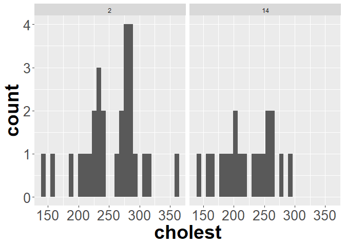<!-- -->

``` r
t.test(cholesterol[cholesterol$day == "2", "cholest"], 
       cholesterol[cholesterol$day == "14", "cholest"],
       paired = T)
```

    ## 
    ##  Paired t-test
    ## 
    ## data:  cholesterol[cholesterol$day == "2", "cholest"] and cholesterol[cholesterol$day == "14", "cholest"]
    ## t = 3.2883, df = 18, p-value = 0.004085
    ## alternative hypothesis: true difference in means is not equal to 0
    ## 95 percent confidence interval:
    ##  13.7215 62.2785
    ## sample estimates:
    ## mean of the differences 
    ##                      38

\*The data are paired since the same patient was measured multiple
times. For this problem I changed day to a factor to consider two groups
(we’ll return to this in class) using a t-test, since the plots
suggested a distribution that shoudl approach normality at these sample
sizes. I found a test statistic of t<sub>18</sub> = 3.28 and a p-value
of \<.01. Since the p-value is \< .05, I reject the null hypothesis that
average cholesterol did not differ between the two sampling dates. \#\#
Using ggplot2 Let’s return to the mammal sleep dataset that we left off
with last week. Load the dataset

``` r
sleep <- read.csv("https://raw.githubusercontent.com/jsgosnell/CUNY-BioStats/master/datasets/sleep.csv", stringsAsFactors = T)
#need to use stringsAsFactors to make characters read in as factors
```

Last time you used the built-in plot functions to do some plots. Let’s
replace those with ggplot2 and do some more.

14. First plot how TotalSleep is explained by BrainWt (remember the
    issues with the data). Use ggplot2 to plot the relationship.

<!-- end list -->

``` r
ggplot(sleep[sleep$BrainWt <1000, ], aes(x=BrainWt, y = TotalSleep)) +
  geom_point(, size = 4) +
  #below here is ylabel, xlabel, and main title
  ylab("Average hours spent \n sleeping daily") +
  xlab("Brain weight (g)") +
  ggtitle("Time spent sleeping \n decreases with brain \n weight") +
  #theme sets sizes, text, etc
  theme(axis.title.x = element_text(face="bold", size=28), 
        axis.title.y = element_text(face="bold", size=28), 
        axis.text.y  = element_text(size=20),
        axis.text.x  = element_text(size=20), 
        legend.text =element_text(size=20),
        legend.title = element_text(size=20, face="bold"),
        plot.title = element_text(hjust = 0.5, face="bold", size=32),
        # change plot background, grid lines, etc (just examples so you can see)
        panel.background = element_rect(fill="white"),
        panel.grid.minor.y = element_line(size=3),
        panel.grid.major = element_line(colour = "black"),
        plot.background = element_rect(fill="gray"),
        legend.background = element_rect(fill="gray"))
```

    ## Warning: Removed 4 rows containing missing values (geom_point).

<!-- -->

15. Next color code each plot point by whether or not its a primate. In
    order to do this you can use the Primate column or (following class
    code) make a new column called Taxa to represent the information
    (hint:search for “ revalue”). Make sure axes are well-labeled.

<!-- end list -->

``` r
library(plyr)
sleep$Taxa <- revalue(sleep$Primate, c(Y = "Primate", N = "Non-primate"))
sleep$Taxa <- relevel(sleep$Taxa, "Primate")

ggplot(sleep[sleep$BrainWt <1000, ], aes(x=BrainWt, y = TotalSleep)) +
  geom_point(aes(colour=Taxa), size = 4) +
  #below here is ylabel, xlabel, and main title
  ylab("Average hours spent \n sleeping daily") +
  xlab("Brain weight (g)") +
  ggtitle("Time spent sleeping \n decreases with brain \n weight") +
  #scale commands help with legends
  scale_colour_manual(name="Type of mammal",values = c("#FFA373","#50486D")) +
  #theme sets sizes, text, etc
  theme(axis.title.x = element_text(face="bold", size=28), 
        axis.title.y = element_text(face="bold", size=28), 
        axis.text.y  = element_text(size=20),
        axis.text.x  = element_text(size=20), 
        legend.text =element_text(size=20),
        legend.title = element_text(size=20, face="bold"),
        plot.title = element_text(hjust = 0.5, face="bold", size=32),
        # change plot background, grid lines, etc (just examples so you can see)
        panel.background = element_rect(fill="white"),
        panel.grid.minor.y = element_line(size=3),
        panel.grid.major = element_line(colour = "black"),
        plot.background = element_rect(fill="gray"),
        legend.background = element_rect(fill="gray"))
```

    ## Warning: Removed 4 rows containing missing values (geom_point).

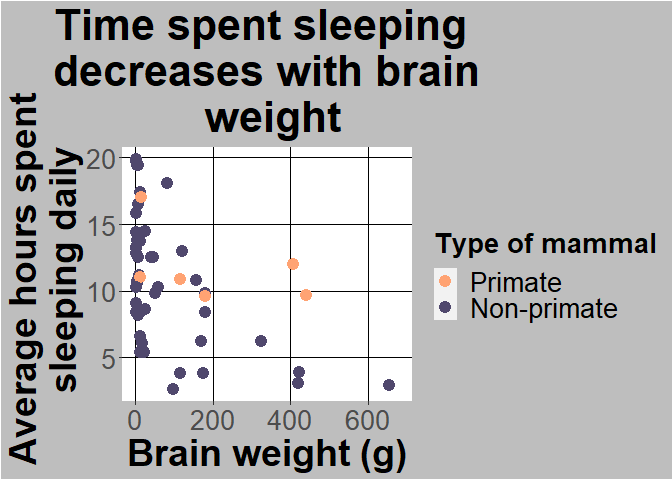<!-- -->

16. Let’s work with histograms.

<!-- end list -->

  - What type of variation do we see in total time spent sleeping?
    Create a histogram to explore this issue.

<!-- end list -->

``` r
ggplot(sleep
       , aes(x=TotalSleep)) +
  geom_histogram() +
  xlab("Total sleep (hours per day")+ggtitle("Variation in sleep levels")+
  theme(axis.title.x = element_text(face="bold", size=28), 
        axis.title.y = element_text(face="bold", size=28), 
        axis.text.y  = element_text(size=20),
        axis.text.x  = element_text(size=20), 
        legend.text =element_text(size=20),
        legend.title = element_text(size=20, face="bold"),
        plot.title = element_text(hjust = 0.5, face="bold", size=32))
```

    ## `stat_bin()` using `bins = 30`. Pick better value with `binwidth`.

    ## Warning: Removed 4 rows containing non-finite values (stat_bin).

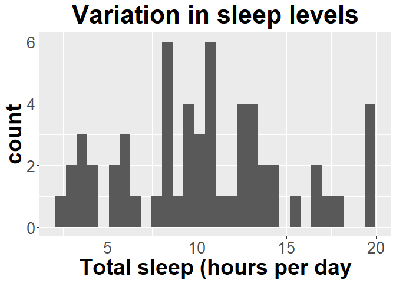<!-- -->

  - Facet the graph you created based on whether or not the animal is a
    primate (Primate column).

<!-- end list -->

``` r
ggplot(sleep
       , aes(x=TotalSleep)) +
  geom_histogram() +
  xlab("Total sleep (hours per day")+ggtitle("Variation in sleep levels")+
  theme(axis.title.x = element_text(face="bold", size=28), 
        axis.title.y = element_text(face="bold", size=28), 
        axis.text.y  = element_text(size=20),
        axis.text.x  = element_text(size=20), 
        legend.text =element_text(size=20),
        legend.title = element_text(size=20, face="bold"),
        plot.title = element_text(hjust = 0.5, face="bold", size=32))+ 
  facet_wrap(~Taxa)
```

    ## `stat_bin()` using `bins = 30`. Pick better value with `binwidth`.

    ## Warning: Removed 4 rows containing non-finite values (stat_bin).

<!-- -->

  - Now only graph the data for primates.

<!-- end list -->

``` r
ggplot(sleep[sleep$Taxa == "Primate",]
       , aes(x=TotalSleep)) +
  geom_histogram() +
  xlab("Total sleep (hours per day")+ggtitle("Variation in sleep levels")+
  theme(axis.title.x = element_text(face="bold", size=28), 
        axis.title.y = element_text(face="bold", size=28), 
        axis.text.y  = element_text(size=20),
        axis.text.x  = element_text(size=20), 
        legend.text =element_text(size=20),
        legend.title = element_text(size=20, face="bold"),
        plot.title = element_text(hjust = 0.5, face="bold", size=32))
```

    ## `stat_bin()` using `bins = 30`. Pick better value with `binwidth`.

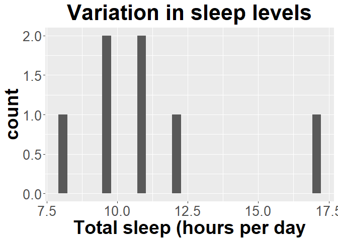<!-- -->

17. Develop a properly-labelled bar graph with error bars to explore how
    total sleep changes with

<!-- end list -->

  - Primate (relabel Primate/Non-Primate as Yes/No; note there are
    multiple ways to do this\!) – use a 95% confidence interval for the
    bar

<!-- end list -->

``` r
#use summarySE function from Rmisc package
sleep$Primate <- revalue(sleep$Primate, c(Y = "Yes", N = "No"))
sleep$Primate <- relevel(sleep$Primate, "No")
library(Rmisc)
sleep_by_primate <- summarySE(sleep, measurevar = "TotalSleep", groupvars = "Primate", na.rm = T)
#look at it
sleep_by_primate
```

    ##   Primate  N TotalSleep       sd        se       ci
    ## 1      No 51   10.44510 4.810335 0.6735817 1.352929
    ## 2     Yes  7   11.17143 2.870955 1.0851189 2.655190

``` r
require(ggplot2)
ggplot(sleep_by_primate
       , aes(x=Primate, y=TotalSleep)) +
  geom_col(size = 3) +
  geom_errorbar(aes(ymin=TotalSleep-ci, ymax=TotalSleep+ci), size=1.5) +
  ylab("Total sleep \n (hours per day")+ 
  xlab("Primate?")+ 
  ggtitle("Sleep across different taxa")+
  theme(axis.title.x = element_text(face="bold", size=28), 
        axis.title.y = element_text(face="bold", size=28), 
        axis.text.y  = element_text(size=20),
        axis.text.x  = element_text(size=20), 
        legend.text =element_text(size=20),
        legend.title = element_text(size=20, face="bold"),
        plot.title = element_text(hjust = 0.5, face="bold", size=32)) 
```

<!-- -->

  - Predation risk (as a factor\!) – use 1 standard error for the bar.
    Note the difference\!

<!-- end list -->

``` r
sleep$Predation <- as.factor(sleep$Predation)
sleep_by_predation <- summarySE(sleep, measurevar = "TotalSleep", 
                                groupvars = "Predation", na.rm = T)
#look at it
sleep_by_predation
```

    ##   Predation  N TotalSleep       sd       se       ci
    ## 1         1 14  12.050000 4.602299 1.230016 2.657288
    ## 2         2 15  12.720000 3.931957 1.015227 2.177445
    ## 3         3 10   9.120000 4.525680 1.431146 3.237476
    ## 4         4  7  10.228571 2.437700 0.921364 2.254496
    ## 5         5 12   7.383333 4.807727 1.387871 3.054684

``` r
require(ggplot2)
ggplot(sleep_by_predation
       , aes(x=Predation, y=TotalSleep)) +
  geom_col(size = 3) +
  geom_errorbar(aes(ymin=TotalSleep-se, ymax=TotalSleep+se), size=1.5) +
  ylab("Total sleep \n (hours per day)") + 
  ggtitle("Sleep across different \n predation levels")+
  theme(axis.title.x = element_text(face="bold", size=28), 
        axis.title.y = element_text(face="bold", size=28), 
        axis.text.y  = element_text(size=20),
        axis.text.x  = element_text(size=20), 
        legend.text =element_text(size=20),
        legend.title = element_text(size=20, face="bold"),
        plot.title = element_text(hjust = 0.5, face="bold", size=32))
```

<!-- -->
