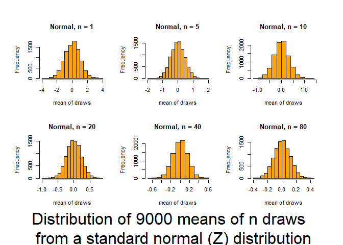
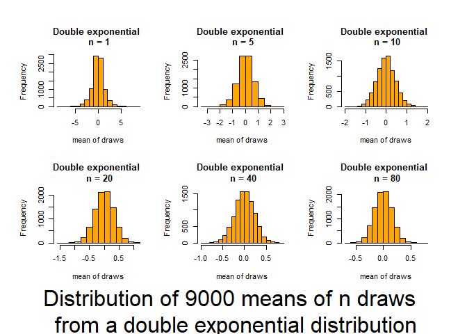
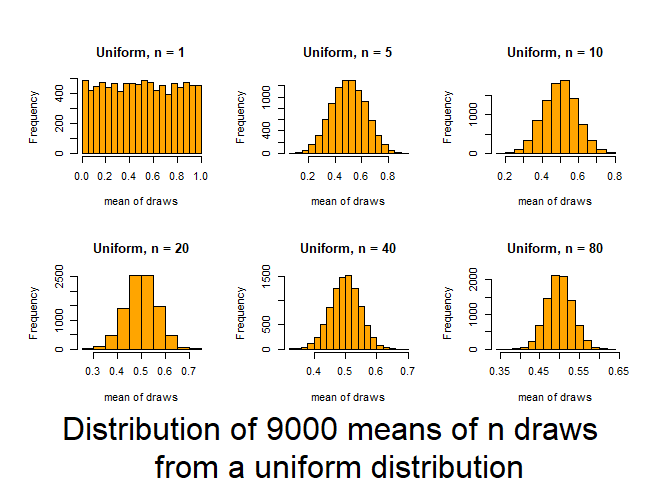
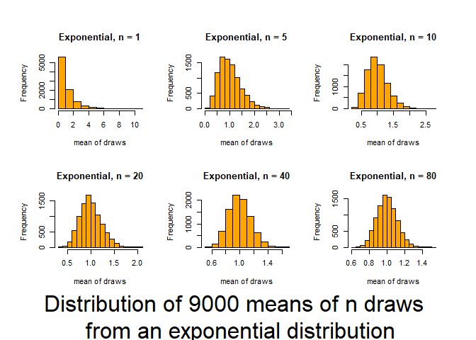
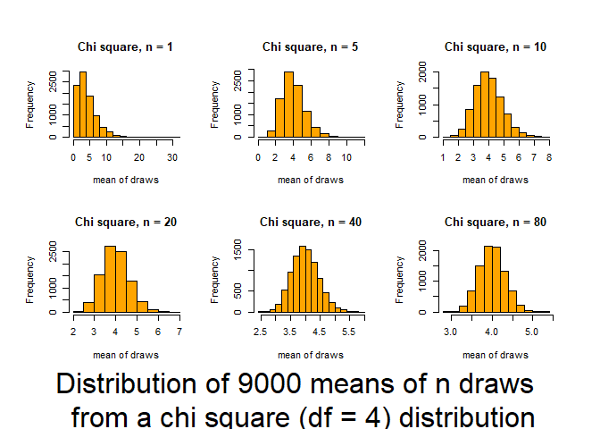
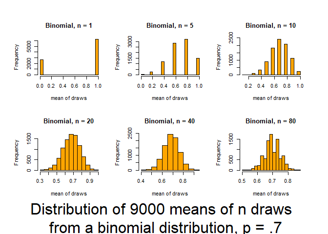

2\. Estimates and ggplot2
================
jsg
9/17/2020

Before doing this, review the **Estimation and Probability** lecture set
slides from
<https://sites.google.com/view/biostats/bioenv-2100/estimation-and-probablity>
and the **2\_estimation\_lecture.R** script in the lecture\_files folder
of the [CUNY-BioStats github
repository](https://github.com/jsgosnell/CUNY-BioStats).

Remember you should

  - add code chunks by clicking the *Insert Chunk* button on the toolbar
    or by pressing *Ctrl+Alt+I* to answer the questions\!
  - **knit** your file to produce a markdown version that you can see\!
  - save your work often
      - **commit** it via git\!
      - **push** updates to github

## Using ggplot2

Let’s return to the mammal sleep dataset that we left off with last
week. Load the dataset

``` r
sleep <- read.csv("https://raw.githubusercontent.com/jsgosnell/CUNY-BioStats/master/datasets/sleep.csv", stringsAsFactors = T)
#need to use stringsAsFactors to make characters read in as factors
```

Last time you used the built-in plot functions to do some plots. Let’s
replace those with ggplot2 and do some more.

1.  First plot how TotalSleep is explained by BrainWt (remember the
    issues with the data). Use ggplot2 to plot the relationship.

<!-- end list -->

``` r
library(ggplot2)
ggplot(sleep[sleep$BrainWt <1000, ], aes(x=BrainWt, y = TotalSleep)) +
  geom_point(size = 4) +
  #below here is ylabel, xlabel, and main title
  ylab("Average hours spent \n sleeping daily") +
  xlab("Brain weight (g)") +
  ggtitle("Time spent sleeping \n decreases with brain \n weight") +
  #theme sets sizes, text, etc
  theme(axis.title.x = element_text(face="bold", size=28), 
        axis.title.y = element_text(face="bold", size=28), 
        axis.text.y  = element_text(size=20),
        axis.text.x  = element_text(size=20), 
        legend.text =element_text(size=20),
        legend.title = element_text(size=20, face="bold"),
        plot.title = element_text(hjust = 0.5, face="bold", size=32),
        # change plot background, grid lines, etc (just examples so you can see)
        panel.background = element_rect(fill="white"),
        panel.grid.minor.y = element_line(size=3),
        panel.grid.major = element_line(colour = "black"),
        plot.background = element_rect(fill="gray"),
        legend.background = element_rect(fill="gray"))
```

    ## Warning: Removed 4 rows containing missing values (geom_point).

<!-- -->

2.  Next color code each plot point by whether or not its a primate. In
    order to do this you can use the Primate column or (following class
    code) make a new column called Taxa to represent the information
    (hint:search for “ revalue”). Make sure axes are well-labeled.

<!-- end list -->

``` r
library(plyr)
sleep$Taxa <- revalue(sleep$Primate, c(Y = "Primate", N = "Non-primate"))
sleep$Taxa <- relevel(sleep$Taxa, "Primate")

ggplot(sleep[sleep$BrainWt <1000, ], aes(x=BrainWt, y = TotalSleep)) +
  geom_point(aes(colour=Taxa), size = 4) +
  #below here is ylabel, xlabel, and main title
  ylab("Average hours spent \n sleeping daily") +
  xlab("Brain weight (g)") +
  ggtitle("Time spent sleeping \n decreases with brain \n weight") +
  #scale commands help with legends
  scale_colour_manual(name="Type of mammal",values = c("#FFA373","#50486D")) +
  #theme sets sizes, text, etc
  theme(axis.title.x = element_text(face="bold", size=28), 
        axis.title.y = element_text(face="bold", size=28), 
        axis.text.y  = element_text(size=20),
        axis.text.x  = element_text(size=20), 
        legend.text =element_text(size=20),
        legend.title = element_text(size=20, face="bold"),
        plot.title = element_text(hjust = 0.5, face="bold", size=32),
        # change plot background, grid lines, etc (just examples so you can see)
        panel.background = element_rect(fill="white"),
        panel.grid.minor.y = element_line(size=3),
        panel.grid.major = element_line(colour = "black"),
        plot.background = element_rect(fill="gray"),
        legend.background = element_rect(fill="gray"))
```

    ## Warning: Removed 4 rows containing missing values (geom_point).

<!-- -->

3.  Let’s work with histograms.

<!-- end list -->

  - What type of variation do we see in total time spent sleeping?
    Create a histogram to explore this issue.

<!-- end list -->

``` r
ggplot(sleep
       , aes(x=TotalSleep)) +
  geom_histogram() +
  xlab("Total sleep (hours per day")+ggtitle("Variation in sleep levels")+
  theme(axis.title.x = element_text(face="bold", size=28), 
        axis.title.y = element_text(face="bold", size=28), 
        axis.text.y  = element_text(size=20),
        axis.text.x  = element_text(size=20), 
        legend.text =element_text(size=20),
        legend.title = element_text(size=20, face="bold"),
        plot.title = element_text(hjust = 0.5, face="bold", size=32))
```

    ## `stat_bin()` using `bins = 30`. Pick better value with `binwidth`.

    ## Warning: Removed 4 rows containing non-finite values (stat_bin).

<!-- -->
\* Facet the graph you created based on whether or not the animal is a
primate (Primate column).

``` r
ggplot(sleep
       , aes(x=TotalSleep)) +
  geom_histogram() +
  xlab("Total sleep (hours per day")+ggtitle("Variation in sleep levels")+
  theme(axis.title.x = element_text(face="bold", size=28), 
        axis.title.y = element_text(face="bold", size=28), 
        axis.text.y  = element_text(size=20),
        axis.text.x  = element_text(size=20), 
        legend.text =element_text(size=20),
        legend.title = element_text(size=20, face="bold"),
        plot.title = element_text(hjust = 0.5, face="bold", size=32))+ 
  facet_wrap(~Taxa)
```

    ## `stat_bin()` using `bins = 30`. Pick better value with `binwidth`.

    ## Warning: Removed 4 rows containing non-finite values (stat_bin).

<!-- -->

  - Now only graph the data for primates.

<!-- end list -->

``` r
ggplot(sleep[sleep$Taxa == "Primate",]
       , aes(x=TotalSleep)) +
  geom_histogram() +
  xlab("Total sleep (hours per day")+ggtitle("Variation in sleep levels")+
  theme(axis.title.x = element_text(face="bold", size=28), 
        axis.title.y = element_text(face="bold", size=28), 
        axis.text.y  = element_text(size=20),
        axis.text.x  = element_text(size=20), 
        legend.text =element_text(size=20),
        legend.title = element_text(size=20, face="bold"),
        plot.title = element_text(hjust = 0.5, face="bold", size=32))
```

    ## `stat_bin()` using `bins = 30`. Pick better value with `binwidth`.

<!-- -->

4.  Develop a properly-labeled bar graph with error bars to explore how
    total sleep changes with

<!-- end list -->

  - Primate (relabeled as yes/no as Primate/Non-Primate; note there are
    multiple ways to do this\!) – use a 95% confidence interval for the
    bar

<!-- end list -->

``` r
#use summarySE function from Rmisc package
sleep$Primate <- revalue(sleep$Primate, c(Y = "Yes", N = "No"))
sleep$Primate <- relevel(sleep$Primate, "No")
library(Rmisc)
```

    ## Loading required package: lattice

``` r
sleep_by_primate <- summarySE(sleep, measurevar = "TotalSleep", groupvars = "Primate", na.rm = T)
#look at it
sleep_by_primate
```

    ##   Primate  N TotalSleep       sd        se       ci
    ## 1      No 51   10.44510 4.810335 0.6735817 1.352929
    ## 2     Yes  7   11.17143 2.870955 1.0851189 2.655190

``` r
library(ggplot2)
ggplot(sleep_by_primate
       , aes(x=Primate, y=TotalSleep)) +
  geom_col(size = 3) +
  geom_errorbar(aes(ymin=TotalSleep-ci, ymax=TotalSleep+ci), size=1.5) +
  ylab("Total sleep \n (hours per day")+ 
  xlab("Primate?")+ 
  ggtitle("Sleep across different taxa")+
  theme(axis.title.x = element_text(face="bold", size=28), 
        axis.title.y = element_text(face="bold", size=28), 
        axis.text.y  = element_text(size=20),
        axis.text.x  = element_text(size=20), 
        legend.text =element_text(size=20),
        legend.title = element_text(size=20, face="bold"),
        plot.title = element_text(hjust = 0.5, face="bold", size=32)) 
```

<!-- -->

  - Predation risk (as a factor\!) – use 1 standard error for the bar.
    Note the difference\!

<!-- end list -->

``` r
sleep$Predation <- as.factor(sleep$Predation)
sleep_by_predation <- summarySE(sleep, measurevar = "TotalSleep", 
                                groupvars = "Predation", na.rm = T)
#look at it
sleep_by_predation
```

    ##   Predation  N TotalSleep       sd       se       ci
    ## 1         1 14  12.050000 4.602299 1.230016 2.657288
    ## 2         2 15  12.720000 3.931957 1.015227 2.177445
    ## 3         3 10   9.120000 4.525680 1.431146 3.237476
    ## 4         4  7  10.228571 2.437700 0.921364 2.254496
    ## 5         5 12   7.383333 4.807727 1.387871 3.054684

``` r
require(ggplot2)
ggplot(sleep_by_predation
       , aes(x=Predation, y=TotalSleep)) +
  geom_col(size = 3) +
  geom_errorbar(aes(ymin=TotalSleep-se, ymax=TotalSleep+se), size=1.5) +
  ylab("Total sleep \n (hours per day)") + 
  ggtitle("Sleep across different \n predation levels")+
  theme(axis.title.x = element_text(face="bold", size=28), 
        axis.title.y = element_text(face="bold", size=28), 
        axis.text.y  = element_text(size=20),
        axis.text.x  = element_text(size=20), 
        legend.text =element_text(size=20),
        legend.title = element_text(size=20, face="bold"),
        plot.title = element_text(hjust = 0.5, face="bold", size=32))
```

<!-- -->

## Estimates and Certainty Concepts

5.  What does a 95% confidence interval mean?

6.  To make sure you understand the ideas of sampling, confidence
    intervals, and the central limit theorem, review the visualizations
    produced by UBC @
    <http://www.zoology.ubc.ca/~whitlock/Kingfisher/CLT.htm>.

7.  For this question you’ll need the central\_limit\_theorem.R script
    from the [code\_examples
    folder](https://github.com/jsgosnell/CUNY-BioStats/tree/master/code_examples).

To show you how well the central limit theorem (and functions) works,
you can also examine 6 distributions that display traits we described at
the beginning of lab using the central\_limit\_theorem.R script from the
Examples folder on github (or download here); you may need to download
the VGAM package. Source it and and then use Rstudio to review the plots
it produces. Decide what characteristics (truncation, skewness,
kurtosis, sample size) speed vs. slow the convergence of the sample mean
upon normality. The reviewed distributions are:

  - Normal(Z) (0,1) {no Kurtosis / no skewness / no truncation}
  - Double exponential (0,2) {high Kurtosis / no skewness / no
    truncation}
  - Uniform(0,1) {moderate Kurtosis / no skewness / double truncation}
  - Exponential(1,1) {high asymmetric Kurtosis / high skewness / single
    truncation}
  - Chi-square(df=4) {low Kurtosis / moderate skewness / single
    truncation}
  - Binomial distribution (p=.7) {discrete distribution\]

For this question, its easiest to just source the main file and see what
happens. When you source a script, it is run in R without showing any
console output (but graphs and objects are still produced\!). Try
*source(“<https://raw.githubusercontent.com/jsgosnell/CUNY-BioStats/master/code_examples/central_limit_theorem.R>”)*.
You’ll also need to have the VGAM library installed.

``` r
#make sure you have VGAM library installed
source("https://raw.githubusercontent.com/jsgosnell/CUNY-BioStats/master/code_examples/central_limit_theorem.R")
```

    ## Press [enter] to continue

    ## Loading required package: VGAM

    ## Loading required package: stats4

    ## Loading required package: splines

<!-- --><!-- -->

    ## Press [enter] to continue

<!-- -->

    ## Press [enter] to continue

<!-- -->

    ## Press [enter] to continue

<!-- -->

    ## Press [enter] to continue

<!-- -->
