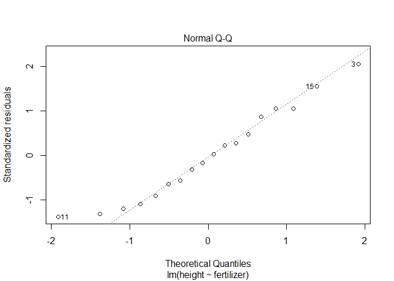

7\. ANOVAs
================
jsg
9/22/2020

Before doing this, review the **7. ANOVA and multiple comparisons**
lecture set slides from
<https://sites.google.com/view/biostats/bioenv-2100/anova-and-multiple-comparisons>
and the **7\_ANOVAs.R** script in the lecture files folder of the
[CUNY-BioStats github
repository](https://github.com/jsgosnell/CUNY-BioStats). Make sure you
are comfortable with null and alternative hypotheses and appropriate
plots for all examples.

Remember you should

  - add code chunks by clicking the *Insert Chunk* button on the toolbar
    or by pressing *Ctrl+Alt+I* to answer the questions\!
  - **knit** your file to produce a markdown version that you can see\!
  - save your work often
      - **commit** it via git\!
      - **push** updates to github

## Just for practice

*Do this problems using ANOVA, Kruskal-Wallis, and bootstrapping
methods. Make sure you can plot the data and carry out multiple
comparison methods as needed. Also be sure to understand the use of
coefficients and adjusted R<sup>2</sup> values and where to find them.*

1.  Use the iris dataset in R to determine if petal length differs among
    species.

<!-- end list -->

``` r
#plot
library(Rmisc)
```

    ## Loading required package: lattice

    ## Loading required package: plyr

``` r
function_output <- summarySE(iris, measurevar="Petal.Length", groupvars =
                               c("Species"))
library(ggplot2)
ggplot(function_output, aes(x=Species, y=Petal.Length)) +
  geom_col(aes(fill=Species), size = 3) +
  geom_errorbar(aes(ymin=Petal.Length-ci, ymax=Petal.Length+ci), size=1.5) +
  ylab("Petal Length (cm)")+ggtitle("Petal Length of \n various iris species")+
  theme(axis.title.x = element_text(face="bold", size=28), 
        axis.title.y = element_text(face="bold", size=28), 
        axis.text.y  = element_text(size=20),
        axis.text.x  = element_text(size=20), 
        legend.text =element_text(size=20),
        legend.title = element_text(size=20, face="bold"),
        plot.title = element_text(hjust = 0.5, face="bold", size=32))
```

<!-- -->

``` r
petal <- lm(Petal.Length ~ Species, iris)
plot(petal)
```

<!-- --><!-- --><!-- --><!-- -->

``` r
library(car)
```

    ## Loading required package: carData

``` r
Anova(petal, type = "III")
```

    ## Anova Table (Type III tests)
    ## 
    ## Response: Petal.Length
    ##             Sum Sq  Df F value    Pr(>F)    
    ## (Intercept) 106.87   1   577.1 < 2.2e-16 ***
    ## Species     437.10   2  1180.2 < 2.2e-16 ***
    ## Residuals    27.22 147                      
    ## ---
    ## Signif. codes:  0 '***' 0.001 '**' 0.01 '*' 0.05 '.' 0.1 ' ' 1

``` r
#compare to
summary(petal)
```

    ## 
    ## Call:
    ## lm(formula = Petal.Length ~ Species, data = iris)
    ## 
    ## Residuals:
    ##    Min     1Q Median     3Q    Max 
    ## -1.260 -0.258  0.038  0.240  1.348 
    ## 
    ## Coefficients:
    ##                   Estimate Std. Error t value Pr(>|t|)    
    ## (Intercept)        1.46200    0.06086   24.02   <2e-16 ***
    ## Speciesversicolor  2.79800    0.08607   32.51   <2e-16 ***
    ## Speciesvirginica   4.09000    0.08607   47.52   <2e-16 ***
    ## ---
    ## Signif. codes:  0 '***' 0.001 '**' 0.01 '*' 0.05 '.' 0.1 ' ' 1
    ## 
    ## Residual standard error: 0.4303 on 147 degrees of freedom
    ## Multiple R-squared:  0.9414, Adjusted R-squared:  0.9406 
    ## F-statistic:  1180 on 2 and 147 DF,  p-value: < 2.2e-16

``` r
library(multcomp)
```

    ## Loading required package: mvtnorm

    ## Loading required package: survival

    ## Loading required package: TH.data

    ## Loading required package: MASS

    ## 
    ## Attaching package: 'TH.data'

    ## The following object is masked from 'package:MASS':
    ## 
    ##     geyser

``` r
comp_cholest <- glht(petal, linfct = mcp(Species = "Tukey"))
summary(comp_cholest)
```

    ## 
    ##   Simultaneous Tests for General Linear Hypotheses
    ## 
    ## Multiple Comparisons of Means: Tukey Contrasts
    ## 
    ## 
    ## Fit: lm(formula = Petal.Length ~ Species, data = iris)
    ## 
    ## Linear Hypotheses:
    ##                             Estimate Std. Error t value Pr(>|t|)    
    ## versicolor - setosa == 0     2.79800    0.08607   32.51   <2e-16 ***
    ## virginica - setosa == 0      4.09000    0.08607   47.52   <2e-16 ***
    ## virginica - versicolor == 0  1.29200    0.08607   15.01   <2e-16 ***
    ## ---
    ## Signif. codes:  0 '***' 0.001 '**' 0.01 '*' 0.05 '.' 0.1 ' ' 1
    ## (Adjusted p values reported -- single-step method)

``` r
#kw approach
petal <- kruskal.test(Petal.Length ~ Species, iris)
pairwise.wilcox.test(iris$Sepal.Length, 
                          iris$Species, 
                          p.adjust.method="holm")
```

    ## 
    ##  Pairwise comparisons using Wilcoxon rank sum test with continuity correction 
    ## 
    ## data:  iris$Sepal.Length and iris$Species 
    ## 
    ##            setosa  versicolor
    ## versicolor 1.7e-13 -         
    ## virginica  < 2e-16 5.9e-07   
    ## 
    ## P value adjustment method: holm

``` r
#bootstrap
library(WRS2)
t1waybt(Petal.Length~Species, iris)
```

    ## Call:
    ## t1waybt(formula = Petal.Length ~ Species, data = iris)
    ## 
    ## Effective number of bootstrap samples was 599.
    ## 
    ## Test statistic: 1510.684 
    ## p-value: 0 
    ## Variance explained: 0.71 
    ## Effect size: 0.843

``` r
bootstrap_post_hoc <- mcppb20(Petal.Length~Species, iris)
#use p.adjust to correct for FWER
p.adjust(as.numeric(bootstrap_post_hoc$comp[,6]), "holm")
```

    ## [1] 0 0 0

\*Answer: We used an ANOVA (a special case of linear models) to
investigate how a numerical response variable differed among 3 groups.
This was appropriate as evidenced by the residual plots (there is no
pattern in the residuals and they are normally distributed), but other
methods are demonstrated as well.

Using an ANOVA, we found F<sub>2,147</sub>= 1180.2, which led to a
p-value of \<.001. Given this, I reject the null hypothesis there is no
difference among mean measurements for each species.  
Post-hoc testing indicated all species significantly differed from all
others (all p \<.05) using a Tukey approach to control for family-wise
error rate. Kruskal-Wallis and bootstrapping approaches led to similar
conclusions.\*

## t-tests are special cases of ANOVAs, which are special cases of linear models\!

2.  Data on plant heights (in cm) for plants grown with a new and old
    formulation of fertilizer can be found at

<https://docs.google.com/spreadsheets/d/e/2PACX-1vSUVowOKlmTic4ekL7LSbwDcqrsDSXv5K_c4Qyfcvz1lLE1_iINmGzy0zMGxY7z5DImlUErK4S2wY7Y/pub?gid=0&single=true&output=csv>.

Analyze this data using the t.test function and the lm function to
convince yourself the outcome is the same.

``` r
fertilizer <- read.csv("https://docs.google.com/spreadsheets/d/e/2PACX-1vSUVowOKlmTic4ekL7LSbwDcqrsDSXv5K_c4Qyfcvz1lLE1_iINmGzy0zMGxY7z5DImlUErK4S2wY7Y/pub?gid=0&single=true&output=csv",
                       stringsAsFactors = T)
#note use of var.equal!  assumption of ANOVAs
t.test(height ~ fertilizer, fertilizer, var.equal = T)
```

    ## 
    ##  Two Sample t-test
    ## 
    ## data:  height by fertilizer
    ## t = 2.9884, df = 16, p-value = 0.008686
    ## alternative hypothesis: true difference in means is not equal to 0
    ## 95 percent confidence interval:
    ##  1.34853 7.93147
    ## sample estimates:
    ## mean in group new mean in group old 
    ##             56.55             51.91

``` r
fert_lm <- lm(height ~ fertilizer, fertilizer)
plot(fert_lm)
```

<!-- --><!-- --><!-- --><!-- -->

``` r
summary(fert_lm)
```

    ## 
    ## Call:
    ## lm(formula = height ~ fertilizer, data = fertilizer)
    ## 
    ## Residuals:
    ##    Min     1Q Median     3Q    Max 
    ##  -4.25  -2.61  -0.21   2.38   6.39 
    ## 
    ## Coefficients:
    ##               Estimate Std. Error t value Pr(>|t|)    
    ## (Intercept)     56.550      1.157  48.865  < 2e-16 ***
    ## fertilizerold   -4.640      1.553  -2.988  0.00869 ** 
    ## ---
    ## Signif. codes:  0 '***' 0.001 '**' 0.01 '*' 0.05 '.' 0.1 ' ' 1
    ## 
    ## Residual standard error: 3.273 on 16 degrees of freedom
    ## Multiple R-squared:  0.3582, Adjusted R-squared:  0.3181 
    ## F-statistic: 8.931 on 1 and 16 DF,  p-value: 0.008686

``` r
require(car)
Anova(fert_lm, type = "III")
```

    ## Anova Table (Type III tests)
    ## 
    ## Response: height
    ##              Sum Sq Df   F value    Pr(>F)    
    ## (Intercept) 25583.2  1 2387.7612 < 2.2e-16 ***
    ## fertilizer     95.7  1    8.9308  0.008686 ** 
    ## Residuals     171.4 16                        
    ## ---
    ## Signif. codes:  0 '***' 0.001 '**' 0.01 '*' 0.05 '.' 0.1 ' ' 1

*Answer: t-tests and ANOVA (lm) approaches yield the same results. Note
for the tests to match exactly we have to assume equal variances among
groups for the t-tests. In both we reject the null hypothesis of no
difference among mean height of plants based on fertilizer. Notice the t
statistic (2.9884) is the square root of the F statistic (8.931). The t
distribution corresponds to the F with only 1 df in the numerator (so
its not listed\!).*

## For the following questions, pick the appropriate method for analyzing the question. Use a plot of the data and/or model analysis to justify your decision. Make sure you can carry out multiple comparison methods as needed. Also be sure to understand the use of coefficients and adjusted R<sup>2</sup> values and where to find them.

3.  Data on sugar cane yield for multiple fields is available using

read.table(“<https://docs.google.com/spreadsheets/d/e/2PACX-1vRjstKreIM6UknyKFQCtw2_Q6itY9iOAVWO1hUNZkBFL8mwVssvTevqgzV22YDKCUeJq0HBDrsBrf5O/pub?gid=971470377&single=true&output=tsv>”,
header = T, stringsAsFactors = T)

More info on the data can be found at
<http://www.statsci.org/data/oz/cane.html>. Is there evidence that
location (DistrictPosition column) impacts yield (Tonn.Hect column)? If
so, which areas are driving this distance?

``` r
cane <- read.table("https://docs.google.com/spreadsheets/d/e/2PACX-1vRjstKreIM6UknyKFQCtw2_Q6itY9iOAVWO1hUNZkBFL8mwVssvTevqgzV22YDKCUeJq0HBDrsBrf5O/pub?gid=971470377&single=true&output=tsv", header = T, stringsAsFactors = T)
summary(cane)
```

    ##            District                     DistrictGroup  DistrictPosition
    ##  WrightsCreek  : 389   BahanaSouth             : 498   C: 498          
    ##  Highleigh     : 360   Cairns/Mulgrave(dry)    :1517   E: 482          
    ##  PineCreek     : 317   Cairns/Mulgrave(Med-wet): 842   N: 452          
    ##  LittleMulgrave: 308   MulgravetoBahana        : 466   S: 553          
    ##  Aloomba       : 284   NorthCairns             : 452   W:1790          
    ##  Hambledon     : 267                                                   
    ##  (Other)       :1850                                                   
    ##      SoilID           SoilName         Area           Variety        Ratoon   
    ##  Min.   :442.0   Liverpool: 737   Min.   : 0.020   138    :629   1R     :767  
    ##  1st Qu.:712.0   Mission  : 399   1st Qu.: 0.880   120    :598   2R     :760  
    ##  Median :801.0   Innisfail: 330   Median : 1.940   152    :513   3R     :692  
    ##  Mean   :757.5   Virgil   : 272   Mean   : 2.578   124    :466   4R     :493  
    ##  3rd Qu.:816.0   Thorpe   : 237   3rd Qu.: 3.620   113    :358   PL     :360  
    ##  Max.   :838.0   Edmonton : 220   Max.   :38.270   117    :319   RP     :304  
    ##                  (Other)  :1580                    (Other):892   (Other):399  
    ##       Age         HarvestMonth  HarvestDuration     Tonn.Hect      
    ##  Min.   :0.000   Min.   : 6.0   Min.   :  0.000   Min.   :   1.45  
    ##  1st Qu.:1.000   1st Qu.: 7.0   1st Qu.:  0.000   1st Qu.:  75.54  
    ##  Median :2.000   Median : 9.0   Median :  1.000   Median : 173.46  
    ##  Mean   :2.151   Mean   : 8.6   Mean   :  9.175   Mean   : 240.11  
    ##  3rd Qu.:3.000   3rd Qu.:10.0   3rd Qu.:  3.000   3rd Qu.: 336.40  
    ##  Max.   :8.000   Max.   :11.0   Max.   :155.000   Max.   :1954.01  
    ##                                                                    
    ##      Fibre           Sugar           Jul.96          Aug.96      
    ##  Min.   :14.20   Min.   : 6.08   Min.   :  0.0   Min.   : 2.200  
    ##  1st Qu.:15.38   1st Qu.:10.93   1st Qu.: 42.2   1st Qu.: 4.500  
    ##  Median :15.80   Median :11.84   Median : 46.0   Median : 7.100  
    ##  Mean   :15.87   Mean   :11.82   Mean   : 50.9   Mean   : 9.274  
    ##  3rd Qu.:16.25   3rd Qu.:12.73   3rd Qu.: 61.0   3rd Qu.: 9.900  
    ##  Max.   :19.10   Max.   :17.36   Max.   :141.5   Max.   :36.000  
    ##                                                                  
    ##      Sep.96           Oct.96          Nov.96           Dec.96     
    ##  Min.   : 0.000   Min.   :137.5   Min.   :  6.00   Min.   :128.5  
    ##  1st Qu.: 0.000   1st Qu.:181.8   1st Qu.: 17.60   1st Qu.:161.9  
    ##  Median : 5.000   Median :224.8   Median : 31.00   Median :239.5  
    ##  Mean   : 5.932   Mean   :219.8   Mean   : 40.39   Mean   :223.6  
    ##  3rd Qu.:11.200   3rd Qu.:240.3   3rd Qu.: 39.50   3rd Qu.:241.4  
    ##  Max.   :14.000   Max.   :308.0   Max.   :100.60   Max.   :353.5  
    ##                                                                   
    ##      Jan.97          Feb.97          Mar.97          Apr.97     
    ##  Min.   :287.5   Min.   :275.8   Min.   :326.0   Min.   :  0.0  
    ##  1st Qu.:321.8   1st Qu.:284.0   1st Qu.:326.0   1st Qu.: 49.3  
    ##  Median :443.8   Median :386.6   Median :426.0   Median : 87.8  
    ##  Mean   :455.2   Mean   :419.6   Mean   :415.1   Mean   :105.0  
    ##  3rd Qu.:508.8   3rd Qu.:495.6   3rd Qu.:480.5   3rd Qu.:176.0  
    ##  Max.   :746.5   Max.   :677.5   Max.   :494.3   Max.   :217.5  
    ##                                                                 
    ##      May.97           Jun.97           Jul.97           Aug.97      
    ##  Min.   : 30.00   Min.   : 34.20   Min.   :  8.60   Min.   : 18.80  
    ##  1st Qu.: 44.60   1st Qu.: 40.20   1st Qu.: 16.40   1st Qu.: 39.20  
    ##  Median : 63.50   Median : 41.00   Median : 24.00   Median : 68.00  
    ##  Mean   : 89.99   Mean   : 82.62   Mean   : 31.65   Mean   : 70.47  
    ##  3rd Qu.: 72.60   3rd Qu.:113.80   3rd Qu.: 28.00   3rd Qu.:112.50  
    ##  Max.   :220.00   Max.   :202.00   Max.   :109.00   Max.   :117.50  
    ##                                                                     
    ##      Sep.97           Oct.97           Nov.97          Dec.97     
    ##  Min.   :  4.00   Min.   :  2.00   Min.   : 13.5   Min.   : 75.0  
    ##  1st Qu.: 42.80   1st Qu.: 22.20   1st Qu.: 62.0   1st Qu.:223.0  
    ##  Median : 73.00   Median : 38.10   Median :123.7   Median :278.3  
    ##  Mean   : 70.46   Mean   : 55.53   Mean   :114.3   Mean   :264.4  
    ##  3rd Qu.:106.00   3rd Qu.: 53.10   3rd Qu.:167.4   3rd Qu.:315.2  
    ##  Max.   :109.20   Max.   :216.50   Max.   :198.0   Max.   :336.6  
    ## 

``` r
cane_summary <- summarySE(cane, measurevar="Tonn.Hect", groupvars =
                               c("DistrictPosition"))

ggplot(cane_summary, aes(x=DistrictPosition, y=Tonn.Hect)) +
  geom_col(size = 3) +
  geom_errorbar(aes(ymin=Tonn.Hect-ci, ymax=Tonn.Hect+ci), size=1.5) +
  ylab("Production (tonnes per hectare)") +
  xlab("District Position") +
  ggtitle("Production differs \n among locations") +
  theme(axis.title.x = element_text(face="bold", size=28), 
        axis.title.y = element_text(face="bold", size=28), 
        axis.text.y  = element_text(size=20),
        axis.text.x  = element_text(size=20), 
        legend.text =element_text(size=20),
        legend.title = element_text(size=20, face="bold"),
        plot.title = element_text(hjust = 0.5, face="bold", size=32))
```

<!-- -->

``` r
impact_district <- lm(Tonn.Hect ~ DistrictPosition, cane)
summary(impact_district)
```

    ## 
    ## Call:
    ## lm(formula = Tonn.Hect ~ DistrictPosition, data = cane)
    ## 
    ## Residuals:
    ##     Min      1Q  Median      3Q     Max 
    ## -274.41 -159.66  -66.07   90.26 1754.55 
    ## 
    ## Coefficients:
    ##                   Estimate Std. Error t value Pr(>|t|)    
    ## (Intercept)        242.418      9.993  24.259  < 2e-16 ***
    ## DistrictPositionE   39.360     14.249   2.762  0.00577 ** 
    ## DistrictPositionN   20.252     14.487   1.398  0.16222    
    ## DistrictPositionS  -42.955     13.777  -3.118  0.00183 ** 
    ## DistrictPositionW   -7.317     11.298  -0.648  0.51727    
    ## ---
    ## Signif. codes:  0 '***' 0.001 '**' 0.01 '*' 0.05 '.' 0.1 ' ' 1
    ## 
    ## Residual standard error: 223 on 3770 degrees of freedom
    ## Multiple R-squared:  0.0107, Adjusted R-squared:  0.009652 
    ## F-statistic:  10.2 on 4 and 3770 DF,  p-value: 3.293e-08

``` r
plot(impact_district)#not really normal...lets bootstrap
```

<!-- --><!-- --><!-- --><!-- -->

``` r
require(WRS2)
t1waybt(Tonn.Hect ~ DistrictPosition, cane)
```

    ## Call:
    ## t1waybt(formula = Tonn.Hect ~ DistrictPosition, data = cane)
    ## 
    ## Effective number of bootstrap samples was 599.
    ## 
    ## Test statistic: 16.5244 
    ## p-value: 0 
    ## Variance explained: 0.032 
    ## Effect size: 0.178

``` r
mcppb20(Tonn.Hect ~ DistrictPosition, cane)
```

    ## Call:
    ## mcppb20(formula = Tonn.Hect ~ DistrictPosition, data = cane)
    ## 
    ##            psihat  ci.lower  ci.upper p-value
    ## S vs. N -56.10126 -97.21674 -14.24283 0.00000
    ## S vs. E -12.51609 -52.78117  29.56220 0.39065
    ## S vs. W  39.25821   7.56314  70.64147 0.00334
    ## S vs. C  -0.97532 -28.48456  30.53173 0.93155
    ## N vs. E  43.58517   7.03801  83.00681 0.00000
    ## N vs. W  95.35948  57.38842 137.00960 0.00000
    ## N vs. C  55.12595  21.81068  93.49215 0.00000
    ## E vs. W  51.77430  13.01900  85.76687 0.00000
    ## E vs. C  11.54077 -17.47567  41.23931 0.26711
    ## W vs. C -40.23353 -60.28807 -18.02545 0.00000

``` r
p <- mcppb20(Tonn.Hect ~ DistrictPosition, cane)
p.adjust(as.numeric(p$comp[,6]), "holm")
```

    ##  [1] 0.00000000 0.82136895 0.02671119 0.95826377 0.00000000 0.00000000
    ##  [7] 0.00000000 0.00000000 0.82136895 0.00000000

``` r
#compare to lm apporach
require(car)
Anova(impact_district, type = "III")
```

    ## Anova Table (Type III tests)
    ## 
    ## Response: Tonn.Hect
    ##                     Sum Sq   Df F value    Pr(>F)    
    ## (Intercept)       29265733    1 588.476 < 2.2e-16 ***
    ## DistrictPosition   2028140    4  10.195 3.293e-08 ***
    ## Residuals        187487281 3770                      
    ## ---
    ## Signif. codes:  0 '***' 0.001 '**' 0.01 '*' 0.05 '.' 0.1 ' ' 1

``` r
require(multcomp)
comp_district <- glht(impact_district, linfct = mcp(DistrictPosition = "Tukey"))
summary(comp_district)
```

    ## 
    ##   Simultaneous Tests for General Linear Hypotheses
    ## 
    ## Multiple Comparisons of Means: Tukey Contrasts
    ## 
    ## 
    ## Fit: lm(formula = Tonn.Hect ~ DistrictPosition, data = cane)
    ## 
    ## Linear Hypotheses:
    ##            Estimate Std. Error t value Pr(>|t|)    
    ## E - C == 0   39.360     14.249   2.762  0.04410 *  
    ## N - C == 0   20.252     14.487   1.398  0.62081    
    ## S - C == 0  -42.955     13.777  -3.118  0.01518 *  
    ## W - C == 0   -7.317     11.298  -0.648  0.96582    
    ## N - E == 0  -19.108     14.601  -1.309  0.67820    
    ## S - E == 0  -82.315     13.896  -5.924  < 0.001 ***
    ## W - E == 0  -46.677     11.444  -4.079  < 0.001 ***
    ## S - N == 0  -63.207     14.141  -4.470  < 0.001 ***
    ## W - N == 0  -27.569     11.739  -2.348  0.12594    
    ## W - S == 0   35.638     10.850   3.285  0.00889 ** 
    ## ---
    ## Signif. codes:  0 '***' 0.001 '**' 0.01 '*' 0.05 '.' 0.1 ' ' 1
    ## (Adjusted p values reported -- single-step method)

*Answer: For this analysis I used a bootstrap approach as the residual
plots suggested a non-normal distribution. Analysis revealed a test
statistics of 16.52 and p-value of 0, so I reject the null hypothesis of
no difference among Districts. since I rejected the null hypothesis, I
have to use post-hoc tsts to determine which groups are different than
the others.  
Post-hoc tests reveal all district areas differ from each other except
for south and east, south and central, and east and central (using
sequential FDR to control for family-wise error rate.)*

*Note that a linear model does lead to slightly different findings
regarding which districts differ from which others.*

4.  Data on FEV (forced expiratory volume), a measure of lung function,
    can be found at

<http://www.statsci.org/data/general/fev.txt>

More information on the dataset is available at

<http://www.statsci.org/data/general/fev.html>.

Is there evidence that FEV depends on gender? If so, which gender has
the higher FEV score? How much variance does gender explain?

``` r
fev <- read.table("http://www.statsci.org/data/general/fev.txt", header = T,
                  stringsAsFactors = T)
fev_summary <- summarySE(fev, measurevar="FEV", groupvars =
                               c("Sex"))

ggplot(fev_summary, aes(x=Sex, y=FEV)) +
  geom_col(size = 3) +
  geom_errorbar(aes(ymin=FEV-ci, ymax=FEV+ci), size=1.5) +
  ylab("FEV (liters)") +
  xlab("Sex") +
  ggtitle("FEV differs \n among males and females") +
  theme(axis.title.x = element_text(face="bold", size=28), 
        axis.title.y = element_text(face="bold", size=28), 
        axis.text.y  = element_text(size=20),
        axis.text.x  = element_text(size=20), 
        legend.text =element_text(size=20),
        legend.title = element_text(size=20, face="bold"),
        plot.title = element_text(hjust = 0.5, face="bold", size=32))
```

<!-- -->

``` r
fev_gender <- lm(FEV ~ Sex, fev)
plot(fev_gender) #anova is fine
```

<!-- --><!-- --><!-- --><!-- -->

``` r
Anova(fev_gender, type = "III")
```

    ## Anova Table (Type III tests)
    ## 
    ## Response: FEV
    ##              Sum Sq  Df  F value    Pr(>F)    
    ## (Intercept) 1910.62   1 2652.756 < 2.2e-16 ***
    ## Sex           21.32   1   29.607 7.496e-08 ***
    ## Residuals    469.60 652                       
    ## ---
    ## Signif. codes:  0 '***' 0.001 '**' 0.01 '*' 0.05 '.' 0.1 ' ' 1

``` r
summary(fev_gender)
```

    ## 
    ## Call:
    ## lm(formula = FEV ~ Sex, data = fev)
    ## 
    ## Residuals:
    ##      Min       1Q   Median       3Q      Max 
    ## -2.01645 -0.69420 -0.06367  0.58233  2.98055 
    ## 
    ## Coefficients:
    ##             Estimate Std. Error t value Pr(>|t|)    
    ## (Intercept)  2.45117    0.04759  51.505  < 2e-16 ***
    ## SexMale      0.36128    0.06640   5.441  7.5e-08 ***
    ## ---
    ## Signif. codes:  0 '***' 0.001 '**' 0.01 '*' 0.05 '.' 0.1 ' ' 1
    ## 
    ## Residual standard error: 0.8487 on 652 degrees of freedom
    ## Multiple R-squared:  0.04344,    Adjusted R-squared:  0.04197 
    ## F-statistic: 29.61 on 1 and 652 DF,  p-value: 7.496e-08

*I used an ANOVA (or linear model, or t-test, here, all the same since 2
groups\!) to consider the impact of sex on FEV. This was appropriate as
evidenced by the residual plots (there is no pattern in the residuals
and they are normally distributed). Results indicate there is a
difference among sexes (F<sub>1,652</sub> = 29.607, p\<.001). There is
no need for post-hoc tests here since there are only 2 groups being
considered.  
Coefficients related to the groups (note female is replaced by intercept
here, and the SexMale coefficient is relative to that) indicates that
males have a higher FEV on average. Graphs also show this relationship.*

5.  A professor carried out a long-term study to see how various factors
    impacted pulse rate before and after exercise. Data can be found at

<http://www.statsci.org/data/oz/ms212.txt>

With more info at

<http://www.statsci.org/data/oz/ms212.html>.

Is there evidence that frequency of exercise (Exercise column) impacts
resting pulse rate (Pulse1 column)?

``` r
pulse <- read.table("http://www.statsci.org/data/oz/ms212.txt", header = T, 
                    stringsAsFactors = T)
pulse$Exercise <- factor(pulse$Exercise)
library(plyr)
pulse$Exercise <- revalue(pulse$Exercise, c("1" = "high", 
                                            "2" = "moderate", 
                                            "3" = "low"))

exercise_summary <- summarySE(pulse, measurevar="Pulse1", groupvars =
                               c("Exercise"), na.rm = T)

ggplot(exercise_summary, aes(x=Exercise, y=Pulse1)) +
  geom_col(size = 3) +
  geom_errorbar(aes(ymin=Pulse1-ci, ymax=Pulse1+ci), size=1.5) +
  ylab("Resting pulse (beats per minute)") +
  xlab("Exercise level")+
  ggtitle("Resting pulse decreases \n with exercise") +
  theme(axis.title.x = element_text(face="bold", size=28), 
        axis.title.y = element_text(face="bold", size=28), 
        axis.text.y  = element_text(size=20),
        axis.text.x  = element_text(size=20), 
        legend.text =element_text(size=20),
        legend.title = element_text(size=20, face="bold"),
        plot.title = element_text(hjust = 0.5, face="bold", size=32))
```

<!-- -->

``` r
initial <- lm(Pulse1 ~ Exercise, pulse)
plot(initial)
```

<!-- --><!-- --><!-- --><!-- -->

``` r
summary(initial)
```

    ## 
    ## Call:
    ## lm(formula = Pulse1 ~ Exercise, data = pulse)
    ## 
    ## Residuals:
    ##     Min      1Q  Median      3Q     Max 
    ## -28.690  -7.690  -0.643   6.310  69.310 
    ## 
    ## Coefficients:
    ##                  Estimate Std. Error t value Pr(>|t|)    
    ## (Intercept)        68.643      3.496  19.633   <2e-16 ***
    ## Exercisemoderate    7.047      3.895   1.809   0.0733 .  
    ## Exerciselow         9.708      4.105   2.365   0.0198 *  
    ## ---
    ## Signif. codes:  0 '***' 0.001 '**' 0.01 '*' 0.05 '.' 0.1 ' ' 1
    ## 
    ## Residual standard error: 13.08 on 106 degrees of freedom
    ##   (1 observation deleted due to missingness)
    ## Multiple R-squared:  0.05013,    Adjusted R-squared:  0.03221 
    ## F-statistic: 2.797 on 2 and 106 DF,  p-value: 0.0655

``` r
Anova(initial, type = "III") 
```

    ## Anova Table (Type III tests)
    ## 
    ## Response: Pulse1
    ##             Sum Sq  Df  F value Pr(>F)    
    ## (Intercept)  65966   1 385.4658 <2e-16 ***
    ## Exercise       957   2   2.7971 0.0655 .  
    ## Residuals    18140 106                    
    ## ---
    ## Signif. codes:  0 '***' 0.001 '**' 0.01 '*' 0.05 '.' 0.1 ' ' 1

*I used a linear model to test for difference in mean resting pulse
rates based on group. This was appropriate as evidenced by the residual
plots (there is no pattern in the residuals and they are normally
distributed). Analyses suggest there is no difference in resting pulse
rate among groups (F<sub>2,106</sub> = 2.8, p = .07), so I fail to
reject the null hypothesis that a difference does not exist in mean
resting pulse rate based on groups. The alternative hypothesis is that a
difference does exist in mean resting pulse rate based on groups.*

6.  Continuing with the pulse dataset, is there evidence frequency of
    exercise impacts change in pulse rate? Note we should only consider
    change for students who ran between the first and second pulse
    measures (Ran column = 1).

<!-- end list -->

``` r
pulse$change <- pulse$Pulse2 - pulse$Pulse1

change_summary <- summarySE(pulse[pulse$Ran == 1, ], measurevar="change", groupvars =
                               c("Exercise"), na.rm = T)

ggplot(change_summary, aes(x=Exercise, y=change)) +
  geom_col(size = 3) +
  geom_errorbar(aes(ymin=change-ci, ymax=change+ci), size=1.5) +
  ylab("Resting pulse \n (beats per minute)") +
  xlab("Exercise level")+
  ggtitle("Change in pulse does \n not differ among groups") +
  theme(axis.title.x = element_text(face="bold", size=28), 
        axis.title.y = element_text(face="bold", size=28), 
        axis.text.y  = element_text(size=20),
        axis.text.x  = element_text(size=20), 
        legend.text =element_text(size=20),
        legend.title = element_text(size=20, face="bold"),
        plot.title = element_text(hjust = 0.5, face="bold", size=32))
```

<!-- -->

``` r
change <- lm(change ~ Exercise, pulse[pulse$Ran == 1, ])
plot(change)
```

<!-- --><!-- --><!-- --><!-- -->

``` r
Anova(change, type = "III")
```

    ## Anova Table (Type III tests)
    ## 
    ## Response: change
    ##              Sum Sq Df F value    Pr(>F)    
    ## (Intercept) 17500.0  1 37.7689 2.245e-07 ***
    ## Exercise       91.2  2  0.0984    0.9065    
    ## Residuals   19923.8 43                      
    ## ---
    ## Signif. codes:  0 '***' 0.001 '**' 0.01 '*' 0.05 '.' 0.1 ' ' 1

*I used a linear model to test for difference in change in pulse rates
(before and after running) based on group. This was appropriate as
evidenced by the residual plots (there is no pattern in the residuals
and they are normally distributed). Analyses suggest there is no
difference in resting pulse rate among groups (F<sub>2,43</sub> = .09, p
= .90), so I fail to reject the null hypothesis that a difference does
not exist in change in pulse rates (before and after running) based on
group. The alternative hypothesis is that a difference does exist in
change in pulse rates (before and after running) based on group.*
