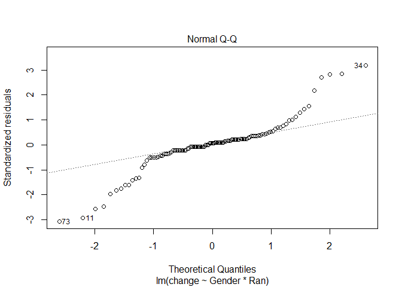
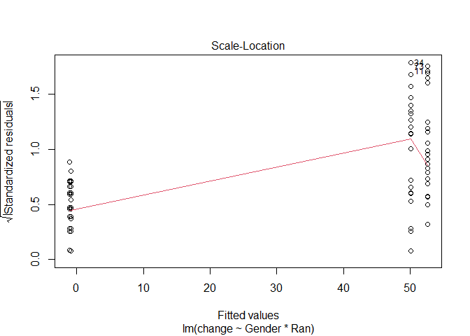

8\. ANOVA Extensions
================
jsg
11/16/2020

Before doing this, review the **8. 2-way Anova** lecture set slides from
<https://sites.google.com/view/biostats/bioenv-2100/2-way-anovas-and-interactions>
and the **8\_Blocking\_and\_interactions.R** script in the lecture files
folder of the [CUNY-BioStats github
repository](https://github.com/jsgosnell/CUNY-BioStats). Make sure you
are comfortable with null and alternative hypotheses and approiate plots
for all examples.

Remember you should

  - add code chunks by clicking the *Insert Chunk* button on the toolbar
    or by pressing *Ctrl+Alt+I* to answer the questions\!
  - **knit** your file to produce a markdown version that you can see\!
  - save your work often
      - **commit** it via git\!
      - **push** updates to github

<!-- end list -->

1.  A survey was conducted to see if athletes and non-athletes deal with
    anger in the same way. Data is @

angry \<-
read.csv(“<https://docs.google.com/spreadsheets/d/e/2PACX-1vSaawG37o1ZUEs1B4keIJpZAY2c5tuljf29dWnzqQ0tHNCzfbz85AlWobYzBQ3nPPXJBLP-FWe4BNZB/pub?gid=1784556512&single=true&output=csv>”,
stringsAsFactors = T)

and more information is at

<http://onlinestatbook.com/case_studies/angry_moods.html>.

Focus on the following variables:

Sports 1 = athletes, 2 = non-athletes Gender 1 = males, 2 = females
Expression (AE) index of general anger expression: (Anger-Out) +
(Anger-In) - (Control-Out) - (Control-In) + 48

Is there any evidence that gender or athlete status impact how anger is
expressed?

``` r
angry <- read.csv("https://docs.google.com/spreadsheets/d/e/2PACX-1vSaawG37o1ZUEs1B4keIJpZAY2c5tuljf29dWnzqQ0tHNCzfbz85AlWobYzBQ3nPPXJBLP-FWe4BNZB/pub?gid=1784556512&single=true&output=csv", stringsAsFactors = T)
str(angry)
```

    ## 'data.frame':    78 obs. of  7 variables:
    ##  $ Gender          : int  2 2 2 2 1 1 1 2 2 2 ...
    ##  $ Sports          : int  1 1 1 1 1 1 1 1 1 1 ...
    ##  $ Anger.Out       : int  18 14 13 17 16 16 12 13 16 12 ...
    ##  $ Anger.In        : int  13 17 14 24 17 22 12 16 16 16 ...
    ##  $ Control.Out     : int  23 25 28 23 26 25 31 22 22 29 ...
    ##  $ Control.In      : int  20 24 28 23 28 23 27 31 24 29 ...
    ##  $ Anger_Expression: int  36 30 19 43 27 38 14 24 34 18 ...

``` r
angry$Gender <- as.factor(angry$Gender)
library(plyr)
angry$Gender <- revalue(angry$Gender, c("1" = "athlete", 
                                        "2" = "non-athlete"))
angry$Sports <- as.factor(angry$Sports)
angry$Sports <- revalue(angry$Sports, c("1" = "male",
                                        "2" = "female"))
library(Rmisc)
```

    ## Loading required package: lattice

``` r
anger_summary <- summarySE(angry, measurevar="Anger_Expression", groupvars =
                               c("Sports", "Gender"), na.rm = T)
library(ggplot2)
ggplot(anger_summary, aes(x=Gender, y=Anger_Expression, color=Sports, 
                                   shape = Sports)) +
  geom_point(size = 3) +
  geom_line(aes(group=Sports, linetype =Sports), size=2) +
  geom_errorbar(aes(ymin=Anger_Expression-ci, ymax=Anger_Expression+ci), size=1.5) +
  ylab("Anger level")+ 
  xlab("Experience") + 
  scale_shape_discrete(guide=FALSE)+
  scale_linetype_discrete(guide=FALSE)+
  ggtitle("Anger level among groups")+
  theme(axis.title.x = element_text(face="bold", size=28), 
        axis.title.y = element_text(face="bold", size=28), 
        axis.text.y  = element_text(size=20),
        axis.text.x  = element_text(size=20), 
        legend.text =element_text(size=20),
        legend.title = element_text(size=20, face="bold"),
        plot.title = element_text(hjust = 0.5, face="bold", size=32))
```

<!-- -->
*I first read in and recoded some data for ease and plotting. I then
produced a plot to consider the null hypotheses that*

  - *the sport an athlete plays does not influence anger level*
  - *the gender of an athlete does not influence anger level*
  - *the sport an athlete plays and their gender do not interact to
    influence anger level*

<!-- end list -->

``` r
angry_gender <- lm(Anger_Expression ~ Sports * Gender, angry)
plot(angry_gender)
```

<!-- --><!-- --><!-- --><!-- -->

``` r
library(car)
```

    ## Loading required package: carData

``` r
Anova(angry_gender, type = "III")
```

    ## Anova Table (Type III tests)
    ## 
    ## Response: Anger_Expression
    ##                Sum Sq Df F value    Pr(>F)    
    ## (Intercept)   11200.1  1 71.8690 1.617e-12 ***
    ## Sports          480.1  1  3.0807   0.08336 .  
    ## Gender           17.7  1  0.1135   0.73711    
    ## Sports:Gender     5.2  1  0.0336   0.85505    
    ## Residuals     11532.2 74                      
    ## ---
    ## Signif. codes:  0 '***' 0.001 '**' 0.01 '*' 0.05 '.' 0.1 ' ' 1

``` r
#remove interaction since not significant
angry_gender <- lm(Anger_Expression ~ Sports + Gender, angry)
plot(angry_gender)
```

<!-- --><!-- --><!-- --><!-- -->

``` r
Anova(angry_gender, type = "III") #only differs among those who play sports
```

    ## Anova Table (Type III tests)
    ## 
    ## Response: Anger_Expression
    ##              Sum Sq Df  F value    Pr(>F)    
    ## (Intercept) 17367.1  1 112.8964 < 2.2e-16 ***
    ## Sports       1357.2  1   8.8227  0.003995 ** 
    ## Gender         16.3  1   0.1061  0.745501    
    ## Residuals   11537.4 75                       
    ## ---
    ## Signif. codes:  0 '***' 0.001 '**' 0.01 '*' 0.05 '.' 0.1 ' ' 1

*I then analyzed the data using factorial ANOVA. The outcome is
continuous and both explanatory variables are categorical. The design is
also fully randomized. Resildual plots indicated all assumptions were
met (there is no pattern in the residuals and they are normally
distributed). Analysis shows an insignificant interaction
(F<sub>1,74</sub>=.04, p=.855) between sport and gender, so I removed
the interaction term. The reduced model showed anger levels differed
among athletes and non-athletes but not by gender. There was no need for
post-hoc tests (only 2 levels/groups for each categorial variable.)*

2.  A professor carried out a long-term study to see how various factors
    impacted pulse rate before and after exercise. Data can be found at
    <http://www.statsci.org/data/oz/ms212.txt> With more info at
    <http://www.statsci.org/data/oz/ms212.html>. Is there evidence that
    frequency of exercise (Exercise column) and gender impact change in
    pulse rate for students who ran (Ran column = 1)?

<!-- end list -->

``` r
pulse <- read.table("http://www.statsci.org/data/oz/ms212.txt", header = T, 
                    stringsAsFactors = T)
pulse$Exercise <- factor(pulse$Exercise)
library(plyr)
pulse$Exercise <- revalue(pulse$Exercise, c("1" = "high", 
                                            "2" = "moderate", 
                                            "3" = "low"))
pulse$Gender <- factor(pulse$Gender)
pulse$Gender <- revalue (pulse$Gender, c("1" = "male", "2" = "female"))
pulse$change <- pulse$Pulse2 - pulse$Pulse1
change_summary <- summarySE(pulse[pulse$Ran == 1, ], measurevar="change", groupvars =
                               c("Exercise", "Gender"), na.rm = T)
```

    ## Warning in qt(conf.interval/2 + 0.5, datac$N - 1): NaNs produced

``` r
ggplot(change_summary, aes(x=Gender, shape = Exercise, color = Exercise,
                           y=change)) +
  geom_point(size = 3) +
  geom_line(aes(group=Exercise, linetype =Exercise), size=2) +
  geom_errorbar(aes(ymin=change-ci, ymax=change+ci), size=1.5) +
  ylab("Change in pulse \n (beats per minute)") +
  scale_color_discrete(name = "Exercise level")+
  scale_shape_discrete(guide=FALSE)+
  scale_linetype_discrete(guide=FALSE)+
  ggtitle("Change in pulse does \n not differ among groups") +
  theme(axis.title.x = element_text(face="bold", size=28), 
        axis.title.y = element_text(face="bold", size=28), 
        axis.text.y  = element_text(size=20),
        axis.text.x  = element_text(size=20), 
        legend.text =element_text(size=20),
        legend.title = element_text(size=20, face="bold"),
        plot.title = element_text(hjust = 0.5, face="bold", size=32))
```

<!-- -->
*I first read in and recoded some data for ease and plotting. I then
produced a plot to consider the null hypotheses that*

  - *exercise level does not influence change in pulse rate*
  - *gender does not influence change in pulse rate*
  - *gender and exercise level do not interact to influence change in
    pulse rate*

<!-- end list -->

``` r
exercise <- lm(change ~ Gender * Exercise, pulse[pulse$Ran == 1, ])
summary(exercise)
```

    ## 
    ## Call:
    ## lm(formula = change ~ Gender * Exercise, data = pulse[pulse$Ran == 
    ##     1, ])
    ## 
    ## Residuals:
    ##     Min      1Q  Median      3Q     Max 
    ## -44.231 -11.300   1.769  10.083  48.444 
    ## 
    ## Coefficients:
    ##                               Estimate Std. Error t value Pr(>|t|)    
    ## (Intercept)                     45.000      8.746   5.145 7.44e-06 ***
    ## Genderfemale                    35.000     23.139   1.513   0.1383    
    ## Exercisemoderate                 9.231     10.573   0.873   0.3879    
    ## Exerciselow                     12.400     12.972   0.956   0.3449    
    ## Genderfemale:Exercisemoderate  -38.231     24.678  -1.549   0.1292    
    ## Genderfemale:Exerciselow       -46.844     26.043  -1.799   0.0796 .  
    ## ---
    ## Signif. codes:  0 '***' 0.001 '**' 0.01 '*' 0.05 '.' 0.1 ' ' 1
    ## 
    ## Residual standard error: 21.42 on 40 degrees of freedom
    ## Multiple R-squared:  0.0828, Adjusted R-squared:  -0.03185 
    ## F-statistic: 0.7222 on 5 and 40 DF,  p-value: 0.6107

``` r
Anova(exercise, type = "III")
```

    ## Anova Table (Type III tests)
    ## 
    ## Response: change
    ##                  Sum Sq Df F value    Pr(>F)    
    ## (Intercept)     12150.0  1 26.4739 7.444e-06 ***
    ## Gender           1050.0  1  2.2879    0.1383    
    ## Exercise          496.3  2  0.5407    0.5865    
    ## Gender:Exercise  1488.8  2  1.6220    0.2102    
    ## Residuals       18357.7 40                      
    ## ---
    ## Signif. codes:  0 '***' 0.001 '**' 0.01 '*' 0.05 '.' 0.1 ' ' 1

``` r
#rerun without interaction
exercise <- lm(change ~ Gender + Exercise, pulse[pulse$Ran == 1, ])
summary(exercise)
```

    ## 
    ## Call:
    ## lm(formula = change ~ Gender + Exercise, data = pulse[pulse$Ran == 
    ##     1, ])
    ## 
    ## Residuals:
    ##    Min     1Q Median     3Q    Max 
    ## -43.99 -14.89   2.23  11.91  45.19 
    ## 
    ## Coefficients:
    ##                  Estimate Std. Error t value Pr(>|t|)    
    ## (Intercept)        50.391      8.273   6.091 2.94e-07 ***
    ## Genderfemale       -2.738      6.770  -0.404    0.688    
    ## Exercisemoderate    3.603      9.572   0.376    0.708    
    ## Exerciselow         1.155     10.617   0.109    0.914    
    ## ---
    ## Signif. codes:  0 '***' 0.001 '**' 0.01 '*' 0.05 '.' 0.1 ' ' 1
    ## 
    ## Residual standard error: 21.74 on 42 degrees of freedom
    ## Multiple R-squared:  0.008416,   Adjusted R-squared:  -0.06241 
    ## F-statistic: 0.1188 on 3 and 42 DF,  p-value: 0.9485

``` r
Anova(exercise, type = "III") #no significance
```

    ## Anova Table (Type III tests)
    ## 
    ## Response: change
    ##              Sum Sq Df F value    Pr(>F)    
    ## (Intercept) 17532.0  1 37.1019 2.937e-07 ***
    ## Gender         77.3  1  0.1636    0.6879    
    ## Exercise       97.1  2  0.1028    0.9025    
    ## Residuals   19846.5 42                      
    ## ---
    ## Signif. codes:  0 '***' 0.001 '**' 0.01 '*' 0.05 '.' 0.1 ' ' 1

*I then analyzed the data using factorial ANOVA. The outcome is
continuous and both explanatory variables are categorical. The design is
also fully randomized. Residual plots indicated all assumptions were met
(there is no pattern in the residuals and they are normally
distributed). Analysis shows an insignificant interaction
(F<sub>2,40</sub>=1.2, p=.21) between exercise level and gender, so I
removed the interaction term. The reduced model showed neither gender
(F<sub>1,42</sub>=.16, p =.69) or exercise level (F<sub>2,42</sub>=.1,
p=.90) influenced change in pulse rate, so I failed to reject the
related null hypotheses.*

3.  (Continuing from question 2) I’m curious if the treatment (running
    vs not) even had an impact, and if so did it depend on gender. How
    would you test this?

<!-- end list -->

``` r
pulse$Ran <- factor(pulse$Ran)
pulse$Ran <- revalue(pulse$Ran, c("1" = "Ran", "2" = "Sat"))
run_summary <- summarySE(pulse, measurevar="change", groupvars =
                               c("Ran", "Gender"), na.rm = T)

ggplot(run_summary, aes(x=Gender, shape = Ran, color = Ran,
                           y=change)) +
  geom_point(size = 3) +
  geom_line(aes(group=Ran, linetype = Ran), size=2) +
  geom_errorbar(aes(ymin=change-ci, ymax=change+ci), size=1.5) +
  ylab("Change in pulse rate \n (beats per minute)") +
  xlab("Gender")+
  ggtitle("Change in pulse  \n  differed among groups") +
  scale_color_discrete(name = "Ran")+
  scale_shape_discrete(guide=FALSE)+
  scale_linetype_discrete(guide=FALSE)+
  theme(axis.title.x = element_text(face="bold", size=28), 
        axis.title.y = element_text(face="bold", size=28), 
        axis.text.y  = element_text(size=20),
        axis.text.x  = element_text(size=20), 
        legend.text =element_text(size=20),
        legend.title = element_text(size=20, face="bold"),
        plot.title = element_text(hjust = 0.5, face="bold", size=32))
```

<!-- -->

``` r
pulse$Ran <- as.factor(pulse$Ran)
levels(pulse$Ran) <- c("ran", "sat")
running <- lm(change ~ Gender * Ran, pulse)
plot(running)
```

<!-- --><!-- --><!-- --><!-- -->

``` r
Anova(running, type = "III") 
```

    ## Anova Table (Type III tests)
    ## 
    ## Response: change
    ##             Sum Sq  Df  F value Pr(>F)    
    ## (Intercept)  66360   1 333.4351 <2e-16 ***
    ## Gender          71   1   0.3583 0.5508    
    ## Ran          40747   1 204.7387 <2e-16 ***
    ## Gender:Ran      35   1   0.1755 0.6761    
    ## Residuals    20897 105                    
    ## ---
    ## Signif. codes:  0 '***' 0.001 '**' 0.01 '*' 0.05 '.' 0.1 ' ' 1

``` r
#consider without interaction
running <- lm(change ~ Gender + Ran, pulse)
Anova(running, type = "III")  #running mattered
```

    ## Anova Table (Type III tests)
    ## 
    ## Response: change
    ##             Sum Sq  Df  F value Pr(>F)    
    ## (Intercept)  89366   1 452.5490 <2e-16 ***
    ## Gender          37   1   0.1872 0.6662    
    ## Ran          73006   1 369.7027 <2e-16 ***
    ## Residuals    20932 106                    
    ## ---
    ## Signif. codes:  0 '***' 0.001 '**' 0.01 '*' 0.05 '.' 0.1 ' ' 1

``` r
summary(running) #running increased pulse
```

    ## 
    ## Call:
    ## lm(formula = change ~ Gender + Ran, data = pulse)
    ## 
    ## Residuals:
    ##    Min     1Q Median     3Q    Max 
    ## -41.95  -3.52   0.48   4.48  43.22 
    ## 
    ## Coefficients:
    ##              Estimate Std. Error t value Pr(>|t|)    
    ## (Intercept)    51.951      2.442  21.273   <2e-16 ***
    ## Genderfemale   -1.169      2.703  -0.433    0.666    
    ## Ransat        -52.431      2.727 -19.228   <2e-16 ***
    ## ---
    ## Signif. codes:  0 '***' 0.001 '**' 0.01 '*' 0.05 '.' 0.1 ' ' 1
    ## 
    ## Residual standard error: 14.05 on 106 degrees of freedom
    ##   (1 observation deleted due to missingness)
    ## Multiple R-squared:  0.7772, Adjusted R-squared:  0.773 
    ## F-statistic: 184.9 on 2 and 106 DF,  p-value: < 2.2e-16

*After plotting the data, I used a linear model to test the null
hypotheses that* \* *change in pulse rate did not depend on gender* \*
*change in pulse rate did not depend on running treatment* \* *there was
no interaction between running treatment and gender on change in pulse
rate*

*Analyses indicated all model assumptions were met( there is little
pattern in the residuals and they are fairly normally distributed,
though you may need to rely more on robustness of test here\! ) and
there is not enough evidence for an interaction between gender and
running treatment on change in pulse rate (F<sub>1,105</sub>=1.3,
p=.25). After removing the interaction, analysis of a reduced model
indicates only running treatment (F<sub>1,106</sub>=212, p\<.01) impacts
change in pulse rate. Running did increase pulse rate.*
