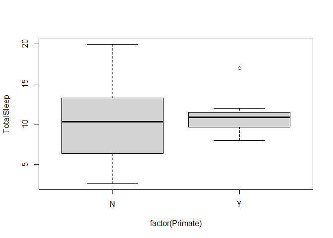
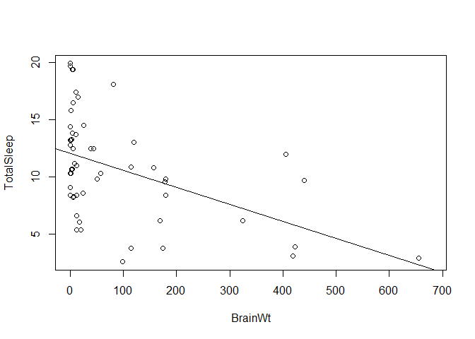

Before doing this, review the **Welcome** and **Git** lecture set slides from 
https://sites.google.com/view/biostats/lessons/welcome and https://sites.google.com/view/biostats/lessons/git-and-rmarkdown.  You can also
review
the  **1_intro_data_lecture_intro_to_R.R** script in the folder for the first lecture @ [CUNY-BioStats github repository](https://github.com/jsgosnell/CUNY-BioStats/tree/master/lecture_files/1_intro_lecture).

## Getting your first repository

At this point I'm assuming you received an invitation to view the assignment
on github classroom and accepted it. You now have a private repository of these 
files in your github account (in the cloud).
In addition to working on R, now we'll have you connect your first
project on Rstudio to this repository and work on some basic git skills.

### If you are using RStudio that you installed on your personal device

To start working on an assignment, open RStudioon your computer. 


Select file, new project, Version control. On the next screen select git. If this
isn't available, you may need to install git (free) on your system.  You can 
download it at https://git-scm.com/download/.  

Next you’ll need to enter the url for your repository. Open a browser, go to 
https://github.com/ and sign in to your account. Look under your repositories for 
the correct one and open it. An easy place to see all repositories (including 
those from github classroom) is https://github.com/settings/repositories.  
Then look for the Code button 
(usually green) in the githbub repository (where you may be reading this...). 


Click it, then copy the 
web url (or click the copy icon). Input that into the Rstudio Repository URL 
space. Then name the project (maybe Assignment 1,2, etc?). The Create project… 
field can be left blank to just save all projects into the main directory.
Alternatively you can click Browse and make an Assignments folder if you want.
Whatever you choose, the project will be saved in new folder in that location 
using the name you chose. As of Fall 2021, Github no longer accepts usernames and
passwords for authentication.  However, Rstudio may ask you for these depending on
what version you are using.  Don't be surprised if you enter your password correctly
but your attempt to create a 
repository (or push commits to it) still fails because you need to setup or reset a
token.  


If you see this message now, go to the 
**Github 2-factor authentication (required as of Fall 2021)** section!). If not,
you can continue, but note you'll have to do it later (when you push changes).

Go to the next section (**Now we can actually work in R**) to get started

### If you are using Rstudio cloud...

You'll instead see something like this:


To start working on an assignment, select **New Project**, **New Project from Github repo**. Next you’ll need to enter the url for your repository. Open a browser, go to 
https://github.com/ and sign in to your account. Look under your repositories for 
the correct one and open it. An easy place to see all repositories (including 
those from github classroom) is https://github.com/settings/repositories.  
Then look for the Code button 
(usually green) in the githbub repository (where you may be reading this...). 


Click it, then copy the 
web url (or click the copy icon). Input that into the field asking for the URL
of your github repository then create the project by selecting OK. As of Fall 2021, Github no longer accepts usernames and
passwords for authentication.  However, Rstudio may ask you for these depending on
what version you are using.  Don't be surprised if you enter your password correctly
but your attempt to create a 
repository (or push commits to it) still fails because you need to setup or reset a
token.  


If you see this message now, go to the 
**Github 2-factor authentication (required as of Fall 2021)** section!). If not,
you can continue, but note you'll have to do it later (when you push changes).

The next screen will bring you to a "normal" RStudio screen.  

Before continuing,  I recommend turning down the computer usage. Free rstudiocloud 
accounts only allow so much usage, but that depends on how much power you allocate
to a project. To do this, click on the RAM icon in the upper left corner, select 
resources, and move all sliders to the far left.


If you end up doing something more complex, you can increase allocated power to 
speed everything up. For most class code, however, low power should be fine.)  If
you make changes here, Rstudio.cloud will need to relaunch to apply them. Let it do
that then keep working.

Continue to the next
section (**Now we can actually work in R**) to get started

## Now we can actually work in R and markdown (for everyone)

Now you can start working on the files in the repository in
Rstudio.  To view the files, make sure 
you are in the right repository.  You should see whatever you named the project in the
upper right hand corner of Rstudio. If you don't go to File > Open Project and 
navigate to where you placed the repository.  

Once you are in the right project, open the file you want to work on.   From inside the project space, go to **File**, **Open File**
and find it, or look in the Files window to find and open the file. 


Then **Knit** the file. Note the first time you do this in a project you may be
prompted to install a number of packages!  If you are using a webservice you may
also need to allow pop-ups in your browser.


Then **Knit** the file. Note the first time you do this in a project you may be
prompted to install a number of packages!  If you are using a webservice you may
also need to allow pop-ups in your browser. Don't be surprised if a new window 
pops up (it should). 

### STOP HERE (IF YOU GET THIS FAR) BEFORE THE SESSION

The **Knit** button saves the .Rmd file and renders a new version whose output 
depends on what you selected in the header. Here we have html_document,
so if everything works a preview of a webpage like document should appear. The file
also produces a github friendly .md file. 

Now we'll start changing the file to show you how rmarkdown works.
First, amend the file by replacing the **NAME** and **DATE** spots in the header
(top of the
file between the --- markers) with your name and the real date.  Then **Knit** the
file again. You should see your name in the new preview. 

### Committing files to your github repository


Now lets make our first commit.  

If you look in the upper right windows, you should see a *Git* tab.  Select it. 


Notice it has several files. These are the files you have changed or created since you started working.  Click the checkbox next to the files, and select
**Commit**.  You'll need to enter a description. Put "My first commit!" and
press Commit.  

If you get a screen that looks like this:


It just means we need to associate an identity with the commits. To do this,
close (x) the git windows. Select the terminal tab:


Then paste this line into the terminal (tab to the right of the console tab), 
(note you need 2 -- should be 2
dashes!)

git config --global user.email "you@example.com"

replace the email with your email (leave the quotes) and press enter.

Then paste this line into the terminal, 

git config --global user.name "Your Name"

replace the Your Name with your name (leave the quotes) and press enter. 

Now go back to the git window and try the commit again. It should work. You will
only have to do this once (for desktop versions) and only occasionally for 
cloud-based RStudio instances.

Now you've saved a snapshot of the file to your local Rstudio instance (on
your own machine or server).  If you go the **Git** tab and select **Diff** and
then **History** on the pop-you, 
you can select the commit, select any file you made, and actually see the
changes.  We'll only focus on the .Rmd files. That's the one you are writing.
The others (the .md in this case) are made automatically and produce the  document
you see when you preview the file and when you view it on github.

### Pushing to github

Now you need to push these changes to the cloud so I can see (and grade) them.
From the **Git** tab, select **Push**. As of Fall 2021, Github no longer accepts usernames and
passwords for authentication.  However, Rstudio may ask you for these depending on
what version you are using.  Don't be surprised if you enter your password correctly
but your attempt to create a 
repository (or push commits to it) still fails because you need to setup or reset a
token.  


If you see this message now, go to the 
**Github 2-factor authentication (required as of Fall 2021)** section!). If not,
you can continue, but note you'll have to do it later (when you push changes).

### Github 2-factor authentication (required as of Fall 2021)

Github requires you to use a token to verify you have permission to make changes 
to repositoties that you store there.  To create a token, can use the code below.
If this file is open in R, you can select the green triangle button (play
icon) to run the current chunk. Otherwise you can copy and paste it into R. 
Note you may also need to install the usethis library first.


```r
library(usethis)
usethis::create_github_token()
```

This will launch a browser pointed to github. You may need to log in. Then it will
have you name a PAT (personal access token). You can, for example, name it Rstudio.
Then scroll to the bottom, and select **Generate Token**. Save the token somewhere 
(you'll never see it again once you close the window).  Then run the next code 
chunk.  Select 3, then paste in the 
token you just generated. Again, you may need to install the gitcreds package.


```r
library(gitcreds)
gitcreds_set()
```

This process is letting your computer and github communicate and should only need 
to be done once for a desktop.  For rstudio.cloud, you will need to regularly reenter 
the token, but you don't have to recreate it. *So save you PAT somewhere just in case*. 
If/when you lose it, however, you can simply make a new one and reconnect the 
repositories.  

Once you enter your git credentials, try to push your changes again. It should 
work this time. A window should appear. When it's done
(white text shows) go to your github repository (on the web). Open the folder for this 
assignment and click on the .md file.  It should preview, and you should see the 
updated file with your name!  Congratulations!

As you work, use commits to save snapshots of your work in a version control manner, 
and 
pushes to share them with me.  If you get stuck, you can also push your file up
so I can see it and help you fix it (much better than "My code isn't working). 
Then you can actually see "how" I fixed it.  The code will also be useful for 
assessments.

[comment]:(This is an comment in Rmarkdown. It won't be seen the processed file. I
use these to leave notes that you can ignore.  
ADD HERE IF YOU CAN @TEACHER IN COMMIT FOR HELP!)

Now let's start working in R.  

## R subtleties and functions

1. Let x be defined by


```r
x <- 1:10
```
Try executing this chunk (in R studio, not the webview) by clicking the *Run* 
button within the chunk or by placing your cursor inside it and pressing 
*Ctrl+Shift+Enter*.

This will run the code in the Console.  You may need to switch to Console (from
Rmarkdown) in the lower right window area to see this.   The executed code is 
also displayed in your processed file (hit **Knit** again to see this!).  

Note running this chunk has added an object named `x` to the **Environment** tab
area (top right area of screen).  But nothing was "returned" in the console.  You
prove this by typing `x` in the console. What does it return?

Determine what the “:” does!  Complete the following sentence:


```r
x <- 1:10
```


*The : means "create a sequence counting by 1's from a to b  (in a:b)".*

2. Now try to guess the output of these commands

* length(x)
* max(x)
* x[x < 5]
* x^2
* x[ x < 8 & x > 2]


INSERT AN R CHUNK HERE AND RUN EACH OF THESE COMMANDS.  Add a new chunk by clicking the *Insert Chunk* button on the toolbar or by pressing *Ctrl+Alt+I*. Then state what
each of these does.


```r
length(x)
```

```
## [1] 10
```

```r
max(x)
```

```
## [1] 10
```

```r
x[x < 5]
```

```
## [1] 1 2 3 4
```

```r
x^2
```

```
##  [1]   1   4   9  16  25  36  49  64  81 100
```

```r
x[ x < 8 & x > 2]
```

```
## [1] 3 4 5 6 7
```

*Length of x returns the number of elements in a vector.  max returns the highest 
value. square brackets allows you to return (or work with) only portions of a vector.
^2 squares a value.*

3.  Is `-1:2` the same as `(-1):2` or `-(1:2)`? INSERT AN R CHUNK HERE AND RUN EACH OF 
THESE COMMANDS. Then state what each of these does.


```r
-1:2
```

```
## [1] -1  0  1  2
```

```r
(-1):2
```

```
## [1] -1  0  1  2
```

```r
-(1:2)
```

```
## [1] -1 -2
```
*The first creates a sequence from -1 to 2 by ones (see question 1).  The second
does the same. The third creates a sequence from 1 to 2 then applies a negative to it.*

## Data input, plotting, and tests

You can read in a dataset from the internet following this protocol.


```r
sleep <- read.csv("http://raw.githubusercontent.com/jsgosnell/CUNY-BioStats/master/datasets/sleep.csv", stringsAsFactors = T)
```

Run this chunk and note it has added an object named `sleep` to the environment. 

*Make sure you see the object in the environment tab!*

Info on the dataset is viewable @ http://www.statsci.org/data/general/sleep.html.

4. How many rows does the **sleep** data set have (hint: `?dim`)?  What kind of data is stored in each variable?

ENTER ANSWERS HERE. ADD ANY R CHUNKS YOU USED TO FIND THE ANSWER.


```r
dim(sleep)
```

```
## [1] 62 12
```
*dim returns the number of rows and columns (IN THAT ORDER) in a dataframe! So 
sleep has 62 rows. NOTE: If you look at the .Rmd code here, you can
see how to put R output inline (instead of in chunks).*


5.  Change the column named *BodyWt* to *Body_weight*”* in the sleep dataset.

ADD ANY R CHUNKS YOU USED TO COMPLETE THE TASK.


```r
names(sleep)[names(sleep) %in% "BodyWt"] = "Body_weight"
```


6.  Produce a plot of how *TotalSleep* differs between primates and other species. What is this plot showing?

Note, as of early 2020 R no longer reads in strings as factors! This means the 
Primate column, which is full of "Yes"s and "No"s, reads in as words and R doesn't
know how to plot them. There are many ways to handle this. You can modify the 
read.csv command (add  stringsAsFactors = T option), eg*

```r
sleep <- read.csv("http://raw.githubusercontent.com/jsgosnell/CUNY-BioStats/master/datasets/sleep.csv", stringsAsFactors = T)
```
If you do this, you'll need to rechange anything you previously updated to the
object (like renaming the BodyWt column).

You can also modify a single column for the 
actual object 


```r
sleep$Primate <- factor (sleep$Primate)
```

or for a single command, eg (plot not actually shown!)


```r
plot(BodyWt ~ factor(Primate), data = sleep)
```


NOTE YOU CAN ADD A PLOT TO THE DOCUMENT TOO! AMEND THE BELOW AS NEEDED.  

```r
plot(cars)
```

<!-- -->

*Answer is*


```r
plot(TotalSleep ~ factor(Primate), sleep)
```

<!-- -->

*or to clean it up (we'll introduce ggplot2 in a few sessions to help with this)*


```r
plot(TotalSleep ~ factor(Primate), sleep, main = "Variance in sleep differs between primates and non-primates", 
     xlab = "Primate", ylab = "Total sleep (hours)")
```

<!-- -->

7.  The **sleep** dataset begs to have a linear model fit for it. Let’s consider. First plot how *TotalSleep* is explained by *BrainWt*. Are there any issues with the data? Exclude any outlier and fit a linear model to obtain the p-value for the model (hint: summary()).  What does this imply?  

ENTER ANSWERS HERE. ADD ANY R CHUNKS YOU USED TO FIND THE ANSWER.

*First look for outliers (before fitting a model)*

```r
plot(TotalSleep ~ BrainWt, sleep)
```

<!-- -->

*We have few measurements where BrainWt >1000, so let's exclude those for the model*


```r
sleep_fit <- lm(TotalSleep ~ BrainWt, sleep[sleep$BrainWt<1000,])
summary(sleep_fit)
```

```
## 
## Call:
## lm(formula = TotalSleep ~ BrainWt, data = sleep[sleep$BrainWt < 
##     1000, ])
## 
## Residuals:
##     Min      1Q  Median      3Q     Max 
## -8.0342 -2.8719  0.1718  2.0426  7.8037 
## 
## Coefficients:
##              Estimate Std. Error t value Pr(>|t|)    
## (Intercept) 12.099991   0.632611  19.127  < 2e-16 ***
## BrainWt     -0.014926   0.003833  -3.894 0.000278 ***
## ---
## Signif. codes:  0 '***' 0.001 '**' 0.01 '*' 0.05 '.' 0.1 ' ' 1
## 
## Residual standard error: 4.021 on 53 degrees of freedom
##   (4 observations deleted due to missingness)
## Multiple R-squared:  0.2224,	Adjusted R-squared:  0.2078 
## F-statistic: 15.16 on 1 and 53 DF,  p-value: 0.0002782
```
*We see a significant (p <.05, don't worry, we'll see this later) relationship 
between BrainWt and TotalSleep, and it appears that TotalSleep decreases as BrainWt
increases (note the negative estimate). We can visualize this using*


```r
plot(TotalSleep ~ BrainWt, data = sleep[sleep$BrainWt <  1000, ])
abline(sleep_fit)
```

<!-- -->

**EXTRA QUESTIONS** *not required*


**Dow Puffin** *Matthew Zalewski / CC BY (https://creativecommons.org/licenses/by/3.0)*

8.  Sometimes data doesn’t have headers (column names),so you have to add them.
Download a dataset on alcids (birds like puffins and auklets)  from 
https://raw.githubusercontent.com/jsgosnell/CUNY-BioStats/master/datasets/alcids55.csv.  
You’ll need to modify the read.csv function by specifying `header = False`, 
then use the `names` function to name the columns ["year", "a1_abund", "NAO", "a2_abund", "a3_abund", "a4_abund", "a5_abund", "a6_abund"]. 
Try it and check your input using the `head` command.

ENTER ANSWERS HERE. ADD ANY R CHUNKS YOU USED TO FIND THE ANSWER.


```r
alcids <- read.csv("https://raw.githubusercontent.com/jsgosnell/CUNY-BioStats/master/datasets/alcids55.csv",header = F, stringsAsFactors = T)
names(alcids) <- c("year", "a1_abund", "NAO", "a2_abund", "a3_abund", "a4_abund", "a5_abund", "a6_abund")
head(alcids)
```

```
##   year a1_abund   NAO a2_abund a3_abund a4_abund a5_abund a6_abund
## 1 1954       55 -2.52      100        1        0        8        0
## 2 1955       44 -1.73      100        1        0       10        0
## 3 1956       50  1.52      100        1        0        7        1
## 4 1957      100 -1.02    18000        2       50        8        0
## 5 1958        5 -0.37     1000        2       15       10        0
## 6 1959      400 -1.54     1500        3      190        6        3
```


9.  Here’s a sample dataset:

Date | greenness| Richness| habitat
---|---|---|---
12-25-2009| 13766| 46| forest
01-01-2010| 50513| 60| forest
01-15-2010| 25084| 60| grassland

Enter it into R (manually or via a .csv). (Hint: you have a piece of this in the code already).  Check your input using the head() command.

ENTER ANSWERS HERE. ADD ANY R CHUNKS YOU USED TO FIND THE ANSWER.

*I did this by putting the data in a spreadsheet, saving it as a .csv file, and 
uploading it. You can see an example spreadsheet at
https://docs.google.com/spreadsheets/d/1nOpd6QkJRG8tdn1b-Mmx8AVdwUIFAzzLw3SlJGb_LWA/edit?usp=sharing.  From there you can download the file OR publish it to the web as a .csv 
(look under File > Publish to web in the Google Sheets), and then read in the .csv 
file to R. Note I used **stringAsFactors = T** to have the habitat column read in
as factors.*


```r
example_sheet <- read.csv("https://docs.google.com/spreadsheets/d/e/2PACX-1vRsRUBNxda2SEyfti8fAlGLbXjilR1SWYdmkOh1ZEIhadaqwkH6fP9aoWSPgIQEh0dd0isOxONTeAQc/pub?gid=0&single=true&output=csv",
                          stringsAsFactors = T)
```

```
## Warning in read.table(file = file, header = header, sep
## = sep, quote = quote, : incomplete final line found by
## readTableHeader on 'https://docs.google.com/spreadsheets/d/e/
## 2PACX-1vRsRUBNxda2SEyfti8fAlGLbXjilR1SWYdmkOh1ZEIhadaqwkH6fP9aoWSPgIQEh0dd0isOxONTeAQc/
## pub?gid=0&single=true&output=csv'
```

```r
# so you can see it
head(example_sheet)
```

```
##         Date greenness Richness   habitat
## 1 12-25-2009     13766       46    forest
## 2 01-01-2010     50513       60    forest
## 3 01-15-2010     25084       60 grassland
```


