Before doing this, review the ** Combining Multiple Explanatory Variables in Linear Models** lecture set slides from 
https://sites.google.com/view/biostats/lessons/ancova-and-multiple-regression and
the  **10_ANCOVA_and_Regression.R**
script in the lecture files folder of the
[CUNY-BioStats github repository](https://github.com/jsgosnell/CUNY-BioStats). 
Make sure you are comfortable with null and alternative hypotheses and appropriate plots
for all examples.

Remember you should

* add code chunks by clicking the *Insert Chunk* button on the toolbar or by
pressing *Ctrl+Alt+I* to answer the questions!
* **knit** your file to produce a markdown version that you can see!
* save your work often 
  * **commit** it via git!
  * **push** updates to github
  

1.  Data on FEV (forced expiratory volume), a measure of lung function, can
be found at 

http://www.statsci.org/data/general/fev.txt

More information on the dataset is available at 

http://www.statsci.org/data/general/fev.html.

Does the impact of age on FEV differ among genders? Consider how your answer to 
this differs from the previous assignment!


```r
fev <- read.table("http://www.statsci.org/data/general/fev.txt", header = T, 
                  stringsAsFactors = T)
fev_age <- lm(FEV ~ Age*Sex, fev)
plot(fev_age)
```

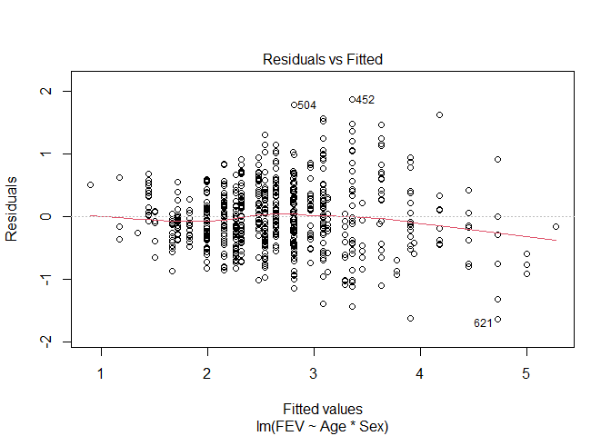<!-- -->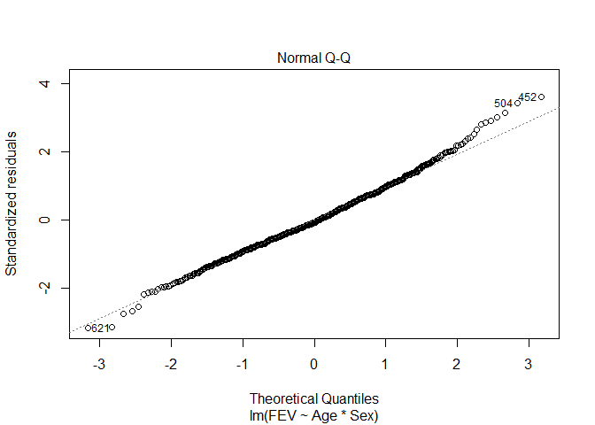<!-- -->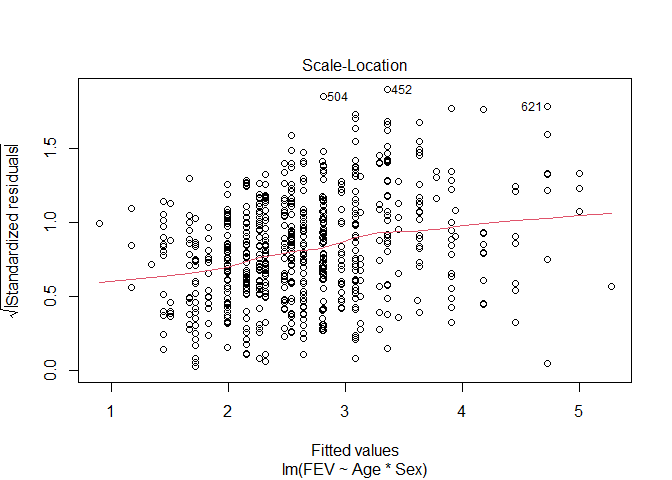<!-- -->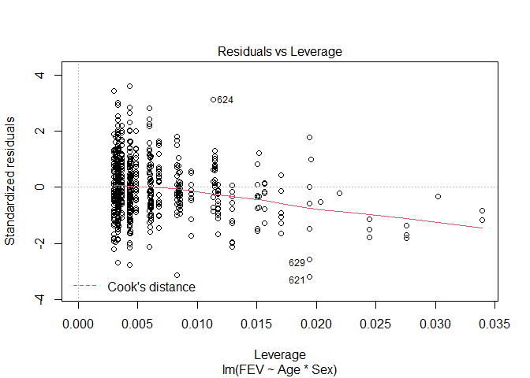<!-- -->

```r
library(car)
```

```
## Loading required package: carData
```

```r
Anova(fev_age, type = "III")
```

```
## Anova Table (Type III tests)
## 
## Response: FEV
##              Sum Sq  Df F value    Pr(>F)    
## (Intercept)  18.654   1  69.087 5.506e-16 ***
## Age          72.190   1 267.356 < 2.2e-16 ***
## Sex           7.977   1  29.543 7.745e-08 ***
## Age:Sex      17.426   1  64.535 4.467e-15 ***
## Residuals   175.509 650                      
## ---
## Signif. codes:  0 '***' 0.001 '**' 0.01 '*' 0.05 '.' 0.1 ' ' 1
```

```r
summary(fev_age)
```

```
## 
## Call:
## lm(formula = FEV ~ Age * Sex, data = fev)
## 
## Residuals:
##      Min       1Q   Median       3Q      Max 
## -1.64072 -0.34337 -0.04934  0.33206  1.86867 
## 
## Coefficients:
##              Estimate Std. Error t value Pr(>|t|)    
## (Intercept)  0.849467   0.102199   8.312 5.51e-16 ***
## Age          0.162729   0.009952  16.351  < 2e-16 ***
## SexMale     -0.775867   0.142745  -5.435 7.74e-08 ***
## Age:SexMale  0.110749   0.013786   8.033 4.47e-15 ***
## ---
## Signif. codes:  0 '***' 0.001 '**' 0.01 '*' 0.05 '.' 0.1 ' ' 1
## 
## Residual standard error: 0.5196 on 650 degrees of freedom
## Multiple R-squared:  0.6425,	Adjusted R-squared:  0.6408 
## F-statistic: 389.4 on 3 and 650 DF,  p-value: < 2.2e-16
```

*We can explore this question using an ANCOVA since the response is continuous and
the explanatory variables combine a categorical and continuous variable. Analysis of
residuals indicates the assumptions are met (no pattern, normal distribution). 
There is a significant interaction among age and gender on FEV (F~1,650~=64.535, 
p<.001).  We should explore impacts of age on each gender separately.*


```r
fev_age <- lm(FEV ~ Age, fev[fev$Sex == "Male",])
plot(fev_age)
```

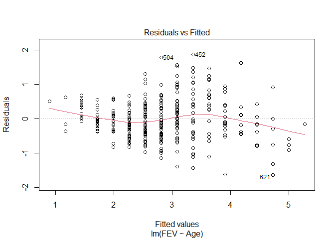<!-- -->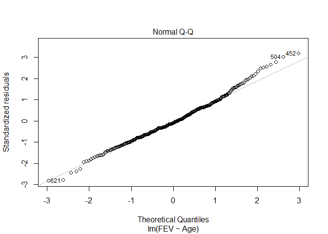<!-- -->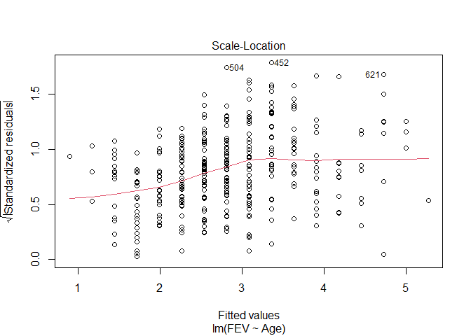<!-- -->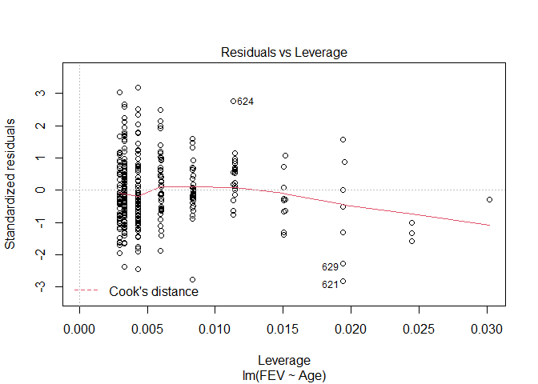<!-- -->

```r
Anova(fev_age, type = "III")
```

```
## Anova Table (Type III tests)
## 
## Response: FEV
##              Sum Sq  Df  F value Pr(>F)    
## (Intercept)   0.147   1   0.4258 0.5145    
## Age         221.896   1 641.5722 <2e-16 ***
## Residuals   115.518 334                    
## ---
## Signif. codes:  0 '***' 0.001 '**' 0.01 '*' 0.05 '.' 0.1 ' ' 1
```

```r
summary(fev_age)
```

```
## 
## Call:
## lm(formula = FEV ~ Age, data = fev[fev$Sex == "Male", ])
## 
## Residuals:
##      Min       1Q   Median       3Q      Max 
## -1.64072 -0.37752 -0.05318  0.36893  1.86867 
## 
## Coefficients:
##             Estimate Std. Error t value Pr(>|t|)    
## (Intercept)   0.0736     0.1128   0.653    0.514    
## Age           0.2735     0.0108  25.329   <2e-16 ***
## ---
## Signif. codes:  0 '***' 0.001 '**' 0.01 '*' 0.05 '.' 0.1 ' ' 1
## 
## Residual standard error: 0.5881 on 334 degrees of freedom
## Multiple R-squared:  0.6576,	Adjusted R-squared:  0.6566 
## F-statistic: 641.6 on 1 and 334 DF,  p-value: < 2.2e-16
```
*Age has a significant (F~1,334~ = 641, p < 0.01) positive 
(.27 L yr^-1^) impact on FEV in males.*


```r
fev_age <- lm(FEV ~ Age, fev[fev$Sex == "Female",])
plot(fev_age)
```

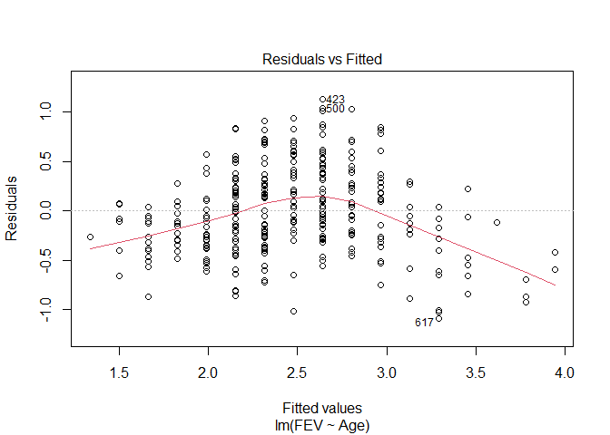<!-- -->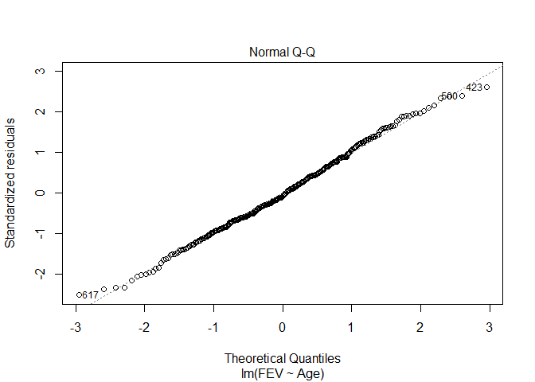<!-- -->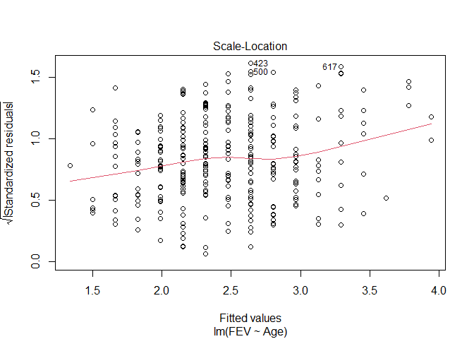<!-- -->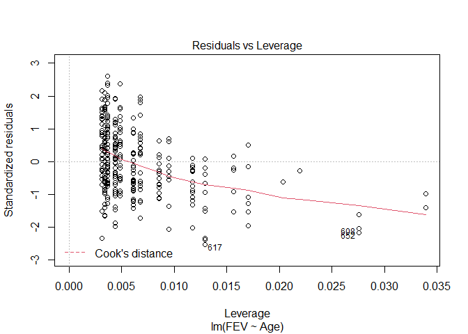<!-- -->

```r
Anova(fev_age, type = "III")
```

```
## Anova Table (Type III tests)
## 
## Response: FEV
##             Sum Sq  Df F value    Pr(>F)    
## (Intercept) 18.654   1  98.262 < 2.2e-16 ***
## Age         72.190   1 380.258 < 2.2e-16 ***
## Residuals   59.991 316                      
## ---
## Signif. codes:  0 '***' 0.001 '**' 0.01 '*' 0.05 '.' 0.1 ' ' 1
```

```r
summary(fev_age)
```

```
## 
## Call:
## lm(formula = FEV ~ Age, data = fev[fev$Sex == "Female", ])
## 
## Residuals:
##      Min       1Q   Median       3Q      Max 
## -1.09240 -0.28991 -0.03762  0.28749  1.13451 
## 
## Coefficients:
##             Estimate Std. Error t value Pr(>|t|)    
## (Intercept) 0.849467   0.085695   9.913   <2e-16 ***
## Age         0.162729   0.008345  19.500   <2e-16 ***
## ---
## Signif. codes:  0 '***' 0.001 '**' 0.01 '*' 0.05 '.' 0.1 ' ' 1
## 
## Residual standard error: 0.4357 on 316 degrees of freedom
## Multiple R-squared:  0.5461,	Adjusted R-squared:  0.5447 
## F-statistic: 380.3 on 1 and 316 DF,  p-value: < 2.2e-16
```
*Age also has a significant (F~1,316~ = 380, p < 0.01) positive 
(.16 L yr^-1^) impact on FEV in females. The interaction is likely
due to the higher rate of increase of FEV with age in males.*


```r
library(ggplot2)
ggplot(fev, aes(x=Age, y=FEV, color = Sex, shape = Sex)) +
  geom_point(size = 3) +
  ylab("FEV (L)") +
  ggtitle("FEV increases faster \n with age in males")+
  theme(axis.title.x = element_text(face="bold", size=28), 
        axis.title.y = element_text(face="bold", size=28), 
        axis.text.y  = element_text(size=20),
        axis.text.x  = element_text(size=20), 
        legend.text =element_text(size=20),
        legend.title = element_text(size=20, face="bold"),
        plot.title = element_text(hjust = 0.5, face="bold", size=32)) +
    geom_smooth(method = "lm", se = F)
```

```
## `geom_smooth()` using formula 'y ~ x'
```

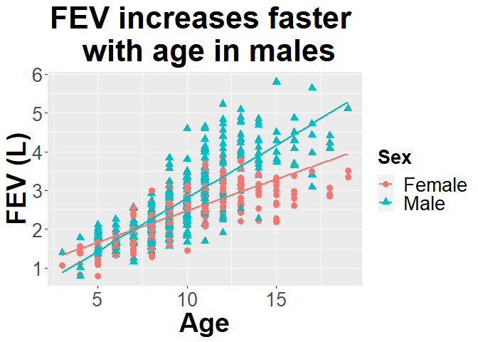<!-- -->


2. Data on home gas consumption at various temperatures before and after new insulation was installed has been collected @ 

http://www.statsci.org/data/general/insulgas.txt

More information on the data is available @

http://www.statsci.org/data/general/insulgas.html

Is there any relationship between these factors?  How would you test this,
and what type of plot would you produce to accompany your analysis?


```r
heat <- read.table("http://www.statsci.org/data/general/insulgas.txt", 
                   header = T, stringsAsFactors = T)
head(heat)
```

```
##   Insulate Temp Gas
## 1   Before -0.8 7.2
## 2   Before -0.7 6.9
## 3   Before  0.4 6.4
## 4   Before  2.5 6.0
## 5   Before  2.9 5.8
## 6   Before  3.2 5.8
```

```r
heat_model <- lm(Gas ~ Insulate * Temp, heat)
plot(heat_model)
```

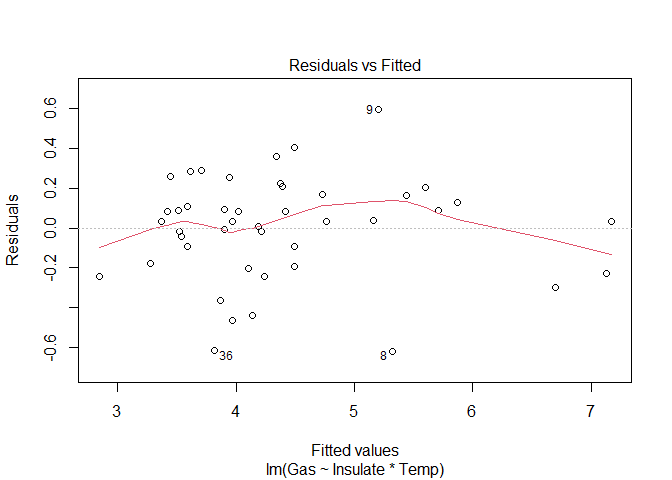<!-- -->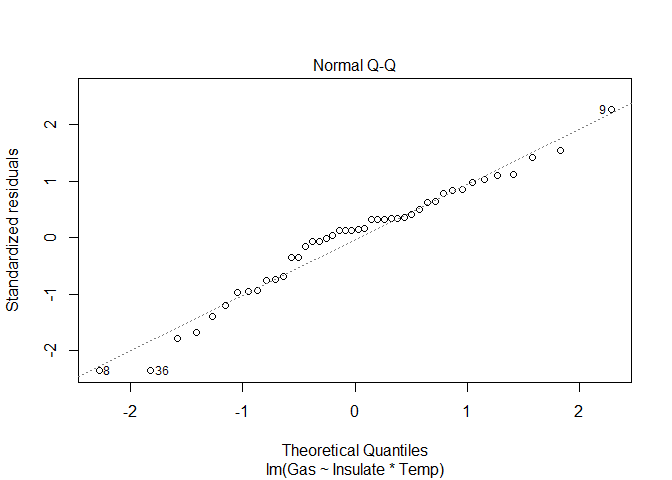<!-- -->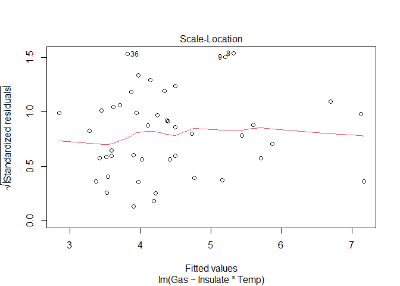<!-- -->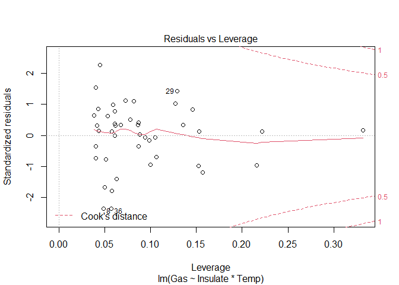<!-- -->

```r
require(car)
Anova(heat_model, type = "III")
```

```
## Anova Table (Type III tests)
## 
## Response: Gas
##               Sum Sq Df  F value    Pr(>F)    
## (Intercept)   90.636  1 1243.911 < 2.2e-16 ***
## Insulate      12.502  1  171.583 4.709e-16 ***
## Temp           2.783  1   38.191 2.640e-07 ***
## Insulate:Temp  0.757  1   10.391  0.002521 ** 
## Residuals      2.915 40                       
## ---
## Signif. codes:  0 '***' 0.001 '**' 0.01 '*' 0.05 '.' 0.1 ' ' 1
```

```r
ggplot(heat, aes_string(x="Temp", y="Gas", color = "Insulate")) +
  geom_point(size = 3) +
  ylab(expression(paste("Gas (1000 ",ft^3, ")")))+
  xlab(expression(paste("Temperature (", degree~C, ")")))+
  geom_smooth(method = "lm", se = F) +
  theme(axis.title.x = element_text(face="bold", size=28), 
        axis.title.y = element_text(face="bold", size=28), 
        axis.text.y  = element_text(size=20),
        axis.text.x  = element_text(size=20), 
        legend.text =element_text(size=20),
        legend.title = element_text(size=20, face="bold"),
        plot.title = element_text(hjust = 0.5, face="bold", size=32))
```

```
## `geom_smooth()` using formula 'y ~ x'
```

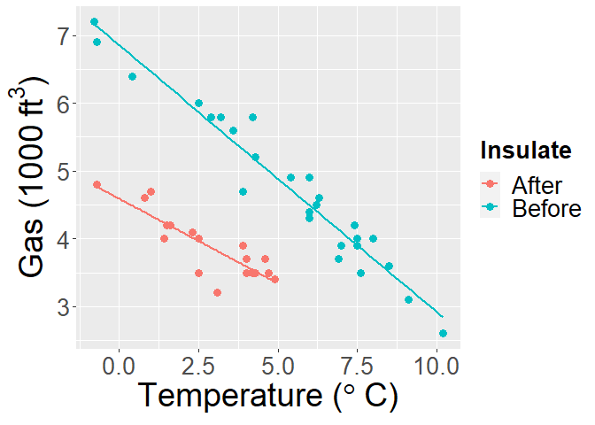<!-- -->
*There is a significant relationship between insulation type (before/after) and
temperature on gas usage (F~1,40~=10.39, p<.01). Graphical analysis indicates the old (before) insulation led to higher overall gas usage and gas usage increased faster with colder temperature
compared to the new insulation. Statistical analysis bears this out*


```r
heat_model_old <- lm(Gas ~ Temp, heat[heat$Insulate == "Before",])
plot(heat_model_old)
```

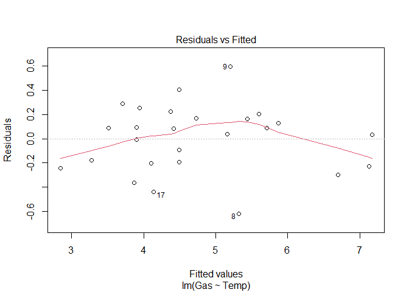<!-- -->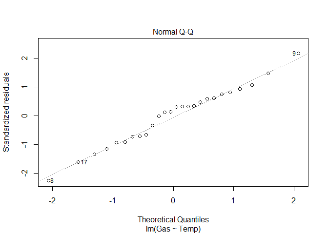<!-- -->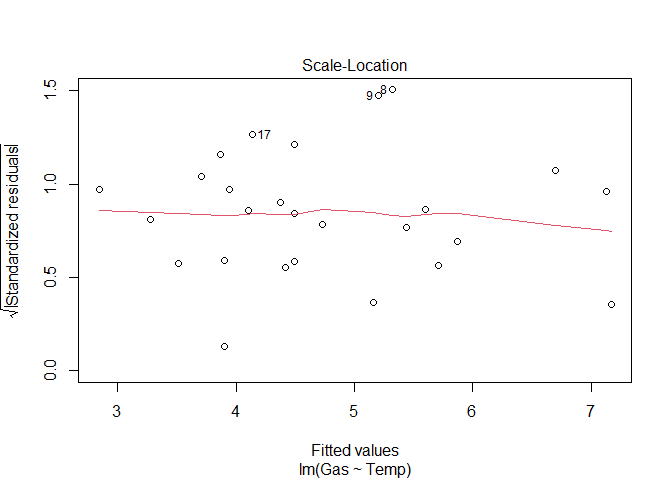<!-- -->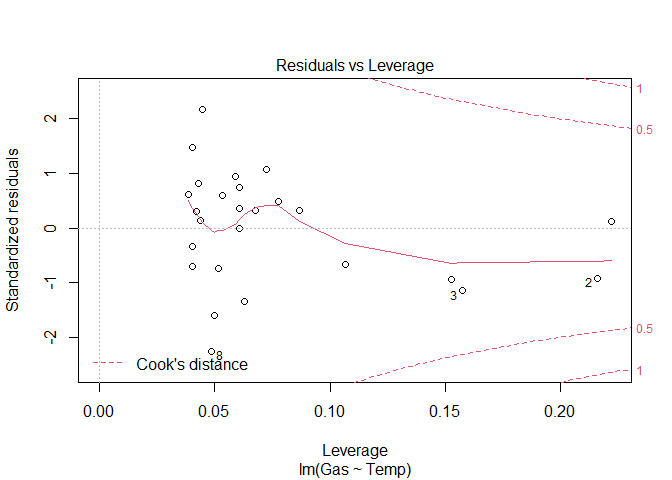<!-- -->

```r
summary(heat_model_old)
```

```
## 
## Call:
## lm(formula = Gas ~ Temp, data = heat[heat$Insulate == "Before", 
##     ])
## 
## Residuals:
##      Min       1Q   Median       3Q      Max 
## -0.62020 -0.19947  0.06068  0.16770  0.59778 
## 
## Coefficients:
##             Estimate Std. Error t value Pr(>|t|)    
## (Intercept)  6.85383    0.11842   57.88   <2e-16 ***
## Temp        -0.39324    0.01959  -20.08   <2e-16 ***
## ---
## Signif. codes:  0 '***' 0.001 '**' 0.01 '*' 0.05 '.' 0.1 ' ' 1
## 
## Residual standard error: 0.2813 on 24 degrees of freedom
## Multiple R-squared:  0.9438,	Adjusted R-squared:  0.9415 
## F-statistic: 403.1 on 1 and 24 DF,  p-value: < 2.2e-16
```

```r
Anova(heat_model_old, type = "III")
```

```
## Anova Table (Type III tests)
## 
## Response: Gas
##              Sum Sq Df F value    Pr(>F)    
## (Intercept) 265.115  1 3349.59 < 2.2e-16 ***
## Temp         31.905  1  403.11 < 2.2e-16 ***
## Residuals     1.900 24                      
## ---
## Signif. codes:  0 '***' 0.001 '**' 0.01 '*' 0.05 '.' 0.1 ' ' 1
```

```r
heat_model_new<- lm(Gas ~ Temp, heat[heat$Insulate == "After",])
plot(heat_model_new)
```

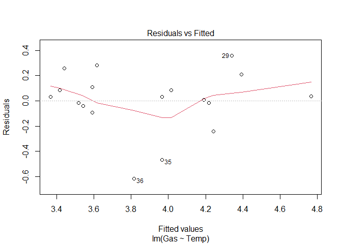<!-- --><!-- -->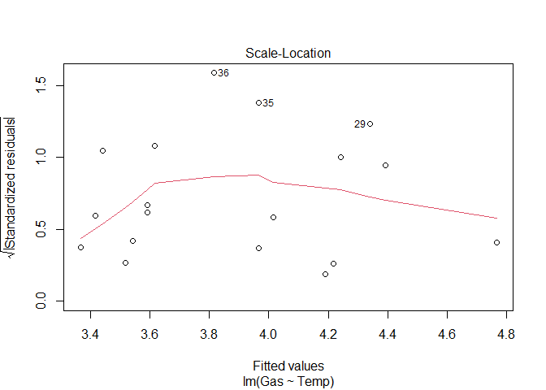<!-- -->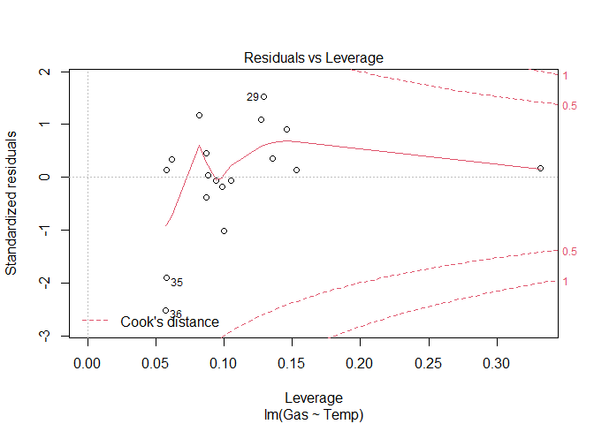<!-- -->

```r
summary(heat_model_new)
```

```
## 
## Call:
## lm(formula = Gas ~ Temp, data = heat[heat$Insulate == "After", 
##     ])
## 
## Residuals:
##      Min       1Q   Median       3Q      Max 
## -0.61677 -0.03594  0.03300  0.10180  0.35901 
## 
## Coefficients:
##             Estimate Std. Error t value Pr(>|t|)    
## (Intercept)  4.59062    0.12145  37.799  < 2e-16 ***
## Temp        -0.24963    0.03769  -6.623 5.86e-06 ***
## ---
## Signif. codes:  0 '***' 0.001 '**' 0.01 '*' 0.05 '.' 0.1 ' ' 1
## 
## Residual standard error: 0.2519 on 16 degrees of freedom
## Multiple R-squared:  0.7327,	Adjusted R-squared:  0.716 
## F-statistic: 43.87 on 1 and 16 DF,  p-value: 5.857e-06
```

```r
Anova(heat_model_new, type = "III")
```

```
## Anova Table (Type III tests)
## 
## Response: Gas
##             Sum Sq Df  F value    Pr(>F)    
## (Intercept) 90.636  1 1428.759 < 2.2e-16 ***
## Temp         2.783  1   43.867 5.857e-06 ***
## Residuals    1.015 16                       
## ---
## Signif. codes:  0 '***' 0.001 '**' 0.01 '*' 0.05 '.' 0.1 ' ' 1
```
*There is a significant relationship between gas usage and temperature for old 
and new insulation homes. However, the old insulation led to using 400 ft^3^ more gas per week to heat the 
house with every degree
drop in temperature, while the new insulation leads to a increase of only 
250 ft^3^ more gas per week with each degree drop.*  

3.  Data on the height, diameter, and volume of cherry trees was collected for
use in developing an optimal model to predict timber volume.  Data is available @ 

http://www.statsci.org/data/general/cherry.txt

Use the data to justify an optimal model.


```r
cherry <- read.table("http://www.statsci.org/data/general/cherry.txt",
                     header = T)
head(cherry)
```

```
##   Diam Height Volume
## 1  8.3     70   10.3
## 2  8.6     65   10.3
## 3  8.8     63   10.2
## 4 10.5     72   16.4
## 5 10.7     81   18.8
## 6 10.8     83   19.7
```

```r
#if only considering main effects (one option)
cherry_full <- lm(Volume ~ Diam + Height, cherry)
plot(cherry_full)
```

<!-- -->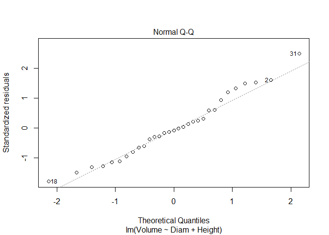<!-- -->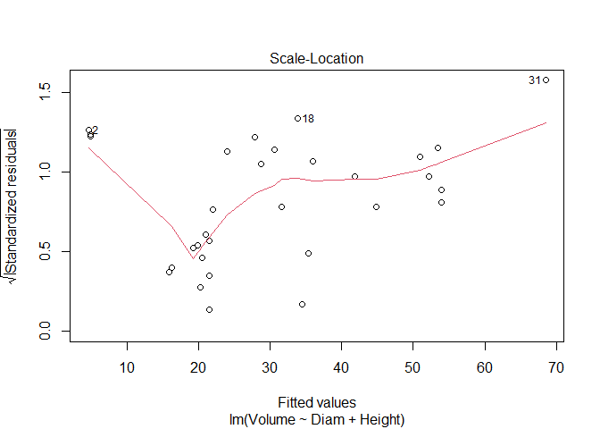<!-- -->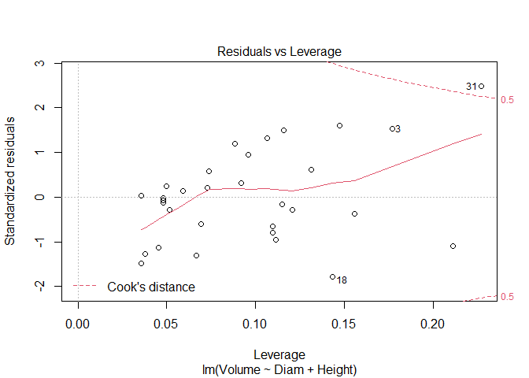<!-- -->

```r
library(car)
Anova(cherry_full, type = "III")
```

```
## Anova Table (Type III tests)
## 
## Response: Volume
##             Sum Sq Df  F value    Pr(>F)    
## (Intercept)  679.0  1  45.0632  2.75e-07 ***
## Diam        4783.0  1 317.4129 < 2.2e-16 ***
## Height       102.4  1   6.7943   0.01449 *  
## Residuals    421.9 28                       
## ---
## Signif. codes:  0 '***' 0.001 '**' 0.01 '*' 0.05 '.' 0.1 ' ' 1
```

```r
#both are significant, so finished

#could also consider interactions 
cherry_full <- lm(Volume ~ Diam * Height, cherry)
plot(cherry_full)
```

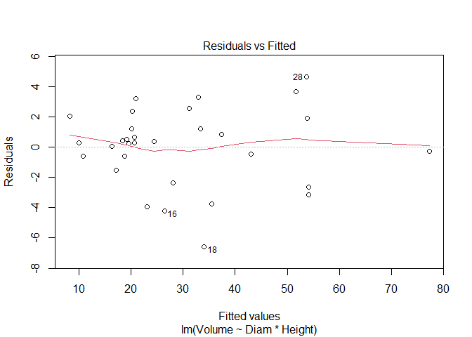<!-- --><!-- -->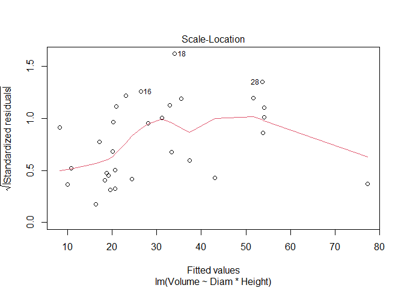<!-- --><!-- -->

```r
Anova(cherry_full, type = "III")
```

```
## Anova Table (Type III tests)
## 
## Response: Volume
##              Sum Sq Df F value    Pr(>F)    
## (Intercept)  62.185  1  8.4765 0.0071307 ** 
## Diam         68.147  1  9.2891 0.0051087 ** 
## Height      128.566  1 17.5248 0.0002699 ***
## Diam:Height 223.843  1 30.5119 7.484e-06 ***
## Residuals   198.079 27                      
## ---
## Signif. codes:  0 '***' 0.001 '**' 0.01 '*' 0.05 '.' 0.1 ' ' 1
```

```r
summary(cherry_full)
```

```
## 
## Call:
## lm(formula = Volume ~ Diam * Height, data = cherry)
## 
## Residuals:
##     Min      1Q  Median      3Q     Max 
## -6.5821 -1.0673  0.3026  1.5641  4.6649 
## 
## Coefficients:
##             Estimate Std. Error t value Pr(>|t|)    
## (Intercept) 69.39632   23.83575   2.911  0.00713 ** 
## Diam        -5.85585    1.92134  -3.048  0.00511 ** 
## Height      -1.29708    0.30984  -4.186  0.00027 ***
## Diam:Height  0.13465    0.02438   5.524 7.48e-06 ***
## ---
## Signif. codes:  0 '***' 0.001 '**' 0.01 '*' 0.05 '.' 0.1 ' ' 1
## 
## Residual standard error: 2.709 on 27 degrees of freedom
## Multiple R-squared:  0.9756,	Adjusted R-squared:  0.9728 
## F-statistic: 359.3 on 3 and 27 DF,  p-value: < 2.2e-16
```

```r
#all significant, so finished
```
*I used multiple regression to consider the impacts of both continuous and 
categorical explanatory variables on timber volume.  I used a top-down approach 
focused on p-values (F tests) in this example.  Both diameter and height (and their
interaction) are significant, so the full model is justified by the data. It 
explains 97.5% of the variation in volume.  AIC methods lead to a similar outcome*


```r
library(MASS)
stepAIC(cherry_full)
```

```
## Start:  AIC=65.49
## Volume ~ Diam * Height
## 
##               Df Sum of Sq    RSS    AIC
## <none>                     198.08 65.495
## - Diam:Height  1    223.84 421.92 86.936
```

```
## 
## Call:
## lm(formula = Volume ~ Diam * Height, data = cherry)
## 
## Coefficients:
## (Intercept)         Diam       Height  Diam:Height  
##     69.3963      -5.8558      -1.2971       0.1347
```


4.  Over the course of five years, a professor asked students in his stats class 
to carry out a simple experiment.  Students were asked to measure their pulse 
rate, run for one minute, then measure their pulse rate again.  The students 
also filled out a questionnaire.  Data  include:

Variable | Description
:-:  | :-:
Height | Height (cm)
Weight | Weight (kg)
Age    | Age (years)
Gender | Sex (1 = male, 2 = female)
Smokes | Regular smoker? (1 = yes, 2 = no)
Alcohol | Regular drinker? (1 = yes, 2 = no)
Exercise | Frequency of exercise (1 = high, 2 = moderate, 3 = low)
Change | Percent change in pulse (pulse after experiment/pulse before experiment)
Year | Year of class (93 - 98)

Using the available data (available at 

https://docs.google.com/spreadsheets/d/e/2PACX-1vToN77M80enimQglwpFroooLzDtcQMh4qKbOuhbu-eVmU9buczh7nVV1BdI4T_ma-PfWUnQYmq-60RZ/pub?gid=942311716&single=true&output=csv )

determine the optimal subset of explanatory variables that should be used to
predict change pulse rate (Change) (focusing on main effects only, no 
interactions) and explain your choice of methods.  Interpret your results. Make
sure you can explain any changes you needed to make to the dataset or steps you 
used in your analysis.


```r
pulse_class_copy <- read.csv("https://docs.google.com/spreadsheets/d/e/2PACX-1vToN77M80enimQglwpFroooLzDtcQMh4qKbOuhbu-eVmU9buczh7nVV1BdI4T_ma-PfWUnQYmq-60RZ/pub?gid=942311716&single=true&output=csv", stringsAsFactors = T)
pulse_class_copy$Gender <- as.factor(pulse_class_copy$Gender)
pulse_class_copy$Smokes <- as.factor (pulse_class_copy$Smokes)
pulse_class_copy$Alcohol <- as.factor(pulse_class_copy$Alcohol)

require(MuMIn)
```

```
## Loading required package: MuMIn
```

```r
pulse_full <- lm(Change ~ ., pulse_class_copy )
pulse_final <- step(pulse_full)
```

```
## Start:  AIC=-94.24
## Change ~ Height + Weight + Age + Gender + Smokes + Alcohol + 
##     Exercise + Year
## 
##            Df Sum of Sq    RSS     AIC
## - Year      1  0.002178 4.0113 -96.218
## - Gender    1  0.002825 4.0119 -96.211
## - Smokes    1  0.006969 4.0161 -96.163
## - Age       1  0.007498 4.0166 -96.157
## - Weight    1  0.018975 4.0281 -96.026
## - Exercise  1  0.063201 4.0723 -95.524
## <none>                  4.0091 -94.243
## - Height    1  0.248912 4.2580 -93.473
## - Alcohol   1  0.275592 4.2847 -93.185
## 
## Step:  AIC=-96.22
## Change ~ Height + Weight + Age + Gender + Smokes + Alcohol + 
##     Exercise
## 
##            Df Sum of Sq    RSS     AIC
## - Gender    1  0.002745 4.0140 -98.187
## - Smokes    1  0.008748 4.0200 -98.118
## - Age       1  0.009061 4.0203 -98.115
## - Weight    1  0.020656 4.0319 -97.982
## - Exercise  1  0.061106 4.0724 -97.523
## <none>                  4.0113 -96.218
## - Height    1  0.247630 4.2589 -95.463
## - Alcohol   1  0.280615 4.2919 -95.108
## 
## Step:  AIC=-98.19
## Change ~ Height + Weight + Age + Smokes + Alcohol + Exercise
## 
##            Df Sum of Sq    RSS      AIC
## - Age       1  0.008872 4.0229 -100.085
## - Smokes    1  0.009773 4.0238 -100.075
## - Weight    1  0.019557 4.0336  -99.963
## - Exercise  1  0.058622 4.0726  -99.520
## <none>                  4.0140  -98.187
## - Height    1  0.258061 4.2721  -97.321
## - Alcohol   1  0.302450 4.3165  -96.845
## 
## Step:  AIC=-100.09
## Change ~ Height + Weight + Smokes + Alcohol + Exercise
## 
##            Df Sum of Sq    RSS      AIC
## - Smokes    1  0.009335 4.0322 -101.979
## - Weight    1  0.020707 4.0436 -101.849
## - Exercise  1  0.063527 4.0864 -101.365
## <none>                  4.0229 -100.085
## - Height    1  0.270131 4.2930  -99.096
## - Alcohol   1  0.293626 4.3165  -98.845
## 
## Step:  AIC=-101.98
## Change ~ Height + Weight + Alcohol + Exercise
## 
##            Df Sum of Sq    RSS     AIC
## - Weight    1  0.020452 4.0527 -103.75
## - Exercise  1  0.055663 4.0879 -103.35
## <none>                  4.0322 -101.98
## - Height    1  0.263914 4.2961 -101.06
## - Alcohol   1  0.285822 4.3181 -100.83
## 
## Step:  AIC=-103.75
## Change ~ Height + Alcohol + Exercise
## 
##            Df Sum of Sq    RSS     AIC
## - Exercise  1   0.07307 4.1258 -104.92
## <none>                  4.0527 -103.75
## - Alcohol   1   0.28662 4.3393 -102.60
## - Height    1   0.39237 4.4451 -101.50
## 
## Step:  AIC=-104.92
## Change ~ Height + Alcohol
## 
##           Df Sum of Sq    RSS     AIC
## <none>                 4.1258 -104.92
## - Alcohol  1   0.25346 4.3792 -104.18
## - Height   1   0.43164 4.5574 -102.35
```

```r
#consider assumptions
plot(pulse_final)
```

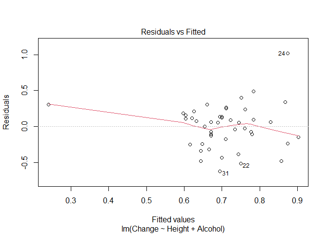<!-- --><!-- --><!-- -->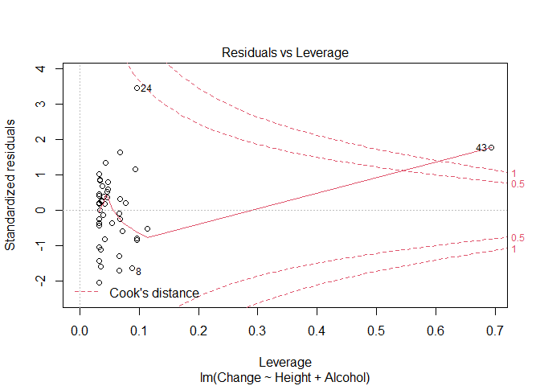<!-- -->

```r
Anova(pulse_final, type = "III")
```

```
## Anova Table (Type III tests)
## 
## Response: Change
##             Sum Sq Df F value  Pr(>F)  
## (Intercept) 0.0434  1  0.4520 0.50500  
## Height      0.4316  1  4.4987 0.03973 *
## Alcohol     0.2535  1  2.6416 0.11141  
## Residuals   4.1258 43                  
## ---
## Signif. codes:  0 '***' 0.001 '**' 0.01 '*' 0.05 '.' 0.1 ' ' 1
```

```r
summary(pulse_final)
```

```
## 
## Call:
## lm(formula = Change ~ Height + Alcohol, data = pulse_class_copy)
## 
## Residuals:
##      Min       1Q   Median       3Q      Max 
## -0.62511 -0.17315  0.05539  0.15239  1.01992 
## 
## Coefficients:
##              Estimate Std. Error t value Pr(>|t|)  
## (Intercept) -0.318699   0.474060  -0.672   0.5050  
## Height       0.005658   0.002668   2.121   0.0397 *
## Alcohol2     0.173965   0.107035   1.625   0.1114  
## ---
## Signif. codes:  0 '***' 0.001 '**' 0.01 '*' 0.05 '.' 0.1 ' ' 1
## 
## Residual standard error: 0.3098 on 43 degrees of freedom
## Multiple R-squared:  0.1074,	Adjusted R-squared:  0.06585 
## F-statistic: 2.586 on 2 and 43 DF,  p-value: 0.08699
```

```r
#or
library(MuMIn)
options(na.action = "na.fail")
auto <- dredge(pulse_full)
```

```
## Fixed term is "(Intercept)"
```

```r
write.csv(auto, "dredge_output.csv", row.names = F)
options(na.action = "na.omit")
```
*I used step based approach (which requires nested models) and large search method
above. Using the step approach only height and alcohol usage are retained in the 
final model, which explains 10% of the variation in pulse change. Model assumptions 
are also met. The search method finds the same optimal model but notes many other
models (including a null model) perform similarly well.*

