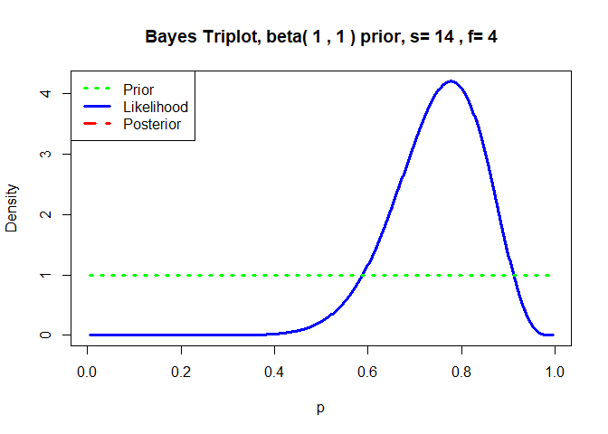
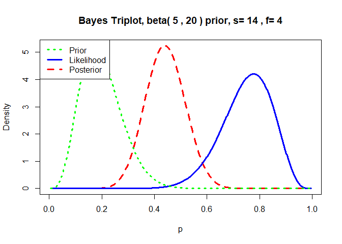
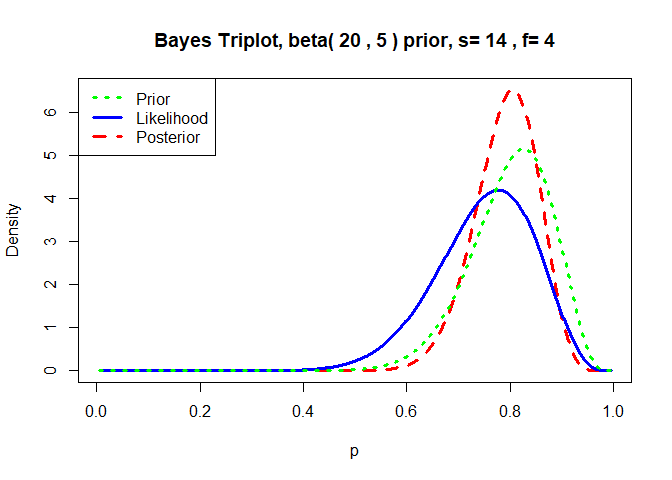
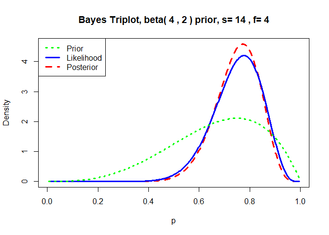
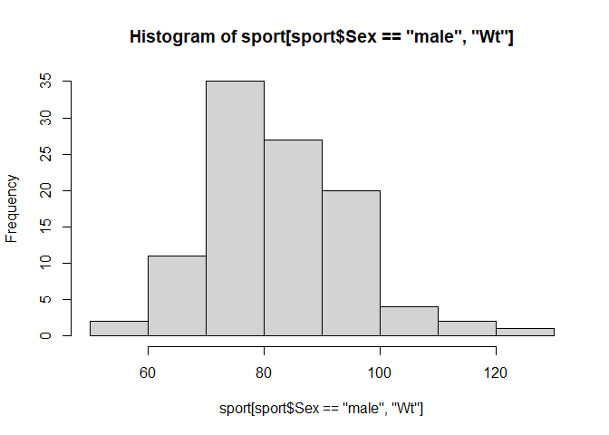
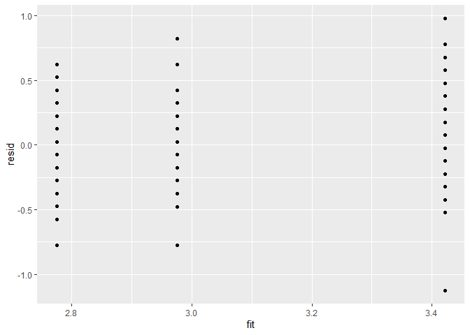
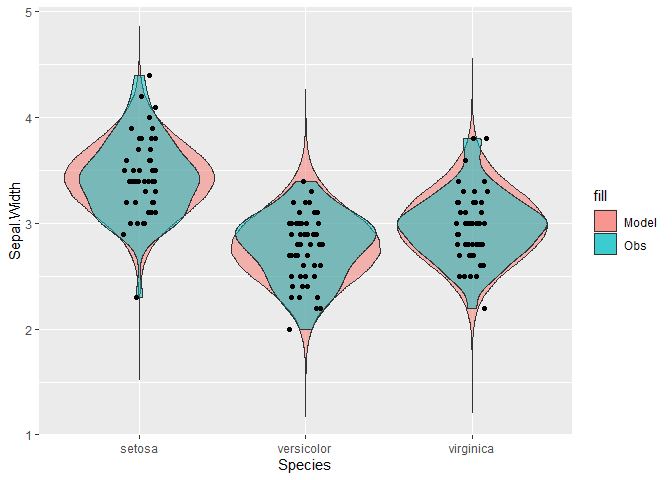
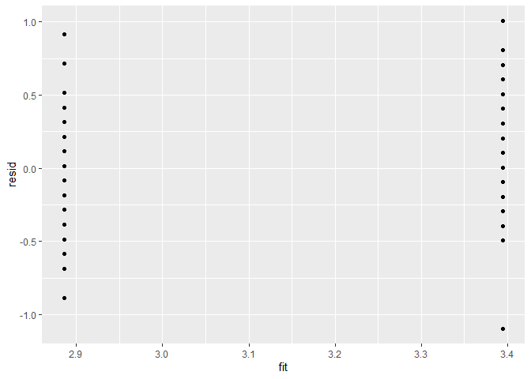
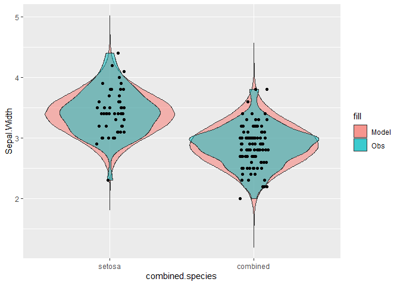

Before doing this, review the lecture set slides from 
https://sites.google.com/view/biostats/lessons/intro-to-bayesian-statistics and
the 
**bayes_standalone.R** script in the lecture files folder of the
[CUNY-BioStats github repository](https://github.com/jsgosnell/CUNY-BioStats). 
Make sure you are comfortable with null and alternative hypotheses for all
examples.

Remember you should

* add code chunks by clicking the *Insert Chunk* button on the toolbar or by
pressing *Ctrl+Alt+I* to answer the questions!
* **knit** your file to produce a markdown version that you can see!
* save your work often 
  * **commit** it via git!
  * **push** updates to github
  

1.  Make sure you can describe the main differences between Frequentist, Likelihood, and Bayesian approaches.

*Answer should focus on differences in perception of "data" and tests. Frequentists
consider real world parameters to be absolute but focus on "noise" in our samples
of it (sampling error) so that tests rely on infinite samples (p-value). Bayesians
consider real world parameters probabilistically. They fit a distribution to what
they think the world looks like (prior), collect data to consider how likely it 
would be if that were true, and focus on combining those to update their beliefs
(posterior).

2.  Review the video we watched in class to make sure you understand the Bayesian 
connection. You can also read a related post @ https://brilliant.org/wiki/monty-hall-problem/.
* https://www.youtube.com/watch?v=mhlc7peGlGg

3.  I've shared a script in R that lets you test the Monty Hall idea (like in 
the video!).  It's the chivers_monty_hall_script from the 
[code_examples folder](https://github.com/jsgosnell/CUNY-BioStats/tree/master/code_examples)code_examples  
on github.  For this question, its easiest to just source the main file and see what happens.
When you source a script, it is run in R without showing any console output
(but graphs and objects are still produced!).  Try 
*source("https://raw.githubusercontent.com/jsgosnell/CUNY-BioStats/master/code_examples/chivers_monty_hall_script.R")*
, then test out the idea here using the following functions which calculate outcomes
under each strategy.
* monty(strat="stay", print_games=F)
* monty(strat="switch", print_games=F)
* monty(strat="random", print_games=F)


```r
source("https://raw.githubusercontent.com/jsgosnell/CUNY-BioStats/master/code_examples/chivers_monty_hall_script.R")
monty(strat="stay", print_games=F)
```

```
## Using the stay strategy, your win percentage was 33.6%
```

```r
monty(strat="switch", print_games=F)
```

```
## Using the switch strategy, your win percentage was 67.9%
```

```r
monty(strat="random", print_games=F)
```

```
## Using the random strategy, your win percentage was 51.8%
```

4. Setup the Monty Hall problem as probabilities and convince yourself how it works.
You may want to remember to think about prior and new information (likelihoods).

5. Run the frog analysis (14/18 frogs are right-pawed) assuming an “uninformed” 
prior (is this really possible?) and priors that predict frogs are likely to be 
left- or right-handed (look under Bayesian analysis in script for functions such
as triplot and qbeta).  Vary both the relationship among the shape variables 
and the magnitude (weighting) to understand how the prior impacts your posterior.


```r
library(LearnBayes)
#even, uniform (uninformed) prior
triplot(prior = c(1,1), data = c(14,4), where = "topleft")
```

<!-- -->

```r
#prior assumes left handed
triplot(prior = c(5,20), data = c(14,4), where = "topleft")
```

<!-- -->

```r
#prior assumes right handed 
triplot(prior = c(20,5), data = c(14,4), where = "topleft")
```

<!-- -->

```r
#less sure right handed
triplot(prior = c(4,2), data = c(14,4), where = "topleft")
```

<!-- -->
*This is the "big picture" of Bayesian analysis. We combined our prior beliefs and
data to update our beliefs (the posterior). We sample/describe the posterior for
our answer. Everything else is "how do we do that?".*

6. Using data from Australian athletes (http://www.statsci.org/data/oz/ais.html 
for details), determine if the average male training at the Australian Institute 
of Sport differs in weight from the average Australian male (85.9 kg) using
bootstrapping techniques and a Bayesian approach. For the Bayesian approach, 
compare approaches that give the null more and less weight.

Data at 

```r
sport <- read.table("http://www.statsci.org/data/oz/ais.txt", header = T, 
                    stringsAsFactors = T)
```

You can source the bootstrapjsg function using


```r
source("https://raw.githubusercontent.com/jsgosnell/CUNY-BioStats/master/code_examples/bootstrapjsg.R")
```

*Answer*


```r
sport <- read.table("http://www.statsci.org/data/oz/ais.txt", header = T)
source("https://raw.githubusercontent.com/jsgosnell/CUNY-BioStats/master/code_examples/bootstrapjsg.R")
bootstrapjsg(data1=sport[sport$Sex == "male", "Wt"], null=85.9)
```

```
## 
## Attaching package: 'boot'
```

```
## The following object is masked from 'package:LearnBayes':
## 
##     darwin
```

```
## Simple Bootstrap Routines (1.1-7)
```

```
## Warning in boot.ci(a, conf): bootstrap variances needed for studentized
## intervals
```

```
##                                                                         
##                  "0.95" "% Confidence Interval"       "80.109032203028" 
##                                                                         
##      "84.9401838035128"               "p-value"                "0.0058"
```

```r
#to get estimates!
summary(sport[sport$Sex == "male",])
```

```
##      Sex               Sport                RCC             WCC        
##  Length:102         Length:102         Min.   :4.130   Min.   : 3.900  
##  Class :character   Class :character   1st Qu.:4.862   1st Qu.: 6.025  
##  Mode  :character   Mode  :character   Median :5.015   Median : 7.100  
##                                        Mean   :5.027   Mean   : 7.221  
##                                        3rd Qu.:5.178   3rd Qu.: 8.375  
##                                        Max.   :6.720   Max.   :14.300  
##        Hc              Hg             Ferr            BMI       
##  Min.   :40.30   Min.   :13.50   Min.   :  8.0   Min.   :19.63  
##  1st Qu.:44.23   1st Qu.:14.93   1st Qu.: 55.0   1st Qu.:22.29  
##  Median :45.50   Median :15.50   Median : 89.5   Median :23.56  
##  Mean   :45.65   Mean   :15.55   Mean   : 96.4   Mean   :23.90  
##  3rd Qu.:46.80   3rd Qu.:15.90   3rd Qu.:123.5   3rd Qu.:25.16  
##  Max.   :59.70   Max.   :19.20   Max.   :234.0   Max.   :34.42  
##       SSF             X.Bfat            LBM               Ht       
##  Min.   : 28.00   Min.   : 5.630   Min.   : 48.00   Min.   :165.3  
##  1st Qu.: 37.52   1st Qu.: 6.968   1st Qu.: 68.00   1st Qu.:179.8  
##  Median : 47.70   Median : 8.625   Median : 74.50   Median :185.6  
##  Mean   : 51.42   Mean   : 9.251   Mean   : 74.66   Mean   :185.5  
##  3rd Qu.: 58.15   3rd Qu.:10.010   3rd Qu.: 80.75   3rd Qu.:191.0  
##  Max.   :113.50   Max.   :19.940   Max.   :106.00   Max.   :209.4  
##        Wt        
##  Min.   : 53.80  
##  1st Qu.: 73.95  
##  Median : 83.00  
##  Mean   : 82.52  
##  3rd Qu.: 90.30  
##  Max.   :123.20
```

```r
hist(sport[sport$Sex == "male", "Wt"])
```

<!-- -->


```r
library(BayesFactor)
```

```
## Loading required package: coda
```

```
## Loading required package: Matrix
```

```
## ************
## Welcome to BayesFactor 0.9.12-4.3. If you have questions, please contact Richard Morey (richarddmorey@gmail.com).
## 
## Type BFManual() to open the manual.
## ************
```

```r
ttestBF(sport[sport$Sex == "male", "Wt"], mu=85.9)
```

```
## Bayes factor analysis
## --------------
## [1] Alt., r=0.707 : 3.818236 ±0.01%
## 
## Against denominator:
##   Null, mu = 85.9 
## ---
## Bayes factor type: BFoneSample, JZS
```

```r
ttestBF(sport[sport$Sex == "male", "Wt"], mu=85.9, rscale = "ultrawide")
```

```
## Bayes factor analysis
## --------------
## [1] Alt., r=1.414 : 2.124392 ±0.01%
## 
## Against denominator:
##   Null, mu = 85.9 
## ---
## Bayes factor type: BFoneSample, JZS
```
*Both answers give a Bayes Factor >1, which is evidence against the null. However, 
support is fairly weak (2.12-3.8, largely anecdotal), and you can see the 
"ultrawide" option gives even more 
weight to the null."*

7. Data on plant heights (in cm) for plants grown with a new and old formulation 
of fertilizer can be found at

https://raw.githubusercontent.com/jsgosnell/CUNY-BioStats/master/datasets/fertilizer.csv

Use the data to test the hypothesis that there is no difference in mean plant
heights for the two groups A) Using frequentist methods B) Using Bayesian
approaches.


```r
#fertilizer####
fertilizer <- read.csv("https://raw.githubusercontent.com/jsgosnell/CUNY-BioStats/master/datasets/fertilizer.csv")

t.test(height ~ fertilizer, fertilizer)
```

```
## 
## 	Welch Two Sample t-test
## 
## data:  height by fertilizer
## t = 3.013, df = 15.559, p-value = 0.008458
## alternative hypothesis: true difference in means between group new and group old is not equal to 0
## 95 percent confidence interval:
##  1.367809 7.912191
## sample estimates:
## mean in group new mean in group old 
##             56.55             51.91
```

```r
library(BayesFactor)
ttestBF(formula = height ~ fertilizer, data = fertilizer)
```

```
## Bayes factor analysis
## --------------
## [1] Alt., r=0.707 : 5.748667 ±0%
## 
## Against denominator:
##   Null, mu1-mu2 = 0 
## ---
## Bayes factor type: BFindepSample, JZS
```
*Using a frequentist t-test (since the data focuses on a continuous response 
variable and differences among 2 groups), we find t~15.559~=3.013, p<.01, so we
reject the null hypothesis of no difference among groups.  We can also we find a
Bayes Factor >1, which is substantial evidence against the null. However, 
support is not as strong as might expect given the very low p-value*

8.Develop a Bayesian model to determine if sepal width (from the iris dataset in
R) differs among populations.

* compare models that parameterize each population as different vs one that only 
examines difference between I. setosa and other species.
  + making a new dummy variable is one way to do this!
  

```r
#ANOVA example####
#with stan for all species
library(rstanarm)
```

```
## Loading required package: Rcpp
```

```
## This is rstanarm version 2.21.3
```

```
## - See https://mc-stan.org/rstanarm/articles/priors for changes to default priors!
```

```
## - Default priors may change, so it's safest to specify priors, even if equivalent to the defaults.
```

```
## - For execution on a local, multicore CPU with excess RAM we recommend calling
```

```
##   options(mc.cores = parallel::detectCores())
```

```
## 
## Attaching package: 'rstanarm'
```

```
## The following object is masked from 'package:boot':
## 
##     logit
```

```
## The following object is masked from 'package:LearnBayes':
## 
##     laplace
```

```r
bayesian_iris_anova <- stan_aov(Sepal.Width~Species, data = iris, 
                                prior = R2(what = "median", location = 0.5), adapt_delta = 0.9999)
```

```
## 
## SAMPLING FOR MODEL 'lm' NOW (CHAIN 1).
## Chain 1: 
## Chain 1: Gradient evaluation took 0 seconds
## Chain 1: 1000 transitions using 10 leapfrog steps per transition would take 0 seconds.
## Chain 1: Adjust your expectations accordingly!
## Chain 1: 
## Chain 1: 
## Chain 1: Iteration:    1 / 2000 [  0%]  (Warmup)
## Chain 1: Iteration:  200 / 2000 [ 10%]  (Warmup)
## Chain 1: Iteration:  400 / 2000 [ 20%]  (Warmup)
## Chain 1: Iteration:  600 / 2000 [ 30%]  (Warmup)
## Chain 1: Iteration:  800 / 2000 [ 40%]  (Warmup)
## Chain 1: Iteration: 1000 / 2000 [ 50%]  (Warmup)
## Chain 1: Iteration: 1001 / 2000 [ 50%]  (Sampling)
## Chain 1: Iteration: 1200 / 2000 [ 60%]  (Sampling)
## Chain 1: Iteration: 1400 / 2000 [ 70%]  (Sampling)
## Chain 1: Iteration: 1600 / 2000 [ 80%]  (Sampling)
## Chain 1: Iteration: 1800 / 2000 [ 90%]  (Sampling)
## Chain 1: Iteration: 2000 / 2000 [100%]  (Sampling)
## Chain 1: 
## Chain 1:  Elapsed Time: 0.607 seconds (Warm-up)
## Chain 1:                2.89 seconds (Sampling)
## Chain 1:                3.497 seconds (Total)
## Chain 1: 
## 
## SAMPLING FOR MODEL 'lm' NOW (CHAIN 2).
## Chain 2: 
## Chain 2: Gradient evaluation took 0 seconds
## Chain 2: 1000 transitions using 10 leapfrog steps per transition would take 0 seconds.
## Chain 2: Adjust your expectations accordingly!
## Chain 2: 
## Chain 2: 
## Chain 2: Iteration:    1 / 2000 [  0%]  (Warmup)
## Chain 2: Iteration:  200 / 2000 [ 10%]  (Warmup)
## Chain 2: Iteration:  400 / 2000 [ 20%]  (Warmup)
## Chain 2: Iteration:  600 / 2000 [ 30%]  (Warmup)
## Chain 2: Iteration:  800 / 2000 [ 40%]  (Warmup)
## Chain 2: Iteration: 1000 / 2000 [ 50%]  (Warmup)
## Chain 2: Iteration: 1001 / 2000 [ 50%]  (Sampling)
## Chain 2: Iteration: 1200 / 2000 [ 60%]  (Sampling)
## Chain 2: Iteration: 1400 / 2000 [ 70%]  (Sampling)
## Chain 2: Iteration: 1600 / 2000 [ 80%]  (Sampling)
## Chain 2: Iteration: 1800 / 2000 [ 90%]  (Sampling)
## Chain 2: Iteration: 2000 / 2000 [100%]  (Sampling)
## Chain 2: 
## Chain 2:  Elapsed Time: 0.574 seconds (Warm-up)
## Chain 2:                0.332 seconds (Sampling)
## Chain 2:                0.906 seconds (Total)
## Chain 2: 
## 
## SAMPLING FOR MODEL 'lm' NOW (CHAIN 3).
## Chain 3: 
## Chain 3: Gradient evaluation took 0 seconds
## Chain 3: 1000 transitions using 10 leapfrog steps per transition would take 0 seconds.
## Chain 3: Adjust your expectations accordingly!
## Chain 3: 
## Chain 3: 
## Chain 3: Iteration:    1 / 2000 [  0%]  (Warmup)
## Chain 3: Iteration:  200 / 2000 [ 10%]  (Warmup)
## Chain 3: Iteration:  400 / 2000 [ 20%]  (Warmup)
## Chain 3: Iteration:  600 / 2000 [ 30%]  (Warmup)
## Chain 3: Iteration:  800 / 2000 [ 40%]  (Warmup)
## Chain 3: Iteration: 1000 / 2000 [ 50%]  (Warmup)
## Chain 3: Iteration: 1001 / 2000 [ 50%]  (Sampling)
## Chain 3: Iteration: 1200 / 2000 [ 60%]  (Sampling)
## Chain 3: Iteration: 1400 / 2000 [ 70%]  (Sampling)
## Chain 3: Iteration: 1600 / 2000 [ 80%]  (Sampling)
## Chain 3: Iteration: 1800 / 2000 [ 90%]  (Sampling)
## Chain 3: Iteration: 2000 / 2000 [100%]  (Sampling)
## Chain 3: 
## Chain 3:  Elapsed Time: 0.488 seconds (Warm-up)
## Chain 3:                0.335 seconds (Sampling)
## Chain 3:                0.823 seconds (Total)
## Chain 3: 
## 
## SAMPLING FOR MODEL 'lm' NOW (CHAIN 4).
## Chain 4: 
## Chain 4: Gradient evaluation took 0 seconds
## Chain 4: 1000 transitions using 10 leapfrog steps per transition would take 0 seconds.
## Chain 4: Adjust your expectations accordingly!
## Chain 4: 
## Chain 4: 
## Chain 4: Iteration:    1 / 2000 [  0%]  (Warmup)
## Chain 4: Iteration:  200 / 2000 [ 10%]  (Warmup)
## Chain 4: Iteration:  400 / 2000 [ 20%]  (Warmup)
## Chain 4: Iteration:  600 / 2000 [ 30%]  (Warmup)
## Chain 4: Iteration:  800 / 2000 [ 40%]  (Warmup)
## Chain 4: Iteration: 1000 / 2000 [ 50%]  (Warmup)
## Chain 4: Iteration: 1001 / 2000 [ 50%]  (Sampling)
## Chain 4: Iteration: 1200 / 2000 [ 60%]  (Sampling)
## Chain 4: Iteration: 1400 / 2000 [ 70%]  (Sampling)
## Chain 4: Iteration: 1600 / 2000 [ 80%]  (Sampling)
## Chain 4: Iteration: 1800 / 2000 [ 90%]  (Sampling)
## Chain 4: Iteration: 2000 / 2000 [100%]  (Sampling)
## Chain 4: 
## Chain 4:  Elapsed Time: 0.476 seconds (Warm-up)
## Chain 4:                0.331 seconds (Sampling)
## Chain 4:                0.807 seconds (Total)
## Chain 4:
```

```
## Warning: There were 4 divergent transitions after warmup. See
## https://mc-stan.org/misc/warnings.html#divergent-transitions-after-warmup
## to find out why this is a problem and how to eliminate them.
```

```
## Warning: Examine the pairs() plot to diagnose sampling problems
```

```r
#check sampling outcomes####
launch_shinystan(bayesian_iris_anova)
```

```
## 
## Hang on... preparing graphical posterior predictive checks for rstanarm model.
## See help('shinystan', 'rstanarm') for how to disable this feature.
```

```
## 
## Launching ShinyStan interface... for large models this  may take some time.
```

```
## Loading required package: shiny
```

```
## 
## Listening on http://127.0.0.1:5820
```

```r
#check model#### 
#check residuals for patterns
require(ggplot2)
```

```
## Loading required package: ggplot2
```

```r
resid = resid(bayesian_iris_anova)
fit = fitted(bayesian_iris_anova)
ggplot() + geom_point(data = NULL, aes(y = resid, x = fit))
```

<!-- -->

```r
#can also look at  posterior predictive checks in shinystan

#does model predict observed data?
#http://www.flutterbys.com.au/stats/tut/tut7.4b.html
y_pred = posterior_predict(bayesian_iris_anova)
#just getting all simulated outcomes into a column
require(tidyr)
```

```
## Loading required package: tidyr
```

```
## 
## Attaching package: 'tidyr'
```

```
## The following objects are masked from 'package:Matrix':
## 
##     expand, pack, unpack
```

```r
newdata = iris[,c("Sepal.Width", "Species")] %>% cbind(t(y_pred)) %>% gather(key = "Rep", value = "Sepal.Width",
                                                                              -"Species":-"Sepal.Width")
require(ggplot2)
ggplot(newdata) + 
  geom_violin(aes(y = Sepal.Width, x = Species, fill = "Model"),
              alpha = 0.5) + 
  geom_violin(data = iris, aes(y = Sepal.Width, x = Species,fill = "Obs"), alpha = 0.5) + 
  geom_point(data = iris, aes(y = Sepal.Width, x= Species), 
             position = position_jitter(width = 0.1, height = 0),
             color = "black")
```

<!-- -->

```r
#analyze posterior####
#have to call certainty interval by dummy variable!
summary(bayesian_iris_anova)
```

```
## 
## Model Info:
##  function:     stan_aov
##  family:       gaussian [identity]
##  formula:      Sepal.Width ~ Species
##  algorithm:    sampling
##  sample:       4000 (posterior sample size)
##  priors:       see help('prior_summary')
##  observations: 150
## 
## Estimates:
##                     mean   sd   10%   50%   90%
## (Intercept)        3.4    0.0  3.4   3.4   3.5 
## Speciesversicolor -0.6    0.1 -0.7  -0.6  -0.6 
## Speciesvirginica  -0.4    0.1 -0.5  -0.4  -0.4 
## sigma              0.3    0.0  0.3   0.3   0.4 
## log-fit_ratio      0.0    0.1 -0.1   0.0   0.1 
## R2                 0.4    0.1  0.3   0.4   0.5 
## 
## Fit Diagnostics:
##            mean   sd   10%   50%   90%
## mean_PPD 3.1    0.0  3.0   3.1   3.1  
## 
## The mean_ppd is the sample average posterior predictive distribution of the outcome variable (for details see help('summary.stanreg')).
## 
## MCMC diagnostics
##                   mcse Rhat n_eff
## (Intercept)       0.0  1.0  1124 
## Speciesversicolor 0.0  1.0  1206 
## Speciesvirginica  0.0  1.0  1365 
## sigma             0.0  1.0  2027 
## log-fit_ratio     0.0  1.0  1446 
## R2                0.0  1.0  1222 
## mean_PPD          0.0  1.0  3683 
## log-posterior     0.1  1.0   882 
## 
## For each parameter, mcse is Monte Carlo standard error, n_eff is a crude measure of effective sample size, and Rhat is the potential scale reduction factor on split chains (at convergence Rhat=1).
```

```r
ci95 <- posterior_interval(bayesian_iris_anova, prob = 0.95, pars = "Speciesversicolor")
round(ci95, 2)
```

```
##                    2.5% 97.5%
## Speciesversicolor -0.78 -0.51
```

```r
ci95 <- posterior_interval(bayesian_iris_anova, prob = 0.95, pars = "Speciesvirginica")
round(ci95, 2)
```

```
##                   2.5% 97.5%
## Speciesvirginica -0.59 -0.32
```

```r
ci95 <- posterior_interval(bayesian_iris_anova, prob = 0.95, pars = "(Intercept)")
round(ci95, 2)
```

```
##             2.5% 97.5%
## (Intercept) 3.33  3.52
```

```r
#make model with virginican and versicolor as same species####

iris$combined.species <- iris$Species
levels(iris$combined.species) <- c("setosa", "combined", "combined")
bayesian_iris_anova_combined <- stan_aov(Sepal.Width~combined.species, data = iris, 
                                prior = R2(what = "median", location = 0.5), adapt_delta = 0.9999)
```

```
## 
## SAMPLING FOR MODEL 'lm' NOW (CHAIN 1).
## Chain 1: 
## Chain 1: Gradient evaluation took 0 seconds
## Chain 1: 1000 transitions using 10 leapfrog steps per transition would take 0 seconds.
## Chain 1: Adjust your expectations accordingly!
## Chain 1: 
## Chain 1: 
## Chain 1: Iteration:    1 / 2000 [  0%]  (Warmup)
## Chain 1: Iteration:  200 / 2000 [ 10%]  (Warmup)
## Chain 1: Iteration:  400 / 2000 [ 20%]  (Warmup)
## Chain 1: Iteration:  600 / 2000 [ 30%]  (Warmup)
## Chain 1: Iteration:  800 / 2000 [ 40%]  (Warmup)
## Chain 1: Iteration: 1000 / 2000 [ 50%]  (Warmup)
## Chain 1: Iteration: 1001 / 2000 [ 50%]  (Sampling)
## Chain 1: Iteration: 1200 / 2000 [ 60%]  (Sampling)
## Chain 1: Iteration: 1400 / 2000 [ 70%]  (Sampling)
## Chain 1: Iteration: 1600 / 2000 [ 80%]  (Sampling)
## Chain 1: Iteration: 1800 / 2000 [ 90%]  (Sampling)
## Chain 1: Iteration: 2000 / 2000 [100%]  (Sampling)
## Chain 1: 
## Chain 1:  Elapsed Time: 0.279 seconds (Warm-up)
## Chain 1:                0.148 seconds (Sampling)
## Chain 1:                0.427 seconds (Total)
## Chain 1: 
## 
## SAMPLING FOR MODEL 'lm' NOW (CHAIN 2).
## Chain 2: 
## Chain 2: Gradient evaluation took 0 seconds
## Chain 2: 1000 transitions using 10 leapfrog steps per transition would take 0 seconds.
## Chain 2: Adjust your expectations accordingly!
## Chain 2: 
## Chain 2: 
## Chain 2: Iteration:    1 / 2000 [  0%]  (Warmup)
## Chain 2: Iteration:  200 / 2000 [ 10%]  (Warmup)
## Chain 2: Iteration:  400 / 2000 [ 20%]  (Warmup)
## Chain 2: Iteration:  600 / 2000 [ 30%]  (Warmup)
## Chain 2: Iteration:  800 / 2000 [ 40%]  (Warmup)
## Chain 2: Iteration: 1000 / 2000 [ 50%]  (Warmup)
## Chain 2: Iteration: 1001 / 2000 [ 50%]  (Sampling)
## Chain 2: Iteration: 1200 / 2000 [ 60%]  (Sampling)
## Chain 2: Iteration: 1400 / 2000 [ 70%]  (Sampling)
## Chain 2: Iteration: 1600 / 2000 [ 80%]  (Sampling)
## Chain 2: Iteration: 1800 / 2000 [ 90%]  (Sampling)
## Chain 2: Iteration: 2000 / 2000 [100%]  (Sampling)
## Chain 2: 
## Chain 2:  Elapsed Time: 0.228 seconds (Warm-up)
## Chain 2:                0.246 seconds (Sampling)
## Chain 2:                0.474 seconds (Total)
## Chain 2: 
## 
## SAMPLING FOR MODEL 'lm' NOW (CHAIN 3).
## Chain 3: 
## Chain 3: Gradient evaluation took 0.001 seconds
## Chain 3: 1000 transitions using 10 leapfrog steps per transition would take 10 seconds.
## Chain 3: Adjust your expectations accordingly!
## Chain 3: 
## Chain 3: 
## Chain 3: Iteration:    1 / 2000 [  0%]  (Warmup)
## Chain 3: Iteration:  200 / 2000 [ 10%]  (Warmup)
## Chain 3: Iteration:  400 / 2000 [ 20%]  (Warmup)
## Chain 3: Iteration:  600 / 2000 [ 30%]  (Warmup)
## Chain 3: Iteration:  800 / 2000 [ 40%]  (Warmup)
## Chain 3: Iteration: 1000 / 2000 [ 50%]  (Warmup)
## Chain 3: Iteration: 1001 / 2000 [ 50%]  (Sampling)
## Chain 3: Iteration: 1200 / 2000 [ 60%]  (Sampling)
## Chain 3: Iteration: 1400 / 2000 [ 70%]  (Sampling)
## Chain 3: Iteration: 1600 / 2000 [ 80%]  (Sampling)
## Chain 3: Iteration: 1800 / 2000 [ 90%]  (Sampling)
## Chain 3: Iteration: 2000 / 2000 [100%]  (Sampling)
## Chain 3: 
## Chain 3:  Elapsed Time: 0.325 seconds (Warm-up)
## Chain 3:                0.236 seconds (Sampling)
## Chain 3:                0.561 seconds (Total)
## Chain 3: 
## 
## SAMPLING FOR MODEL 'lm' NOW (CHAIN 4).
## Chain 4: 
## Chain 4: Gradient evaluation took 0 seconds
## Chain 4: 1000 transitions using 10 leapfrog steps per transition would take 0 seconds.
## Chain 4: Adjust your expectations accordingly!
## Chain 4: 
## Chain 4: 
## Chain 4: Iteration:    1 / 2000 [  0%]  (Warmup)
## Chain 4: Iteration:  200 / 2000 [ 10%]  (Warmup)
## Chain 4: Iteration:  400 / 2000 [ 20%]  (Warmup)
## Chain 4: Iteration:  600 / 2000 [ 30%]  (Warmup)
## Chain 4: Iteration:  800 / 2000 [ 40%]  (Warmup)
## Chain 4: Iteration: 1000 / 2000 [ 50%]  (Warmup)
## Chain 4: Iteration: 1001 / 2000 [ 50%]  (Sampling)
## Chain 4: Iteration: 1200 / 2000 [ 60%]  (Sampling)
## Chain 4: Iteration: 1400 / 2000 [ 70%]  (Sampling)
## Chain 4: Iteration: 1600 / 2000 [ 80%]  (Sampling)
## Chain 4: Iteration: 1800 / 2000 [ 90%]  (Sampling)
## Chain 4: Iteration: 2000 / 2000 [100%]  (Sampling)
## Chain 4: 
## Chain 4:  Elapsed Time: 0.384 seconds (Warm-up)
## Chain 4:                1.102 seconds (Sampling)
## Chain 4:                1.486 seconds (Total)
## Chain 4:
```

```r
#check sampling outcomes####
launch_shinystan(bayesian_iris_anova_combined)
```

```
## 
## Hang on... preparing graphical posterior predictive checks for rstanarm model.
## See help('shinystan', 'rstanarm') for how to disable this feature.
```

```
## 
## Launching ShinyStan interface... for large models this  may take some time.
```

```
## 
## Listening on http://127.0.0.1:5820
```

```r
#check model#### 
#check residuals for patterns
resid = resid(bayesian_iris_anova_combined)
fit = fitted(bayesian_iris_anova_combined)
ggplot() + geom_point(data = NULL, aes(y = resid, x = fit))
```

<!-- -->

```r
#can also look at  posterior predictive checks in shinystan

#does model predict observed data?
#http://www.flutterbys.com.au/stats/tut/tut7.4b.html
y_pred = posterior_predict(bayesian_iris_anova_combined)
#just getting all simulated outcomes into a column
newdata = iris[,c("Sepal.Width", "combined.species")] %>% cbind(t(y_pred)) %>% gather(key = "Rep", value = "Sepal.Width",
                                                                             -"combined.species":-"Sepal.Width")
ggplot(newdata) + 
  geom_violin(aes(y = Sepal.Width, x = combined.species, fill = "Model"),
              alpha = 0.5) + 
  geom_violin(data = iris, aes(y = Sepal.Width, x = combined.species,fill = "Obs"), alpha = 0.5) + 
  geom_point(data = iris, aes(y = Sepal.Width, x= combined.species), 
             position = position_jitter(width = 0.1, height = 0),
             color = "black")
```

<!-- -->

```r
#analyze posterior####
#have to call certainty interval by dummy variable!
summary(bayesian_iris_anova_combined)
```

```
## 
## Model Info:
##  function:     stan_aov
##  family:       gaussian [identity]
##  formula:      Sepal.Width ~ combined.species
##  algorithm:    sampling
##  sample:       4000 (posterior sample size)
##  priors:       see help('prior_summary')
##  observations: 150
## 
## Estimates:
##                            mean   sd   10%   50%   90%
## (Intercept)               3.4    0.0  3.3   3.4   3.4 
## combined.speciescombined -0.5    0.0 -0.6  -0.5  -0.5 
## sigma                     0.4    0.0  0.3   0.4   0.4 
## log-fit_ratio            -0.5    0.1 -0.6  -0.5  -0.5 
## R2                        0.9    0.1  0.7   0.9   1.0 
## 
## Fit Diagnostics:
##            mean   sd   10%   50%   90%
## mean_PPD 3.1    0.0  3.0   3.1   3.1  
## 
## The mean_ppd is the sample average posterior predictive distribution of the outcome variable (for details see help('summary.stanreg')).
## 
## MCMC diagnostics
##                          mcse Rhat n_eff
## (Intercept)              0.0  1.0  1704 
## combined.speciescombined 0.0  1.0  1601 
## sigma                    0.0  1.0  1806 
## log-fit_ratio            0.0  1.0  1456 
## R2                       0.0  1.0   994 
## mean_PPD                 0.0  1.0  3149 
## log-posterior            0.0  1.0   855 
## 
## For each parameter, mcse is Monte Carlo standard error, n_eff is a crude measure of effective sample size, and Rhat is the potential scale reduction factor on split chains (at convergence Rhat=1).
```

```r
ci95 <- posterior_interval(bayesian_iris_anova_combined, prob = 0.95, pars = "combined.speciescombined")
round(ci95, 2)
```

```
##                           2.5% 97.5%
## combined.speciescombined -0.58 -0.43
```

```r
ci95 <- posterior_interval(bayesian_iris_anova, prob = 0.95, pars = "(Intercept)")
round(ci95, 2)
```

```
##             2.5% 97.5%
## (Intercept) 3.33  3.52
```

```r
#compare models using loo
#leave one out cross validation #not in lecture
loo_bayesian_iris_anova <- loo(bayesian_iris_anova)
print(loo_bayesian_iris_anova)
```

```
## 
## Computed from 4000 by 150 log-likelihood matrix
## 
##          Estimate   SE
## elpd_loo    -53.6  9.9
## p_loo         4.2  0.8
## looic       107.1 19.9
## ------
## Monte Carlo SE of elpd_loo is 0.1.
## 
## All Pareto k estimates are good (k < 0.5).
## See help('pareto-k-diagnostic') for details.
```

```r
loo_bayesian_iris_anova_combined <- loo(bayesian_iris_anova_combined)
print(loo_bayesian_iris_anova_combined)
```

```
## 
## Computed from 4000 by 150 log-likelihood matrix
## 
##          Estimate   SE
## elpd_loo    -56.5  9.7
## p_loo         2.3  0.4
## looic       113.0 19.3
## ------
## Monte Carlo SE of elpd_loo is 0.0.
## 
## All Pareto k estimates are good (k < 0.5).
## See help('pareto-k-diagnostic') for details.
```

```r
loo_compare(loo_bayesian_iris_anova,loo_bayesian_iris_anova_combined)
```

```
##                              elpd_diff se_diff
## bayesian_iris_anova           0.0       0.0   
## bayesian_iris_anova_combined -3.0       2.7
```

```r
#or using an information criterion
waic_bayesian_iris_anova <- waic(bayesian_iris_anova)
```

```
## Warning: 
## 1 (0.7%) p_waic estimates greater than 0.4. We recommend trying loo instead.
```

```r
print(waic_bayesian_iris_anova)
```

```
## 
## Computed from 4000 by 150 log-likelihood matrix
## 
##           Estimate   SE
## elpd_waic    -53.6  9.9
## p_waic         4.2  0.8
## waic         107.1 19.9
## 
## 1 (0.7%) p_waic estimates greater than 0.4. We recommend trying loo instead.
```

```r
waic_bayesian_iris_anova_combined <- waic(bayesian_iris_anova_combined)
print(waic_bayesian_iris_anova_combined)
```

```
## 
## Computed from 4000 by 150 log-likelihood matrix
## 
##           Estimate   SE
## elpd_waic    -56.5  9.7
## p_waic         2.3  0.4
## waic         113.0 19.3
```

```r
loo_compare(waic_bayesian_iris_anova,waic_bayesian_iris_anova_combined) #model
```

```
##                              elpd_diff se_diff
## bayesian_iris_anova           0.0       0.0   
## bayesian_iris_anova_combined -3.0       2.7
```
*Sample code provided. Major point is using Shinystan to visually access that
burn-in period is sufficient and chains converger prior to analyzing the posterior.*
