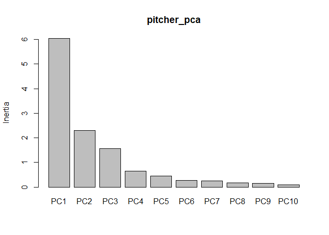
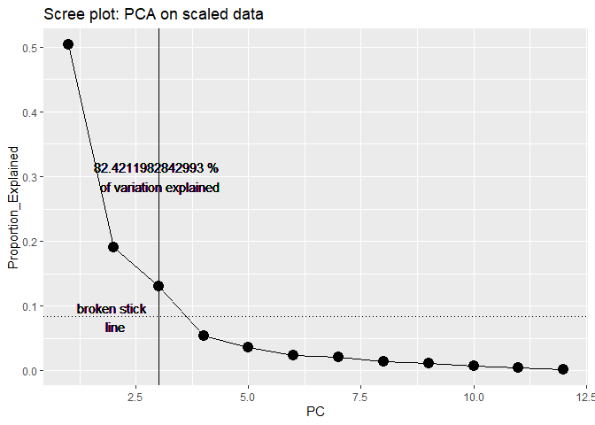
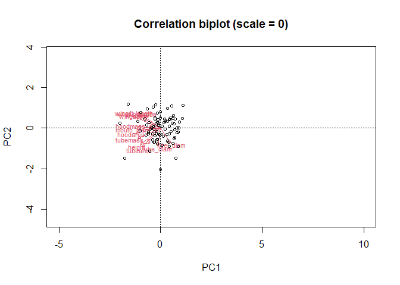
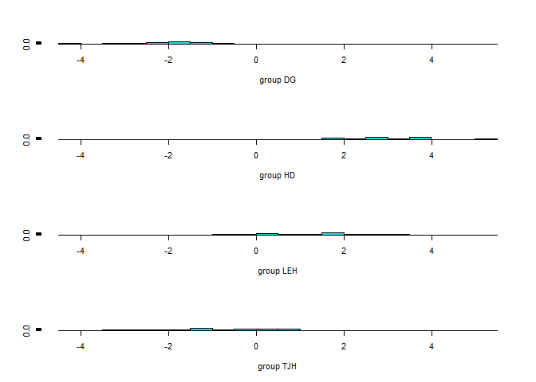
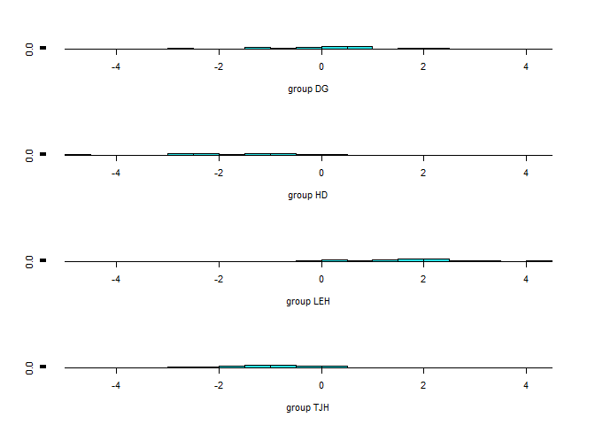
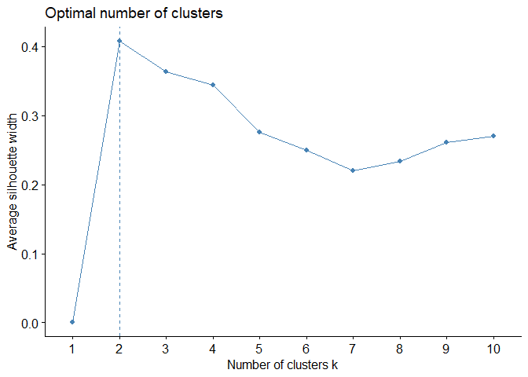
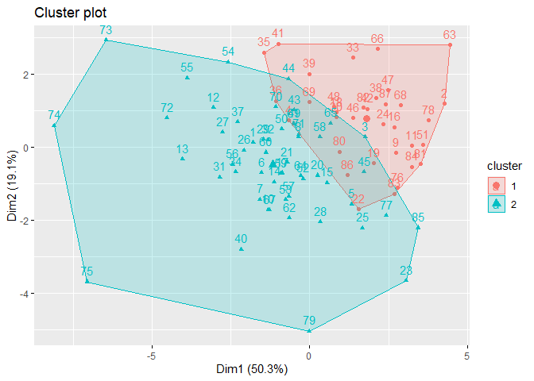
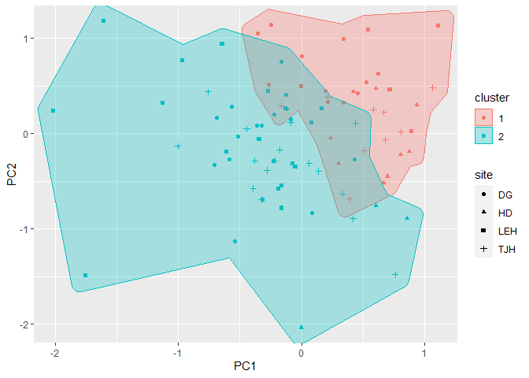
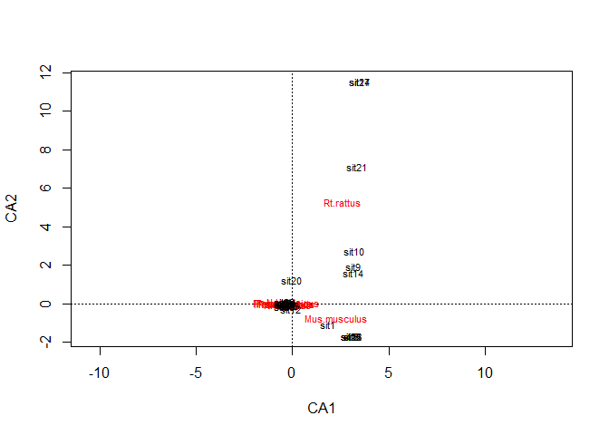

1. A pharmaceutical company has a drug that may help an illness that causes 
fever (temperature in degrees Celsius), blood pressures, and “aches” (scored on an
index).  Data is collected for several patients. To determine if the drug actually 
helps, test for differences in multivariate means for the fever, 
pressure and aches column,
against the grouping variable treatment.


```r
illness <- read.csv("https://docs.google.com/spreadsheets/d/e/2PACX-1vRlcjpU0XHfXF1WId1C5ZYX0YdY53KI9Nv91_tNCMj4z4iTjr-XMW1L_Ln8j3ahk5GUPZy4kGzSlA96/pub?gid=1322236994&single=true&output=csv",
                    stringsAsFactors = T)
```

We will test the multiple outcomes using a MANOVA. This tests the null hypothesis
that there is no difference in the vector of mean parameters for the groups. 


```r
m <- manova(cbind(fever,pressure,aches)~treatment, illness)
summary(m)
```

```
##           Df  Pillai approx F num Df den Df    Pr(>F)    
## treatment  1 0.55466   14.115      3     34 3.857e-06 ***
## Residuals 36                                             
## ---
## Signif. codes:  0 '***' 0.001 '**' 0.01 '*' 0.05 '.' 0.1 ' ' 1
```
The MANOVA shows a significant difference (Pillai's trace = .55466, p <.001), so
we reject the  null hypothesis.  To follow this up we consider ANOVAs for each 
trait to determine which ones differ among groups


```r
summary.aov(m)
```

```
##  Response fever :
##             Df Sum Sq Mean Sq F value   Pr(>F)    
## treatment    1 43.973  43.973   34.99 9.02e-07 ***
## Residuals   36 45.242   1.257                     
## ---
## Signif. codes:  0 '***' 0.001 '**' 0.01 '*' 0.05 '.' 0.1 ' ' 1
## 
##  Response pressure :
##             Df Sum Sq Mean Sq F value Pr(>F)
## treatment    1  440.9  440.93  2.6871 0.1099
## Residuals   36 5907.4  164.09               
## 
##  Response aches :
##             Df  Sum Sq Mean Sq F value Pr(>F)
## treatment    1   59.74  59.738  1.6285 0.2101
## Residuals   36 1320.58  36.683
```

These indicate that only fever differs among groups.

2. Darlingtonia californica is a partly carnivorous pitcher plant that grows in 
fens and along seeps and
streams in the mountains of Oregon and California. Its pitchers are tubular l
eaves with a round hood and
a mouth at the base of the hood (see figure below). A "fishtail" appendage 
hangs from the mouth.
Wasps and other prey are attracted to nectar secreted by extrafloral nectaries 
along the hood, mouth,
and fishtail. Plants absorb nutrients excreted by a food web of bacteria, 
protozoa, mites, and fly larvae
that break down the prey. 

Measurements of 87 plants from four sites were made by Ellison and Farnsworth 
(2005, The cost of
carnivory for Darlingtonia californica (Sarraceniaceae): evidence from 
relationships among leaf traits.
Am. J. Botany 92: 1085-1093). Their measurements are available using


```r
pitcher <- read.csv("https://docs.google.com/spreadsheets/d/e/2PACX-1vQZf2mS4NmfBUUsn7lY2RTpuVjuWvRYN4MdLNt2XdS4WepolrxvWCKBI5diKBMWPLhdbEGwP-hfWOnz/pub?gid=1427497144&single=true&output=csv",
                    stringsAsFactors = T)
```

I obtained them from the web page
(http://harvardforest.fas.harvard.edu/personnel/web/aellison/publications/primer/primer.html)
of A. M. Ellison for the book by Gotelli and Ellison (2004, A primer of ecological 
statistics. Sinauer,
Sunderland, Mass.). To simplify, outliers have been removed. Most plant traits 
in the file are illustrated in the image below, and trait labels are fairly 
self-explanatory. Keel width measures the span of the
pitcher tube. "Wing" traits refer to the lengths of the fishtail appendage.

<center>


{width=30%}

</center>

* Use a MANOVA to consider differences in plant traits (do not follow-up with 
almost 20 ANOVA's! Just consider why PCA might be useful with large datasets!


```r
pitcher_outcomes <- pitcher[,2:13]
pitcher_manova <- manova(as.matrix(pitcher_outcomes)~site, pitcher)
summary(pitcher_manova)
```

```
##           Df Pillai approx F num Df den Df    Pr(>F)    
## site       3 1.6951   8.0108     36    222 < 2.2e-16 ***
## Residuals 83                                            
## ---
## Signif. codes:  0 '***' 0.001 '**' 0.01 '*' 0.05 '.' 0.1 ' ' 1
```

```r
summary.aov(pitcher_manova)
```

```
##  Response height :
##             Df Sum Sq Mean Sq F value Pr(>F)
## site         3  35080   11693  1.1618 0.3293
## Residuals   83 835341   10064               
## 
##  Response mouth_diam :
##             Df Sum Sq Mean Sq F value    Pr(>F)    
## site         3 1069.1  356.38  12.902 5.353e-07 ***
## Residuals   83 2292.7   27.62                      
## ---
## Signif. codes:  0 '***' 0.001 '**' 0.01 '*' 0.05 '.' 0.1 ' ' 1
## 
##  Response tube_diam :
##             Df Sum Sq Mean Sq F value    Pr(>F)    
## site         3 234.95  78.317  9.6701 1.526e-05 ***
## Residuals   83 672.21   8.099                      
## ---
## Signif. codes:  0 '***' 0.001 '**' 0.01 '*' 0.05 '.' 0.1 ' ' 1
## 
##  Response keel_diam :
##             Df Sum Sq Mean Sq F value    Pr(>F)    
## site         3 141.99  47.329  14.653 9.638e-08 ***
## Residuals   83 268.08   3.230                      
## ---
## Signif. codes:  0 '***' 0.001 '**' 0.01 '*' 0.05 '.' 0.1 ' ' 1
## 
##  Response wing1_length :
##             Df Sum Sq Mean Sq F value   Pr(>F)    
## site         3  12897  4298.9  11.289 2.76e-06 ***
## Residuals   83  31606   380.8                     
## ---
## Signif. codes:  0 '***' 0.001 '**' 0.01 '*' 0.05 '.' 0.1 ' ' 1
## 
##  Response wing2_length :
##             Df Sum Sq Mean Sq F value   Pr(>F)   
## site         3   7784 2594.56     5.5 0.001702 **
## Residuals   83  39154  471.74                    
## ---
## Signif. codes:  0 '***' 0.001 '**' 0.01 '*' 0.05 '.' 0.1 ' ' 1
## 
##  Response wingsprea :
##             Df Sum Sq Mean Sq F value    Pr(>F)    
## site         3  21676  7225.3  6.9585 0.0003108 ***
## Residuals   83  86182  1038.3                      
## ---
## Signif. codes:  0 '***' 0.001 '**' 0.01 '*' 0.05 '.' 0.1 ' ' 1
## 
##  Response hoodarea :
##             Df  Sum Sq Mean Sq F value    Pr(>F)    
## site         3  4015.2 1338.41  6.3842 0.0006031 ***
## Residuals   83 17400.4  209.64                      
## ---
## Signif. codes:  0 '***' 0.001 '**' 0.01 '*' 0.05 '.' 0.1 ' ' 1
## 
##  Response wingarea :
##             Df  Sum Sq Mean Sq F value    Pr(>F)    
## site         3  3115.8 1038.60  7.1171 0.0002592 ***
## Residuals   83 12112.2  145.93                      
## ---
## Signif. codes:  0 '***' 0.001 '**' 0.01 '*' 0.05 '.' 0.1 ' ' 1
## 
##  Response tubearea :
##             Df Sum Sq Mean Sq F value  Pr(>F)  
## site         3   5507 1835.78  2.9363 0.03805 *
## Residuals   83  51892  625.21                  
## ---
## Signif. codes:  0 '***' 0.001 '**' 0.01 '*' 0.05 '.' 0.1 ' ' 1
## 
##  Response hoodmass_g :
##             Df Sum Sq Mean Sq F value    Pr(>F)    
## site         3 3.1075 1.03585  10.439 6.721e-06 ***
## Residuals   83 8.2362 0.09923                      
## ---
## Signif. codes:  0 '***' 0.001 '**' 0.01 '*' 0.05 '.' 0.1 ' ' 1
## 
##  Response tubemass_g :
##             Df Sum Sq Mean Sq F value    Pr(>F)    
## site         3 19.305  6.4349    6.39 0.0005991 ***
## Residuals   83 83.583  1.0070                      
## ---
## Signif. codes:  0 '***' 0.001 '**' 0.01 '*' 0.05 '.' 0.1 ' ' 1
```

* Use principal component analysis to investigate variation among
individual plants in their dimensions. Along the way, make sure you
  * construct screeplots
  * determine how many principal components to retain (and why)
  * Use biplots and/or loadings to see if you can understand/interpret the 
  first few principal components
  
Noticed I scaled the data here since some groups have more/less variation and 
are measured in different units.


```r
summary(pitcher_outcomes)
```

```
##      height        mouth_diam      tube_diam       keel_diam     
##  Min.   :322.0   Min.   :13.60   Min.   :14.30   Min.   : 1.600  
##  1st Qu.:545.5   1st Qu.:27.30   1st Qu.:17.70   1st Qu.: 5.000  
##  Median :625.0   Median :31.50   Median :19.80   Median : 6.100  
##  Mean   :615.6   Mean   :30.88   Mean   :20.05   Mean   : 6.399  
##  3rd Qu.:671.0   3rd Qu.:34.50   3rd Qu.:21.00   3rd Qu.: 7.200  
##  Max.   :845.0   Max.   :49.30   Max.   :30.00   Max.   :14.800  
##   wing1_length     wing2_length      wingsprea         hoodarea     
##  Min.   : 10.00   Min.   : 16.00   Min.   : 22.00   Min.   : 13.81  
##  1st Qu.: 58.00   1st Qu.: 56.50   1st Qu.: 70.00   1st Qu.: 35.31  
##  Median : 70.00   Median : 70.00   Median : 86.00   Median : 46.18  
##  Mean   : 73.26   Mean   : 72.36   Mean   : 91.66   Mean   : 47.56  
##  3rd Qu.: 85.00   3rd Qu.: 83.50   3rd Qu.:112.50   3rd Qu.: 56.30  
##  Max.   :148.00   Max.   :152.00   Max.   :199.00   Max.   :104.04  
##     wingarea        tubearea        hoodmass_g       tubemass_g   
##  Min.   : 2.03   Min.   : 29.57   Min.   :0.2200   Min.   :0.680  
##  1st Qu.:14.36   1st Qu.: 69.40   1st Qu.:0.5600   1st Qu.:1.995  
##  Median :19.89   Median : 89.15   Median :0.7600   Median :2.920  
##  Mean   :23.21   Mean   : 87.43   Mean   :0.8101   Mean   :2.882  
##  3rd Qu.:27.59   3rd Qu.:103.00   3rd Qu.:1.0250   3rd Qu.:3.505  
##  Max.   :77.09   Max.   :187.27   Max.   :1.9300   Max.   :5.890
```

  

```r
library(vegan)
```

```
## Loading required package: permute
```

```
## Loading required package: lattice
```

```
## This is vegan 2.6-2
```

```r
pitcher_pca <- rda(pitcher_outcomes, scale=T)
summary(pitcher_pca)
```

```
## 
## Call:
## rda(X = pitcher_outcomes, scale = T) 
## 
## Partitioning of correlations:
##               Inertia Proportion
## Total              12          1
## Unconstrained      12          1
## 
## Eigenvalues, and their contribution to the correlations 
## 
## Importance of components:
##                          PC1    PC2    PC3     PC4     PC5     PC6     PC7
## Eigenvalue            6.0387 2.2926 1.5593 0.63927 0.44024 0.27999 0.25489
## Proportion Explained  0.5032 0.1910 0.1299 0.05327 0.03669 0.02333 0.02124
## Cumulative Proportion 0.5032 0.6943 0.8242 0.87748 0.91417 0.93750 0.95874
##                           PC8     PC9     PC10     PC11     PC12
## Eigenvalue            0.17288 0.14335 0.092922 0.057404 0.028523
## Proportion Explained  0.01441 0.01195 0.007744 0.004784 0.002377
## Cumulative Proportion 0.97315 0.98510 0.992839 0.997623 1.000000
## 
## Scaling 2 for species and site scores
## * Species are scaled proportional to eigenvalues
## * Sites are unscaled: weighted dispersion equal on all dimensions
## * General scaling constant of scores:  5.667871 
## 
## 
## Species scores
## 
##                  PC1      PC2      PC3      PC4      PC5      PC6
## height       -1.1643 -0.95368  0.23353 -0.28433  0.40067 -0.15695
## mouth_diam   -1.3498 -0.10307  0.53362  0.29479 -0.35038 -0.30827
## tube_diam    -0.1513 -1.02639 -1.06379  0.09076 -0.48719  0.43845
## keel_diam     0.5582 -0.85222 -0.86751  0.77983  0.39166 -0.33991
## wing1_length -1.3002  0.72306 -0.29384  0.23501  0.18980  0.09135
## wing2_length -1.2168  0.68270 -0.57917  0.02279  0.35568  0.17562
## wingsprea    -0.9352  0.67747 -0.88936 -0.41005 -0.11292 -0.30465
## hoodarea     -1.4402 -0.30399 -0.01017  0.07542 -0.49798 -0.26424
## wingarea     -1.3941  0.58219 -0.41932  0.00920  0.02980  0.05794
## tubearea     -1.0507 -1.09046 -0.15821 -0.51083  0.12765 -0.03247
## hoodmass_g   -1.3095  0.07561  0.51625  0.65995 -0.04898  0.20154
## tubemass_g   -1.3311 -0.60281  0.52025 -0.03302  0.24827  0.27434
## 
## 
## Site scores (weighted sums of species scores)
## 
##              PC1      PC2      PC3       PC4        PC5       PC6
## sit1  -0.4463924  0.04766  0.79651  1.054843  0.0870049 -0.335005
## sit2   1.0632800  0.47916  0.42089  0.119629 -0.3613301  0.247938
## sit3   0.4386730  0.10924  0.13222  0.184173  0.0890179 -0.075499
## sit4  -0.1661331  0.29206 -0.03427  0.712293 -0.4491643  0.439535
## sit5   0.3304689 -0.63223  0.59247 -0.079716  0.5914151  0.735484
## sit6  -0.3799725 -0.28525  0.39815  0.429037  0.2000534  0.225961
## sit7  -0.3916880 -0.57755  0.31489  1.060107 -0.6798062  0.519512
## sit8  -0.0872208  0.11243 -0.13918 -0.472610  0.3446415  0.130392
## sit9   0.6816717 -0.06759 -0.17840  0.236907  0.0438359  0.171646
## sit10 -0.3255634 -0.69190  1.06871  0.482034 -0.4828406 -0.184721
## sit11  0.8034244  0.01429  0.35956  0.876686 -0.9733306 -0.320842
## sit12 -0.7595912  0.43638 -0.10189  0.912732 -0.9836053 -0.143740
## sit13 -1.0031435 -0.13357 -0.03894  0.391550  0.2840587 -0.273339
## sit14 -0.2806476 -0.38673  0.74999  1.082411 -0.1679918 -0.241718
## sit15  0.1381739 -0.39591  0.58624  0.030995 -1.1319188 -0.778462
## sit16  0.6670847  0.22010  0.73802 -0.082469 -0.6924330 -0.453134
## sit17 -0.2175254 -0.28696  0.55793 -0.214797  0.3622401 -0.778094
## sit18  0.2111235  0.38335 -0.30553 -0.212128 -0.7100999 -0.380937
## sit19  0.5075660 -0.17979 -0.05746 -0.511997  0.5220202  0.850809
## sit20  0.0617287 -0.31374  0.23245 -0.449793  0.0306993  0.077435
## sit21 -0.1762105 -0.17153  0.20731 -0.236427  0.2415121 -0.636271
## sit22  0.3895824 -0.68817 -0.21368  0.670757  0.0133626  0.448295
## sit23  0.7597897 -1.47935  0.32618 -0.466748 -1.2094533  1.493809
## sit24  0.5820916  0.25051 -0.18916  0.420591  0.5091079 -0.715202
## sit25  0.4175885 -0.89406  0.51579 -0.604205  0.4564758 -0.259361
## sit26 -0.5162329 -0.03560  0.21041 -0.758770  0.9719342  0.078193
## sit27 -0.6874618  0.16528 -0.23048  0.145259  0.6574611  0.540882
## sit28  0.0844907 -0.83030  0.84730 -0.025341  0.7203106  0.905834
## sit29 -0.3639010  0.08398  0.40438  0.114736  0.2829802  1.022799
## sit30  0.2092140  0.33223  0.33383  0.281520  0.5847517  0.287617
## sit31 -0.7094872 -0.33309 -0.17645 -0.038312  1.2697983  0.555526
## sit32 -0.3247773  0.08040  0.31726  0.452421  0.3123298  0.184047
## sit33  0.3397863  0.98893 -0.17209  0.320579 -0.5824703  0.006482
## sit34 -0.5845362 -0.27480  0.66265  0.362946 -0.0002129  0.376642
## sit35 -0.3572606  1.04672  0.05764  0.298637  0.6573240  0.203199
## sit36 -0.2667667  0.50878  0.06541  0.452741  0.3111447  0.686467
## sit37 -0.5677158  0.27752  0.06170  0.728231  0.4752313  0.829873
## sit38  0.5229252  0.54024 -0.17909  0.065267  0.1945776 -0.189681
## sit39 -0.0013364  0.80816 -0.13455  0.018343  0.0410862 -0.391301
## sit40 -0.5388902 -1.13087  1.26171  0.047454  1.0441887  0.668788
## sit41 -0.2467531  1.14060  0.66910  0.573901 -0.0146463 -0.332846
## sit42  0.4549990  0.42063 -0.10218  0.856017 -0.6250215  0.270708
## sit43 -0.1239053  0.40831  0.29145  0.371215  0.3167318 -0.356128
## sit44 -0.1669593  0.75504  0.93458 -0.624792 -0.4268282 -0.101325
## sit45  0.4288170 -0.27499 -0.17573  2.222507  1.7711028 -2.378105
## sit46  0.3411268  0.32102  0.69979  0.390182 -0.1043059  0.594431
## sit47  0.6208401  0.62623  1.25634 -0.137758 -0.4047325  0.285599
## sit48  0.1931513  0.44505  0.64189  0.001985  0.3186258  0.602631
## sit49 -0.1224239  0.25412  0.94560 -0.191226 -0.1844349 -0.531529
## sit50 -0.2202620  0.19981  0.53275 -0.010767  0.3077867  0.109635
## sit51  0.8917147  0.02203  0.06410  0.439493 -0.5206997  0.369146
## sit52 -0.0500368 -0.35043  0.24503 -0.062231 -0.4307627 -0.651150
## sit53 -0.1877315 -0.58397  0.59962 -0.501188 -0.5327591 -1.182568
## sit54 -0.6434479  0.93835 -0.12122 -0.419734  0.7328652 -0.051323
## sit55 -0.9655902  0.76333 -0.63653 -1.590712  0.2336204 -0.966367
## sit56 -0.6095791 -0.19369  0.35361 -0.609574 -0.0675414  0.955165
## sit57 -0.1637258 -0.54635  0.70509 -1.868968 -0.0093444 -0.293474
## sit58  0.0811023  0.11102  0.27559 -0.731463 -0.6025209 -1.179412
## sit59 -0.2263622 -0.29279 -1.06919 -0.452795 -1.7155293  0.943129
## sit60 -0.3437170 -0.05901 -0.15968 -0.355757 -0.0777497  0.696393
## sit61 -0.1269513  0.25833 -0.29434 -0.768799 -0.2236760 -0.109182
## sit62 -0.1611561 -0.78416 -0.31557  0.400971 -0.6635208 -0.607628
## sit63  1.1077018  1.12820  0.12538 -0.199203 -0.7324537 -0.040404
## sit64 -0.0706639 -0.31781 -0.28904 -0.864513  0.6646166 -0.272227
## sit65  0.1664669  0.26363 -0.70956 -0.813948  0.2342168 -0.627288
## sit66  0.5394657  1.08518  0.32806 -1.362784  0.0030909 -0.112026
## sit67 -0.3158841 -0.69456 -0.89648 -0.118303 -0.1763827  0.045813
## sit68  0.7171084  0.46154 -0.54202 -0.181813 -0.1222254  0.471115
## sit69  0.0004532  0.49471 -0.46819 -0.323250 -0.5553126 -0.509247
## sit70 -0.2681351  0.44464 -0.47120 -0.182249  0.4531224  0.044631
## sit71 -0.0843833  0.14298 -0.53371 -0.135497 -0.6208439 -1.058486
## sit72 -1.1261616  0.32014  0.29980 -0.657098  0.0572245 -0.325422
## sit73 -1.6046603  1.17904 -1.27249  0.552834 -0.3197890  0.419779
## sit74 -2.0139236  0.23599 -0.89121  0.173690 -0.1562039  0.675486
## sit75 -1.7543157 -1.48957 -0.72403 -0.142786 -1.5671974 -0.413141
## sit76  0.6965810 -0.44968 -0.89687 -0.225599  0.7381074  0.324791
## sit77  0.6040848 -0.75733 -1.01652 -0.372706  1.2037617  0.408366
## sit78  0.9358270  0.29392 -0.43741 -0.230137  0.4547464  0.598805
## sit79 -0.0025734 -2.03491 -0.65786  0.113113  0.3848851 -1.109784
## sit80  0.2355288 -0.05073 -1.32836  0.062861  0.3406334 -0.278353
## sit81  0.8757834 -0.18870 -1.63886  0.442544  0.1753669  0.402537
## sit82  0.4224307  0.43504 -1.16942  0.626329  0.2335106  0.121773
## sit83  0.6657932 -0.51662 -0.89376  0.649431 -0.7968785  0.678728
## sit84  0.8054656 -0.22045 -0.88613 -0.148910  0.2246859 -0.056510
## sit85  0.8557207 -0.89255 -0.13112 -0.682129  0.3729357 -0.461634
## sit86  0.3009114 -0.31308 -0.38347 -0.015390 -0.5723651 -0.609030
## sit87  0.6020202  0.47404  0.07596 -0.694564  0.1281819  0.066068
```


```r
screeplot(pitcher_pca)
```



```r
pca_data <- as.data.frame(t(as.data.frame(summary(pitcher_pca)$cont)))
pca_data$PC <- 1: nrow(pca_data)
pca_data$Proportion_Explained <-pca_data$"Proportion Explained"
pca_data$Cumulative <-pca_data$"Cumulative Proportion"
library(ggplot2)
ggplot(pca_data, aes(x=PC,y=Proportion_Explained, group=1))+
  geom_point(size=4)+
  geom_line()+
  labs(title="Scree plot: PCA on scaled data") +
  geom_vline(xintercept = which(pca_data$Cumulative > .80)[1]) +
  geom_text(aes(which(Cumulative > .80)[1],.3,
            label = paste(Cumulative[which(Cumulative > .80)[1]]*100, 
                          "% \n of variation explained"))) +
  geom_hline(yintercept = 1/nrow(pca_data), linetype="dotted")+
  geom_text(aes(y= 1/nrow(pca_data), x=2, label = "broken stick \n line"))
```



Multiple methods suggest we should retain first 3 PC (they explain >80% of variance, 
form elbow in scree plot, and would be selected using broken stick approach).


```r
 summary(pitcher_pca)$species
```

```
##                     PC1         PC2         PC3          PC4         PC5
## height       -1.1643428 -0.95367637  0.23352889 -0.284330991  0.40067325
## mouth_diam   -1.3497724 -0.10307217  0.53362181  0.294794469 -0.35038393
## tube_diam    -0.1513386 -1.02639333 -1.06379060  0.090757278 -0.48718590
## keel_diam     0.5582436 -0.85222211 -0.86751464  0.779825245  0.39165963
## wing1_length -1.3001889  0.72306489 -0.29383753  0.235012920  0.18979581
## wing2_length -1.2168443  0.68270351 -0.57917053  0.022790217  0.35568359
## wingsprea    -0.9352076  0.67746718 -0.88936229 -0.410054974 -0.11292338
## hoodarea     -1.4401785 -0.30398796 -0.01016784  0.075423616 -0.49797720
## wingarea     -1.3940507  0.58219309 -0.41931938  0.009200049  0.02980016
## tubearea     -1.0507264 -1.09045742 -0.15821104 -0.510832669  0.12764686
## hoodmass_g   -1.3094841  0.07560727  0.51625102  0.659950440 -0.04897506
## tubemass_g   -1.3310526 -0.60280534  0.52025395 -0.033022124  0.24826759
##                      PC6
## height       -0.15695312
## mouth_diam   -0.30826618
## tube_diam     0.43844844
## keel_diam    -0.33991294
## wing1_length  0.09135393
## wing2_length  0.17561592
## wingsprea    -0.30465108
## hoodarea     -0.26424106
## wingarea      0.05793657
## tubearea     -0.03246665
## hoodmass_g    0.20153729
## tubemass_g    0.27433695
```

Wing (wingarea, wing1_length, wing2_length) and hoodarea appear to be driving PC1.
PC is focus on tube  measurements.


```r
biplot(pitcher_pca, choices = c(1,2), type = c("text", "points"), xlim = c(-5,10), scale=0,
       main= "Correlation biplot (scale = 0)") # biplot of axis 1 vs 2
```

```
## Warning in plot.window(...): "scale" is not a graphical parameter
```

```
## Warning in plot.xy(xy, type, ...): "scale" is not a graphical parameter
```

```
## Warning in axis(side = side, at = at, labels = labels, ...): "scale" is not a
## graphical parameter

## Warning in axis(side = side, at = at, labels = labels, ...): "scale" is not a
## graphical parameter
```

```
## Warning in box(...): "scale" is not a graphical parameter
```

```
## Warning in title(...): "scale" is not a graphical parameter
```




3. Using the same plant dataset, use linear discriminant analysis to classify the 
various sites


```r
library(MASS)
pitcher_lda <-pitcher[,1:13]
da_ca <- lda(site ~ ., pitcher_lda)
summary(da_ca)
```

```
##         Length Class  Mode     
## prior    4     -none- numeric  
## counts   4     -none- numeric  
## means   48     -none- numeric  
## scaling 36     -none- numeric  
## lev      4     -none- character
## svd      3     -none- numeric  
## N        1     -none- numeric  
## call     3     -none- call     
## terms    3     terms  call     
## xlevels  0     -none- list
```

```r
Predictions <- predict(da_ca,pitcher_lda)
table(Predictions$class, pitcher_lda$site)
```

```
##      
##       DG HD LEH TJH
##   DG  23  0   0   2
##   HD   0 11   0   0
##   LEH  0  1  24   0
##   TJH  2  0   1  23
```

```r
ldahist(data = Predictions$x[,1], g=pitcher_lda$site)
```



```r
ldahist(data = Predictions$x[,2], g=pitcher_lda$site)
```




4.  Using the same plant dataset, use cluster analysis to determine how many 
clusters are supported by the data.


```r
library(cluster)    # clustering algorithms
library(factoextra)
```

```
## Welcome! Want to learn more? See two factoextra-related books at https://goo.gl/ve3WBa
```

```r
fviz_nbclust(pitcher_outcomes, kmeans, method = "silhouette")
```


  
Data only support 2 clusters (but we had 4 sites!). Note we don't see clear
break among sites in graph either.


```r
final <- kmeans(pitcher_outcomes, 2, nstart = 25)
print(final)
```

```
## K-means clustering with 2 clusters of sizes 34, 53
## 
## Cluster means:
##     height mouth_diam tube_diam keel_diam wing1_length wing2_length wingsprea
## 1 515.8824   26.55588  19.49412  6.697059     66.85294     66.08824  85.38235
## 2 679.6226   33.65094  20.40755  6.207547     77.37736     76.37736  95.67925
##   hoodarea wingarea  tubearea hoodmass_g tubemass_g
## 1 36.46529 17.75353  66.17559  0.6179412   1.972647
## 2 54.68491 26.71642 101.05679  0.9333962   3.464906
## 
## Clustering vector:
##  [1] 2 1 2 1 2 2 2 2 1 2 1 2 2 2 2 1 2 1 1 2 2 1 2 1 2 2 2 2 2 1 2 2 1 2 1 1 2 1
## [39] 1 2 1 1 2 2 2 1 1 1 2 2 1 2 2 2 2 2 2 2 2 2 2 2 1 2 2 1 2 1 1 2 2 2 2 2 2 1
## [77] 2 1 2 1 1 1 1 1 2 1 1
## 
## Within cluster sum of squares by cluster:
## [1] 175725.5 395968.5
##  (between_SS / total_SS =  51.1 %)
## 
## Available components:
## 
## [1] "cluster"      "centers"      "totss"        "withinss"     "tot.withinss"
## [6] "betweenss"    "size"         "iter"         "ifault"
```

```r
fviz_cluster(final, data = pitcher_outcomes)
```



```r
#compare to other information

library(ggforce)
library(concaveman)
pitcher$cluster <- factor(final$cluster)
pitcher$PC1 <- as.data.frame(summary(pitcher_pca)$site)$PC1
pitcher$PC2 <- as.data.frame(summary(pitcher_pca)$site)$PC2
ggplot(pitcher, aes(x=PC1, y=PC2, shape=site, color=cluster, group=cluster)) +
  geom_point() +
  geom_mark_hull(aes(fill=cluster))
```


  
5. The data for this exercise are rodent species abundance from 28 sites
in California (Bolger et al. 1997, Response of rodents to habitat fragmentation 
in coastal Southern
California, Ecological Applications 7: 552–563). 


This data comes from the (website)[http://www.zoology.unimelb.edu.au/qkstats/data.htm) of Quinn and Keough (2002, Experimental
Design and Data Analysis for Biologists, Cambridge Univ. Press, Cambridge, UK). Data
is available via


```r
rodents <- read.csv("https://docs.google.com/spreadsheets/d/e/2PACX-1vTLRwuI1cQ61RZOVJFwi0jhO85fonqR7oZHzy_9A5fVwxuZQ2A6iBnlLG2Z-33rwNnycqNUUh1_XuMU/pub?gid=1403553505&single=true&output=csv", 
                    stringsAsFactors = T)
```

The 9 species are indicated by variable (column) names. Genus abbreviations are: Rt (Rattus), Rs
(Reithrodontomys), Mus (Mus), Pm (Peromyscus), Pg (Perognathus), N (Neotoma) and M (Microtus).
Rattus and Mus are invasive species, whereas the others are native.

* Analyze the dat using correspondence analysis
  * interpret any results (loadings!)
  

```r
rodents_cca <- cca(rodents[,-1])
summary(rodents_cca)
```

```
## 
## Call:
## cca(X = rodents[, -1]) 
## 
## Partitioning of scaled Chi-square:
##               Inertia Proportion
## Total           1.719          1
## Unconstrained   1.719          1
## 
## Eigenvalues, and their contribution to the scaled Chi-square 
## 
## Importance of components:
##                          CA1    CA2    CA3     CA4     CA5     CA6      CA7
## Eigenvalue            0.7463 0.4591 0.2876 0.15278 0.03567 0.02458 0.011345
## Proportion Explained  0.4341 0.2670 0.1673 0.08886 0.02074 0.01430 0.006599
## Cumulative Proportion 0.4341 0.7011 0.8684 0.95721 0.97795 0.99225 0.998847
##                            CA8
## Eigenvalue            0.001982
## Proportion Explained  0.001153
## Cumulative Proportion 1.000000
## 
## Scaling 2 for species and site scores
## * Species are scaled proportional to eigenvalues
## * Sites are unscaled: weighted dispersion equal on all dimensions
## 
## 
## Species scores
## 
##                     CA1      CA2      CA3      CA4       CA5       CA6
## Rt.rattus        2.6062  5.29874 -0.04857 -0.20529  0.030064 -0.003758
## Mus.musculus     2.2895 -0.77463  0.09027  0.02397 -0.006747  0.002850
## Pm.californicus -0.3071  0.05080 -0.13409  0.35500 -0.063215  0.011530
## Pm.eremicus     -0.4133  0.02486  1.14724 -0.27566 -0.023139 -0.177492
## Rs.megalotis    -0.3156 -0.04209 -0.06907 -0.13316  0.532798  0.211411
## N.fuscipes      -0.2733 -0.07662 -0.52447 -0.42972  0.118793 -0.153441
## N.lepida        -0.4467  0.02780  1.35632 -0.41923 -0.044516  0.771731
## Pg.fallax       -0.2746 -0.10305 -0.94290 -1.12163 -0.429545  0.193050
## M.californicus  -0.3839 -0.01687  0.44567 -0.65496 -0.744677  0.261514
## 
## 
## Site scores (weighted averages of species scores)
## 
##            CA1       CA2      CA3      CA4      CA5      CA6
## sit1   1.84681 -1.098735  0.13919  0.03544  0.65872 -0.40955
## sit2  -0.45410  0.028388  1.47538 -0.54050 -0.32520 -1.03226
## sit3  -0.13106 -0.087277 -0.63582  1.12198 -0.09235 -0.42415
## sit4  -0.27507 -0.091636 -1.13823 -0.98046 -1.75568  0.41337
## sit5  -0.37103  0.009339  0.20537  0.47983  0.81371 -1.12508
## sit6  -0.44178  0.027407  1.27694 -0.33839  0.14261  1.97439
## sit7   3.06766 -1.687336  0.31393  0.15686 -0.18917  0.11596
## sit8   3.06766 -1.687336  0.31393  0.15686 -0.18917  0.11596
## sit9   3.18338  1.920675  0.18225 -0.25239  0.09231  0.04264
## sit10  3.20909  2.722455  0.15299 -0.34334  0.15486  0.02634
## sit11  3.06766 -1.687336  0.31393  0.15686 -0.18917  0.11596
## sit12 -0.05491 -0.301609 -1.65187 -3.06119  1.29183 -0.03379
## sit13 -0.16717 -0.081410 -0.67420  0.91543  0.50579 -0.36864
## sit14  3.17373  1.620007  0.19322 -0.21829  0.06885  0.04875
## sit15  3.06766 -1.687336  0.31393  0.15686 -0.18917  0.11596
## sit16  3.06766 -1.687336  0.31393  0.15686 -0.18917  0.11596
## sit17  3.49195 11.542037 -0.16891 -1.34374  0.84291 -0.15289
## sit18 -0.34063  0.010235 -0.71108  0.96386  0.08532  0.61901
## sit19 -0.41150  0.110658 -0.46632  2.32364 -1.77238  0.46910
## sit20 -0.03833  1.215098 -0.29380  1.83557 -1.48304  0.16083
## sit21  3.35052  7.132246 -0.00796 -0.84354  0.49888 -0.06327
## sit22  3.06766 -1.687336  0.31393  0.15686 -0.18917  0.11596
## sit23 -0.37591 -0.163960 -1.80243 -3.24399  2.70293 -1.41928
## sit24  3.49195 11.542037 -0.16891 -1.34374  0.84291 -0.15289
## sit25  3.06766 -1.687336  0.31393  0.15686 -0.18917  0.11596
## sit26 -0.39476  0.004274 -1.05370  0.15706 -0.75548 -1.21836
## sit27 -0.40460  0.011545 -0.72691  0.53089  2.36564  1.04667
## sit28 -0.41957  0.082820 -0.20812  1.55161 -1.25349 -0.73110
```

```r
plot(rodents_cca)
```



It appears that invasive species (*Rattus rattus* and *Muscus musculus*) are driving
the loadings.


```r
summary(rodents_cca)$species
```

```
##                        CA1         CA2         CA3         CA4         CA5
## Rt.rattus        2.6061989  5.29874422 -0.04857056 -0.20529314  0.03006368
## Mus.musculus     2.2895378 -0.77462586  0.09027392  0.02396537 -0.00674700
## Pm.californicus -0.3071181  0.05080108 -0.13409430  0.35500013 -0.06321493
## Pm.eremicus     -0.4132524  0.02486477  1.14723516 -0.27565948 -0.02313896
## Rs.megalotis    -0.3155994 -0.04208708 -0.06906776 -0.13316240  0.53279757
## N.fuscipes      -0.2732769 -0.07662170 -0.52446997 -0.42971810  0.11879332
## N.lepida        -0.4467095  0.02779902  1.35631782 -0.41923277 -0.04451588
## Pg.fallax       -0.2746243 -0.10305312 -0.94289792 -1.12162708 -0.42954482
## M.californicus  -0.3838821 -0.01686660  0.44566658 -0.65495633 -0.74467657
##                          CA6
## Rt.rattus       -0.003757729
## Mus.musculus     0.002850040
## Pm.californicus  0.011529890
## Pm.eremicus     -0.177492479
## Rs.megalotis     0.211411033
## N.fuscipes      -0.153441047
## N.lepida         0.771730556
## Pg.fallax        0.193049692
## M.californicus   0.261513923
```

```r
summary(rodents_cca)$sites
```

```
##               CA1          CA2          CA3         CA4         CA5         CA6
## sit1   1.84681376 -1.098735409  0.139189335  0.03544107  0.65872436 -0.40954944
## sit2  -0.45409654  0.028387729  1.475378220 -0.54050126 -0.32520013 -1.03226268
## sit3  -0.13106453 -0.087277026 -0.635820733  1.12197796 -0.09235328 -0.42414574
## sit4  -0.27506595 -0.091636366 -1.138230154 -0.98045754 -1.75567536  0.41337133
## sit5  -0.37103128  0.009338973  0.205367912  0.47983474  0.81370883 -1.12508461
## sit6  -0.44178475  0.027406546  1.276944215 -0.33838712  0.14260695  1.97439271
## sit7   3.06766380 -1.687335649  0.313930805  0.15686425 -0.18916846  0.11595600
## sit8   3.06766380 -1.687335649  0.313930805  0.15686425 -0.18916846  0.11595600
## sit9   3.18337708  1.920674958  0.182248070 -0.25239060  0.09230693  0.04263546
## sit10  3.20909115  2.722455092  0.152985239 -0.34333613  0.15485702  0.02634201
## sit11  3.06766380 -1.687335649  0.313930805  0.15686425 -0.18916846  0.11595600
## sit12 -0.05490512 -0.301609274 -1.651874915 -3.06118525  1.29183391 -0.03378661
## sit13 -0.16716877 -0.081410397 -0.674199522  0.91543170  0.50578546 -0.36864212
## sit14  3.17373431  1.620007407  0.193221631 -0.21828603  0.06885065  0.04874550
## sit15  3.06766380 -1.687335649  0.313930805  0.15686425 -0.18916846  0.11595600
## sit16  3.06766380 -1.687335649  0.313930805  0.15686425 -0.18916846  0.11595600
## sit17  3.49194583 11.542036575 -0.168905891 -1.34373689  0.84290798 -0.15288597
## sit18 -0.34062887  0.010234699 -0.711080679  0.96386393  0.08531798  0.61901315
## sit19 -0.41149579  0.110657901 -0.466317773  2.32363717 -1.77238336  0.46910209
## sit20 -0.03833064  1.215097902 -0.293798251  1.83557020 -1.48304462  0.16082859
## sit21  3.35051849  7.132245834 -0.007960326 -0.84353651  0.49888250 -0.06327198
## sit22  3.06766380 -1.687335649  0.313930805  0.15686425 -0.18916846  0.11595600
## sit23 -0.37590517 -0.163960086 -1.802433393 -3.24399470  2.70292869 -1.41927763
## sit24  3.49194583 11.542036575 -0.168905891 -1.34373689  0.84290798 -0.15288597
## sit25  3.06766380 -1.687335649  0.313930805  0.15686425 -0.18916846  0.11595600
## sit26 -0.39475743  0.004274291 -1.053697437  0.15706278 -0.75548148 -1.21835714
## sit27 -0.40459817  0.011545310 -0.726914344  0.53088842  2.36563584  1.04666752
## sit28 -0.41956768  0.082819918 -0.208124105  1.55161291 -1.25349435 -0.73110448
```


