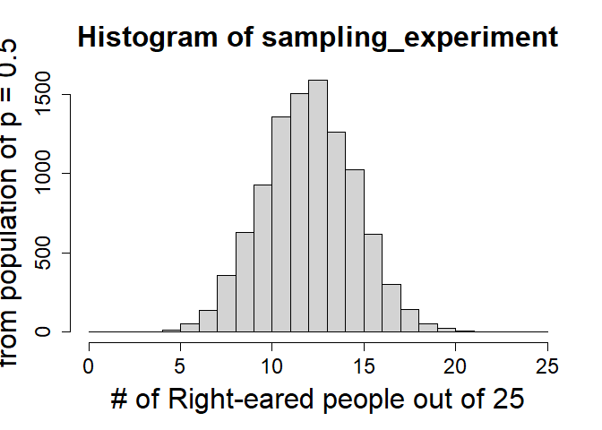

Before doing this, review the **Introduction To Hypothesis Testing Via Binomial Tests** lecture set slides from 
https://sites.google.com/view/biostats/bioenv-2100/hypothesis-testing-with-the-binomial-distribution and
the  **3_hypothesis_testing_and_binomial.R** script in the lecture_files folder of the
[CUNY-BioStats github repository](https://github.com/jsgosnell/CUNY-BioStats).


Remember you should

* add code chunks by clicking the *Insert Chunk* button on the toolbar or by
pressing *Ctrl+Alt+I* to answer the questions!
* **knit** your file to produce a markdown version that you can see!
* save your work often 
  * **commit** it via git!
  * **push** updates to github

## Hypothesis Testing and the Binomial Distribution

1. Are people eared (do they prefer one ear or another)?  Of 25 people observed 
while in conversation in a nightclub, 19 turned their right ear to the speaker 
and 6 turn their left ear to the speaker.  How strong is the evidence for 
eared-ness given this data (adapted from Analysis of Biological Data)?
* state a null and alternative hypothesis
  + *H~o~:  proportion of right-eared people is equal to .5*
  + *H~a~: proportion of right-eared people is note equal to .5*

* calculate a test statistic (signal) for this data

```r
19/25 #sample proportion
```

```
## [1] 0.76
```
*The signal from the data is the proportion of right-eared people  0.76*

* Make you understand how to construct a null distribution
  + using sampling/simulation (code or written explanation)

```r
sampling_experiment = rbinom(10000, 25, .5)
hist(sampling_experiment, breaks = 0:25, xlab = "# of Right-eared people out of 25", ylab = "Probability of being drawn \n from population of p = 0.5", cex.main = 2, cex.axis = 1.5, cex.lab = 2)
```

<!-- -->
  
  + by using an appropriate distribution (code or written explanation)

```r
using_distribution = dbinom(0:25,25,.5)
using_distribution
```

```
##  [1] 2.980232e-08 7.450581e-07 8.940697e-06 6.854534e-05 3.769994e-04
##  [6] 1.583397e-03 5.277991e-03 1.432598e-02 3.223345e-02 6.088540e-02
## [11] 9.741664e-02 1.328409e-01 1.549810e-01 1.549810e-01 1.328409e-01
## [16] 9.741664e-02 6.088540e-02 3.223345e-02 1.432598e-02 5.277991e-03
## [21] 1.583397e-03 3.769994e-04 6.854534e-05 8.940697e-06 7.450581e-07
## [26] 2.980232e-08
```

```r
sum(using_distribution)
```

```
## [1] 1
```

```r
Number_righteared = c(0:25)
pdf = data.frame(Number_righteared, using_distribution)
plot(0:25, using_distribution)
```

<!-- -->

*Each of these show the expected distribution of signal under the null hypothesis.
Note this implies multiple samples are taken.  This is theory that underlies NHST
(null hypothesis significance testing) and definition of p-value (coming up!).*
  
* Calculate and compare p-values obtained using 
  + simulation (calculation won’t be required on test, but make sure you understand!) (code or written explanation)

```r
length(sampling_experiment[sampling_experiment >= 19 | sampling_experiment <= 6])/length(sampling_experiment)
```

```
## [1] 0.014
```
  
  + equations for binomial distribution (code or written explanation)

```r
(1-pbinom(18,25,.5)) * 2
```

```
## [1] 0.0146333
```
  
  + R functions (required)(code)

```r
binom.test(19,25, p=.5)
```

```
## 
## 	Exact binomial test
## 
## data:  19 and 25
## number of successes = 19, number of trials = 25, p-value = 0.01463
## alternative hypothesis: true probability of success is not equal to 0.5
## 95 percent confidence interval:
##  0.5487120 0.9064356
## sample estimates:
## probability of success 
##                   0.76
```
*Note we can calculate a p-value using the simulated distribution, the actual
distribution (which is exact in this case), and the test (which is usign the 
actual distribution!).*

* Calculate a 95% confidence interval for the proportion of people who are right-eared


```r
library(binom)
```

```
## Warning: package 'binom' was built under R version 4.1.2
```

```r
binom.confint(x=19, n=25, alpha=.05, method="all") #use Agresti-coull 
```

```
##           method  x  n mean     lower     upper
## 1  agresti-coull 19 25 0.76 0.5624805 0.8882596
## 2     asymptotic 19 25 0.76 0.5925865 0.9274135
## 3          bayes 19 25 0.75 0.5854415 0.9037771
## 4        cloglog 19 25 0.76 0.5420481 0.8842776
## 5          exact 19 25 0.76 0.5487120 0.9064356
## 6          logit 19 25 0.76 0.5584422 0.8880044
## 7         probit 19 25 0.76 0.5666202 0.8934027
## 8        profile 19 25 0.76 0.5724026 0.8967715
## 9            lrt 19 25 0.76 0.5724301 0.8968455
## 10     prop.test 19 25 0.76 0.5447916 0.8984194
## 11        wilson 19 25 0.76 0.5657032 0.8850369
```

```r
#or
binom.confint(x=19, n=25, alpha=.05, method="agresti-coull")
```

```
##          method  x  n mean     lower     upper
## 1 agresti-coull 19 25 0.76 0.5624805 0.8882596
```
*Our 95% CI is .562 - .888.  Note it does not include .5!*

* How do your 95% confidence interval and hypothesis test compare?

*The p-value from all methods are <.05, so I reject the null hypothesis that the proportion of right-eared people is equal to .5. The 95% 5% CI is .562 - .888.  Note it does not include .5!*

2.  A professor lets his dog take every multiple-choice test to see how it 
compares to his students (I know someone who did this).  Unfortunately, the
professor believes undergraduates in the class tricked him by helping the dog 
do better on a test. It’s a 100 question test, and every questions has 4 answer 
choices.  For the last test, the dog picked 33 questions correctly.  How likely
is this to happen, and is there evidence the students helped the dog?	

MAKE SURE TO THINK ABOUT YOUR TEST OPTIONS 


```r
#use sided test as you only care if students helped the dog
binom.test(33,100, alternative="greater", p=.25)
```

```
## 
## 	Exact binomial test
## 
## data:  33 and 100
## number of successes = 33, number of trials = 100, p-value = 0.0446
## alternative hypothesis: true probability of success is greater than 0.25
## 95 percent confidence interval:
##  0.2523035 1.0000000
## sample estimates:
## probability of success 
##                   0.33
```
*I chose to use a sided test since the professor wants to know if the students helped the dog.  
I found a p-value of .04, so I reject the null hypothesis that the proportion 
of correct answers is .25 (what I would expect by chance).*
