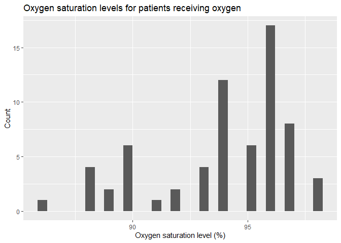

# Medical applications of oxygen

A study was done to determine if oxygen was being appropriately supplied to patients
in a medical unit (Barrett et al 2020). They surveyed 636 patients in mutiple wards and
found 66 were using oxygen.  Oxygen saturation levels were measured for each patient
using oxygen.  Create a properly-labeled plot that  shows saturation levels using ggplot2.

## Create data - not in student quiz!

Not part of student answer but shown here! Note I know theres a better way to do
this but just made here for ease. Paper provided aggregated data.


```r
oxygen_use <- data.frame (Oxygen_saturation_level = c(rep(86,1), rep(88,4), rep(89,2),
rep(90,6), rep(91,1), rep(92,2), rep(93,4), rep(94, 12), rep(95,6), rep(96,17),
rep(97,8), rep(98,3)))
write.csv(oxygen_use, "oxygen_use.csv", row.names = F)
```

Data can be loaded using 


```r
oxygen_use <- read.csv("https://docs.google.com/spreadsheets/d/e/2PACX-1vSC8ft2LReouozG9fDK0Pa-QXESZ82qzADTCCBr_LoQeVRlRDLS4KOhMNYjGnGZFTrq5hkuYcOk6cKm/pub?gid=1295231330&single=true&output=csv",
                       stringsAsFactors = T)
```


```r
library(ggplot2)
ggplot(oxygen_use, aes(x = Oxygen_saturation_level)) +
  geom_histogram() +
  ggtitle ("Oxygen saturation levels for patients receiving oxygen") +
  ylab("Count")+
  xlab("Oxygen saturation level (%)")
```

```
## `stat_bin()` using `bins = 30`. Pick better value with `binwidth`.
```

<!-- -->

