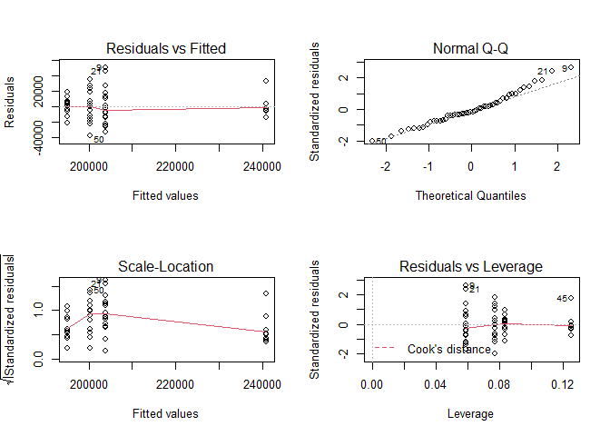

## Making the data (not in student version)

From:  
* https://covid.cdc.gov/covid-data-tracker/#vaccinations_vacc-people-onedose-pop-5yr
* https://www2.census.gov/geo/pdfs/maps-data/maps/reference/us_regdiv.pdf


```r
regions <- read.csv("https://docs.google.com/spreadsheets/d/e/2PACX-1vSHjDv2eSCOtuux9E6JIoEx2F4cOyU6jX6mXUr_FQDtTjpQxroh-IP_3D1z_qcSDr-9lQRQG_CRMZXY/pub?gid=0&single=true&output=csv",
                    stringsAsFactors = T)
rates <- read.csv("https://docs.google.com/spreadsheets/d/e/2PACX-1vT6WmtWdZSUo--2i2nMCWUIMx6BjdJJHKH42oJBzdIZFlAxLH1XztcMI8na-4QKU8ySMHf2-41JwR1y/pub?gid=418071752&single=true&output=csv",
                   stringsAsFactors =T)
```
merge


```r
names(rates)[names(rates) == "State.Territory.Federal.Entity"] = "State"
covid_regions <- merge(rates, regions, all.x = F, all.y = T)
covid_regions <- covid_regions[,c("State", "Doses.Delivered.per.100K", "Region", "Division")]
write.csv(covid_regions, "covid_regions.csv", row.names = F)
```

## Quiz version

COVID-19 vaccines are a key part of the country's response to the pandemic, but 
they only work if people take them. The CDC keeps detailed records of dosages, 
which I combined with the US Census Bureau's data on regions. Data from:  
* https://covid.cdc.gov/covid-data-tracker/#vaccinations_vacc-people-onedose-pop-5yr
* https://www2.census.gov/geo/pdfs/maps-data/maps/reference/us_regdiv.pdf

Use the data (combined version provided below) to determine if vaccination rates 
differ by region.


```r
vaccine <- read.csv("https://docs.google.com/spreadsheets/d/e/2PACX-1vQsI2fpJSpI4pEgvUba3xfafpubrdWj3BaoCigWr4K0eUOGdwWgPygu2-Y6kwqZ-Abi92t4xFDsjbIY/pub?gid=200028780&single=true&output=csv",
                             stringsAsFactors = T)
```
Investigate the question. Make sure you include

* null hypothesis
  * H~0~: there is no difference among regions in vaccination rates
* alternative hypothesis
  * H~A~: there is a difference among regions in vaccination rates
* explanation for test you will use 
  * I will use an ANOVA as we are considering continuous data from differnet groups.
  I will also check assumptions
* results from statistical test

```r
vaccine_lm <- lm(Doses.Delivered.per.100K~Region, vaccine)
par(mfrow=c(2,2))
plot(vaccine_lm)
```

<!-- -->

```r
summary(vaccine_lm)
```

```
## 
## Call:
## lm(formula = Doses.Delivered.per.100K ~ Region, data = vaccine)
## 
## Residuals:
##    Min     1Q Median     3Q    Max 
## -37892 -13299  -3259   9334  50044 
## 
## Coefficients:
##                 Estimate Std. Error t value Pr(>|t|)    
## (Intercept)       194998       5681  34.322  < 2e-16 ***
## RegionNortheast    45906       8983   5.110 6.07e-06 ***
## RegionSouth         8774       7420   1.182    0.243    
## RegionWest          5256       7879   0.667    0.508    
## ---
## Signif. codes:  0 '***' 0.001 '**' 0.01 '*' 0.05 '.' 0.1 ' ' 1
## 
## Residual standard error: 19680 on 46 degrees of freedom
## Multiple R-squared:  0.3961,	Adjusted R-squared:  0.3568 
## F-statistic: 10.06 on 3 and 46 DF,  p-value: 3.266e-05
```

```r
library(car)
```

```
## Warning: package 'car' was built under R version 4.1.3
```

```
## Loading required package: carData
```

```
## Warning: package 'carData' was built under R version 4.1.3
```

```r
Anova(vaccine_lm, type="III")
```

```
## Anova Table (Type III tests)
## 
## Response: Doses.Delivered.per.100K
##                 Sum Sq Df  F value    Pr(>F)    
## (Intercept) 4.5629e+11  1 1178.002 < 2.2e-16 ***
## Region      1.1689e+10  3   10.059 3.266e-05 ***
## Residuals   1.7818e+10 46                       
## ---
## Signif. codes:  0 '***' 0.001 '**' 0.01 '*' 0.05 '.' 0.1 ' ' 1
```
I noted a significant difference among regions, so I carried out post-hoc 
tests.


```r
library(multcomp)
```

```
## Loading required package: mvtnorm
```

```
## Loading required package: survival
```

```
## Loading required package: TH.data
```

```
## Loading required package: MASS
```

```
## 
## Attaching package: 'TH.data'
```

```
## The following object is masked from 'package:MASS':
## 
##     geyser
```

```r
region_compare <-   glht(vaccine_lm, linfct = mcp(Region = "Tukey"))
summary(region_compare)
```

```
## 
## 	 Simultaneous Tests for General Linear Hypotheses
## 
## Multiple Comparisons of Means: Tukey Contrasts
## 
## 
## Fit: lm(formula = Doses.Delivered.per.100K ~ Region, data = vaccine)
## 
## Linear Hypotheses:
##                          Estimate Std. Error t value Pr(>|t|)    
## Northeast - Midwest == 0    45906       8983   5.110  < 1e-04 ***
## South - Midwest == 0         8774       7420   1.182 0.638962    
## West - Midwest == 0          5256       7879   0.667 0.908233    
## South - Northeast == 0     -37132       8438  -4.400 0.000340 ***
## West - Northeast == 0      -40650       8844  -4.596 0.000166 ***
## West - South == 0           -3518       7251  -0.485 0.961705    
## ---
## Signif. codes:  0 '***' 0.001 '**' 0.01 '*' 0.05 '.' 0.1 ' ' 1
## (Adjusted p values reported -- single-step method)
```

* clear explanation of how results relate to your stated hypotheses
  * There is a difference among regions (F~3,46~=10.059, p <.01).  Posthoc tests
  using the Tukey method to control for FWER indicated the following areas differ
  at the $a = 0.05$ level:
    * NE- MW
    * S - NE
    * W- NE

