Three morphotypes of salamanders were tested to see if they had similar tail lengths.  The authors collected tail length (in mm) in the three morphotypes. They also noted the stage (juvenile vs adult) of each individual. Data is available @


```r
sallies <- read.csv("https://docs.google.com/spreadsheets/d/e/2PACX-1vSJHbPnebpKq58mE4kQWF9mQ_0ak2sTyaUbEvtmgoSkb31DprOmAS9clOoNNHD_3tHITOXKdhMbWfBf/pub?gid=1050993814&single=true&output=csv", stringsAsFactors = T)
```

Analyze the data correctly to consider how stage and morphotype impact heart 
rate . Make sure you include

* null hypothesis
  * H~0~: there is no difference among morphotypes in tail length
  * H~0~: there is no difference among stages in tail length
  * H~0~: there is no interaction among morphotype and stage on tail length
* alternative hypothesis
  * H~A~: there is a difference among morphotypes in tail length
  * H~A~: there is a difference among stages in tail length
  * H~A~: there is an interaction among morphotype and stage on tail length
* explanation for test you will use
  * Since tail length is a continous variable and morphotype and stage 
  are both categorical explanatory variables, I will plan to use a linear model (2 way ANOVA). However, I will check assumptions to ensure this is
  appropriate.
  

```r
sallies$morphotype <- as.factor(sallies$morphotype)
sallies$stage <- relevel(sallies$stage, "juvenile")
sallies_lm_int <- lm(tail_length~stage*morphotype, sallies)
plot(sallies_lm_int)
```

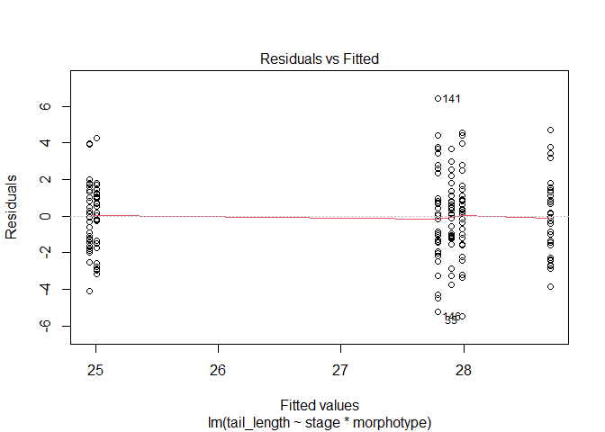<!-- -->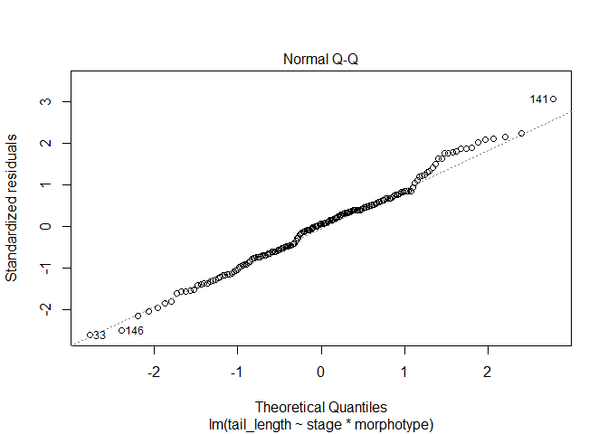<!-- -->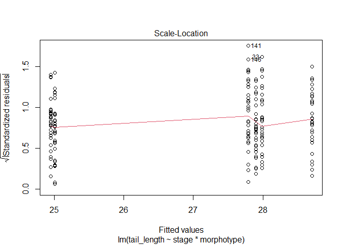<!-- -->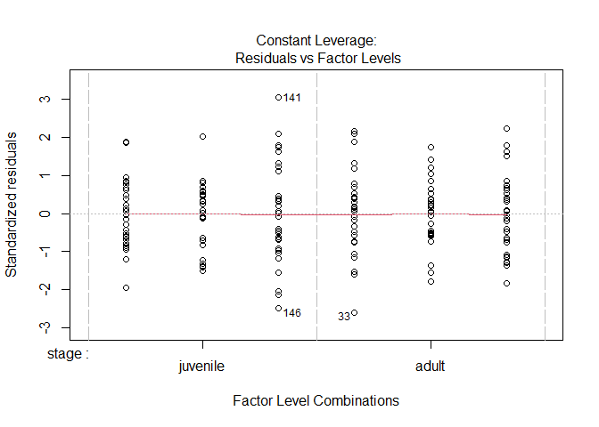<!-- -->

```r
summary(sallies_lm_int)
```

```
## 
## Call:
## lm(formula = tail_length ~ stage * morphotype, data = sallies)
## 
## Residuals:
##     Min      1Q  Median      3Q     Max 
## -5.4797 -1.4355  0.1299  1.2196  6.4341 
## 
## Coefficients:
##                        Estimate Std. Error t value Pr(>|t|)    
## (Intercept)            24.94720    0.39014  63.943  < 2e-16 ***
## stageadult              3.03944    0.55175   5.509 1.28e-07 ***
## morphotype2             0.05958    0.55175   0.108  0.91413    
## morphotype3             2.84066    0.55175   5.148 7.05e-07 ***
## stageadult:morphotype2 -0.14793    0.78029  -0.190  0.84986    
## stageadult:morphotype3 -2.12359    0.78029  -2.722  0.00716 ** 
## ---
## Signif. codes:  0 '***' 0.001 '**' 0.01 '*' 0.05 '.' 0.1 ' ' 1
## 
## Residual standard error: 2.137 on 174 degrees of freedom
## Multiple R-squared:  0.3372,	Adjusted R-squared:  0.3181 
## F-statistic:  17.7 on 5 and 174 DF,  p-value: 3.657e-14
```

```r
library(car)
```

```
## Warning: package 'car' was built under R version 4.1.3
```

```
## Loading required package: carData
```

```
## Warning: package 'carData' was built under R version 4.1.3
```

```r
Anova(sallies_lm_int, type = "III")
```

```
## Anova Table (Type III tests)
## 
## Response: tail_length
##                   Sum Sq  Df   F value    Pr(>F)    
## (Intercept)      18670.9   1 4088.7656 < 2.2e-16 ***
## stage              138.6   1   30.3464 1.282e-07 ***
## morphotype         158.1   2   17.3083 1.395e-07 ***
## stage:morphotype    42.2   2    4.6178   0.01112 *  
## Residuals          794.6 174                        
## ---
## Signif. codes:  0 '***' 0.001 '**' 0.01 '*' 0.05 '.' 0.1 ' ' 1
```

* results from statistical test
    * Graphs show assumptions appear to be met.  Since the interaction is 
    significant (F~174,2~=4.62, p = 0.01) I analyzed both data sets 
    individually.
    

```r
sallies_lm_1 <- lm(tail_length~stage, sallies[sallies$morphotype == "1",])
plot(sallies_lm_1)
```

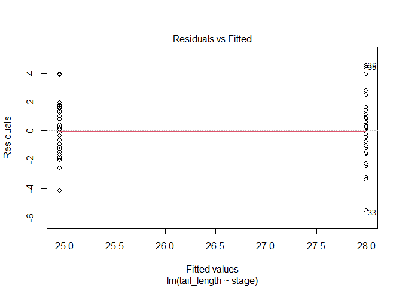<!-- -->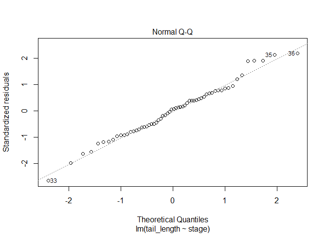<!-- -->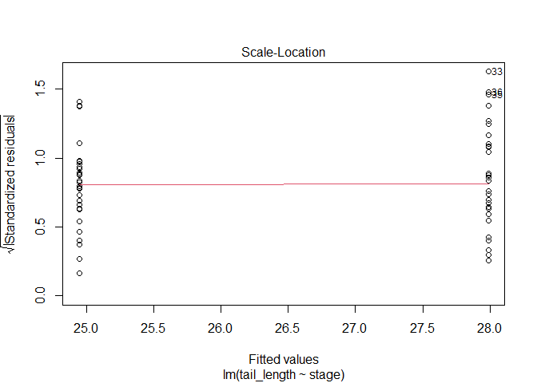<!-- -->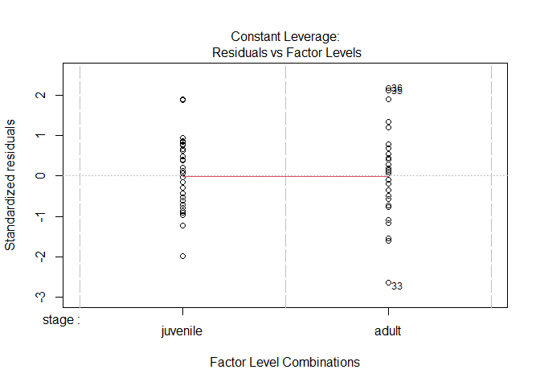<!-- -->

```r
summary(sallies_lm_1)
```

```
## 
## Call:
## lm(formula = tail_length ~ stage, data = sallies[sallies$morphotype == 
##     "1", ])
## 
## Residuals:
##     Min      1Q  Median      3Q     Max 
## -5.4797 -1.4679  0.1443  1.3404  4.5344 
## 
## Coefficients:
##             Estimate Std. Error t value Pr(>|t|)    
## (Intercept)  24.9472     0.3846  64.872  < 2e-16 ***
## stageadult    3.0394     0.5438   5.589 6.42e-07 ***
## ---
## Signif. codes:  0 '***' 0.001 '**' 0.01 '*' 0.05 '.' 0.1 ' ' 1
## 
## Residual standard error: 2.106 on 58 degrees of freedom
## Multiple R-squared:   0.35,	Adjusted R-squared:  0.3388 
## F-statistic: 31.23 on 1 and 58 DF,  p-value: 6.423e-07
```

```r
Anova(sallies_lm_1, type = "III")
```

```
## Anova Table (Type III tests)
## 
## Response: tail_length
##              Sum Sq Df  F value    Pr(>F)    
## (Intercept) 18670.9  1 4208.402 < 2.2e-16 ***
## stage         138.6  1   31.234 6.423e-07 ***
## Residuals     257.3 58                       
## ---
## Signif. codes:  0 '***' 0.001 '**' 0.01 '*' 0.05 '.' 0.1 ' ' 1
```

```r
sallies_lm_2 <- lm(tail_length~stage, sallies[sallies$morphotype == "2",])
plot(sallies_lm_2)
```

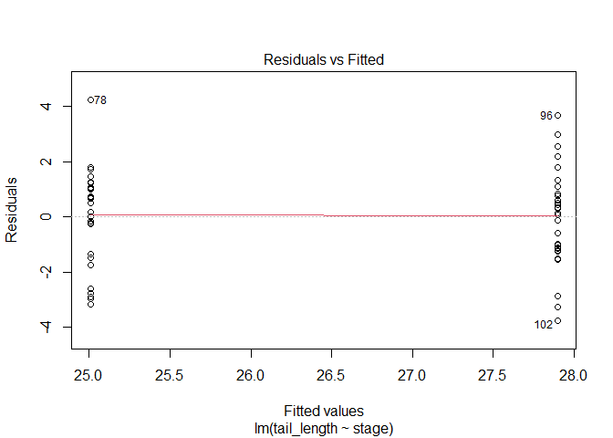<!-- -->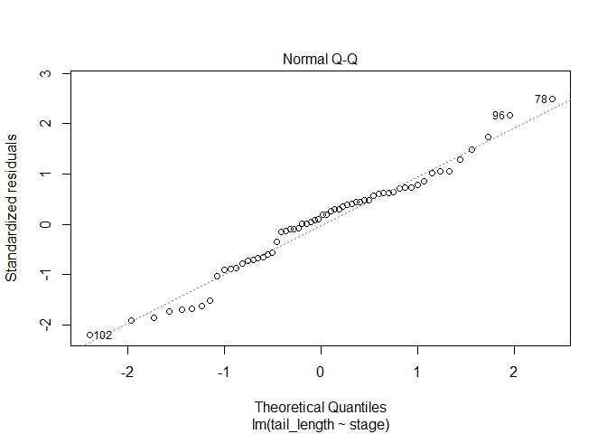<!-- -->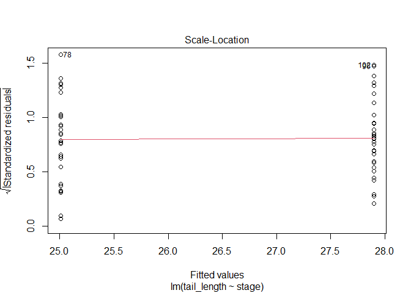<!-- -->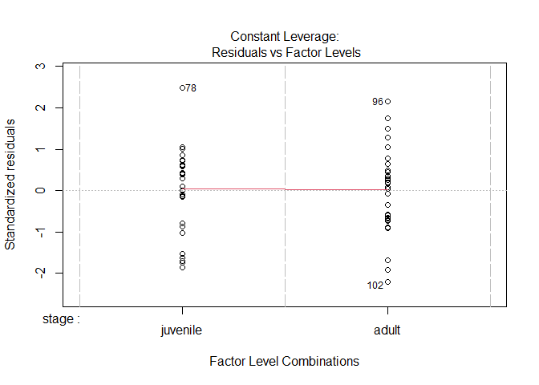<!-- -->

```r
summary(sallies_lm_2)
```

```
## 
## Call:
## lm(formula = tail_length ~ stage, data = sallies[sallies$morphotype == 
##     "2", ])
## 
## Residuals:
##     Min      1Q  Median      3Q     Max 
## -3.7650 -1.1758  0.2455  1.0577  4.2443 
## 
## Coefficients:
##             Estimate Std. Error t value Pr(>|t|)    
## (Intercept)  25.0068     0.3167  78.958  < 2e-16 ***
## stageadult    2.8915     0.4479   6.456 2.39e-08 ***
## ---
## Signif. codes:  0 '***' 0.001 '**' 0.01 '*' 0.05 '.' 0.1 ' ' 1
## 
## Residual standard error: 1.735 on 58 degrees of freedom
## Multiple R-squared:  0.4181,	Adjusted R-squared:  0.4081 
## F-statistic: 41.68 on 1 and 58 DF,  p-value: 2.39e-08
```

```r
Anova(sallies_lm_2, type = "III")
```

```
## Anova Table (Type III tests)
## 
## Response: tail_length
##              Sum Sq Df  F value    Pr(>F)    
## (Intercept) 18760.2  1 6234.327 < 2.2e-16 ***
## stage         125.4  1   41.677  2.39e-08 ***
## Residuals     174.5 58                       
## ---
## Signif. codes:  0 '***' 0.001 '**' 0.01 '*' 0.05 '.' 0.1 ' ' 1
```

```r
sallies_lm_3 <- lm(tail_length~stage, sallies[sallies$morphotype == "3",])
plot(sallies_lm_3)
```

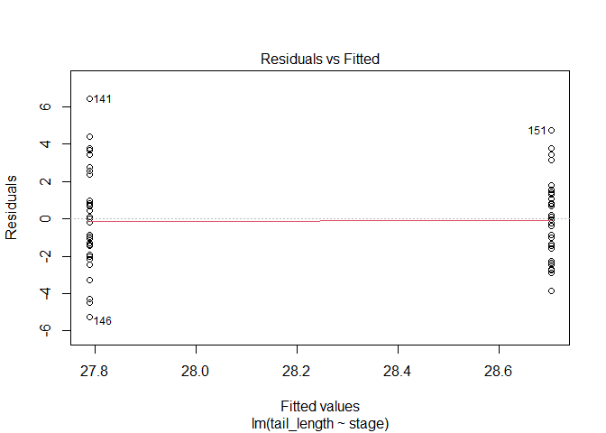<!-- -->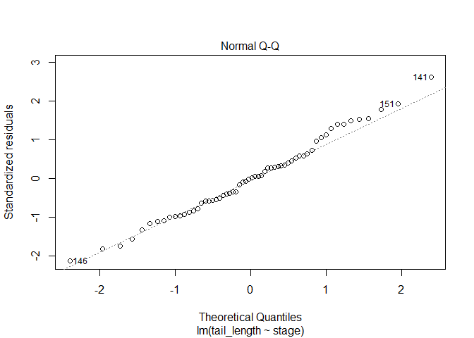<!-- -->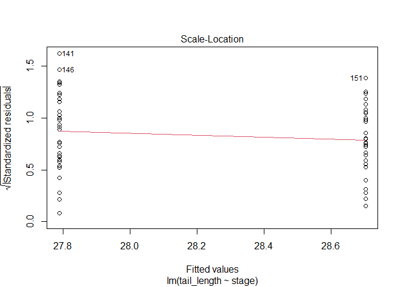<!-- -->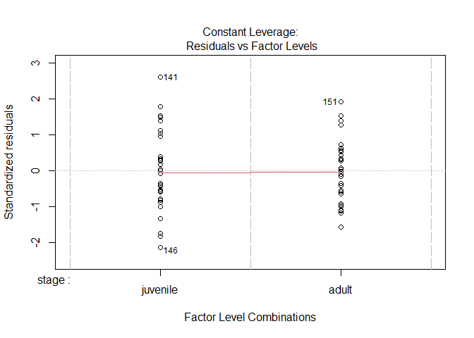<!-- -->

```r
summary(sallies_lm_3)
```

```
## 
## Call:
## lm(formula = tail_length ~ stage, data = sallies[sallies$morphotype == 
##     "3", ])
## 
## Residuals:
##     Min      1Q  Median      3Q     Max 
## -5.2575 -1.6781 -0.0194  1.4043  6.4341 
## 
## Coefficients:
##             Estimate Std. Error t value Pr(>|t|)    
## (Intercept)  27.7879     0.4566  60.864   <2e-16 ***
## stageadult    0.9159     0.6457   1.418    0.161    
## ---
## Signif. codes:  0 '***' 0.001 '**' 0.01 '*' 0.05 '.' 0.1 ' ' 1
## 
## Residual standard error: 2.501 on 58 degrees of freedom
## Multiple R-squared:  0.03353,	Adjusted R-squared:  0.01686 
## F-statistic: 2.012 on 1 and 58 DF,  p-value: 0.1614
```

```r
Anova(sallies_lm_3, type = "III")
```

```
## Anova Table (Type III tests)
## 
## Response: tail_length
##              Sum Sq Df  F value Pr(>F)    
## (Intercept) 23165.0  1 3704.371 <2e-16 ***
## stage          12.6  1    2.012 0.1614    
## Residuals     362.7 58                    
## ---
## Signif. codes:  0 '***' 0.001 '**' 0.01 '*' 0.05 '.' 0.1 ' ' 1
```
    
Tail length appear to differ among stage for morphotypes 1 (F~1,58~=31.23,
p <.001) and 2 (F~1,58~=41.23,
p <.001) with adults having larger tails.  However, tail length does not 
differ by stage for morphotype 3 (F~1,58~=0.916,
p =.161)).
* clear explanation of how results relate to your stated hypotheses
Findings indicate we should reject the null hyothesis of no interactiong among stage and morphotype on tail length.  The impact of stage differs by morphotype.
* a properly-labelled plot of the data. There are many options here, but
make sure you show trends and patterns that match your analysis.


```r
library(Rmisc)
```

```
## Loading required package: lattice
```

```
## Loading required package: plyr
```

```r
sallies_summary <- summarySE(sallies, measurevar="tail_length", groupvars =
                               c("morphotype", "stage"), na.rm = T)
library(ggplot2)
ggplot(sallies_summary, aes(x=morphotype, y=tail_length, color=stage, 
                                   shape = stage)) +
  geom_point(size = 3) +
  geom_line(aes(group=stage, linetype =stage), size=2) +
  geom_errorbar(aes(ymin=tail_length-ci, ymax=tail_length+ci), size=1.5) +
  ylab("Tail Length")+ 
  xlab("Morphotype") + 
  scale_shape_discrete(guide=FALSE)+
  scale_linetype_discrete(guide=FALSE)+
  ggtitle("Tail length across stages of various morphotypes")+
  theme(axis.title.x = element_text(face="bold", size=28), 
        axis.title.y = element_text(face="bold", size=28), 
        axis.text.y  = element_text(size=20),
        axis.text.x  = element_text(size=20), 
        legend.text =element_text(size=20),
        legend.title = element_text(size=20, face="bold"),
        plot.title = element_text(hjust = 0.5, face="bold", size=32))
```

```
## Warning: It is deprecated to specify `guide = FALSE` to remove a guide. Please use `guide = "none"` instead.
## It is deprecated to specify `guide = FALSE` to remove a guide. Please use `guide = "none"` instead.
```

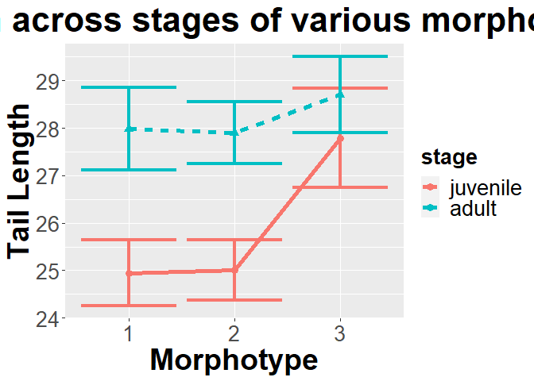<!-- -->

```r
ggplot(sallies_summary, aes(x=stage, y=tail_length, color=morphotype, 
                                   shape = morphotype)) +
  geom_point(size = 3) +
  geom_line(aes(group=morphotype, linetype =morphotype), size=2) +
  geom_errorbar(aes(ymin=tail_length-ci, ymax=tail_length+ci), size=1.5) +
  ylab("Tail Length")+ 
  xlab("stage") + 
  scale_shape_discrete(guide=FALSE)+
  scale_linetype_discrete(guide=FALSE)+
  ggtitle("Tail length across stages of various morphotypes")+
  theme(axis.title.x = element_text(face="bold", size=28), 
        axis.title.y = element_text(face="bold", size=28), 
        axis.text.y  = element_text(size=20),
        axis.text.x  = element_text(size=20), 
        legend.text =element_text(size=20),
        legend.title = element_text(size=20, face="bold"),
        plot.title = element_text(hjust = 0.5, face="bold", size=32))
```

```
## Warning: It is deprecated to specify `guide = FALSE` to remove a guide. Please use `guide = "none"` instead.
## It is deprecated to specify `guide = FALSE` to remove a guide. Please use `guide = "none"` instead.
```

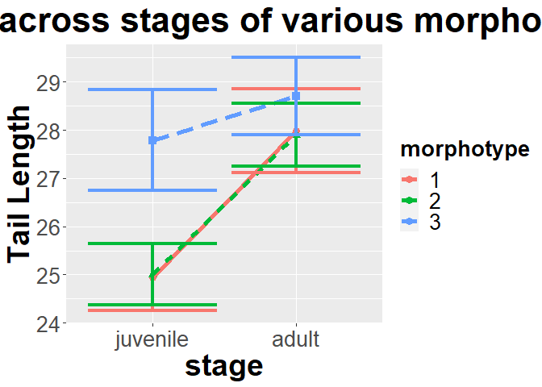<!-- -->


