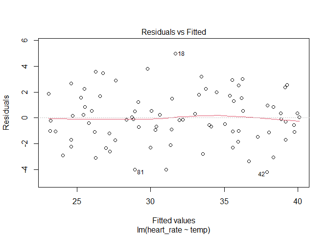
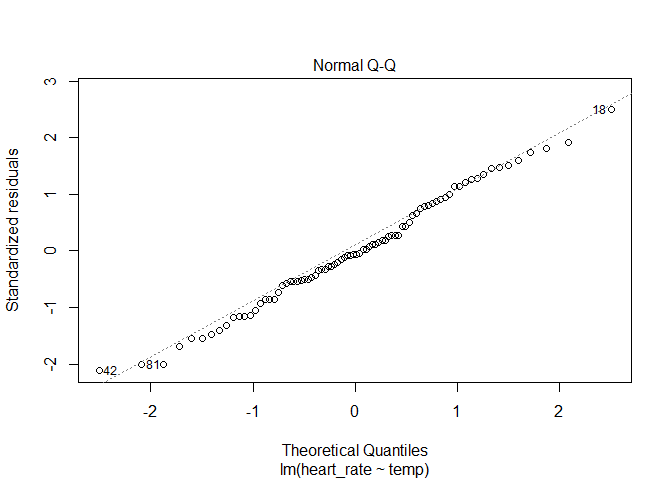
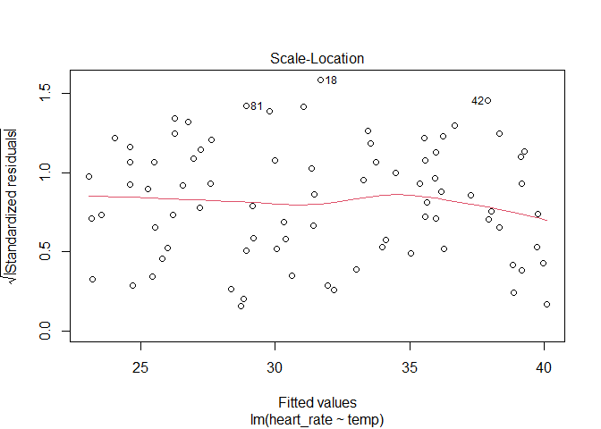
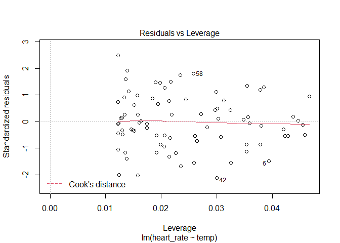
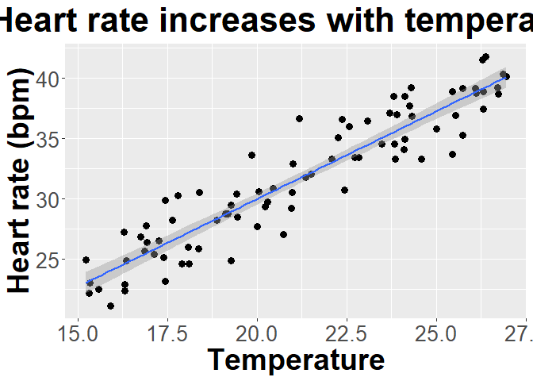

The salamander scientists continued their work.  In another study, the authors
determined the impact of temperature on heart rate. Data is available @


```r
temperature <- read.csv("https://docs.google.com/spreadsheets/d/e/2PACX-1vRhcbtbwuBje-9I7abkP2EXWuddGVo5VH1N2CgNtR8NMj-sjS-9KXjrJuZY9an9Gt4c-JbdCwwP9S0B/pub?gid=1230482827&single=true&output=csv", stringsAsFactors = T)
```

Analyze the data correctly. Make sure you include

* null hypothesis
  * H~0~: there is no relationship between heart rate and tempeature.
* alternative hypothesis
  * H~A~: there is a relationship between heart rate and tempeature.
* explanation for test you will use
    * Since heart rate is a continuous variable and temperature is a 
    continuous explanatory variable, I will plan to use a linear model (regression). However, I will check assumptions to ensure this is
  appropriate.
* results from statistical test


```r
relationship <- lm(heart_rate ~ temp, temperature)
plot(relationship)
```

<!-- --><!-- --><!-- --><!-- -->

```r
summary(relationship)
```

```
## 
## Call:
## lm(formula = heart_rate ~ temp, data = temperature)
## 
## Residuals:
##     Min      1Q  Median      3Q     Max 
## -4.1950 -1.1184 -0.1257  1.5317  4.9934 
## 
## Coefficients:
##             Estimate Std. Error t value Pr(>|t|)    
## (Intercept)   0.8767     1.3504   0.649    0.518    
## temp          1.4554     0.0629  23.139   <2e-16 ***
## ---
## Signif. codes:  0 '***' 0.001 '**' 0.01 '*' 0.05 '.' 0.1 ' ' 1
## 
## Residual standard error: 2.012 on 80 degrees of freedom
## Multiple R-squared:   0.87,	Adjusted R-squared:  0.8684 
## F-statistic: 535.4 on 1 and 80 DF,  p-value: < 2.2e-16
```

```r
library(car)
```

```
## Warning: package 'car' was built under R version 4.1.3
```

```
## Loading required package: carData
```

```
## Warning: package 'carData' was built under R version 4.1.3
```

```r
Anova(relationship)
```

```
## Anova Table (Type II tests)
## 
## Response: heart_rate
##            Sum Sq Df F value    Pr(>F)    
## temp      2167.84  1  535.42 < 2.2e-16 ***
## Residuals  323.91 80                      
## ---
## Signif. codes:  0 '***' 0.001 '**' 0.01 '*' 0.05 '.' 0.1 ' ' 1
```

  * Assumptions appear to be met.  I found temperature has a significant
  (F~1,80~=535, p<.001) impact on heart rate, with heart rate increasing 
  with temperature. Tempeature explains 86% of variation in heart rate.
* clear explanation of how results relate to your stated hypotheses
    * Since p<.05, I reject the null hypothesis.

* a properly-labelled plot of the data. There are many options here, but
make sure you show trends and patterns that match your analysis.


```r
library(ggplot2)
ggplot(relationship, aes(x=temp, y=heart_rate)) +
  geom_point(size = 3) +
  geom_smooth(method = "lm") +
  ylab("Heart rate (bpm)")+ggtitle("Heart rate increases with temperature")+
  xlab("Temperature")+
  theme(axis.title.x = element_text(face="bold", size=28), 
        axis.title.y = element_text(face="bold", size=28), 
        axis.text.y  = element_text(size=20),
        axis.text.x  = element_text(size=20), 
        legend.text =element_text(size=20),
        legend.title = element_text(size=20, face="bold"),
        plot.title = element_text(hjust = 0.5, face="bold", size=32))
```

```
## `geom_smooth()` using formula 'y ~ x'
```

<!-- -->
