Function to help check packages. will see if package in installed, install if not,
and load. input must be in quotes. only works for one at a time.


```r
local({r <- getOption("repos")
       r["CRAN"] <- "http://cran.r-project.org" 
       options(repos=r)
})

checkPackage <- function(x){
  if (x %in% row.names(installed.packages()) == F)install.packages(x)
  library(x, character.only = T)
}
```

## Multivariate  model fitting

### MANOVA 

* https://rstudio-pubs-static.s3.amazonaws.com/142692_508137b868e84f239064e90ff1960da6.html
* http://mason.gmu.edu/~alaemmer/bio314/manova
* https://homepages.inf.ed.ac.uk/bwebb/statistics/MANOVA2.pdf

Let's use the iris dataset to explain MANOVA.Load the dataset.


```r
head(iris)
```

```
##   Sepal.Length Sepal.Width Petal.Length Petal.Width Species
## 1          5.1         3.5          1.4         0.2  setosa
## 2          4.9         3.0          1.4         0.2  setosa
## 3          4.7         3.2          1.3         0.2  setosa
## 4          4.6         3.1          1.5         0.2  setosa
## 5          5.0         3.6          1.4         0.2  setosa
## 6          5.4         3.9          1.7         0.4  setosa
```

```r
dim(iris)
```

```
## [1] 150   5
```

```r
str(iris)
```

```
## 'data.frame':	150 obs. of  5 variables:
##  $ Sepal.Length: num  5.1 4.9 4.7 4.6 5 5.4 4.6 5 4.4 4.9 ...
##  $ Sepal.Width : num  3.5 3 3.2 3.1 3.6 3.9 3.4 3.4 2.9 3.1 ...
##  $ Petal.Length: num  1.4 1.4 1.3 1.5 1.4 1.7 1.4 1.5 1.4 1.5 ...
##  $ Petal.Width : num  0.2 0.2 0.2 0.2 0.2 0.4 0.3 0.2 0.2 0.1 ...
##  $ Species     : Factor w/ 3 levels "setosa","versicolor",..: 1 1 1 1 1 1 1 1 1 1 ...
```

Plot the different outcomes they measured


```r
library(ggplot2)
library(reshape)
irisshow <- melt(iris,id=c("Species"))
ggplot(irisshow,aes(x=variable,y=value,fill=Species))+
  geom_boxplot()
```

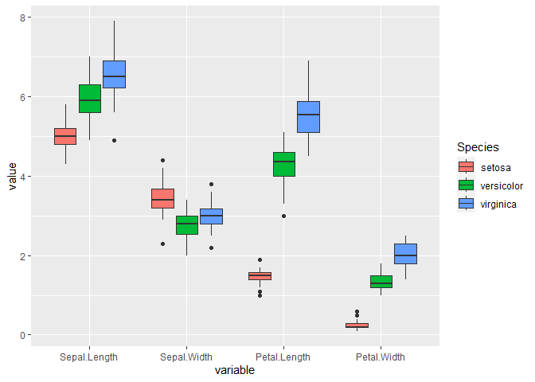<!-- -->

Since we measured multiple responses, we could do ANOVA's but multiple tests and 
correlated.  Note variance-covariance matrix


```r
var(iris[,1:4])
```

```
##              Sepal.Length Sepal.Width Petal.Length Petal.Width
## Sepal.Length    0.6856935  -0.0424340    1.2743154   0.5162707
## Sepal.Width    -0.0424340   0.1899794   -0.3296564  -0.1216394
## Petal.Length    1.2743154  -0.3296564    3.1162779   1.2956094
## Petal.Width     0.5162707  -0.1216394    1.2956094   0.5810063
```

```r
cor(iris[,1:4])
```

```
##              Sepal.Length Sepal.Width Petal.Length Petal.Width
## Sepal.Length    1.0000000  -0.1175698    0.8717538   0.8179411
## Sepal.Width    -0.1175698   1.0000000   -0.4284401  -0.3661259
## Petal.Length    0.8717538  -0.4284401    1.0000000   0.9628654
## Petal.Width     0.8179411  -0.3661259    0.9628654   1.0000000
```


Multiple options exist for tests. 


```r
m <- manova(cbind(Sepal.Length,Sepal.Width,Petal.Length,Petal.Width)~Species,
            data=iris)
summary(m)
```

```
##            Df Pillai approx F num Df den Df    Pr(>F)    
## Species     2 1.1919   53.466      8    290 < 2.2e-16 ***
## Residuals 147                                            
## ---
## Signif. codes:  0 '***' 0.001 '**' 0.01 '*' 0.05 '.' 0.1 ' ' 1
```

Follow up can mean doing several one way ANOVAs


```r
summary.aov(m) 
```

```
##  Response Sepal.Length :
##              Df Sum Sq Mean Sq F value    Pr(>F)    
## Species       2 63.212  31.606  119.26 < 2.2e-16 ***
## Residuals   147 38.956   0.265                      
## ---
## Signif. codes:  0 '***' 0.001 '**' 0.01 '*' 0.05 '.' 0.1 ' ' 1
## 
##  Response Sepal.Width :
##              Df Sum Sq Mean Sq F value    Pr(>F)    
## Species       2 11.345  5.6725   49.16 < 2.2e-16 ***
## Residuals   147 16.962  0.1154                      
## ---
## Signif. codes:  0 '***' 0.001 '**' 0.01 '*' 0.05 '.' 0.1 ' ' 1
## 
##  Response Petal.Length :
##              Df Sum Sq Mean Sq F value    Pr(>F)    
## Species       2 437.10 218.551  1180.2 < 2.2e-16 ***
## Residuals   147  27.22   0.185                      
## ---
## Signif. codes:  0 '***' 0.001 '**' 0.01 '*' 0.05 '.' 0.1 ' ' 1
## 
##  Response Petal.Width :
##              Df Sum Sq Mean Sq F value    Pr(>F)    
## Species       2 80.413  40.207  960.01 < 2.2e-16 ***
## Residuals   147  6.157   0.042                      
## ---
## Signif. codes:  0 '***' 0.001 '**' 0.01 '*' 0.05 '.' 0.1 ' ' 1
```

### PERMANOVA

* https://f-santos.gitlab.io/2020-05-07-npmanova.html
* https://archetypalecology.wordpress.com/2018/02/21/permutational-multivariate-analysis-of-variance-permanova-in-r-preliminary/

if normality assumpions are not met, you can use a permuation-based PERMANOVA. Note
it requires to make diffferent objects for response and explanatory variables, as
vegan package often separates these.


```r
checkPackage("vegan")
```

```
## Warning: package 'vegan' was built under R version 4.2.3
```

```
## Loading required package: permute
```

```
## Warning: package 'permute' was built under R version 4.2.3
```

```
## Loading required package: lattice
```

```
## This is vegan 2.6-4
```

```r
outcomes <- iris[, c("Sepal.Length", "Sepal.Width", "Petal.Length", "Petal.Width")]
p <- adonis2(outcomes~iris$Species)
p
```

```
## Permutation test for adonis under reduced model
## Terms added sequentially (first to last)
## Permutation: free
## Number of permutations: 999
## 
## adonis2(formula = outcomes ~ iris$Species)
##               Df SumOfSqs      R2      F Pr(>F)    
## iris$Species   2  2.31730 0.87876 532.74  0.001 ***
## Residual     147  0.31971 0.12124                  
## Total        149  2.63701 1.00000                  
## ---
## Signif. codes:  0 '***' 0.001 '**' 0.01 '*' 0.05 '.' 0.1 ' ' 1
```

You can carry out pairwise comparison using


```r
checkPackage('devtools')
```

```
## Loading required package: usethis
```

```
## 
## Attaching package: 'devtools'
```

```
## The following object is masked from 'package:permute':
## 
##     check
```

```r
install_github("pmartinezarbizu/pairwiseAdonis/pairwiseAdonis")
```

```
## WARNING: Rtools is required to build R packages, but is not currently installed.
## 
## Please download and install Rtools 4.2 from https://cran.r-project.org/bin/windows/Rtools/ or https://www.r-project.org/nosvn/winutf8/ucrt3/.
```

```
## Skipping install of 'pairwiseAdonis' from a github remote, the SHA1 (cb190f76) has not changed since last install.
##   Use `force = TRUE` to force installation
```

```r
checkPackage("pairwiseAdonis")
```

```
## Loading required package: cluster
```

```r
pairwise.adonis(outcomes, iris$Species, sim.method = "euclidean",
                p.adjust.m = "bonferroni")
```

```
##                     pairs Df SumsOfSqs  F.Model        R2 p.value p.adjusted
## 1    setosa vs versicolor  1  257.3267 551.0039 0.8489994   0.001      0.003
## 2     setosa vs virginica  1  565.1335 943.7992 0.9059320   0.001      0.003
## 3 versicolor vs virginica  1   65.6496  86.7697 0.4696100   0.001      0.003
##   sig
## 1   *
## 2   *
## 3   *
```

### ANOSIM

* https://danstich.github.io/stich/classes/BIOL217/11_multivariate.html 


```r
a <- anosim(vegdist(outcomes), grouping = iris$Species)
summary(a)
```

```
## 
## Call:
## anosim(x = vegdist(outcomes), grouping = iris$Species) 
## Dissimilarity: bray 
## 
## ANOSIM statistic R: 0.8576 
##       Significance: 0.001 
## 
## Permutation: free
## Number of permutations: 999
## 
## Upper quantiles of permutations (null model):
##    90%    95%  97.5%    99% 
## 0.0150 0.0208 0.0288 0.0363 
## 
## Dissimilarity ranks between and within classes:
##            0%    25%    50%     75%    100%    N
## Between    24 5443.5 7425.0 9300.25 11175.0 7500
## setosa      3  939.5 1971.0 3355.00  6085.0 1225
## versicolor  9 1044.0 2219.5 3748.00  6066.5 1225
## virginica   1 1028.5 2226.0 3661.00  6567.5 1225
```

## Ordination

### Polar/Bray-Curtis


```r
data(dune)
#use "extreme" vegan for this historic approach
checkPackage("devtools")
install_github("jarioksa/natto")
```

```
## WARNING: Rtools is required to build R packages, but is not currently installed.
## 
## Please download and install Rtools 4.2 from https://cran.r-project.org/bin/windows/Rtools/ or https://www.r-project.org/nosvn/winutf8/ucrt3/.
```

```
## Skipping install of 'natto' from a github remote, the SHA1 (12eeb0ff) has not changed since last install.
##   Use `force = TRUE` to force installation
```

```r
checkPackage("natto")
```

```
## 
## Attaching package: 'natto'
```

```
## The following object is masked from 'package:vegan':
## 
##     humpfit
```

```r
dis <- dist(dune, method = "binary") ## Jaccard index
ord <- polarord(dis, k = 1)
ord
```

```
## Polar Ordination
## Call: polarord(d = dis, k = 1) 
## 
## Axis endpoints:
##    PO1
## p1   5
## p2  20
## 
## Eigenvalues:
##      PO1 
## 1.517934 
## Total inertia: 4.805178
```

```r
plot(ord)
```

<!-- -->

```r
summary(eigenvals(ord))
```

```
## Importance of components:
##                          PO1
## Eigenvalue            1.5179
## Proportion Explained  0.3159
## Cumulative Proportion 0.3159
```


### PCA

* https://ourcodingclub.github.io/tutorials/ordination/#section1


```r
PCA <- rda(dune, scale = FALSE)
summary(PCA)
```

```
## 
## Call:
## rda(X = dune, scale = FALSE) 
## 
## Partitioning of variance:
##               Inertia Proportion
## Total           84.12          1
## Unconstrained   84.12          1
## 
## Eigenvalues, and their contribution to the variance 
## 
## Importance of components:
##                           PC1     PC2     PC3     PC4    PC5     PC6     PC7
## Eigenvalue            24.7953 18.1466 7.62913 7.15277 5.6950 4.33331 3.19936
## Proportion Explained   0.2947  0.2157 0.09069 0.08503 0.0677 0.05151 0.03803
## Cumulative Proportion  0.2947  0.5105 0.60115 0.68618 0.7539 0.80539 0.84342
##                           PC8    PC9    PC10    PC11    PC12    PC13     PC14
## Eigenvalue            2.78186 2.4820 1.85377 1.74712 1.31358 0.99051 0.637794
## Proportion Explained  0.03307 0.0295 0.02204 0.02077 0.01561 0.01177 0.007582
## Cumulative Proportion 0.87649 0.9060 0.92803 0.94880 0.96441 0.97619 0.983768
##                           PC15     PC16     PC17     PC18     PC19
## Eigenvalue            0.550827 0.350584 0.199556 0.148798 0.115753
## Proportion Explained  0.006548 0.004167 0.002372 0.001769 0.001376
## Cumulative Proportion 0.990316 0.994483 0.996855 0.998624 1.000000
## 
## Scaling 2 for species and site scores
## * Species are scaled proportional to eigenvalues
## * Sites are unscaled: weighted dispersion equal on all dimensions
## * General scaling constant of scores:  6.322924 
## 
## 
## Species scores
## 
##                PC1      PC2       PC3       PC4      PC5       PC6
## Achimill -0.603786  0.12392  0.008464  0.159574  0.40871  0.127857
## Agrostol  1.373953 -0.96401  0.166905  0.266466 -0.08765  0.047368
## Airaprae  0.023415  0.25078 -0.194768 -0.326043  0.05574 -0.079619
## Alopgeni  0.531234 -1.42784 -0.505241 -0.042885 -0.44293  0.278566
## Anthodor -0.559138  0.56761 -0.476205  0.015781  0.34408 -0.135783
## Bellpere -0.333560 -0.18881  0.140638 -0.084177  0.12541  0.134771
## Bromhord -0.523468 -0.19656  0.164222  0.005671  0.38612  0.257634
## Chenalbu  0.017494 -0.05462 -0.055349 -0.010582  0.02664  0.016405
## Cirsarve  0.002398 -0.10237  0.063716 -0.048735 -0.03212 -0.036055
## Comapalu  0.168933  0.10522  0.063625  0.052352  0.13056  0.108129
## Eleopalu  1.278257  0.21782  0.469213  0.667986  0.20877  0.189927
## Elymrepe -0.450692 -0.80310  0.340783 -0.243514  0.25145 -0.691715
## Empenigr  0.014054  0.10956 -0.099378 -0.161788 -0.02289 -0.001195
## Hyporadi -0.014612  0.42079 -0.223096 -0.535685 -0.10309 -0.025185
## Juncarti  0.679423 -0.07604  0.243642  0.310903 -0.08877 -0.248736
## Juncbufo  0.065583 -0.45959 -0.548944 -0.018900 -0.10571 -0.087168
## Lolipere -1.455985 -0.39306  1.013109  0.170493 -0.52430  0.114397
## Planlanc -0.913938  0.55455 -0.244341  0.617631 -0.12494 -0.098047
## Poaprat  -0.899147 -0.55712  0.542805 -0.042467 -0.27815 -0.026353
## Poatriv  -0.756003 -1.56056 -0.480385  0.351099  0.36641  0.044066
## Ranuflam  0.625121  0.06099  0.124760  0.233953  0.13645  0.087328
## Rumeacet -0.582581  0.06663 -0.574256  0.775879 -0.08772 -0.361433
## Sagiproc  0.156823 -0.42388 -0.331722 -0.454322 -0.43262  0.037181
## Salirepe  0.293607  0.45555 -0.023780 -0.196209 -0.20176 -0.097569
## Scorautu -0.453771  0.39268 -0.212281 -0.382424 -0.27635  0.395164
## Trifprat -0.417853  0.16572 -0.234524  0.570030 -0.09646 -0.128045
## Trifrepe -0.581801 -0.02115 -0.167299  0.196535  0.18714  0.928758
## Vicilath -0.106710  0.11571  0.092827 -0.055592 -0.15433  0.129733
## Bracruta  0.148626  0.47690 -0.168758  0.509177 -0.96307  0.029481
## Callcusp  0.538513  0.17963  0.175086  0.238876  0.25531  0.169209
## 
## 
## Site scores (weighted sums of species scores)
## 
##         PC1     PC2     PC3     PC4      PC5      PC6
## 1  -0.85678 -0.1724  2.6079 -1.1296  0.45074 -2.49113
## 2  -1.64477 -1.2299  0.8867 -0.9859  2.03463  1.81057
## 3  -0.44010 -2.3827  0.9297 -0.4601 -1.02783 -0.05183
## 4   0.04795 -2.0463  1.2737 -0.9742 -0.64210 -0.72074
## 5  -1.62445  0.2900 -1.5927  1.5398  1.86008 -2.21191
## 6  -1.97427  1.0802 -1.1501  3.3534 -1.52026  0.03127
## 7  -1.79263  0.3220 -0.2200  1.4714  0.01245 -0.42583
## 8   0.88980 -1.0905  0.9250  0.5165 -1.08897  0.94777
## 9   0.00904 -1.6570 -0.4661 -0.2826 -0.10821 -2.16570
## 10 -1.91463  0.4940  0.7058  0.2676  1.36985  2.62386
## 11 -1.04110  1.2081  1.4203 -0.9566 -2.71745  1.11200
## 12  1.01822 -1.4598 -3.2509 -0.3247 -1.75331  1.01550
## 13  0.69939 -2.1837 -2.2128 -0.4231  1.06502  0.65585
## 14  1.49047  0.9772  0.5447  0.2733  2.38875  2.47896
## 15  1.88644  1.1261  0.7271  0.7732  0.22113 -0.31750
## 16  2.84848 -0.2081  0.7041  2.1012  0.29311 -0.08124
## 17  0.04666  1.7279 -0.9135 -1.6663  1.80070 -1.55572
## 18 -0.26936  1.7157  0.1648 -0.5770 -2.10498  0.33880
## 19  0.28094  2.1901 -1.9865 -3.2341 -0.45760 -0.02389
## 20  2.34069  1.2991  0.9029  0.7178 -0.07573 -0.96909
```

```r
# Use scale = TRUE if your variables are on different scales (e.g. for abiotic variables).
# Here, all species are measured on the same scale 
# So use scale = FALSE

# Now plot a bar plot of relative eigenvalues. This is the percentage variance explained by each axis
barplot(as.vector(PCA$CA$eig)/sum(PCA$CA$eig)) 
```

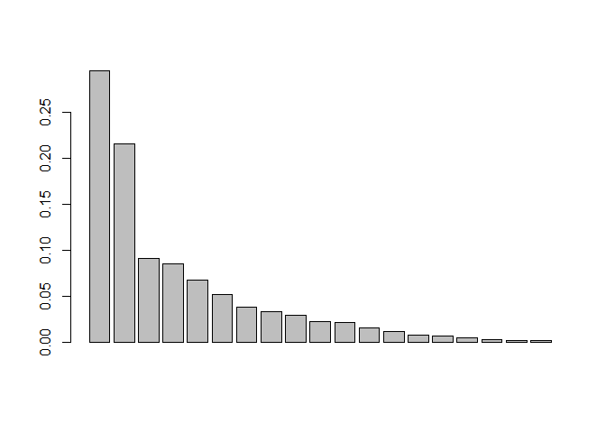<!-- -->

```r
screeplot(PCA)# not corrected
```

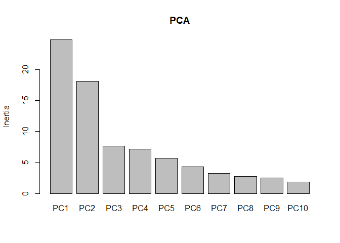<!-- -->

```r
# How much of the variance in our dataset is explained by the first principal component?

# Calculate the percent of variance explained by first two axes
sum((as.vector(PCA$CA$eig)/sum(PCA$CA$eig))[1:2]) # 79%, this is ok.
```

```
## [1] 0.510462
```

```r
# Also try to do it for the first three axes

# Now, we`ll plot our results with the plot function
plot(PCA)
```

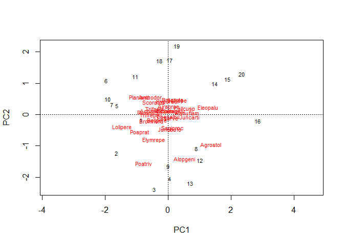<!-- -->

```r
plot(PCA, display = "sites", type = "points")
```

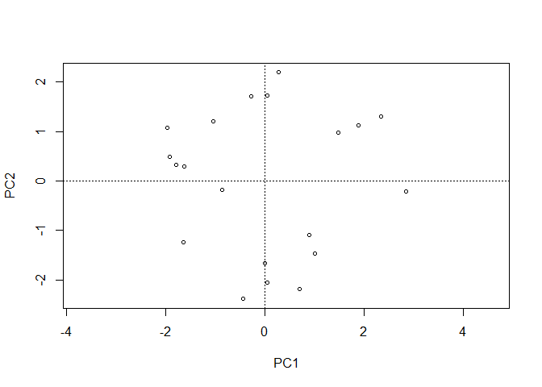<!-- -->

```r
plot(PCA, display = "species", type = "text")
```

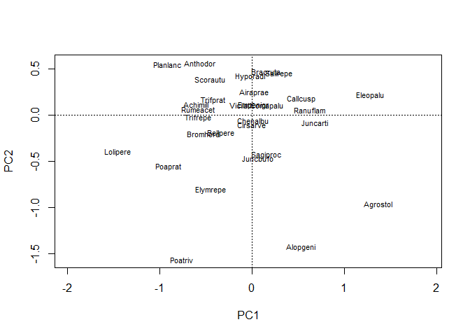<!-- -->

Evaluate outcomes and biplot


```r
#using rda
summary(PCA)
```

```
## 
## Call:
## rda(X = dune, scale = FALSE) 
## 
## Partitioning of variance:
##               Inertia Proportion
## Total           84.12          1
## Unconstrained   84.12          1
## 
## Eigenvalues, and their contribution to the variance 
## 
## Importance of components:
##                           PC1     PC2     PC3     PC4    PC5     PC6     PC7
## Eigenvalue            24.7953 18.1466 7.62913 7.15277 5.6950 4.33331 3.19936
## Proportion Explained   0.2947  0.2157 0.09069 0.08503 0.0677 0.05151 0.03803
## Cumulative Proportion  0.2947  0.5105 0.60115 0.68618 0.7539 0.80539 0.84342
##                           PC8    PC9    PC10    PC11    PC12    PC13     PC14
## Eigenvalue            2.78186 2.4820 1.85377 1.74712 1.31358 0.99051 0.637794
## Proportion Explained  0.03307 0.0295 0.02204 0.02077 0.01561 0.01177 0.007582
## Cumulative Proportion 0.87649 0.9060 0.92803 0.94880 0.96441 0.97619 0.983768
##                           PC15     PC16     PC17     PC18     PC19
## Eigenvalue            0.550827 0.350584 0.199556 0.148798 0.115753
## Proportion Explained  0.006548 0.004167 0.002372 0.001769 0.001376
## Cumulative Proportion 0.990316 0.994483 0.996855 0.998624 1.000000
## 
## Scaling 2 for species and site scores
## * Species are scaled proportional to eigenvalues
## * Sites are unscaled: weighted dispersion equal on all dimensions
## * General scaling constant of scores:  6.322924 
## 
## 
## Species scores
## 
##                PC1      PC2       PC3       PC4      PC5       PC6
## Achimill -0.603786  0.12392  0.008464  0.159574  0.40871  0.127857
## Agrostol  1.373953 -0.96401  0.166905  0.266466 -0.08765  0.047368
## Airaprae  0.023415  0.25078 -0.194768 -0.326043  0.05574 -0.079619
## Alopgeni  0.531234 -1.42784 -0.505241 -0.042885 -0.44293  0.278566
## Anthodor -0.559138  0.56761 -0.476205  0.015781  0.34408 -0.135783
## Bellpere -0.333560 -0.18881  0.140638 -0.084177  0.12541  0.134771
## Bromhord -0.523468 -0.19656  0.164222  0.005671  0.38612  0.257634
## Chenalbu  0.017494 -0.05462 -0.055349 -0.010582  0.02664  0.016405
## Cirsarve  0.002398 -0.10237  0.063716 -0.048735 -0.03212 -0.036055
## Comapalu  0.168933  0.10522  0.063625  0.052352  0.13056  0.108129
## Eleopalu  1.278257  0.21782  0.469213  0.667986  0.20877  0.189927
## Elymrepe -0.450692 -0.80310  0.340783 -0.243514  0.25145 -0.691715
## Empenigr  0.014054  0.10956 -0.099378 -0.161788 -0.02289 -0.001195
## Hyporadi -0.014612  0.42079 -0.223096 -0.535685 -0.10309 -0.025185
## Juncarti  0.679423 -0.07604  0.243642  0.310903 -0.08877 -0.248736
## Juncbufo  0.065583 -0.45959 -0.548944 -0.018900 -0.10571 -0.087168
## Lolipere -1.455985 -0.39306  1.013109  0.170493 -0.52430  0.114397
## Planlanc -0.913938  0.55455 -0.244341  0.617631 -0.12494 -0.098047
## Poaprat  -0.899147 -0.55712  0.542805 -0.042467 -0.27815 -0.026353
## Poatriv  -0.756003 -1.56056 -0.480385  0.351099  0.36641  0.044066
## Ranuflam  0.625121  0.06099  0.124760  0.233953  0.13645  0.087328
## Rumeacet -0.582581  0.06663 -0.574256  0.775879 -0.08772 -0.361433
## Sagiproc  0.156823 -0.42388 -0.331722 -0.454322 -0.43262  0.037181
## Salirepe  0.293607  0.45555 -0.023780 -0.196209 -0.20176 -0.097569
## Scorautu -0.453771  0.39268 -0.212281 -0.382424 -0.27635  0.395164
## Trifprat -0.417853  0.16572 -0.234524  0.570030 -0.09646 -0.128045
## Trifrepe -0.581801 -0.02115 -0.167299  0.196535  0.18714  0.928758
## Vicilath -0.106710  0.11571  0.092827 -0.055592 -0.15433  0.129733
## Bracruta  0.148626  0.47690 -0.168758  0.509177 -0.96307  0.029481
## Callcusp  0.538513  0.17963  0.175086  0.238876  0.25531  0.169209
## 
## 
## Site scores (weighted sums of species scores)
## 
##         PC1     PC2     PC3     PC4      PC5      PC6
## 1  -0.85678 -0.1724  2.6079 -1.1296  0.45074 -2.49113
## 2  -1.64477 -1.2299  0.8867 -0.9859  2.03463  1.81057
## 3  -0.44010 -2.3827  0.9297 -0.4601 -1.02783 -0.05183
## 4   0.04795 -2.0463  1.2737 -0.9742 -0.64210 -0.72074
## 5  -1.62445  0.2900 -1.5927  1.5398  1.86008 -2.21191
## 6  -1.97427  1.0802 -1.1501  3.3534 -1.52026  0.03127
## 7  -1.79263  0.3220 -0.2200  1.4714  0.01245 -0.42583
## 8   0.88980 -1.0905  0.9250  0.5165 -1.08897  0.94777
## 9   0.00904 -1.6570 -0.4661 -0.2826 -0.10821 -2.16570
## 10 -1.91463  0.4940  0.7058  0.2676  1.36985  2.62386
## 11 -1.04110  1.2081  1.4203 -0.9566 -2.71745  1.11200
## 12  1.01822 -1.4598 -3.2509 -0.3247 -1.75331  1.01550
## 13  0.69939 -2.1837 -2.2128 -0.4231  1.06502  0.65585
## 14  1.49047  0.9772  0.5447  0.2733  2.38875  2.47896
## 15  1.88644  1.1261  0.7271  0.7732  0.22113 -0.31750
## 16  2.84848 -0.2081  0.7041  2.1012  0.29311 -0.08124
## 17  0.04666  1.7279 -0.9135 -1.6663  1.80070 -1.55572
## 18 -0.26936  1.7157  0.1648 -0.5770 -2.10498  0.33880
## 19  0.28094  2.1901 -1.9865 -3.2341 -0.45760 -0.02389
## 20  2.34069  1.2991  0.9029  0.7178 -0.07573 -0.96909
```

```r
biplot(PCA, choices = c(1,2), type = c("text", "points"), xlim = c(-5,10), scale=0,
       main= "Correlation biplot (scale = 0)") # biplot of axis 1 vs 2
```

```
## Warning in plot.window(...): "scale" is not a graphical parameter
```

```
## Warning in plot.xy(xy, type, ...): "scale" is not a graphical parameter
```

```
## Warning in axis(side = side, at = at, labels = labels, ...): "scale" is not a
## graphical parameter

## Warning in axis(side = side, at = at, labels = labels, ...): "scale" is not a
## graphical parameter
```

```
## Warning in box(...): "scale" is not a graphical parameter
```

```
## Warning in title(...): "scale" is not a graphical parameter
```

<!-- -->

```r
biplot(PCA, choices = c(1,2), type = c("text", "points"), 
       main = "Distance biplot (scale = 1)", xlim = c(-5,10), scale = 1) # biplot of axis 1 vs 2
```

```
## Warning in plot.window(...): "scale" is not a graphical parameter
```

```
## Warning in plot.xy(xy, type, ...): "scale" is not a graphical parameter
```

```
## Warning in axis(side = side, at = at, labels = labels, ...): "scale" is not a
## graphical parameter

## Warning in axis(side = side, at = at, labels = labels, ...): "scale" is not a
## graphical parameter
```

```
## Warning in box(...): "scale" is not a graphical parameter
```

```
## Warning in title(...): "scale" is not a graphical parameter
```

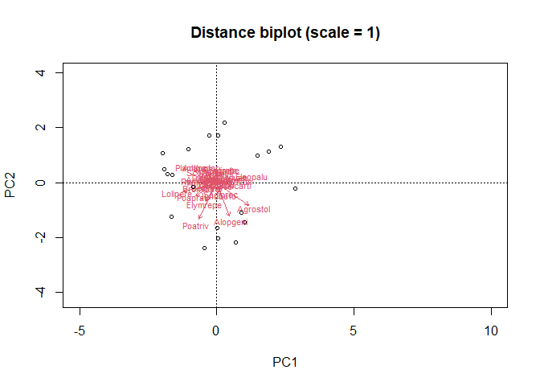<!-- -->

```r
biplot(PCA, choices = c(1,3), type = c("text","points")) # biplot of axis 1 vs 3
```

<!-- -->

```r
# You can extract the species and site scores on the new PC for further analyses:
sitePCA <- PCA$CA$u # Site scores
speciesPCA <- PCA$CA$v # Species scores

# In a biplot of a PCA, species' scores are drawn as arrows 
# that point in the direction of increasing values for that variable
# use prcomp to generate both types
# http://strata.uga.edu/8370/lecturenotes/principalComponents.html
# https://www.r-bloggers.com/2021/11/biplots-are-everywhere-where-do-they-come-from/
PCApc <- prcomp(dune, scale = FALSE)
biplot(PCApc, choices = c(1,2), xlim = c(-5,10), pc.biplot = T,
       main= "Correlation biplot") # biplot of axis 1 vs 2
```

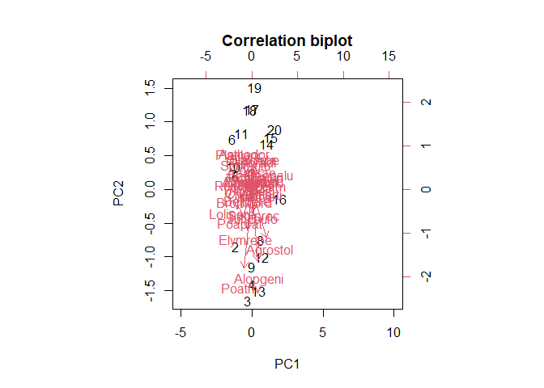<!-- -->

```r
biplot(PCApc, choices = c(1,2), xlim = c(-5,10),
       main= "Distance biplot") # biplot of axis 1 vs 2
```

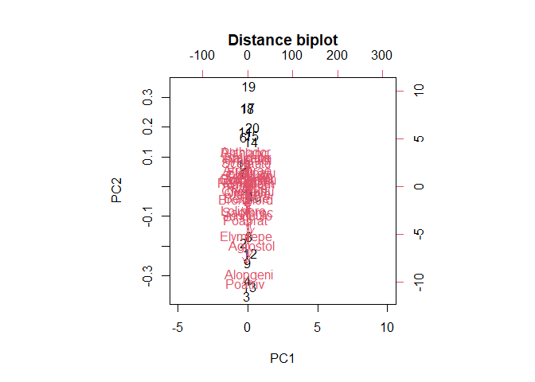<!-- -->

```r
biplot(PCApc, choices = c(1,2), 
       main = "Distance biplot", xlim = c(-5,10),  pc.biplot = T) # biplot of axis 1 vs 2
```

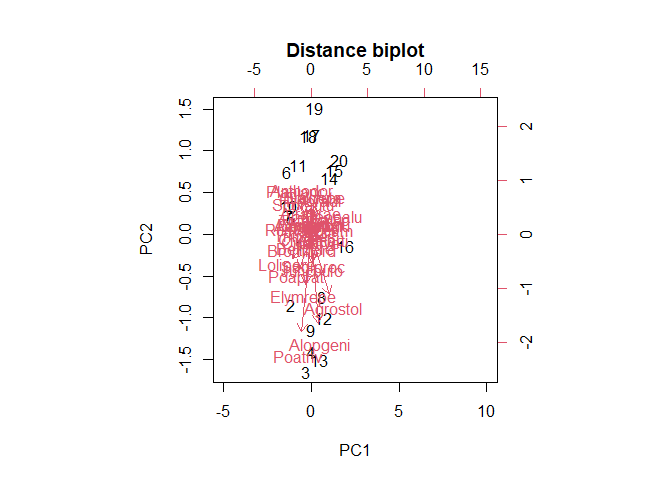<!-- -->

```r
biplot(PCA, choices = c(1,3), type = c("text","points")) # biplot of axis 1 vs 3
```

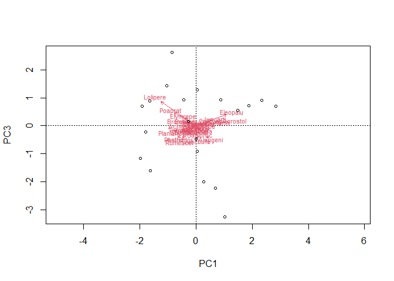<!-- -->

```r
data(dune.env)
dune.env.new <- dune.env
dune.env.new$pc1 <- data.frame(sitePCA)$PC1
dune.env.new$pc2 <- data.frame(sitePCA)$PC2
library(ggplot2)
ggplot(dune.env.new, aes(x=pc1, y=pc2, shape=Use, color=Use))+
  geom_point(size=2)
```

```
## Warning: Using shapes for an ordinal variable is not advised
```

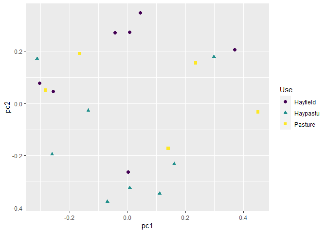<!-- -->

```r
impact <- lm(pc1 ~ Use, dune.env.new)
par(mfrow=c(2,2))
plot(impact)
```

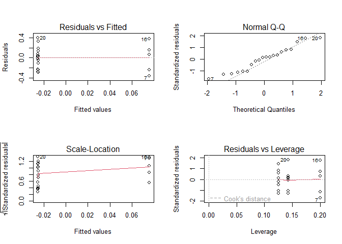<!-- -->

```r
par(mfrow=c(1,1))
library(car)
```

```
## Loading required package: carData
```

```r
Anova(impact, type= "III")
```

```
## Anova Table (Type III tests)
## 
## Response: pc1
##              Sum Sq Df F value Pr(>F)
## (Intercept) 0.00136  1  0.0240 0.8787
## Use         0.03826  2  0.3382 0.7178
## Residuals   0.96174 17
```

```r
library(Rmisc)
```

```
## Loading required package: plyr
```

```
## 
## Attaching package: 'plyr'
```

```
## The following objects are masked from 'package:reshape':
## 
##     rename, round_any
```

```r
impact_summary <- summarySE(dune.env.new, measurevar = "pc1", groupvars = "Use")
ggplot(impact_summary, aes(x=Use, y=pc1, shape=Use, color=Use))+
  geom_point(size=5, stat = "identity", color = "black") +
  geom_errorbar(aes(ymin=pc1-ci, ymax=pc1+ci, colour=Use), size = 1,
                width = 0)
```

```
## Warning: Using `size` aesthetic for lines was deprecated in ggplot2 3.4.0.
## ℹ Please use `linewidth` instead.
## This warning is displayed once every 8 hours.
## Call `lifecycle::last_lifecycle_warnings()` to see where this warning was
## generated.
```

```
## Warning: Using shapes for an ordinal variable is not advised
```

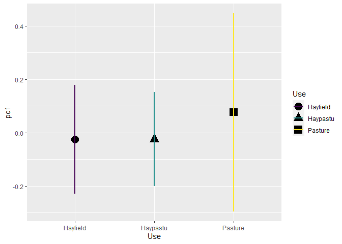<!-- -->
### CCA


```r
cca_dune <- cca(dune)
summary(cca_dune)
```

```
## 
## Call:
## cca(X = dune) 
## 
## Partitioning of scaled Chi-square:
##               Inertia Proportion
## Total           2.115          1
## Unconstrained   2.115          1
## 
## Eigenvalues, and their contribution to the scaled Chi-square 
## 
## Importance of components:
##                          CA1    CA2    CA3     CA4     CA5     CA6     CA7
## Eigenvalue            0.5360 0.4001 0.2598 0.17598 0.14476 0.10791 0.09247
## Proportion Explained  0.2534 0.1892 0.1228 0.08319 0.06844 0.05102 0.04372
## Cumulative Proportion 0.2534 0.4426 0.5654 0.64858 0.71702 0.76804 0.81175
##                           CA8     CA9    CA10    CA11    CA12    CA13     CA14
## Eigenvalue            0.08091 0.07332 0.05630 0.04826 0.04125 0.03523 0.020529
## Proportion Explained  0.03825 0.03466 0.02661 0.02282 0.01950 0.01665 0.009705
## Cumulative Proportion 0.85000 0.88467 0.91128 0.93410 0.95360 0.97025 0.979955
##                           CA15     CA16     CA17     CA18     CA19
## Eigenvalue            0.014911 0.009074 0.007938 0.007002 0.003477
## Proportion Explained  0.007049 0.004290 0.003753 0.003310 0.001644
## Cumulative Proportion 0.987004 0.991293 0.995046 0.998356 1.000000
## 
## Scaling 2 for species and site scores
## * Species are scaled proportional to eigenvalues
## * Sites are unscaled: weighted dispersion equal on all dimensions
## 
## 
## Species scores
## 
##               CA1      CA2      CA3       CA4       CA5      CA6
## Achimill -0.90859  0.08461 -0.58636 -0.008919 -0.660183 -0.18877
## Agrostol  0.93378 -0.20651  0.28165  0.024293 -0.139326 -0.02256
## Airaprae -1.00434  3.06749  1.33773  0.194305 -1.081813 -0.53699
## Alopgeni  0.40088 -0.61839  0.85013  0.346740  0.016509  0.10169
## Anthodor -0.96676  1.08361 -0.17188  0.459788 -0.607533 -0.30425
## Bellpere -0.50018 -0.35503 -0.15239 -0.704153 -0.058546  0.07308
## Bromhord -0.65762 -0.40634 -0.30685 -0.496751 -0.561358  0.07004
## Chenalbu  0.42445 -0.84402  1.59029  1.248755 -0.207480  0.87566
## Cirsarve -0.05647 -0.76398  0.91793 -1.175919 -0.384024 -0.13985
## Comapalu  1.91690  0.52150 -1.18215 -0.021738 -1.359988  1.31207
## Eleopalu  1.76383  0.34562 -0.57336 -0.002976 -0.332396 -0.14688
## Elymrepe -0.37074 -0.74148  0.26238 -0.566308 -0.270122 -0.72624
## Empenigr -0.69027  3.26420  1.95716 -0.176936 -0.073518 -0.16083
## Hyporadi -0.85408  2.52821  1.13951 -0.175115 -0.311874  0.11177
## Juncarti  1.27580  0.09963 -0.09320  0.005536  0.289410 -0.78247
## Juncbufo  0.08157 -0.68074  1.00545  1.078390  0.268360  0.24168
## Lolipere -0.50272 -0.35955 -0.21821 -0.474727  0.101494 -0.01594
## Planlanc -0.84058  0.24886 -0.78066  0.371149  0.271377  0.11989
## Poaprat  -0.38919 -0.32999 -0.02015 -0.358371  0.079296 -0.05165
## Poatriv  -0.18185 -0.53997  0.23388  0.178834 -0.155342 -0.07584
## Ranuflam  1.55886  0.30700 -0.29765  0.046974 -0.008747 -0.14744
## Rumeacet -0.65289 -0.25525 -0.59728  1.160164  0.255849 -0.32730
## Sagiproc  0.00364  0.01719  1.11570  0.066981  0.186654  0.32463
## Salirepe  0.61035  1.54868  0.04970 -0.607136  1.429729 -0.55183
## Scorautu -0.19566  0.38884  0.03975 -0.130392  0.141232  0.23717
## Trifprat -0.88116 -0.09792 -1.18172  1.282429  0.325706 -0.33388
## Trifrepe -0.07666 -0.02032 -0.20594  0.026462 -0.186748  0.53957
## Vicilath -0.61893  0.37140 -0.46057 -1.000375  1.162652  1.44971
## Bracruta  0.18222  0.26477 -0.16606  0.064009  0.576334  0.07741
## Callcusp  1.95199  0.56743 -0.85948 -0.098969 -0.556737  0.23282
## 
## 
## Site scores (weighted averages of species scores)
## 
##         CA1        CA2      CA3      CA4      CA5      CA6
## 1  -0.81167 -1.0826714 -0.14479 -2.10665 -0.39287 -1.83462
## 2  -0.63268 -0.6958357 -0.09708 -1.18695 -0.97686  0.06575
## 3  -0.10148 -0.9128732  0.68815 -0.68137 -0.08709 -0.28678
## 4  -0.05647 -0.7639784  0.91793 -1.17592 -0.38402 -0.13985
## 5  -0.95293 -0.1846015 -0.95609  0.86853 -0.34552 -0.98333
## 6  -0.85633 -0.0005408 -1.39735  1.59909  0.65494 -0.19386
## 7  -0.87149 -0.2547040 -0.86830  0.90468  0.17385 -0.03446
## 8   0.76268 -0.2968459  0.35648 -0.10772  0.17507 -0.36444
## 9   0.09693 -0.7864314  0.86492  0.40090  0.28704 -1.02783
## 10 -0.87885 -0.0353136 -0.82987 -0.68053 -0.75438  0.81070
## 11 -0.64223  0.4440332 -0.17371 -1.09684  1.37462  2.00626
## 12  0.28557 -0.6656161  1.64423  1.71496  0.65381  1.17376
## 13  0.42445 -0.8440195  1.59029  1.24876 -0.20748  0.87566
## 14  1.91996  0.5351062 -1.39863 -0.08575 -2.21317  2.43044
## 15  1.91384  0.5079036 -0.96567  0.04227 -0.50681  0.19370
## 16  2.00229  0.1090627 -0.33414  0.33760 -0.50097 -0.76159
## 17 -1.47545  2.7724102  0.40859  0.75117 -2.59425 -1.10122
## 18 -0.31241  0.6328355 -0.66501 -1.12728  2.65575  0.97565
## 19 -0.69027  3.2642026  1.95716 -0.17694 -0.07352 -0.16083
## 20  1.94438  1.0688809 -0.66595 -0.55317  1.59606 -1.70292
```

```r
plot(cca_dune, type= "t")
```

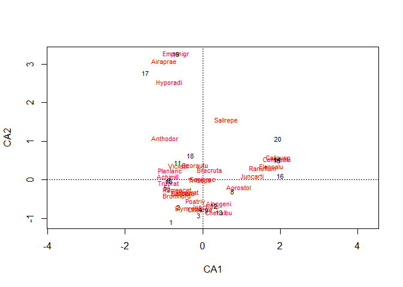<!-- -->


### RDA

* https://dmcglinn.github.io/quant_methods/lessons/multivariate_models.html


```r
rda_dune <- rda(dune~., data=dune.env)
rda_dune
```

```
## Call: rda(formula = dune ~ A1 + Moisture + Management + Use + Manure,
## data = dune.env)
## 
##               Inertia Proportion Rank
## Total         84.1237     1.0000     
## Constrained   63.2062     0.7513   12
## Unconstrained 20.9175     0.2487    7
## Inertia is variance 
## Some constraints or conditions were aliased because they were redundant
## 
## Eigenvalues for constrained axes:
##   RDA1   RDA2   RDA3   RDA4   RDA5   RDA6   RDA7   RDA8   RDA9  RDA10  RDA11 
## 22.396 16.208  7.039  4.038  3.760  2.609  2.167  1.803  1.404  0.917  0.582 
##  RDA12 
##  0.284 
## 
## Eigenvalues for unconstrained axes:
##   PC1   PC2   PC3   PC4   PC5   PC6   PC7 
## 6.627 4.309 3.549 2.546 2.340 0.934 0.612
```

```r
RsquareAdj(rda_dune)
```

```
## $r.squared
## [1] 0.7513483
## 
## $adj.r.squared
## [1] 0.3250882
```

```r
plot(rda_dune, type='n', scaling=1)
orditorp(rda_dune, display='sp', cex=0.5, scaling=1, col='blue')
text(rda_dune, display='cn', col='red')
```

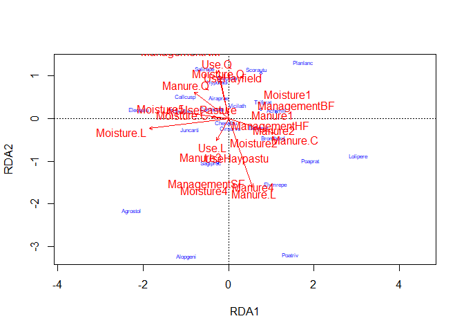<!-- -->

### CCA

* https://dmcglinn.github.io/quant_methods/lessons/multivariate_models.html


```r
cca_dune = cca(dune ~ ., data=dune.env)
cca_dune
```

```
## Call: cca(formula = dune ~ A1 + Moisture + Management + Use + Manure,
## data = dune.env)
## 
##               Inertia Proportion Rank
## Total          2.1153     1.0000     
## Constrained    1.5032     0.7106   12
## Unconstrained  0.6121     0.2894    7
## Inertia is scaled Chi-square 
## Some constraints or conditions were aliased because they were redundant
## 
## Eigenvalues for constrained axes:
##   CCA1   CCA2   CCA3   CCA4   CCA5   CCA6   CCA7   CCA8   CCA9  CCA10  CCA11 
## 0.4671 0.3410 0.1761 0.1532 0.0953 0.0703 0.0589 0.0499 0.0318 0.0260 0.0228 
##  CCA12 
## 0.0108 
## 
## Eigenvalues for unconstrained axes:
##     CA1     CA2     CA3     CA4     CA5     CA6     CA7 
## 0.27237 0.10876 0.08975 0.06305 0.03489 0.02529 0.01798
```

```r
RsquareAdj(cca_dune, 100)
```

```
## $r.squared
## [1] 0.7106267
## 
## $adj.r.squared
## [1] 0.2091022
```

### Hypothesis testing

* https://dmcglinn.github.io/quant_methods/lessons/multivariate_models.html

You can test related hypotheses using permutations


```r
anova(rda_dune, permutations=999)
```

```
## Permutation test for rda under reduced model
## Permutation: free
## Number of permutations: 999
## 
## Model: rda(formula = dune ~ A1 + Moisture + Management + Use + Manure, data = dune.env)
##          Df Variance      F Pr(>F)   
## Model    12   63.206 1.7627  0.008 **
## Residual  7   20.917                 
## ---
## Signif. codes:  0 '***' 0.001 '**' 0.01 '*' 0.05 '.' 0.1 ' ' 1
```

```r
anova(rda_dune, by='margin', permutations=999)
```

```
## Permutation test for rda under reduced model
## Marginal effects of terms
## Permutation: free
## Number of permutations: 999
## 
## Model: rda(formula = dune ~ A1 + Moisture + Management + Use + Manure, data = dune.env)
##            Df Variance      F Pr(>F)
## A1          1   2.3704 0.7933  0.654
## Moisture    3  11.9409 1.3320  0.183
## Management  2   7.1574 1.1976  0.281
## Use         2   4.9785 0.8330  0.659
## Manure      3   9.6257 1.0737  0.403
## Residual    7  20.9175
```

```r
anova(cca_dune, permutations = 999)
```

```
## Permutation test for cca under reduced model
## Permutation: free
## Number of permutations: 999
## 
## Model: cca(formula = dune ~ A1 + Moisture + Management + Use + Manure, data = dune.env)
##          Df ChiSquare      F Pr(>F)  
## Model    12    1.5032 1.4325  0.028 *
## Residual  7    0.6121                
## ---
## Signif. codes:  0 '***' 0.001 '**' 0.01 '*' 0.05 '.' 0.1 ' ' 1
```

```r
anova(cca_dune, by='margin', permutations = 999)
```

```
## Permutation test for cca under reduced model
## Marginal effects of terms
## Permutation: free
## Number of permutations: 999
## 
## Model: cca(formula = dune ~ A1 + Moisture + Management + Use + Manure, data = dune.env)
##            Df ChiSquare      F Pr(>F)
## A1          1   0.11070 1.2660  0.233
## Moisture    3   0.31587 1.2041  0.235
## Management  2   0.15882 0.9081  0.590
## Use         2   0.13010 0.7439  0.776
## Manure      3   0.25490 0.9717  0.532
## Residual    7   0.61210
```

or consider nested models.


```r
rda_dune_use_removed <- update(rda_dune, . ~ . - Use)
anova(rda_dune, rda_dune_use_removed)
```

```
## Permutation tests for rda under reduced model
## Permutation: free
## Number of permutations: 999
## 
## Model 1: dune ~ A1 + Moisture + Management + Use + Manure
## Model 2: dune ~ A1 + Moisture + Management + Manure
##   ResDf ResChiSquare Df ChiSquare     F Pr(>F)
## 1     7       20.918                          
## 2     9       25.896 -2   -4.9785 0.833  0.652
```

### NMDS

* https://peat-clark.github.io/BIO381/veganTutorial.html
* https://danstich.github.io/stich/classes/BIOL217/11_multivariate.html


```r
nmds_dune <- metaMDS(dune, k =2)
```

```
## Run 0 stress 0.1192678 
## Run 1 stress 0.1183186 
## ... New best solution
## ... Procrustes: rmse 0.02026979  max resid 0.06495956 
## Run 2 stress 0.1192678 
## Run 3 stress 0.1809577 
## Run 4 stress 0.1192679 
## Run 5 stress 0.1192678 
## Run 6 stress 0.1183186 
## ... New best solution
## ... Procrustes: rmse 7.057357e-06  max resid 2.249647e-05 
## ... Similar to previous best
## Run 7 stress 0.1192678 
## Run 8 stress 0.1183186 
## ... Procrustes: rmse 5.81422e-06  max resid 2.078633e-05 
## ... Similar to previous best
## Run 9 stress 0.1192678 
## Run 10 stress 0.1183186 
## ... Procrustes: rmse 6.507868e-06  max resid 2.132521e-05 
## ... Similar to previous best
## Run 11 stress 0.1192678 
## Run 12 stress 0.1192678 
## Run 13 stress 0.1192678 
## Run 14 stress 0.1192679 
## Run 15 stress 0.188964 
## Run 16 stress 0.1886532 
## Run 17 stress 0.1192678 
## Run 18 stress 0.1183186 
## ... New best solution
## ... Procrustes: rmse 5.612526e-06  max resid 1.77014e-05 
## ... Similar to previous best
## Run 19 stress 0.1192678 
## Run 20 stress 0.1183186 
## ... Procrustes: rmse 4.78354e-06  max resid 1.485872e-05 
## ... Similar to previous best
## *** Best solution repeated 2 times
```

```r
nmds_dune
```

```
## 
## Call:
## metaMDS(comm = dune, k = 2) 
## 
## global Multidimensional Scaling using monoMDS
## 
## Data:     dune 
## Distance: bray 
## 
## Dimensions: 2 
## Stress:     0.1183186 
## Stress type 1, weak ties
## Best solution was repeated 2 times in 20 tries
## The best solution was from try 18 (random start)
## Scaling: centring, PC rotation, halfchange scaling 
## Species: expanded scores based on 'dune'
```

```r
stressplot(nmds_dune)
```

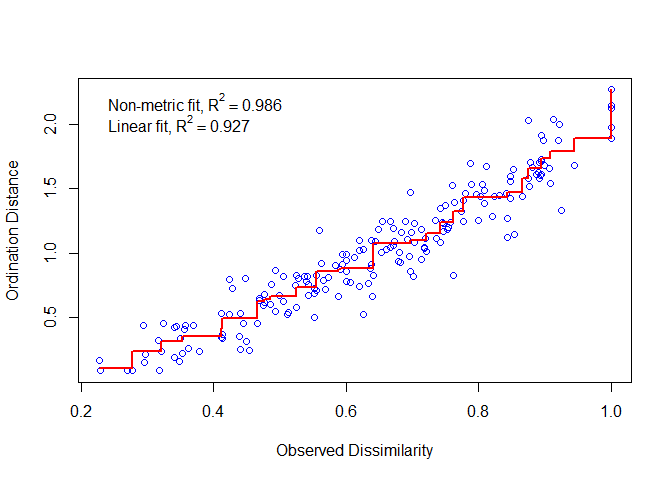<!-- -->

```r
plot(nmds_dune)
```

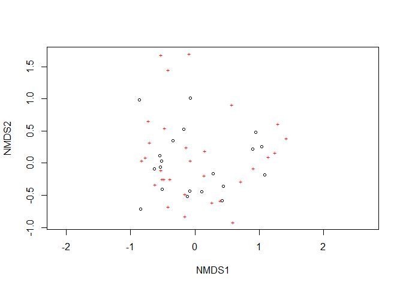<!-- -->

```r
ordiplot(nmds_dune,type="n") #Ordination plot function especially for congested plots
orditorp(nmds_dune,display="species",col="red",air=0.01) #The function adds text or points to ordination plots
orditorp(nmds_dune,display="sites",cex=1.25,air=0.01)
```

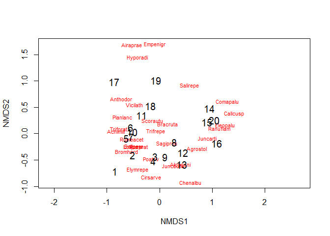<!-- -->

if we had a treatment applied to varous plots, we can consider impact on grouping
graphically.

* https://jonlefcheck.net/2012/10/24/nmds-tutorial-in-r/


```r
ordiplot(nmds_dune,type="n")
ordihull(nmds_dune,groups=dune.env$Use,draw="polygon",col="grey90",label=T)
orditorp(nmds_dune,display="species",col="red",air=0.01)
orditorp(nmds_dune,display="sites",cex=1.25,air=0.01)
```

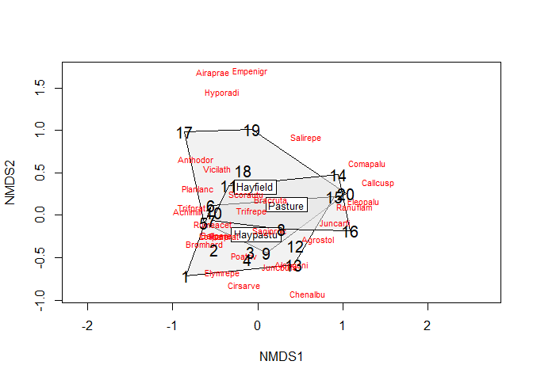<!-- -->

## Classification

### discriminant analysis

* https://www.r-bloggers.com/2018/03/discriminant-analysis-statistics-all-the-way/


```r
library(MASS)
lda_iris <- lda(Species ~ ., iris)
summary(lda_iris)
```

```
##         Length Class  Mode     
## prior    3     -none- numeric  
## counts   3     -none- numeric  
## means   12     -none- numeric  
## scaling  8     -none- numeric  
## lev      3     -none- character
## svd      2     -none- numeric  
## N        1     -none- numeric  
## call     3     -none- call     
## terms    3     terms  call     
## xlevels  0     -none- list
```

```r
Predictions <- predict(lda_iris,iris)
table(Predictions$class, iris$Species)
```

```
##             
##              setosa versicolor virginica
##   setosa         50          0         0
##   versicolor      0         48         1
##   virginica       0          2        49
```

```r
ldahist(data = Predictions$x[,1], g=iris$Species)
```

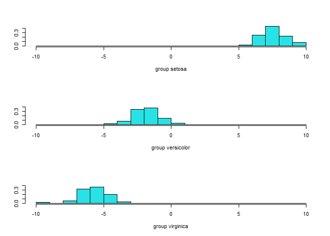<!-- -->

```r
ldahist(data = Predictions$x[,2], g=iris$Species)
```

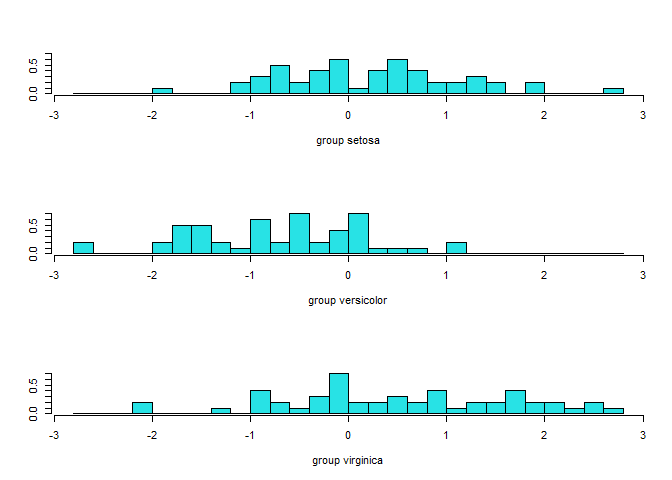<!-- -->

### clustering

Finding optimal number of groups

* https://rpubs.com/AnanyaDu/361293

#### elbow method

* https://rpubs.com/AnanyaDu/361293


```r
#set possible number
k.max = 19
wss<- sapply(1:k.max,function(k){kmeans(iris[,1:4],k,nstart = 20,iter.max = 20)$tot.withinss})
plot(1:k.max,wss, type= "b", xlab = "Number of clusters(k)", ylab = "Within cluster sum of squares")
```

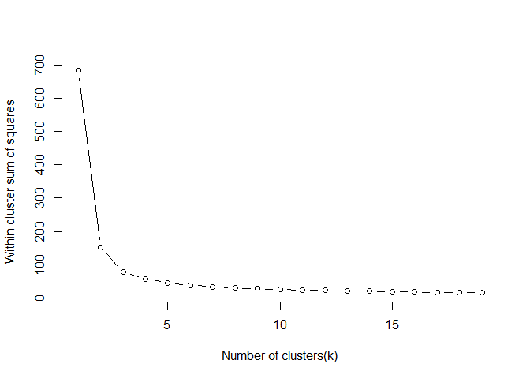<!-- -->

or

* https://uc-r.github.io/kmeans_clustering
* https://rpubs.com/AnanyaDu/361293


```r
library(cluster)    # clustering algorithms
library(factoextra)
```

```
## Warning: package 'factoextra' was built under R version 4.2.3
```

```
## Welcome! Want to learn more? See two factoextra-related books at https://goo.gl/ve3WBa
```

```r
fviz_nbclust(dune, kmeans, method = "wss")
```

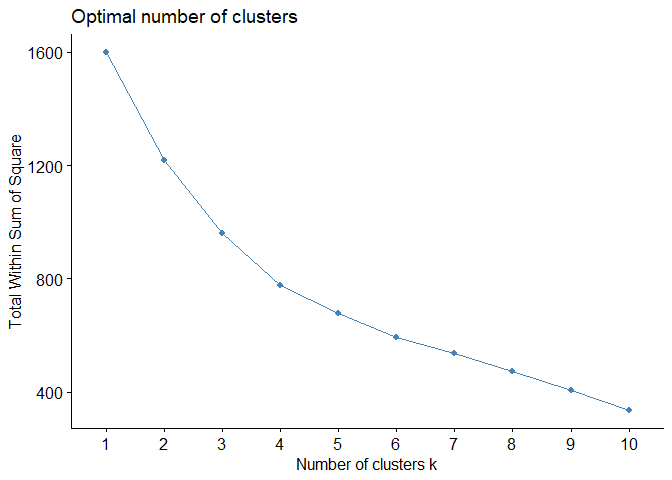<!-- -->

#### silhouette method


```r
fviz_nbclust(dune, kmeans, method = "silhouette")
```

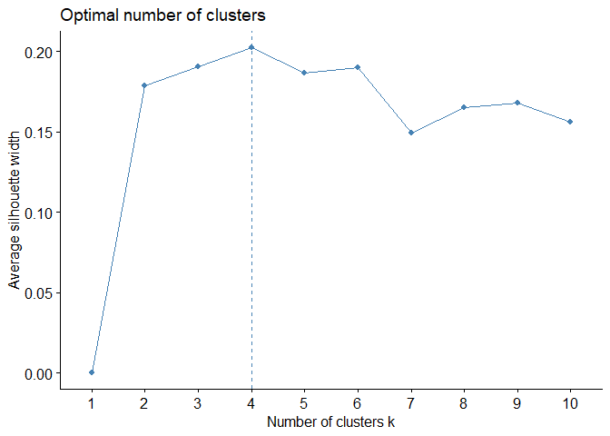<!-- -->

#### gap stat


```r
gap_stat <- clusGap(dune, FUN = kmeans, nstart = 25,
                    K.max = 10, B = 50)
fviz_gap_stat(gap_stat)
```

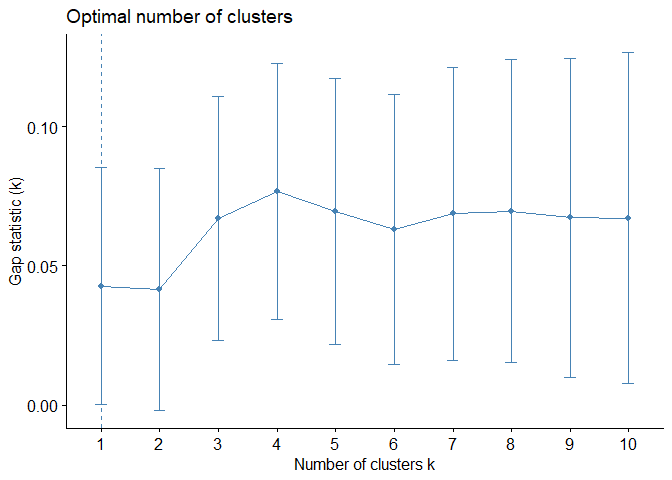<!-- -->

#### fit final model


```r
final <- kmeans(dune, 4, nstart = 25)
print(final)
```

```
## K-means clustering with 4 clusters of sizes 6, 4, 6, 4
## 
## Cluster means:
##   Achimill Agrostol Airaprae  Alopgeni Anthodor  Bellpere Bromhord  Chenalbu
## 1 2.333333 0.000000     0.00 0.3333333 2.166667 1.1666667      2.0 0.0000000
## 2 0.000000 5.000000     0.00 1.0000000 0.000000 0.0000000      0.0 0.0000000
## 3 0.000000 4.666667     0.00 5.0000000 0.000000 0.6666667      0.5 0.1666667
## 4 0.500000 0.000000     1.25 0.0000000 2.000000 0.5000000      0.0 0.0000000
##    Cirsarve Comapalu  Eleopalu Elymrepe Empenigr Hyporadi Juncarti  Juncbufo
## 1 0.0000000        0 0.0000000 2.000000      0.0     0.00 0.000000 0.3333333
## 2 0.0000000        1 5.2500000 0.000000      0.0     0.00 2.500000 0.0000000
## 3 0.3333333        0 0.6666667 2.333333      0.0     0.00 1.333333 1.8333333
## 4 0.0000000        0 0.0000000 0.000000      0.5     2.25 0.000000 0.0000000
##   Lolipere Planlanc  Poaprat  Poatriv  Ranuflam  Rumeacet Sagiproc Salirepe
## 1 5.333333        3 3.500000 4.666667 0.0000000 2.3333333     0.00     0.00
## 2 0.000000        0 0.000000 0.500000 2.5000000 0.0000000     0.00     1.25
## 3 2.833333        0 3.166667 5.500000 0.6666667 0.6666667     2.50     0.00
## 4 2.250000        2 2.000000 0.000000 0.0000000 0.0000000     1.25     1.50
##   Scorautu Trifprat Trifrepe  Vicilath Bracruta Callcusp
## 1 2.833333      1.5 3.333333 0.1666667     2.00      0.0
## 2 1.500000      0.0 1.750000 0.0000000     3.00      2.5
## 3 2.166667      0.0 2.166667 0.0000000     2.00      0.0
## 4 4.500000      0.0 1.750000 0.7500000     3.25      0.0
## 
## Clustering vector:
##  1  2  3  4  5  6  7  8  9 10 11 12 13 14 15 16 17 18 19 20 
##  1  1  3  3  1  1  1  3  3  1  4  3  3  2  2  2  4  4  4  2 
## 
## Within cluster sum of squares by cluster:
## [1] 263.6667 115.2500 254.1667 144.2500
##  (between_SS / total_SS =  51.4 %)
## 
## Available components:
## 
## [1] "cluster"      "centers"      "totss"        "withinss"     "tot.withinss"
## [6] "betweenss"    "size"         "iter"         "ifault"
```

```r
fviz_cluster(final, data = dune)
```

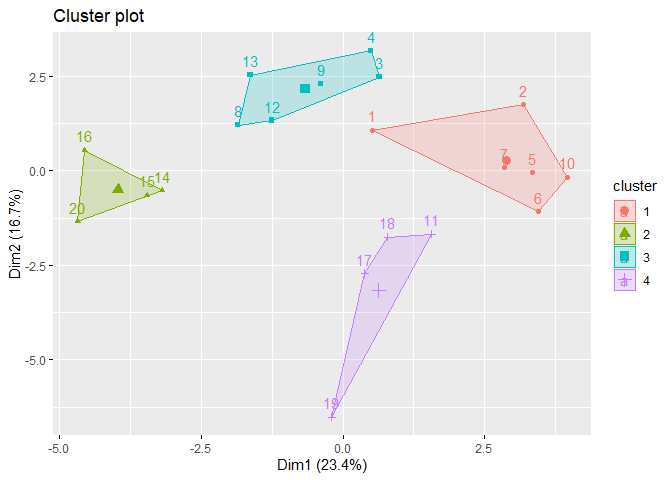<!-- -->

## Tree models 

This needs to be moved to rmd format


```r
#trees are useful way of handling data visually and allow first look
#building the classification tree
#install if necessary
#example with famous iris dataset (built-in)
#good for species classification!
library(rpart)
iris_tree_initial <- rpart(Species ~ ., data = iris, method = "class", 
                           minsplit = 2, minbucket = 1)
plot(iris_tree_initial)
text(iris_tree_initial)
```

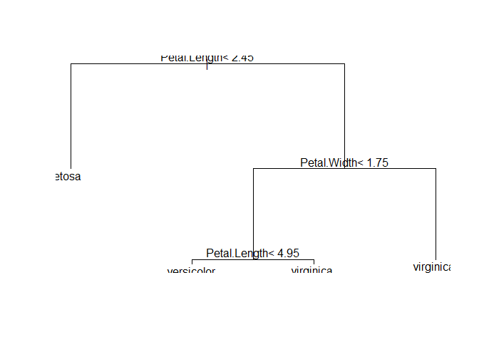<!-- -->

```r
#or for a prettier graph
library(rattle)
```

```
## Warning: package 'rattle' was built under R version 4.2.3
```

```
## Loading required package: tibble
```

```
## Loading required package: bitops
```

```
## Rattle: A free graphical interface for data science with R.
## Version 5.5.1 Copyright (c) 2006-2021 Togaware Pty Ltd.
## Type 'rattle()' to shake, rattle, and roll your data.
```

```r
fancyRpartPlot(iris_tree_initial, main="Iris")
```

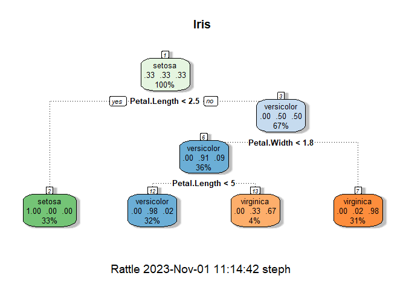<!-- -->

```r
#what if you want fewer splits (less complex model)
#can use defaults for buckets 
iris_tree_initial_auto <- rpart(Species ~ ., data = iris)
fancyRpartPlot(iris_tree_initial_auto, main="Iris")
```

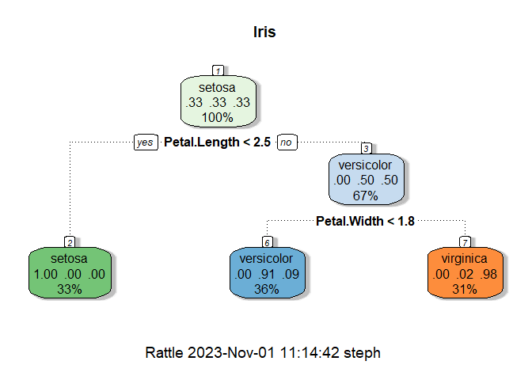<!-- -->

```r
#or minimize complexity parameter (good for larger models)
iris_tree_model_2<- prune(iris_tree_initial, 
                          cp =   iris_tree_initial$cptable[which.min(iris_tree_initial$cptable[,"xerror"]),"CP"])
#is using this to make decisions
iris_tree_initial$cptable
```

```
##     CP nsplit rel error xerror       xstd
## 1 0.50      0      1.00   1.16 0.05127703
## 2 0.44      1      0.50   0.61 0.06016090
## 3 0.02      2      0.06   0.09 0.02908608
## 4 0.01      3      0.04   0.10 0.03055050
```

```r
fancyRpartPlot(iris_tree_model_2)
```

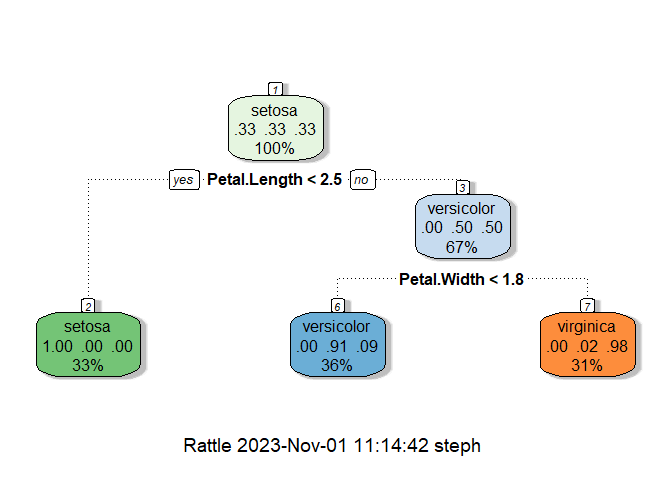<!-- -->

```r
#validation techniques
#UNDER CONSTRUCTION
#need 0/1 column for for prediction
iris$virginica <- iris$Species
levels(iris$virginica)[levels(iris$virginica) == "virginica"]  <- "1"
levels(iris$virginica)[levels(iris$virginica) %in% c("setosa", "versicolor")] <- "0"
iris$virginica <- as.numeric(as.character(iris$virginica))

#compare glm and gam 
library(mgcv)
```

```
## Loading required package: nlme
```

```
## This is mgcv 1.8-41. For overview type 'help("mgcv-package")'.
```

```r
library(MASS)
library(MuMIn)
```

```
## 
## Attaching package: 'MuMIn'
```

```
## The following object is masked from 'package:rattle':
## 
##     importance
```

```r
iris_glm <- glm(virginica ~ . - Species, iris, family = binomial)
```

```
## Warning: glm.fit: fitted probabilities numerically 0 or 1 occurred
```

```r
summary(iris_glm)
```

```
## 
## Call:
## glm(formula = virginica ~ . - Species, family = binomial, data = iris)
## 
## Deviance Residuals: 
##      Min        1Q    Median        3Q       Max  
## -2.01105  -0.00065   0.00000   0.00048   1.78065  
## 
## Coefficients:
##              Estimate Std. Error z value Pr(>|z|)  
## (Intercept)   -42.638     25.708  -1.659   0.0972 .
## Sepal.Length   -2.465      2.394  -1.030   0.3032  
## Sepal.Width    -6.681      4.480  -1.491   0.1359  
## Petal.Length    9.429      4.737   1.990   0.0465 *
## Petal.Width    18.286      9.743   1.877   0.0605 .
## ---
## Signif. codes:  0 '***' 0.001 '**' 0.01 '*' 0.05 '.' 0.1 ' ' 1
## 
## (Dispersion parameter for binomial family taken to be 1)
## 
##     Null deviance: 190.954  on 149  degrees of freedom
## Residual deviance:  11.899  on 145  degrees of freedom
## AIC: 21.899
## 
## Number of Fisher Scoring iterations: 12
```

```r
iris_glm_final <- stepAIC(iris_glm)
```

```
## Start:  AIC=21.9
## virginica ~ (Sepal.Length + Sepal.Width + Petal.Length + Petal.Width + 
##     Species) - Species
```

```
## Warning: glm.fit: fitted probabilities numerically 0 or 1 occurred
```

```
## Warning: glm.fit: fitted probabilities numerically 0 or 1 occurred

## Warning: glm.fit: fitted probabilities numerically 0 or 1 occurred

## Warning: glm.fit: fitted probabilities numerically 0 or 1 occurred
```

```
##                Df Deviance    AIC
## - Sepal.Length  1   13.266 21.266
## <none>              11.899 21.899
## - Sepal.Width   1   15.492 23.492
## - Petal.Width   1   23.772 31.772
## - Petal.Length  1   25.902 33.902
```

```
## Warning: glm.fit: fitted probabilities numerically 0 or 1 occurred
```

```
## 
## Step:  AIC=21.27
## virginica ~ Sepal.Width + Petal.Length + Petal.Width
```

```
## Warning: glm.fit: fitted probabilities numerically 0 or 1 occurred

## Warning: glm.fit: fitted probabilities numerically 0 or 1 occurred
```

```
##                Df Deviance    AIC
## <none>              13.266 21.266
## - Sepal.Width   1   20.564 26.564
## - Petal.Length  1   27.399 33.399
## - Petal.Width   1   31.512 37.512
```

```r
iris_gam <- gam(virginica ~ s(Sepal.Length) + s(Sepal.Width) + 
                  s(Petal.Length) + s(Petal.Width), data = iris)
summary(iris_gam)
```

```
## 
## Family: gaussian 
## Link function: identity 
## 
## Formula:
## virginica ~ s(Sepal.Length) + s(Sepal.Width) + s(Petal.Length) + 
##     s(Petal.Width)
## 
## Parametric coefficients:
##             Estimate Std. Error t value Pr(>|t|)    
## (Intercept)   0.3333     0.0128   26.05   <2e-16 ***
## ---
## Signif. codes:  0 '***' 0.001 '**' 0.01 '*' 0.05 '.' 0.1 ' ' 1
## 
## Approximate significance of smooth terms:
##                   edf Ref.df     F  p-value    
## s(Sepal.Length) 1.000  1.000 4.291   0.0402 *  
## s(Sepal.Width)  2.084  2.655 2.143   0.0857 .  
## s(Petal.Length) 5.840  6.949 7.384 5.11e-07 ***
## s(Petal.Width)  6.438  7.544 9.971  < 2e-16 ***
## ---
## Signif. codes:  0 '***' 0.001 '**' 0.01 '*' 0.05 '.' 0.1 ' ' 1
## 
## R-sq.(adj) =   0.89   Deviance explained = 90.2%
## GCV = 0.027571  Scale est. = 0.024564  n = 150
```

```r
iris_gam_a <-update(iris_gam, . ~ . - s(Petal.Width))
summary(iris_gam_a)
```

```
## 
## Family: gaussian 
## Link function: identity 
## 
## Formula:
## virginica ~ s(Sepal.Length) + s(Sepal.Width) + s(Petal.Length)
## 
## Parametric coefficients:
##             Estimate Std. Error t value Pr(>|t|)    
## (Intercept)  0.33333    0.01513   22.03   <2e-16 ***
## ---
## Signif. codes:  0 '***' 0.001 '**' 0.01 '*' 0.05 '.' 0.1 ' ' 1
## 
## Approximate significance of smooth terms:
##                   edf Ref.df      F p-value    
## s(Sepal.Length) 1.151  1.283 10.200 0.00122 ** 
## s(Sepal.Width)  1.541  1.922  0.493 0.61414    
## s(Petal.Length) 7.941  8.685 48.588 < 2e-16 ***
## ---
## Signif. codes:  0 '***' 0.001 '**' 0.01 '*' 0.05 '.' 0.1 ' ' 1
## 
## R-sq.(adj) =  0.847   Deviance explained = 85.7%
## GCV = 0.037217  Scale est. = 0.034331  n = 150
```

```r
iris_gam_b <-update(iris_gam_a, . ~ . - s(Sepal.Width))
summary(iris_gam_b)
```

```
## 
## Family: gaussian 
## Link function: identity 
## 
## Formula:
## virginica ~ s(Sepal.Length) + s(Petal.Length)
## 
## Parametric coefficients:
##             Estimate Std. Error t value Pr(>|t|)    
## (Intercept)   0.3333     0.0151   22.07   <2e-16 ***
## ---
## Signif. codes:  0 '***' 0.001 '**' 0.01 '*' 0.05 '.' 0.1 ' ' 1
## 
## Approximate significance of smooth terms:
##                   edf Ref.df      F  p-value    
## s(Sepal.Length) 1.611  2.029  7.385 0.000864 ***
## s(Petal.Length) 7.964  8.690 48.871  < 2e-16 ***
## ---
## Signif. codes:  0 '***' 0.001 '**' 0.01 '*' 0.05 '.' 0.1 ' ' 1
## 
## R-sq.(adj) =  0.847   Deviance explained = 85.7%
## GCV = 0.036795  Scale est. = 0.034201  n = 150
```

```r
AICc(iris_gam_b,  iris_glm_final)
```

```
##                      df      AICc
## iris_gam_b     11.57503 -66.34235
## iris_glm_final  4.00000  21.54170
```

```r
#compare visually using AUC
#calculate AUROC (AUC)
library(ROCR)
```

```
## Warning: package 'ROCR' was built under R version 4.2.3
```

```r
iris_glm_final_predict<-prediction(fitted.values(iris_glm_final), iris$virginica)
iris_glm_final_performance<-performance(iris_glm_final_predict,"tpr","fpr")
#to see auc
plot(iris_glm_final_performance, main = "glm AUC")
```

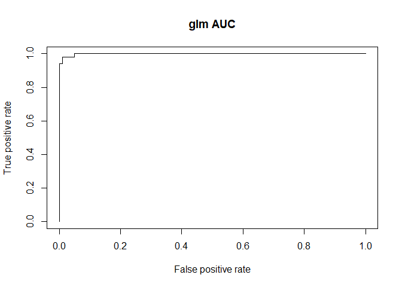<!-- -->

```r
#compare to gam
iris_gam_b_predict<-prediction(fitted.values(iris_gam_b), iris$virginica)
iris_gam_b_performance<-performance(iris_gam_b_predict,"tpr","fpr")
#to see auc
plot(iris_gam_b_performance, main = "gam AUC")
```

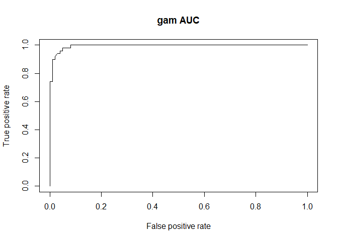<!-- -->

```r
#cross validation
require(boot)
```

```
## Loading required package: boot
```

```
## 
## Attaching package: 'boot'
```

```
## The following object is masked from 'package:car':
## 
##     logit
```

```
## The following object is masked from 'package:lattice':
## 
##     melanoma
```

```r
#K is the number of groups to put data into. default is "leave-one"out" design
iris_glm_final_cv<-cv.glm(iris,  iris_glm_final)
```

```
## Warning: glm.fit: fitted probabilities numerically 0 or 1 occurred

## Warning: glm.fit: fitted probabilities numerically 0 or 1 occurred

## Warning: glm.fit: fitted probabilities numerically 0 or 1 occurred

## Warning: glm.fit: fitted probabilities numerically 0 or 1 occurred

## Warning: glm.fit: fitted probabilities numerically 0 or 1 occurred

## Warning: glm.fit: fitted probabilities numerically 0 or 1 occurred

## Warning: glm.fit: fitted probabilities numerically 0 or 1 occurred

## Warning: glm.fit: fitted probabilities numerically 0 or 1 occurred

## Warning: glm.fit: fitted probabilities numerically 0 or 1 occurred

## Warning: glm.fit: fitted probabilities numerically 0 or 1 occurred

## Warning: glm.fit: fitted probabilities numerically 0 or 1 occurred

## Warning: glm.fit: fitted probabilities numerically 0 or 1 occurred

## Warning: glm.fit: fitted probabilities numerically 0 or 1 occurred

## Warning: glm.fit: fitted probabilities numerically 0 or 1 occurred

## Warning: glm.fit: fitted probabilities numerically 0 or 1 occurred

## Warning: glm.fit: fitted probabilities numerically 0 or 1 occurred

## Warning: glm.fit: fitted probabilities numerically 0 or 1 occurred

## Warning: glm.fit: fitted probabilities numerically 0 or 1 occurred

## Warning: glm.fit: fitted probabilities numerically 0 or 1 occurred

## Warning: glm.fit: fitted probabilities numerically 0 or 1 occurred

## Warning: glm.fit: fitted probabilities numerically 0 or 1 occurred

## Warning: glm.fit: fitted probabilities numerically 0 or 1 occurred

## Warning: glm.fit: fitted probabilities numerically 0 or 1 occurred

## Warning: glm.fit: fitted probabilities numerically 0 or 1 occurred

## Warning: glm.fit: fitted probabilities numerically 0 or 1 occurred

## Warning: glm.fit: fitted probabilities numerically 0 or 1 occurred

## Warning: glm.fit: fitted probabilities numerically 0 or 1 occurred

## Warning: glm.fit: fitted probabilities numerically 0 or 1 occurred

## Warning: glm.fit: fitted probabilities numerically 0 or 1 occurred

## Warning: glm.fit: fitted probabilities numerically 0 or 1 occurred

## Warning: glm.fit: fitted probabilities numerically 0 or 1 occurred

## Warning: glm.fit: fitted probabilities numerically 0 or 1 occurred

## Warning: glm.fit: fitted probabilities numerically 0 or 1 occurred

## Warning: glm.fit: fitted probabilities numerically 0 or 1 occurred

## Warning: glm.fit: fitted probabilities numerically 0 or 1 occurred

## Warning: glm.fit: fitted probabilities numerically 0 or 1 occurred

## Warning: glm.fit: fitted probabilities numerically 0 or 1 occurred

## Warning: glm.fit: fitted probabilities numerically 0 or 1 occurred

## Warning: glm.fit: fitted probabilities numerically 0 or 1 occurred

## Warning: glm.fit: fitted probabilities numerically 0 or 1 occurred

## Warning: glm.fit: fitted probabilities numerically 0 or 1 occurred

## Warning: glm.fit: fitted probabilities numerically 0 or 1 occurred

## Warning: glm.fit: fitted probabilities numerically 0 or 1 occurred

## Warning: glm.fit: fitted probabilities numerically 0 or 1 occurred

## Warning: glm.fit: fitted probabilities numerically 0 or 1 occurred

## Warning: glm.fit: fitted probabilities numerically 0 or 1 occurred

## Warning: glm.fit: fitted probabilities numerically 0 or 1 occurred

## Warning: glm.fit: fitted probabilities numerically 0 or 1 occurred

## Warning: glm.fit: fitted probabilities numerically 0 or 1 occurred

## Warning: glm.fit: fitted probabilities numerically 0 or 1 occurred

## Warning: glm.fit: fitted probabilities numerically 0 or 1 occurred

## Warning: glm.fit: fitted probabilities numerically 0 or 1 occurred

## Warning: glm.fit: fitted probabilities numerically 0 or 1 occurred

## Warning: glm.fit: fitted probabilities numerically 0 or 1 occurred

## Warning: glm.fit: fitted probabilities numerically 0 or 1 occurred

## Warning: glm.fit: fitted probabilities numerically 0 or 1 occurred

## Warning: glm.fit: fitted probabilities numerically 0 or 1 occurred

## Warning: glm.fit: fitted probabilities numerically 0 or 1 occurred

## Warning: glm.fit: fitted probabilities numerically 0 or 1 occurred

## Warning: glm.fit: fitted probabilities numerically 0 or 1 occurred

## Warning: glm.fit: fitted probabilities numerically 0 or 1 occurred

## Warning: glm.fit: fitted probabilities numerically 0 or 1 occurred

## Warning: glm.fit: fitted probabilities numerically 0 or 1 occurred

## Warning: glm.fit: fitted probabilities numerically 0 or 1 occurred

## Warning: glm.fit: fitted probabilities numerically 0 or 1 occurred

## Warning: glm.fit: fitted probabilities numerically 0 or 1 occurred

## Warning: glm.fit: fitted probabilities numerically 0 or 1 occurred

## Warning: glm.fit: fitted probabilities numerically 0 or 1 occurred

## Warning: glm.fit: fitted probabilities numerically 0 or 1 occurred

## Warning: glm.fit: fitted probabilities numerically 0 or 1 occurred

## Warning: glm.fit: fitted probabilities numerically 0 or 1 occurred

## Warning: glm.fit: fitted probabilities numerically 0 or 1 occurred

## Warning: glm.fit: fitted probabilities numerically 0 or 1 occurred

## Warning: glm.fit: fitted probabilities numerically 0 or 1 occurred

## Warning: glm.fit: fitted probabilities numerically 0 or 1 occurred

## Warning: glm.fit: fitted probabilities numerically 0 or 1 occurred

## Warning: glm.fit: fitted probabilities numerically 0 or 1 occurred

## Warning: glm.fit: fitted probabilities numerically 0 or 1 occurred

## Warning: glm.fit: fitted probabilities numerically 0 or 1 occurred

## Warning: glm.fit: fitted probabilities numerically 0 or 1 occurred

## Warning: glm.fit: fitted probabilities numerically 0 or 1 occurred

## Warning: glm.fit: fitted probabilities numerically 0 or 1 occurred

## Warning: glm.fit: fitted probabilities numerically 0 or 1 occurred

## Warning: glm.fit: fitted probabilities numerically 0 or 1 occurred

## Warning: glm.fit: fitted probabilities numerically 0 or 1 occurred

## Warning: glm.fit: fitted probabilities numerically 0 or 1 occurred

## Warning: glm.fit: fitted probabilities numerically 0 or 1 occurred

## Warning: glm.fit: fitted probabilities numerically 0 or 1 occurred

## Warning: glm.fit: fitted probabilities numerically 0 or 1 occurred

## Warning: glm.fit: fitted probabilities numerically 0 or 1 occurred

## Warning: glm.fit: fitted probabilities numerically 0 or 1 occurred

## Warning: glm.fit: fitted probabilities numerically 0 or 1 occurred

## Warning: glm.fit: fitted probabilities numerically 0 or 1 occurred

## Warning: glm.fit: fitted probabilities numerically 0 or 1 occurred

## Warning: glm.fit: fitted probabilities numerically 0 or 1 occurred

## Warning: glm.fit: fitted probabilities numerically 0 or 1 occurred

## Warning: glm.fit: fitted probabilities numerically 0 or 1 occurred

## Warning: glm.fit: fitted probabilities numerically 0 or 1 occurred

## Warning: glm.fit: fitted probabilities numerically 0 or 1 occurred

## Warning: glm.fit: fitted probabilities numerically 0 or 1 occurred

## Warning: glm.fit: fitted probabilities numerically 0 or 1 occurred

## Warning: glm.fit: fitted probabilities numerically 0 or 1 occurred

## Warning: glm.fit: fitted probabilities numerically 0 or 1 occurred

## Warning: glm.fit: fitted probabilities numerically 0 or 1 occurred

## Warning: glm.fit: fitted probabilities numerically 0 or 1 occurred

## Warning: glm.fit: fitted probabilities numerically 0 or 1 occurred

## Warning: glm.fit: fitted probabilities numerically 0 or 1 occurred

## Warning: glm.fit: fitted probabilities numerically 0 or 1 occurred

## Warning: glm.fit: fitted probabilities numerically 0 or 1 occurred

## Warning: glm.fit: fitted probabilities numerically 0 or 1 occurred

## Warning: glm.fit: fitted probabilities numerically 0 or 1 occurred

## Warning: glm.fit: fitted probabilities numerically 0 or 1 occurred

## Warning: glm.fit: fitted probabilities numerically 0 or 1 occurred

## Warning: glm.fit: fitted probabilities numerically 0 or 1 occurred

## Warning: glm.fit: fitted probabilities numerically 0 or 1 occurred

## Warning: glm.fit: fitted probabilities numerically 0 or 1 occurred

## Warning: glm.fit: fitted probabilities numerically 0 or 1 occurred

## Warning: glm.fit: fitted probabilities numerically 0 or 1 occurred

## Warning: glm.fit: fitted probabilities numerically 0 or 1 occurred

## Warning: glm.fit: fitted probabilities numerically 0 or 1 occurred

## Warning: glm.fit: fitted probabilities numerically 0 or 1 occurred

## Warning: glm.fit: fitted probabilities numerically 0 or 1 occurred

## Warning: glm.fit: fitted probabilities numerically 0 or 1 occurred

## Warning: glm.fit: fitted probabilities numerically 0 or 1 occurred

## Warning: glm.fit: fitted probabilities numerically 0 or 1 occurred

## Warning: glm.fit: fitted probabilities numerically 0 or 1 occurred

## Warning: glm.fit: fitted probabilities numerically 0 or 1 occurred

## Warning: glm.fit: fitted probabilities numerically 0 or 1 occurred

## Warning: glm.fit: fitted probabilities numerically 0 or 1 occurred

## Warning: glm.fit: fitted probabilities numerically 0 or 1 occurred

## Warning: glm.fit: fitted probabilities numerically 0 or 1 occurred

## Warning: glm.fit: fitted probabilities numerically 0 or 1 occurred

## Warning: glm.fit: fitted probabilities numerically 0 or 1 occurred

## Warning: glm.fit: fitted probabilities numerically 0 or 1 occurred

## Warning: glm.fit: fitted probabilities numerically 0 or 1 occurred

## Warning: glm.fit: fitted probabilities numerically 0 or 1 occurred

## Warning: glm.fit: fitted probabilities numerically 0 or 1 occurred

## Warning: glm.fit: fitted probabilities numerically 0 or 1 occurred

## Warning: glm.fit: fitted probabilities numerically 0 or 1 occurred

## Warning: glm.fit: fitted probabilities numerically 0 or 1 occurred

## Warning: glm.fit: fitted probabilities numerically 0 or 1 occurred

## Warning: glm.fit: fitted probabilities numerically 0 or 1 occurred

## Warning: glm.fit: fitted probabilities numerically 0 or 1 occurred

## Warning: glm.fit: fitted probabilities numerically 0 or 1 occurred

## Warning: glm.fit: fitted probabilities numerically 0 or 1 occurred

## Warning: glm.fit: fitted probabilities numerically 0 or 1 occurred

## Warning: glm.fit: fitted probabilities numerically 0 or 1 occurred

## Warning: glm.fit: fitted probabilities numerically 0 or 1 occurred

## Warning: glm.fit: fitted probabilities numerically 0 or 1 occurred

## Warning: glm.fit: fitted probabilities numerically 0 or 1 occurred
```

```r
str(iris_glm_final_cv)
```

```
## List of 4
##  $ call : language cv.glm(data = iris, glmfit = iris_glm_final)
##  $ K    : num 150
##  $ delta: num [1:2] 0.0259 0.0259
##  $ seed : int [1:626] 10403 245 -531716202 -2009050608 1302797035 1869243141 1536888801 -1393492820 -1110966239 371800656 ...
```

```r
#delta is the prediction error and the adjusted rate - use adjusted to minimize
#impact of sampling or outliers
```

## SEM

Needs to be updated.


```r
library(lavaan)
#data from Keeley et al. 2005 and extensions in Grace and Keeley 2006 exploring how 
#fire severity interacts with stand age and cover
keeley <- read.csv("http://byrneslab.net/classes/lavaan_materials/Keeley_rawdata_select4.csv")

#sem vs lm####
keeley_formula1 <- 'firesev ~ age'
class(keeley_formula1)
keeley_sem1 <- sem(keeley_formula1, data = keeley)
summary(keeley_sem1)

keeley_lm <- lm(firesev ~ age, data = keeley)
summary(keeley_lm)
summary(keeley_sem1, standardize = T, rsq = T)

#plot
library(lavaanPlot)
lavaanPlot(model = keeley_sem1, coefs = TRUE)
lavaanPlot(model = keeley_sem1, coefs = TRUE,
           stand=TRUE)

#2nd model####
keeley_formula2 <- '
firesev ~ age
cover ~ firesev
'

keeley_sem2 <- sem(keeley_formula2, data = keeley)
summary(keeley_sem2, standardize = T, rsq = T)
lavaanPlot(model = keeley_sem2, coefs = TRUE)
lavaanPlot(model = keeley_sem2, coefs = TRUE,
           stand=TRUE)

#3rd model####
keeley_formula3 <- '
firesev ~ age
cover ~ firesev + age
'

keeley_sem3 <- sem(keeley_formula3, data = keeley)
summary(keeley_sem3, standardize = T)
lavaanPlot(model = keeley_sem3, coefs = TRUE)
lavaanPlot(model = keeley_sem3, coefs = TRUE,
           stand=TRUE)
#another layout
lavaanPlot(model = keeley_sem3, coefs = TRUE, stand=TRUE,
           graph_options = list(layout = "circo"),sig = 0.05)

#compare####
anova(keeley_sem2, keeley_sem3) #null is that models are different!
```

