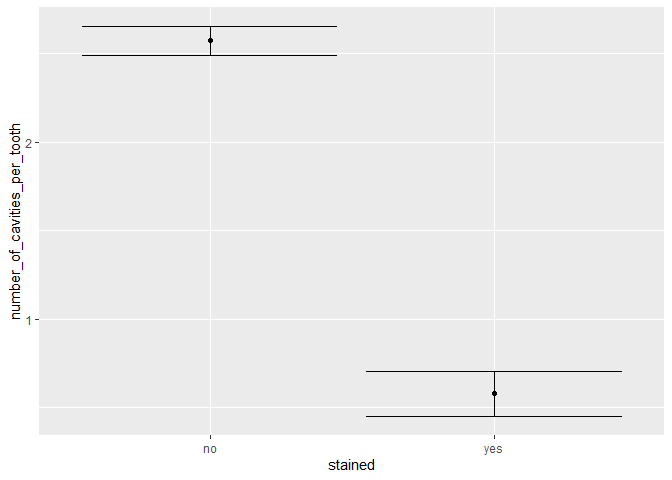
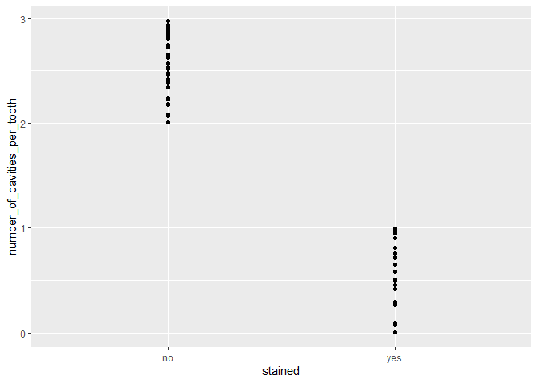

2020 Bio 2100 Final: A brief history of preventative dentistry (26 pts
total)
================
jsg
12/12/2020

# Instructions! Read this first.

The exam is open note, open course website, open class-related code
repositories (mine and those you produced in class). However, you may
not get external help ( from other students, directed internet searches,
etc.). Please update the statement below to acknowledge these
instructions (and that you can use git).

I, INSERT YOUR NAME HERE, promise to not seek external help on the exam.
I understand any academic issues will result in a D or F on the exam or
in the class and be reported to the Dean of Students.

Good luck!

Have you ever wondered why we use fluoride in toothpaste? The data below
is not exact but follows the general story and gives a good view of how
science and statistics work together. Let’s pretend you were a fellow
scientist/dentist/doctor who was part of the story.

1.  Frederick McKay moved to Colorado Springs, Colorado after completing
    dental school in 1901. He was surprised to find the locals had
    extremely stained teeth (to the point they permanently looked like
    they had recently eaten chocolate candy). In general 8% of people at
    the time had stained teeth, but in his first month on the job he
    noted six out of 15 patients had stained teeth.

He thinks this seems like a lot but asks you to help give his feeling a
quantitative analysis. How would you evaluate the data? Make sure to
include

- null hypothesis
- alternative hypothesis
- explanation for test you will use
- results from statistical test (including post-hoc tests if needed!)
- clear explanation of how results relate to your stated hypotheses

``` r
binom.test(6,15,.08)
```

    ## 
    ##  Exact binomial test
    ## 
    ## data:  6 and 15
    ## number of successes = 6, number of trials = 15, p-value = 0.0006952
    ## alternative hypothesis: true probability of success is not equal to 0.08
    ## 95 percent confidence interval:
    ##  0.1633643 0.6771302
    ## sample estimates:
    ## probability of success 
    ##                    0.4

``` r
binom.test(6,15)
```

    ## 
    ##  Exact binomial test
    ## 
    ## data:  6 and 15
    ## number of successes = 6, number of trials = 15, p-value = 0.6072
    ## alternative hypothesis: true probability of success is not equal to 0.5
    ## 95 percent confidence interval:
    ##  0.1633643 0.6771302
    ## sample estimates:
    ## probability of success 
    ##                    0.4

2.  McKay spent the next several years trying to determine what was
    causign the staining (or mottling, as he called it) and was assisted
    by multiple others. Dr. G.V. Black was a primary collaborator.
    Together they investigated a few ideas. First, they compared tooth
    staining rates in people who had been in the town vs those who had
    moved their at multiple points. They found

| *Age moved to town*                  | Stains present | Stains absent |
|--------------------------------------|----------------|---------------|
| born in town                         | 50             | 20            |
| moved to town as young child (\<10)  | 48             | 23            |
| moved to town as older child (11-20) | 7              | 81            |
| moved to town as adult (20+)         | 3              | 35            |

How would you evaluate the data? Make sure to include

- null hypothesis
- alternative hypothesis
- explanation for test you will use
- results from statistical test (including post-hoc tests if needed!)
- clear explanation of how results relate to your stated hypotheses

``` r
stain_group <-matrix(c(50,20,48,23,7,81,3,35), ncol = 2, byrow = T)
colnames(stain_group) <- c("stain", "no stain")
rownames(stain_group) <- c("born","child","teenager","adult")
#check it
stain_group
```

    ##          stain no stain
    ## born        50       20
    ## child       48       23
    ## teenager     7       81
    ## adult        3       35

``` r
chisq.test(stain_group)
```

    ## 
    ##  Pearson's Chi-squared test
    ## 
    ## data:  stain_group
    ## X-squared = 104.92, df = 3, p-value < 2.2e-16

``` r
library(rcompanion)
pairwiseNominalIndependence(stain_group, compare = "row", method = "holm")
```

    ## Warning in chisq.test(Dataz, ...): Chi-squared approximation may be incorrect

    ##         Comparison p.Fisher p.adj.Fisher  p.Gtest p.adj.Gtest  p.Chisq p.adj.Chisq
    ## 1     born : child 7.15e-01     1.00e+00 6.22e-01    1.00e+00 7.57e-01    1.00e+00
    ## 2  born : teenager 2.34e-17     1.40e-16 0.00e+00    0.00e+00 6.15e-16    3.69e-15
    ## 3     born : adult 6.61e-11     2.64e-10 2.04e-11    8.16e-11 1.02e-09    4.08e-09
    ## 4 child : teenager 1.25e-15     6.25e-15 3.33e-16    1.66e-15 1.43e-14    7.15e-14
    ## 5    child : adult 1.00e-09     3.00e-09 2.25e-10    6.75e-10 8.80e-09    2.64e-08
    ## 6 teenager : adult 1.00e+00     1.00e+00 9.91e-01    1.00e+00 1.00e+00    1.00e+00

3.  What does your answer to question \#2 imply?

4.  During their work the dentists also noticed that stained teeth
    behaved differently than unstained teeth. Data they collected on
    cavities is found at

``` r
set.seed(4)
cavities <- data.frame(stained = c(rep("yes", 25),rep("no", 50)), 
                       number_of_cavities_per_tooth = c(runif(25), 2 + runif(50)))
write.csv(cavities, "cavities.csv", row.names = F)
```

``` r
cavities <- read.csv("https://docs.google.com/spreadsheets/d/e/2PACX-1vRuczoRwyQsMBSH0ONdoUlkzBFLbzwSEGNaj14ZXePJtr59QY7C3N2AYzKhm4Pdo5bKteqRMzwTZT9c/pub?gid=220386619&single=true&output=csv", stringsAsFactors = T)
```

What does the data suggest? Make sure to include

- null hypothesis
- alternative hypothesis
- explanation for test you will use
- results from statistical test (including post-hoc tests if needed!)
- clear explanation of how results relate to your stated hypotheses

``` r
t.test(number_of_cavities_per_tooth~stained, cavities)
```

    ## 
    ##  Welch Two Sample t-test
    ## 
    ## data:  number_of_cavities_per_tooth by stained
    ## t = 27.322, df = 44.619, p-value < 2.2e-16
    ## alternative hypothesis: true difference in means between group no and group yes is not equal to 0
    ## 95 percent confidence interval:
    ##  1.847187 2.141275
    ## sample estimates:
    ##  mean in group no mean in group yes 
    ##          2.573971          0.579740

``` r
cavities_lm <- lm(number_of_cavities_per_tooth~stained, cavities)
library(car)
Anova(cavities_lm, type = "III")
```

    ## Anova Table (Type III tests)
    ## 
    ## Response: number_of_cavities_per_tooth
    ##             Sum Sq Df F value    Pr(>F)    
    ## (Intercept) 331.27  1 3951.66 < 2.2e-16 ***
    ## stained      66.28  1  790.68 < 2.2e-16 ***
    ## Residuals     6.12 73                      
    ## ---
    ## Signif. codes:  0 '***' 0.001 '**' 0.01 '*' 0.05 '.' 0.1 ' ' 1

5.  Provide a properly-labelled graph of the data from question 4. Make
    sure it shows both the signal and noise in the data!

``` r
library(ggplot2)
library(Rmisc)
cavities_summary <- summarySE(cavities, 
                              measurevar = "number_of_cavities_per_tooth",
                              groupvars = "stained")
ggplot(cavities_summary, aes(x=stained, y=number_of_cavities_per_tooth))+
  geom_point() +
  geom_errorbar(aes(ymin = number_of_cavities_per_tooth - ci, 
                    ymax = number_of_cavities_per_tooth + ci))
```

<!-- -->

``` r
ggplot(cavities, aes(x=stained, y=number_of_cavities_per_tooth))+
  geom_point()
```

<!-- -->

6.  An unfortunate incident in Idaho shed more light on the causes of
    staining. People noticed a slight increase in tooth staining after a
    town switched to a new water source. Consider the average tooth
    color (0 is white using analysis tools from the time, 100 is black)
    of children from families who had children before and after the
    switch. Data is available @

``` r
set.seed(2)
idaho_cavities <- data.frame(family = letters[1:25],before = 10 + rnorm(25,0,3))
idaho_cavities$after <- idaho_cavities$before + 2 + rnorm(25,0,3)
write.csv(idaho_cavities, "idaho_cavities.csv", row.names = F)
```

``` r
idaho_cavities <- read.csv("https://docs.google.com/spreadsheets/d/e/2PACX-1vQB6vCEkF79IKADjr8nugsbrOnHyk15NJbo7_Q4qWRfJ-OrJ8FoFfkkzFQ25mtVwKVZyWF_kh97SJfO/pub?gid=1969060757&single=true&output=csv", stringsAsFactors = F)
```

What does the data suggest? Make sure to include

- null hypothesis
- alternative hypothesis
- explanation for test you will use
- results from statistical test (including post-hoc tests if needed!)
- clear explanation of how results relate to your stated hypotheses

``` r
t.test(idaho_cavities$before, idaho_cavities$after, paired = T)
```

    ## 
    ##  Paired t-test
    ## 
    ## data:  idaho_cavities$before and idaho_cavities$after
    ## t = -2.1959, df = 24, p-value = 0.03801
    ## alternative hypothesis: true mean difference is not equal to 0
    ## 95 percent confidence interval:
    ##  -2.74090556 -0.08490742
    ## sample estimates:
    ## mean difference 
    ##       -1.412906

``` r
t.test(idaho_cavities$before, idaho_cavities$after)
```

    ## 
    ##  Welch Two Sample t-test
    ## 
    ## data:  idaho_cavities$before and idaho_cavities$after
    ## t = -1.1446, df = 41.906, p-value = 0.2589
    ## alternative hypothesis: true difference in means is not equal to 0
    ## 95 percent confidence interval:
    ##  -3.904262  1.078449
    ## sample estimates:
    ## mean of x mean of y 
    ##  11.00192  12.41483

7.  Analysis of water from other towns where staining was common
    eventually revealed high amounts of fluoride. Scientists then
    collected data on average tooth decay rates and fluoride levels from
    multiple towns (this part is made up!). Data is available @

``` r
set.seed(4)
fluoride <- data.frame(fluoride_ppm = runif(50))
fluoride$tooth_decay_rates <- 25 + fluoride$fluoride_ppm*15+2*runif(50) 
write.csv(fluoride, "fluoride.csv", row.names = F)
```

``` r
fluoride <- read.csv("https://docs.google.com/spreadsheets/d/e/2PACX-1vS7VvJ5WyzEIMyj-HGArfu_ZIT5cneHI5RiqmDIW_TaDDKgFTtBgcPXCPA00TLO4ax-xJlknn2bWfBi/pub?gid=1554561003&single=true&output=csv", stringsAsFactors = T)
```

What does the data suggest? Make sure to include

- null hypothesis
- alternative hypothesis
- explanation for test you will use
- results from statistical test (including post-hoc tests if needed!)
- clear explanation of how results relate to your stated hypotheses

``` r
fluoride_lm <- lm(tooth_decay_rates ~ fluoride_ppm, fluoride)
summary(fluoride_lm)
```

    ## 
    ## Call:
    ## lm(formula = tooth_decay_rates ~ fluoride_ppm, data = fluoride)
    ## 
    ## Residuals:
    ##      Min       1Q   Median       3Q      Max 
    ## -0.95285 -0.57264  0.02045  0.59148  0.94659 
    ## 
    ## Coefficients:
    ##              Estimate Std. Error t value Pr(>|t|)    
    ## (Intercept)   26.0673     0.1977  131.82   <2e-16 ***
    ## fluoride_ppm  14.9417     0.3059   48.85   <2e-16 ***
    ## ---
    ## Signif. codes:  0 '***' 0.001 '**' 0.01 '*' 0.05 '.' 0.1 ' ' 1
    ## 
    ## Residual standard error: 0.6213 on 48 degrees of freedom
    ## Multiple R-squared:  0.9803, Adjusted R-squared:  0.9799 
    ## F-statistic:  2386 on 1 and 48 DF,  p-value: < 2.2e-16

\#Epilogue

In the real world, researchers worked to determine how much fluoride was
too much in regards to staining (which is a more complicated analysis)
before eventually considering its usefulness in low (safe)
concentrations. After large-scale studies showed results, it became a
major component of preventative dentistry.
