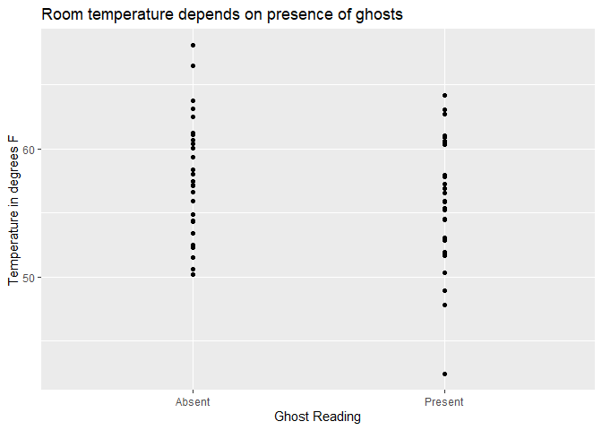
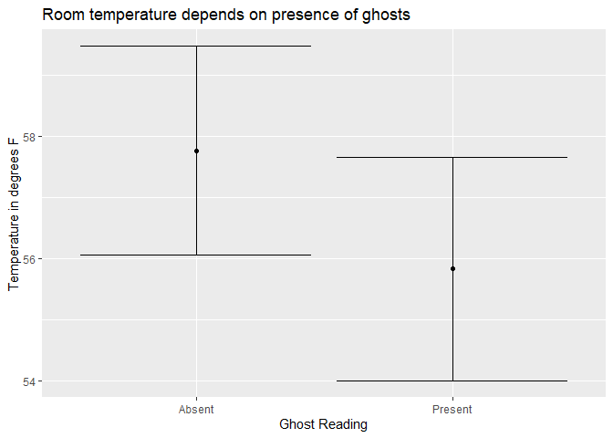

2020 Bio 2100 Midterm: Halloween Redux (26 pts total)
================
jsg
10/27/2020

# Instructions! Read this first.

The exam is open note, open course website, open class-related code
repositories (mine and those you produced in class). However, you may
not get external help ( from other students, directed internet searches,
etc.). Please update the statement below to acknowledge these
instructions (and that you can use git).

I, INSERT YOUR NAME HERE, promise to not seek external help on the exam.
I understand any academic issues will result in a D or F on the exam or
in the class and be reported to the Dean of Students.

Good luck!

# Mind reading

## *Questions 1 - 3*

Researchers want to determine if mind-reading is possible. To test this,
they place a purported mind-reader in a soundproof room. Directly
outside the room is a chair. For each data point, a volunteer sits in
the chair or doesn’t. All the mind-reader has to do is “detect” the
presence of the volunteer (this should be the first step in reading
minds!). Even though the mind-reader can’t see or hear if the volunteer
is present, he correctly determines if a person is present or not 12
times out of 20.

1.  How would you assess this evidence to see if it offers evidence
    supporting the existence of mind-reading (6 pts)?

Make sure your answers include (if applicable)

-   null hypothesis

*(For a sided test) The mind reader can not detect the presence of
people, so they will guess correctly 50% or less of the time (what we
would expect by chance).* ->H<sub>O</sub>: p \<= .5

*(For a non-sided test) The mind reader can not detect the presence of
people, so they will guess correctly 50% of the time (what we would
expect by chance).* ->H<sub>O</sub>: p = .5

-   alternative hypothesis

*(For a sided test) The mind reader can detect the presence of people,
so they will guess correctly greater than 50% of the time
.*->H<sub>A</sub>: p \>.5

*(For a non-sided test) The mind reader can detect the presence of
people, so the proportion of times they will guess correctly is not
equal to 50% (what we would expect by chance).* ->H<sub>A</sub>: p != .5

-   explanation for test you will use

*I will use binomial test since its discrete data (counts) that falls
into 2 groups.*

-   results from statistical test

``` r
binom.test(12,20, alternative="greater", .5)
```

    ## 
    ##  Exact binomial test
    ## 
    ## data:  12 and 20
    ## number of successes = 12, number of trials = 20, p-value = 0.2517
    ## alternative hypothesis: true probability of success is greater than 0.5
    ## 95 percent confidence interval:
    ##  0.3935849 1.0000000
    ## sample estimates:
    ## probability of success 
    ##                    0.6

*For the sided version, I found a p-value of .2517.*

``` r
binom.test(12,20, .5)
```

    ## 
    ##  Exact binomial test
    ## 
    ## data:  12 and 20
    ## number of successes = 12, number of trials = 20, p-value = 0.5034
    ## alternative hypothesis: true probability of success is not equal to 0.5
    ## 95 percent confidence interval:
    ##  0.3605426 0.8088099
    ## sample estimates:
    ## probability of success 
    ##                    0.6

*For the non-sided version, I found a p-value of .5034*

-   clear explanation of how results relate to your stated hypotheses

*In both cases I fail to reject the null hypothesis. The data does not
contain enough evidence to indicate mind readers can detect the presence
of people.*

2.  Calculate a confidence interval for the mind-reader data. Share it
    and clearly explain what it means (3 pts).

``` r
library(binom)
#non-sided option
binom.confint(12,20) 
```

    ##           method  x  n      mean     lower     upper
    ## 1  agresti-coull 12 20 0.6000000 0.3860304 0.7817446
    ## 2     asymptotic 12 20 0.6000000 0.3852967 0.8147033
    ## 3          bayes 12 20 0.5952381 0.3904659 0.7951753
    ## 4        cloglog 12 20 0.6000000 0.3572920 0.7760495
    ## 5          exact 12 20 0.6000000 0.3605426 0.8088099
    ## 6          logit 12 20 0.6000000 0.3800981 0.7858454
    ## 7         probit 12 20 0.6000000 0.3811790 0.7907655
    ## 8        profile 12 20 0.6000000 0.3829371 0.7928411
    ## 9            lrt 12 20 0.6000000 0.3829334 0.7928930
    ## 10     prop.test 12 20 0.6000000 0.3641167 0.8002291
    ## 11        wilson 12 20 0.6000000 0.3865815 0.7811935

*Using the Agresti-Coull method, we find a 95% confidence interval of
.39 - .78. a 95% confidencei interval means 95% of the time we sample
the population and create this interval it will contain the true
parameter. Note that this interval contains .5, meaning the data does
not offer much evidence against the parameter under the null
hypothesis.*

3.  If the mind-reader wanted to redo the experiment, what could they do
    to reduce the width of the confidence interval **ASSUMING** the
    noted signal in the data remains the same. Make sure you explain and
    justify your answer (3 pts).

*Given the formula for confidence intervals, the best approach is to
have a larger sample size. A larger sample size where the mind reader
guessed correctly 60% of the time could lead to “significant” outcome.*

# Ghosts

## *Questions 4 - 6*

People who hunt for ghosts typically note their “presence” is associated
with lower temperatures. To note this, they use a “ghost detecting
machine” to document the presence or absence of ghosts in a room. The
machine also documents the room temperature. Data is available using

``` r
ghosts <- read.csv("https://raw.githubusercontent.com/jsgosnell/CUNY-BioStats/master/datasets/ghosts.csv", stringsAsFactors = T)
```

3.  Provide a graph of the data that clearly displays patterns in the
    central tendency and variance of the data (many options here!) (5
    pts).

*Lots of options here. Some shown below. Key was to include some measure
of central tendency and variation OR just plot the data!*

``` r
library(ggplot2)
#dotplot
ggplot(ghosts, aes (x = Present, y = Temperature)) +
  geom_point() +
  ggtitle("Room temperature depends on presence of ghosts") +
  xlab("Ghost Reading") +
  ylab ("Temperature in degrees F")
```

<!-- -->

``` r
#with confidence interval
library(Rmisc)
```

    ## Loading required package: lattice

    ## Loading required package: plyr

``` r
ghosts_summary <- summarySE(ghosts, measurevar = "Temperature", groupvars = "Present")
ggplot(ghosts_summary, aes (x = Present, y = Temperature)) +
  geom_point() +
  geom_errorbar(aes(ymin = Temperature - ci, ymax = Temperature + ci))+
  ggtitle("Room temperature depends on presence of ghosts") +
  xlab("Ghost Reading") +
  ylab ("Temperature in degrees F")
```

<!-- -->

4.  One issue with the data is that ghosts mainly occur in old (and
    poorly insulated) homes. Data shows the average temperature of homes
    where ghosts are present is on average 56 degrees when ghosts are
    not detected. Using this information, how would you assess the
    evidence to see if it offers evidence supporting the existence of
    ghosts (6 pts)?

As a hint, remember you can subset the data using
`ghosts[ghosts$Present == "Present", "Temperature"]`.

Make sure your answers include (if applicable)

-   null hypothesis

*People had issues with my wording here, so I was very open to
interpretation.  
What I was trying to point out is that old houses tend to be colder in
general, so our null hypothesis would be the temperature when ghosts are
“detected” is no different than 56 degrees. H<sub>O</sub>: mean
temperature = 56*

-   alternative hypothesis

The temperature when ghosts are “detected” is different than 56 degrees.
H<sub>A</sub>: mean temperature != 56

-   explanation for test you will use

*This is continuous data from one population, so we can use a t.test if
we assume the data (and thus residusals, as we now know) are normally
distributed. We could also bootstrap the data. Other options (sign tests
or rank tests) also work but have less power.*

-   results from statistical test

``` r
t.test(ghosts[ghosts$Present == "Present", "Temperature"], mu=56)
```

    ## 
    ##  One Sample t-test
    ## 
    ## data:  ghosts[ghosts$Present == "Present", "Temperature"]
    ## t = -0.18536, df = 29, p-value = 0.8542
    ## alternative hypothesis: true mean is not equal to 56
    ## 95 percent confidence interval:
    ##  54.00882 57.66024
    ## sample estimates:
    ## mean of x 
    ##  55.83453

``` r
#or bootstrap
source("https://raw.githubusercontent.com/jsgosnell/CUNY-BioStats/master/code_examples/bootstrapjsg.R")
bootstrapjsg(ghosts[ghosts$Present == "Present", "Temperature"], null=56)
```

    ## 
    ## Attaching package: 'boot'

    ## The following object is masked from 'package:lattice':
    ## 
    ##     melanoma

    ## Simple Bootstrap Routines (1.1-7)

    ## Warning in boot.ci(a, conf): bootstrap variances needed for studentized
    ## intervals

    ##                                                                         
    ##                  "0.95" "% Confidence Interval"      "54.0977180783118" 
    ##                                                                         
    ##      "57.4744338173198"               "p-value"                "0.8583"

\*Using the t-test I found a test value t<sub>29</sub>=0.18536, which
corresponds to a p-value of 0.8542. Bootstrap tests led to similar
p-value (.8494)

-   clear explanation of how results relate to your stated hypotheses

*Using either method I reject the null hypothesis. There is not enough
evidence to indicate the presence of ghosts lowers temperatures.*

-   confidence interval for your estimate

*From the t-test, I get a 95% confidence interval of 54.00882-57.66024;
the bootstrap interval is 54.06-57.52. Note both include 56.*

5.  The investigator is confused. He found an average temerature of
    55.8, which is less than 56. He thinks that should confirm the
    existence of ghosts. Explain any issues you see with his rationale
    in plain English. Also explain to him what a p-value means as part
    of your answer (3 pts).

*The small difference he observed between 55.8 and 56 degrees may be
explained by sampling error. A p-value indicates hwo likely we were to
see the observed signal or something more extreme if the null hypothesis
were true and multiple samples were collected. 55.8 is within the region
of acceptable variation from 56; it does not indicate a devation from
the average temperature of 56.*
