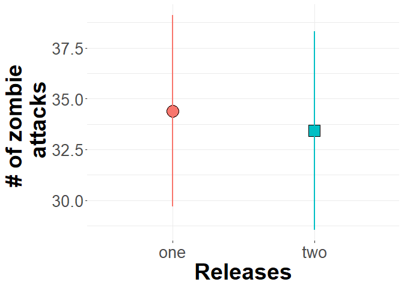

Plotting quiz
================
jsg
10/16/2020

------------------------------------------------------------------------

# ZOMBIES!

You wake up one morning and find that zombies have taken over your
neighborhood (bummer). One idea is to use biocontrol to reduce zombie
attacks. A zombie parasite is identified. Test plots (neighborhoods!)
are subjected to one or two releases of the parasite at low, medium, or
high densities. Use the data (in R chunk below!) to construct a graph
(You should use a bar graph with confidence intervals!) that properly
summarizes how the number of releases impacts the number of zombie
attacks.

``` r
biocontrol <- read.csv("https://raw.githubusercontent.com/jsgosnell/CUNY-BioStats/master/datasets/biocontrol.csv",
                       stringsAsFactors = T)

library(plyr)
biocontrol$Density <- factor(biocontrol$Density, c("low", "medium", "high"))

library(Rmisc)
biocontrol_summary_no_int <- summarySE(biocontrol, measurevar = "bites", groupvars = c("Releases"))

library(ggplot2)
ggplot(biocontrol_summary_no_int, aes(x=Releases, y=bites, fill = Releases, shape = Releases))+
  scale_shape_manual(values=c(21:22))+
  geom_point(size=7, color = "black")+
  geom_errorbar(aes(ymin=bites-ci, ymax=bites+ci, color = Releases), size = 1,
                width = 0)+
  ylab("# of zombie \n attacks") +
 theme_grey()+#make bw if you want
  theme(axis.title.x = element_text(face="bold", size=28), 
        axis.title.y = element_text(face="bold", size=28), 
        axis.text.y  = element_text(size=20),
        axis.text.x  = element_text(size=20), 
        legend.text =element_text(size=28),
        legend.title = element_text(size=32, face="bold"),
        plot.title = element_text(hjust = 0.5, face="bold", size=32),
        strip.text.x = element_text(size = 30, lineheight = 2),
        strip.text.y = element_text(size = 25, lineheight = 2),
        strip.background = element_rect(fill = "white", 
                                        colour = "white"),
        panel.background = element_rect(fill = "white", 
                                        colour = NA),
        panel.grid = element_line(colour = "grey92"), 
        panel.grid.minor = element_line(size = rel(0.5)),
        strip.placement = "outside",
        legend.key = element_rect(fill = "white"),
        legend.position = "none") 
```

<!-- -->
