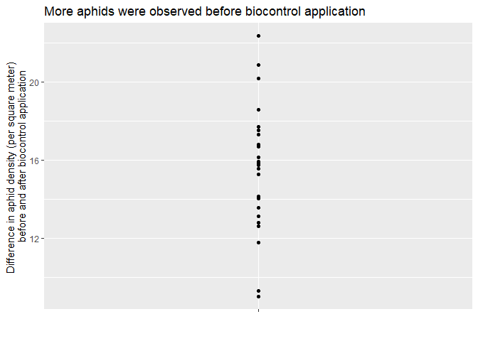
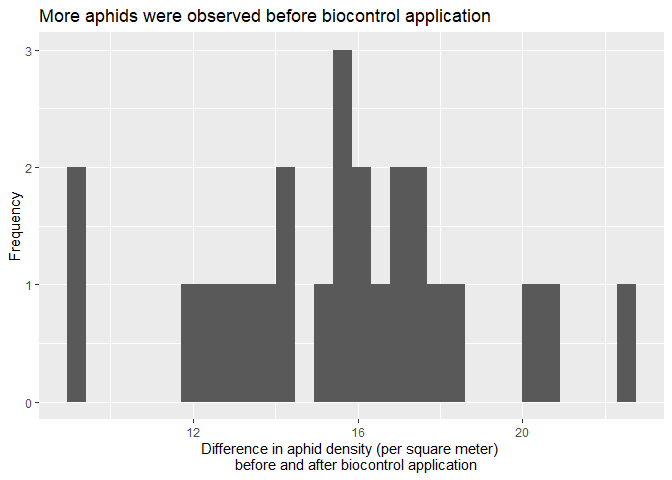
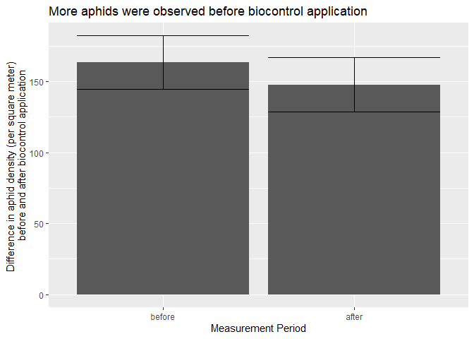

Quiz 5
================
jsg
11/18/2020

# Biocontrol effectiveness!

One way to reduce herbivory by invasive species is biocontrol - the
intentional release or supplementation of species that prey on a pest.
To consider if biocontrol is effective at reducing aphid density across
generations, scientists consider the number of aphids in square meter
plots at 20 fields prior to the release of biocontrol agents. A year
later they visit the same plots and sample for aphids again. Data is
available using

``` r
aphid_density <- read.csv("https://docs.google.com/spreadsheets/d/e/2PACX-1vR7IAJjpKonpJLjENw9GQ7tiZm63YZZq5ed7es0OFceWvEqvPSiqpYrEnnKiCsNGIspUhn3YDry_ChF/pub?gid=552866496&single=true&output=csv", stringsAsFactors = T)
```

How would you evaluate the data?

In case it helps (it may not, but I want you to know how to melt data
into long format)

``` r
library(reshape2)
aphid_density_long <- melt(aphid_density, id.vars = "field", variable.name = "before_after", value.name = "aphid_density")
```

Make sure your answers include

- null hypothesis

*There is no impact of biocontrol on aphid density, so the mean
difference between the two samples is 0.*

- alternative hypothesis

*There is an impact of biocontrol on aphid density, so the mean
difference between the two samples is not 0.*

- explanation for test you will use

*I will use a paired t-test since the data consists of continuous
measures and each unit (field) is measured twice.*

- results from statistical test (including post-hoc tests if needed!)

``` r
t.test(aphid_density$before, aphid_density$after, paired = T)
```

    ## 
    ##  Paired t-test
    ## 
    ## data:  aphid_density$before and aphid_density$after
    ## t = 24.225, df = 24, p-value < 2.2e-16
    ## alternative hypothesis: true mean difference is not equal to 0
    ## 95 percent confidence interval:
    ##  14.25909 16.91509
    ## sample estimates:
    ## mean difference 
    ##        15.58709

*Using a paired t-test, we found t<sub>24</sub>=24.225, p\<.01. Note a
non-paired test leads to different outcomes!*

``` r
t.test(aphid_density$before, aphid_density$after)
```

    ## 
    ##  Welch Two Sample t-test
    ## 
    ## data:  aphid_density$before and aphid_density$after
    ## t = 1.194, df = 47.988, p-value = 0.2383
    ## alternative hypothesis: true difference in means is not equal to 0
    ## 95 percent confidence interval:
    ##  -10.66007  41.83425
    ## sample estimates:
    ## mean of x mean of y 
    ##  163.2800  147.6929

- clear explanation of how results relate to your stated hypotheses

*We can reject the null hypothesis using a paired test. There appears to
be a decreasee in density based on biocontrol application. * a graph
that clearly displays the data

*Many options here. However, note that focusing on change makes the
outcome easier to see.*

``` r
library(ggplot2)
aphid_density$change <- aphid_density$before - aphid_density$after
ggplot(aphid_density, aes(x="", y =change)) +
  geom_point() +
  xlab("")+
  ylab("Difference in aphid density (per square meter) 
       before and after biocontrol application")+
  ggtitle("More aphids were observed before biocontrol application")
```

<!-- -->

``` r
ggplot(aphid_density, aes(x=change)) +
  geom_histogram() +
  ylab("Frequency")+
  xlab("Difference in aphid density (per square meter) 
  before and after biocontrol application")+
  ggtitle("More aphids were observed before biocontrol application")
```

    ## `stat_bin()` using `bins = 30`. Pick better value with `binwidth`.

<!-- -->

``` r
library(Rmisc)
```

    ## Loading required package: lattice
    ## Loading required package: plyr

``` r
aphid_summary <- summarySE(aphid_density_long, measurevar = "aphid_density",
                           groupvars = "before_after")
ggplot(aphid_summary, aes(x=before_after, y=aphid_density))+
  geom_col()+
  geom_errorbar(aes(ymin = aphid_density - ci, ymax = aphid_density + ci))+
  xlab("Measurement Period")+
  ylab("Difference in aphid density (per square meter) 
       before and after biocontrol application")+
  ggtitle("More aphids were observed before biocontrol application")
```

<!-- -->
