Quiz 7
================
jsg
11/20/2020

# Biocontrol effectiveness!


Figure 1: The *parasitic wasp* Trioxys complanatus is a biological
control agent introduced to combat the spotted alfalfa aphid. . CSIRO,
CC BY 3.0 \<<https://creativecommons.org/licenses/by/3.0>


Fig 2: Two different sized Seven Spotted-Ladybug (*Coccinella
septempunctata*) eating mealybugs/aphids. Zeynel Cebeci, CC BY-SA 4.0
<https://creativecommons.org/licenses/by-sa/4.0>, via Wikimedia Commons

Building on earlier experiments (Quiz 5 and 6!), scientists now wonder
if the impact of the biocontrol agents depends on the presence of an
aphid competitor. Scientists measure the number of damaged leaves along
10 m surveys in fields that have had no biocontrol (control) and those
where parasitic wasps (Figure 1) or predatory ladybugs (Figure 2) have
been released. These fields also differ in the presence of the aphid
competitor. Data is available using

``` r
damage_competitor <- read.csv("https://docs.google.com/spreadsheets/d/e/2PACX-1vTRtyKuFbpcwdBZISTxSI4Eyl7V9fdtH0TyB-Pgwum2YS676Okhu9TtB1n3HlOcXIuYSh--faebX9Gb/pub?gid=1533136727&single=true&output=csv", header = T, stringsAsFactors = T)
```

Make sure your answers include

-   null hypothesis

*We have three null hypotheses here*:

-   *There is no difference in the average number of damaged leaves
    based on biocontrol agent*

-   *There is no difference in the average number of damaged leaves
    based on competitor presence*

-   *There is no interaction between competitor presence and biocontrol
    agent on the the average number of damaged leaves*

-   alternative hypothesis

*We have three alternative hypotheses here:*

-   *There is a difference in the average number of damaged leaves based
    on biocontrol agent*

-   *There is a difference in the average number of damaged leaves based
    on competitor presence*

-   *There is an interaction between competitor presence and biocontrol
    agent on the the average number of damaged leaves*

-   explanation for test you will use

*We will use a factorial ANOVA to examine the data. The outcome is
continuous and both explanatory variables are categorical. The design is
also fully randomized.*

-   results from statistical test (including post-hoc tests if needed!)

``` r
damage_competitor_lm <- lm(leaf_damage~treatment*competitor, damage_competitor)
plot(damage_competitor_lm)
```

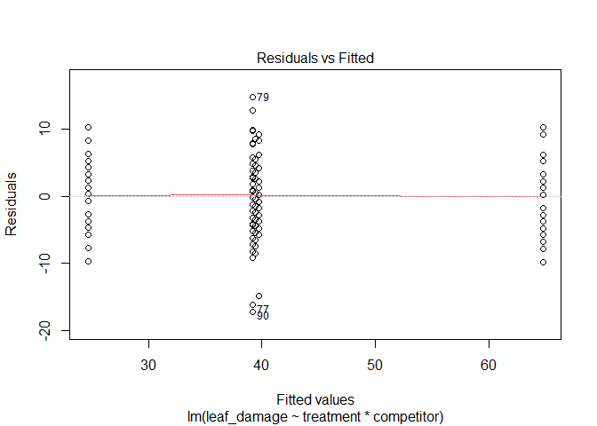<!-- -->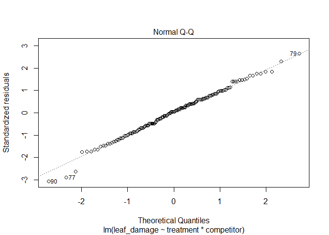<!-- -->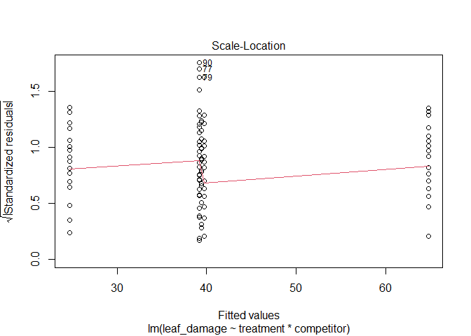<!-- -->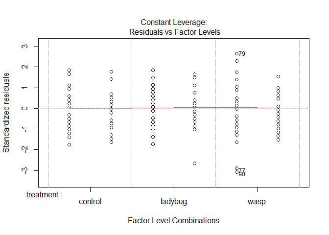<!-- -->

``` r
library(car)
Anova(damage_competitor_lm, type = "III")
```

    ## Anova Table (Type III tests)
    ## 
    ## Response: leaf_damage
    ##                      Sum Sq  Df F value    Pr(>F)    
    ## (Intercept)          104846   1 3224.61 < 2.2e-16 ***
    ## treatment             20588   2  316.60 < 2.2e-16 ***
    ## competitor             8192   1  251.95 < 2.2e-16 ***
    ## treatment:competitor  10595   2  162.93 < 2.2e-16 ***
    ## Residuals              4682 144                      
    ## ---
    ## Signif. codes:  0 '***' 0.001 '**' 0.01 '*' 0.05 '.' 0.1 ' ' 1

*I first built and checked a linear model. Assumptions were met as
evidenced by the residual plots (there is no pattern in the residuals
and they are normally distributed). Analysis shows a significant
interaction (F<sub>2,144</sub>=162.93, p\<.01) between competitor and
treatment. This means I can’t simply look at main effects as they depend
on each other, so I have to split the data into subsets for analysis.*

``` r
damage_competitor_present_lm <- lm(leaf_damage~treatment, 
                           damage_competitor[damage_competitor$competitor == "present",])
plot(damage_competitor_present_lm)
```

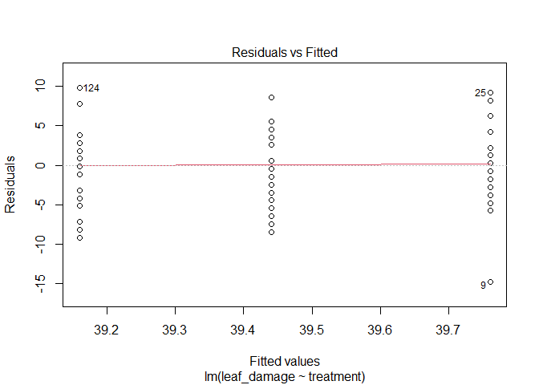<!-- -->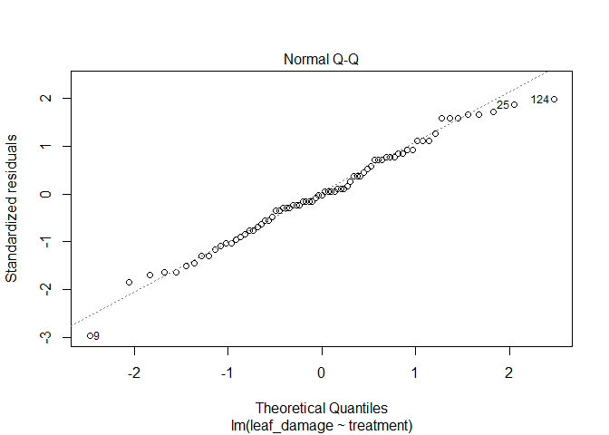<!-- -->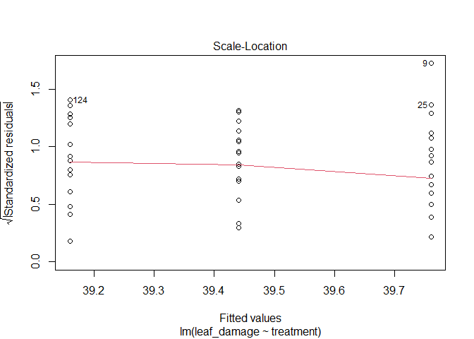<!-- -->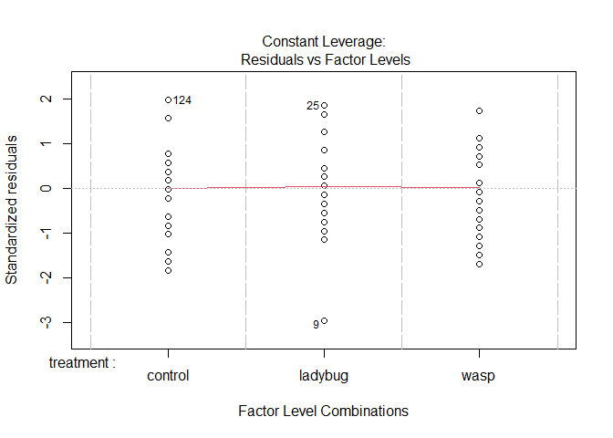<!-- -->

``` r
Anova(damage_competitor_present_lm, type = "III")
```

    ## Anova Table (Type III tests)
    ## 
    ## Response: leaf_damage
    ##             Sum Sq Df   F value Pr(>F)    
    ## (Intercept)  38338  1 1482.3800 <2e-16 ***
    ## treatment        5  2    0.0871 0.9167    
    ## Residuals     1862 72                     
    ## ---
    ## Signif. codes:  0 '***' 0.001 '**' 0.01 '*' 0.05 '.' 0.1 ' ' 1

*When the competitor is present, there is no impact of biocontrol agents
(F<sub>2,72</sub>= .08, p = .92), so for this subset I fail to reject
the null hypothesis of no difference among treatments.*

``` r
damage_competitor_absent_lm <- lm(leaf_damage~treatment, 
                           damage_competitor[damage_competitor$competitor == "absent",])
plot(damage_competitor_absent_lm)
```

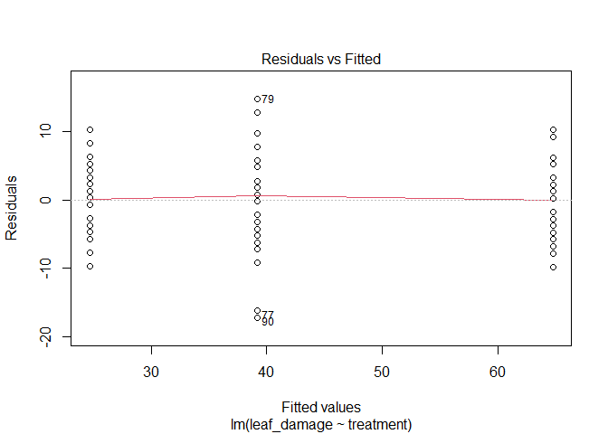<!-- -->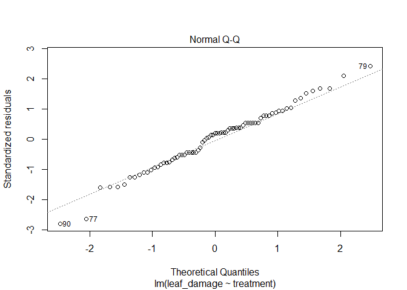<!-- -->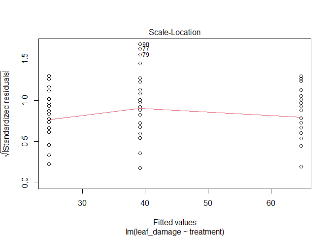<!-- -->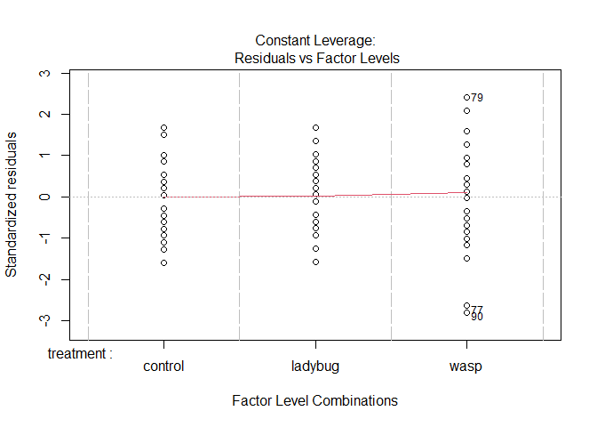<!-- -->

``` r
Anova(damage_competitor_absent_lm, type = "III")
```

    ## Anova Table (Type III tests)
    ## 
    ## Response: leaf_damage
    ##             Sum Sq Df F value    Pr(>F)    
    ## (Intercept) 104846  1 2676.93 < 2.2e-16 ***
    ## treatment    20588  2  262.82 < 2.2e-16 ***
    ## Residuals     2820 72                      
    ## ---
    ## Signif. codes:  0 '***' 0.001 '**' 0.01 '*' 0.05 '.' 0.1 ' ' 1

``` r
library(multcomp)
damage_compare <-   glht(damage_competitor_absent_lm, linfct = mcp(treatment = "Tukey"))
summary(damage_compare)
```

    ## 
    ##   Simultaneous Tests for General Linear Hypotheses
    ## 
    ## Multiple Comparisons of Means: Tukey Contrasts
    ## 
    ## 
    ## Fit: lm(formula = leaf_damage ~ treatment, data = damage_competitor[damage_competitor$competitor == 
    ##     "absent", ])
    ## 
    ## Linear Hypotheses:
    ##                        Estimate Std. Error t value Pr(>|t|)    
    ## ladybug - control == 0   -40.08       1.77 -22.643   <1e-10 ***
    ## wasp - control == 0      -25.56       1.77 -14.440   <1e-10 ***
    ## wasp - ladybug == 0       14.52       1.77   8.203   <1e-10 ***
    ## ---
    ## Signif. codes:  0 '***' 0.001 '**' 0.01 '*' 0.05 '.' 0.1 ' ' 1
    ## (Adjusted p values reported -- single-step method)

*When the competitor is absent, there is an impact of biocontrol agents
(F<sub>2,72</sub>= 263, p \<.01), so for this subset I reject the null
hypothesis of no difference among treatments. Since there are more than
2 groups I need to do post hoc tests to understand which groups are
different. A tukey approach indicates all treatments are different when
the competitor is absent.*

-   clear explanation of how results relate to your stated hypotheses

*Noted above.*

-   a graph that clearly displays the data

*One option shown below!*

``` r
library(Rmisc)
damage_competitor_summary <- summarySE(damage_competitor, measurevar = "leaf_damage", groupvars = c("treatment", "competitor"))
library(ggplot2)
ggplot(damage_competitor_summary, aes(x=treatment, y=leaf_damage, fill = competitor))+
  geom_col(position = "dodge", size = 4, width = .5) +
  geom_errorbar(aes(ymin = leaf_damage-ci, ymax = leaf_damage+ci), 
                position = position_dodge(.5), width = 0)+
  xlab("Biocontrol treatment")+
  ylab("Number of damaged leaves")+
  ggtitle("Biocontrols differ in impacts on leaf damage")
```

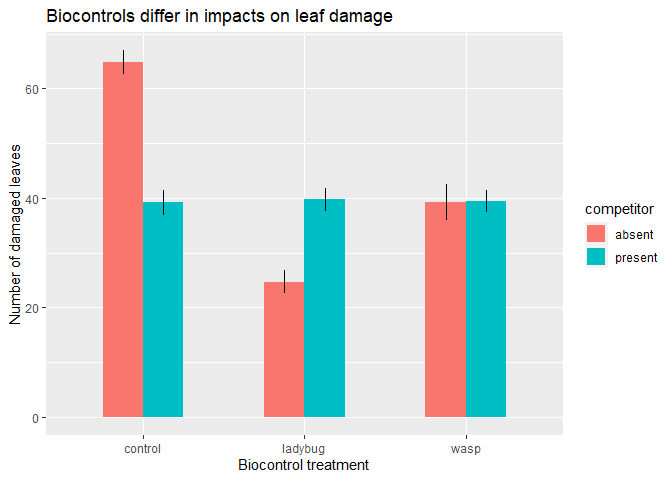<!-- -->
