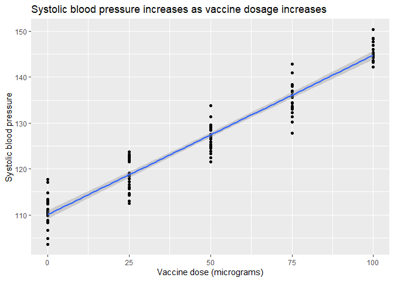
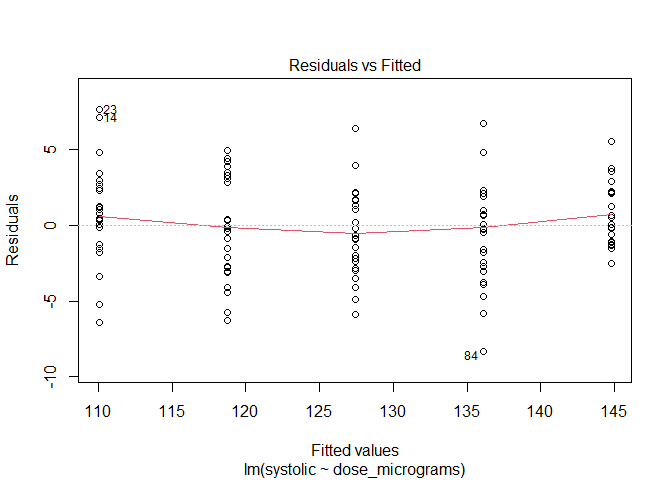
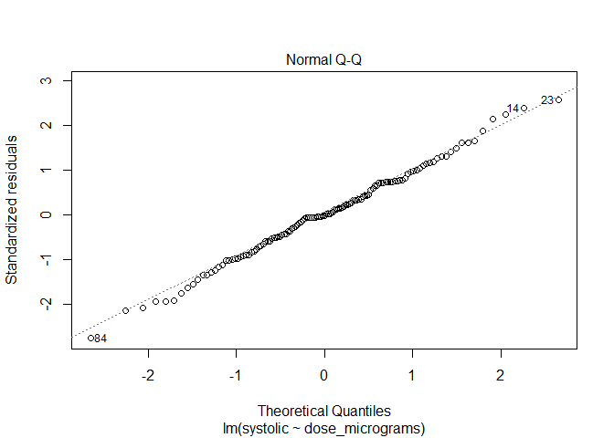
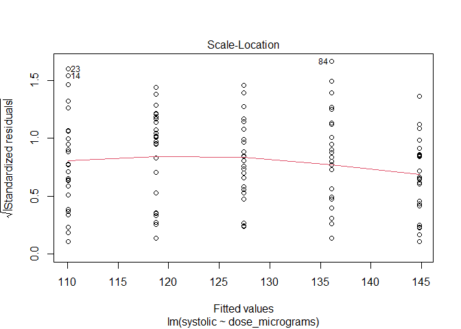
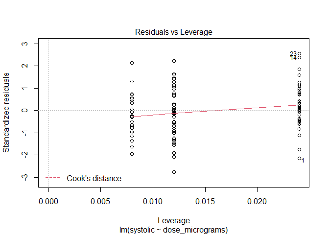

Quiz 8
================
jsg
11/18/2020

# Vaccine effectiveness

A recent study of the new coronavirus vaccine produced by Johnson and
Johnson led to a surprising result. Lower dosages of the vaccine led to
a higher effectiveness. Typically one would assume that higher dosages
are better.

Higher dosages, however, may lead to more side effects and also impact
availability. Imagine a study considering dosage level (of a different
vaccine) impacts on systolic blood pressure (a potential side effect).
Data can be found at

``` r
dosage <- read.csv("https://docs.google.com/spreadsheets/d/e/2PACX-1vSEsIPp-49ERvzN2EAC37NrSr9GLsWFTVgIIjBxGwloYoxz5mpUTJ2KCH7kXVxBGLtg9eSLs6YIx32E/pub?gid=993951219&single=true&output=csv", stringsAsFactors = T)
```

How would you evaluate the results?

Make sure your answers include

-   null hypothesis

*There is no relationship between dosage level and systolic blood
pressure.* B=0

-   alternative hypothesis

*There is a relationship between dosage level and systolic blood
pressure.* B!=0

-   graph that clearly displays the data and represents these hypotheses

``` r
library(ggplot2)
ggplot(dosage, aes(x=dose_micrograms, y=systolic)) +
         geom_point()+
         geom_smooth(method = "lm")+
         xlab("Vaccine dose (micrograms)")+
         ylab("Systolic blood pressure")+
         ggtitle("Systolic blood pressure increases as vaccine dosage increases")
```

    ## `geom_smooth()` using formula 'y ~ x'

<!-- -->

-   explanation for test you will use

*I would test for a relationship using regression. The dosage levels
were preset, and both the response and explanatory variables are
continuous.*

-   results from statistical test (including post-hoc tests if needed
    and indication of how much variation the model explains!)

``` r
impacts <- lm(systolic~dose_micrograms, dosage)
plot(impacts)
```

<!-- --><!-- --><!-- --><!-- -->

``` r
library(car)
Anova(impacts, type = "III")
```

    ## Anova Table (Type III tests)
    ## 
    ## Response: systolic
    ##                 Sum Sq  Df F value    Pr(>F)    
    ## (Intercept)     504575   1 55154.5 < 2.2e-16 ***
    ## dose_micrograms  18843   1  2059.7 < 2.2e-16 ***
    ## Residuals         1125 123                      
    ## ---
    ## Signif. codes:  0 '***' 0.001 '**' 0.01 '*' 0.05 '.' 0.1 ' ' 1

``` r
summary(impacts)
```

    ## 
    ## Call:
    ## lm(formula = systolic ~ dose_micrograms, data = dosage)
    ## 
    ## Residuals:
    ##     Min      1Q  Median      3Q     Max 
    ## -8.3186 -1.8108 -0.0553  2.1313  7.6628 
    ## 
    ## Coefficients:
    ##                  Estimate Std. Error t value Pr(>|t|)    
    ## (Intercept)     1.100e+02  4.686e-01  234.85   <2e-16 ***
    ## dose_micrograms 3.473e-01  7.652e-03   45.38   <2e-16 ***
    ## ---
    ## Signif. codes:  0 '***' 0.001 '**' 0.01 '*' 0.05 '.' 0.1 ' ' 1
    ## 
    ## Residual standard error: 3.025 on 123 degrees of freedom
    ## Multiple R-squared:  0.9436, Adjusted R-squared:  0.9432 
    ## F-statistic:  2060 on 1 and 123 DF,  p-value: < 2.2e-16

*I first ensured model assumptions were met. Plots show no patterns in
residuals and a relatively normal distribution, which means they are.
Analysis indicates a significant relationship between dose and systolic
blood pressure (F<sub>1,123</sub>=2059, p\<.001), so I reject the null
hypothesis. Model analysis indicates dosage level explains 94% of the
variation in blood pressure (this an example!). There is no need for
post-hoc tests in regression!*

-   clear explanation of how results relate to your stated hypotheses

*noted above.*
