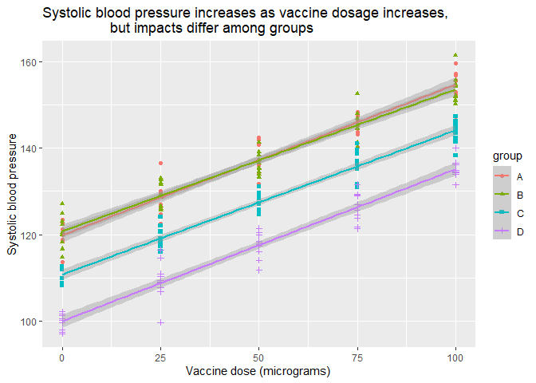
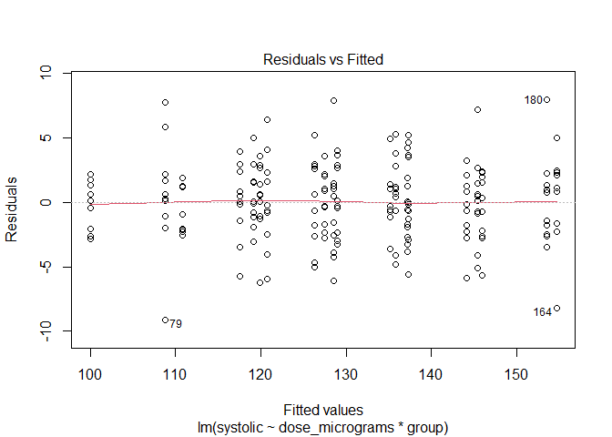
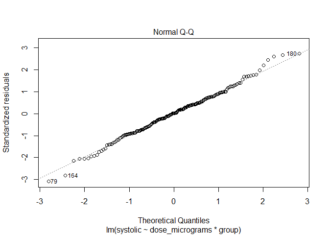
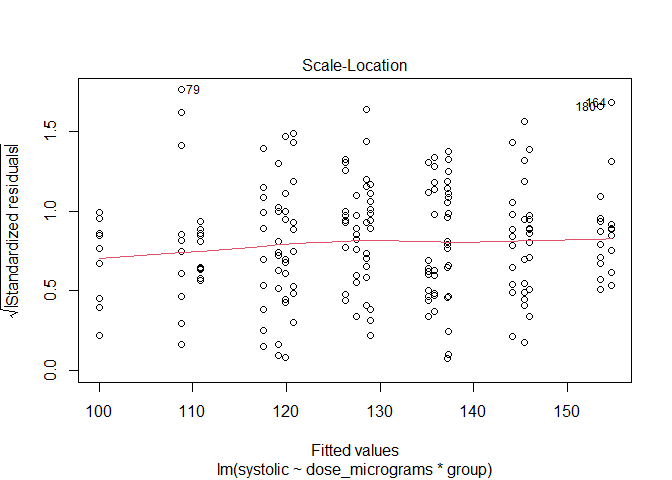
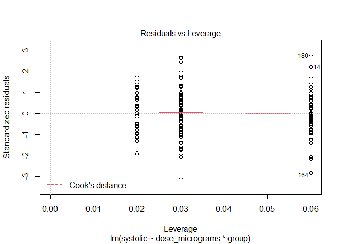
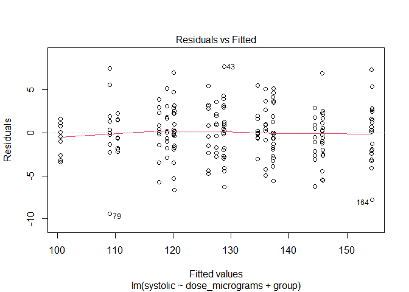
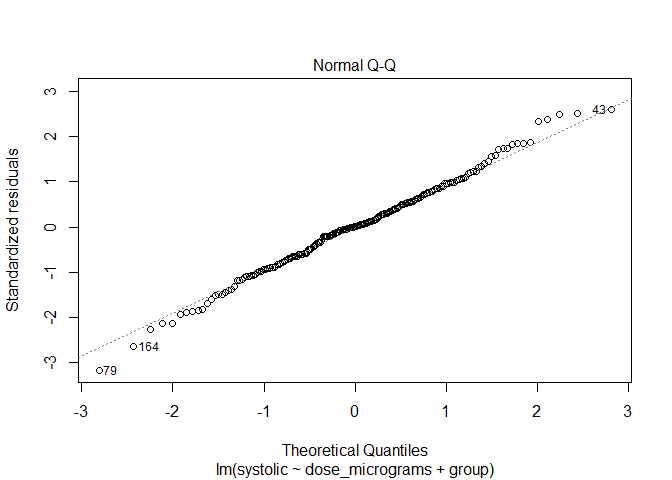
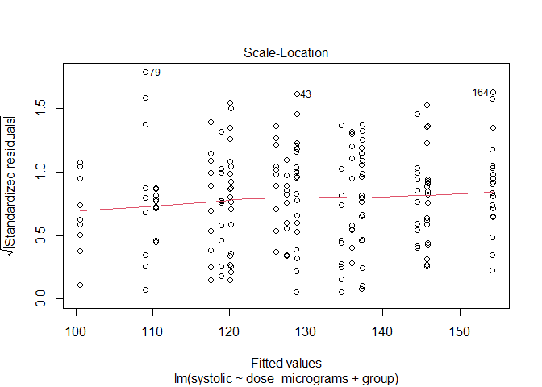
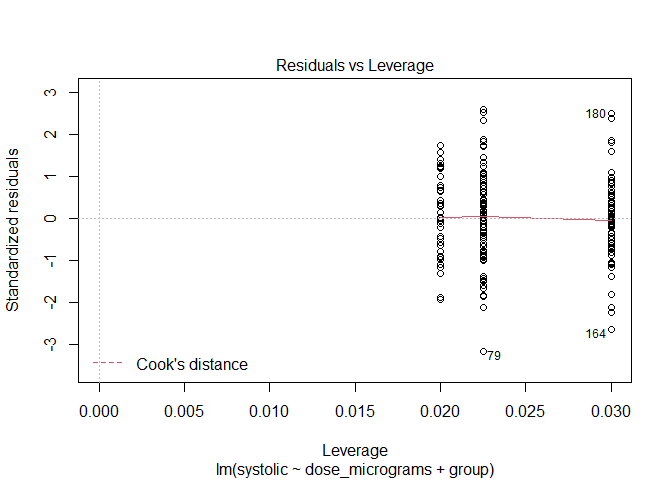

Quiz 9
================
jsg
11/18/2020

# Vaccine effectiveness

An earlier study (Quiz 8) focused on a relationship between dosage and
systolic blood pressure). A follow-up wanted to consider if ethnicity
impacted this relationship. Data were collected from 4 different groups
(labeled A-D here) on vaccine dosage level and systolic blood pressure.
Data can be found at

``` r
dosage_group <- read.csv("https://docs.google.com/spreadsheets/d/e/2PACX-1vSXfNA4nl1SRK6BDxfJqo7izW254hxP8N4tjK9snXZngfgQFJ3aeKlg5EAAWPfrStv_61e3FKsAOjjx/pub?gid=73925069&single=true&output=csv", stringsAsFactors = T)
```

How would you evaluate the results?

Make sure your answers include

-   null hypothesis

*We have three null hypotheses here*:

-   *There is no difference in systolic blood pressure based on dosage*

-   *There is no difference in systolic blood pressure based on group*

-   *There is no interaction between group and dosage agent on systolic
    blood pressure*

-   alternative hypothesis

*We have three alternative hypotheses here*:

-   *There is a difference in systolic blood pressure based on dosage*

-   *There is a difference in systolic blood pressure based on group*

-   *There is an interaction between group and dosage agent on systolic
    blood pressure*

-   graph that clearly displays the data and represents these hypotheses

``` r
library(ggplot2)
ggplot(dosage_group, aes(x=dose_micrograms, y=systolic, shape = group, 
                         color = group)) +
         geom_point()+
         geom_smooth(method="lm")+
         xlab("Vaccine dose (micrograms)")+
         ylab("Systolic blood pressure")+
         ggtitle("Systolic blood pressure increases as vaccine dosage increases,
                 but impacts differ among groups")
```

    ## `geom_smooth()` using formula 'y ~ x'

<!-- -->

-   explanation for test you will use

*I will use an ANCOVA here. The explanatory variables combine a
continuous and categorial variable, the outcome is continuous and should
follow a normal distribution (so should meet model assumptions).*

-   results from statistical test (including post-hoc tests if needed
    and indication of how much variation the model explains!)

``` r
impacts_group <- lm(systolic~dose_micrograms*group, dosage_group)
plot(impacts_group)
```

<!-- --><!-- --><!-- --><!-- -->

``` r
library(car)
Anova(impacts_group, type = "III")
```

    ## Anova Table (Type III tests)
    ## 
    ## Response: systolic
    ##                       Sum Sq  Df    F value Pr(>F)    
    ## (Intercept)           239438   1 26637.0715 <2e-16 ***
    ## dose_micrograms         7586   1   843.9175 <2e-16 ***
    ## group                   4694   3   174.0549 <2e-16 ***
    ## dose_micrograms:group     24   3     0.8739 0.4556    
    ## Residuals               1726 192                      
    ## ---
    ## Signif. codes:  0 '***' 0.001 '**' 0.01 '*' 0.05 '.' 0.1 ' ' 1

*I first ensured model assumptions were met. Plots show no patterns in
residuals and a relatively normal distribution, which means they are.
Analysis indicates no significant interaction between dose and group on
systolic blood pressure (F<sub>3,192</sub>=.87,p = .46), so I fail to
reject the null hypothesis that an interaction does note exist. Given
this, I remove the interaction from the model.*

``` r
impacts_group <- lm(systolic~dose_micrograms+group, dosage_group)
plot(impacts_group)
```

<!-- --><!-- --><!-- --><!-- -->

``` r
Anova(impacts_group, type = "III")
```

    ## Anova Table (Type III tests)
    ## 
    ## Response: systolic
    ##                 Sum Sq  Df  F value    Pr(>F)    
    ## (Intercept)     482006   1 53726.50 < 2.2e-16 ***
    ## dose_micrograms  28997   1  3232.12 < 2.2e-16 ***
    ## group            13280   3   493.43 < 2.2e-16 ***
    ## Residuals         1749 195                       
    ## ---
    ## Signif. codes:  0 '***' 0.001 '**' 0.01 '*' 0.05 '.' 0.1 ' ' 1

``` r
library(multcomp)
group_compare <-glht(impacts_group, linfct = mcp(group = "Tukey"))
summary(group_compare)
```

    ## 
    ##   Simultaneous Tests for General Linear Hypotheses
    ## 
    ## Multiple Comparisons of Means: Tukey Contrasts
    ## 
    ## 
    ## Fit: lm(formula = systolic ~ dose_micrograms + group, data = dosage_group)
    ## 
    ## Linear Hypotheses:
    ##            Estimate Std. Error t value Pr(>|t|)    
    ## B - A == 0  -0.1019     0.5990   -0.17    0.998    
    ## C - A == 0  -9.8162     0.5990  -16.39   <1e-06 ***
    ## D - A == 0 -19.7187     0.5990  -32.92   <1e-06 ***
    ## C - B == 0  -9.7142     0.5990  -16.22   <1e-06 ***
    ## D - B == 0 -19.6167     0.5990  -32.75   <1e-06 ***
    ## D - C == 0  -9.9025     0.5990  -16.53   <1e-06 ***
    ## ---
    ## Signif. codes:  0 '***' 0.001 '**' 0.01 '*' 0.05 '.' 0.1 ' ' 1
    ## (Adjusted p values reported -- single-step method)

``` r
summary(impacts_group)
```

    ## 
    ## Call:
    ## lm(formula = systolic ~ dose_micrograms + group, data = dosage_group)
    ## 
    ## Residuals:
    ##     Min      1Q  Median      3Q     Max 
    ## -9.3983 -1.9438  0.0276  1.8140  7.6927 
    ## 
    ## Coefficients:
    ##                  Estimate Std. Error t value Pr(>|t|)    
    ## (Intercept)     120.25044    0.51879  231.79   <2e-16 ***
    ## dose_micrograms   0.34057    0.00599   56.85   <2e-16 ***
    ## groupB           -0.10194    0.59905   -0.17    0.865    
    ## groupC           -9.81616    0.59905  -16.39   <2e-16 ***
    ## groupD          -19.71865    0.59905  -32.92   <2e-16 ***
    ## ---
    ## Signif. codes:  0 '***' 0.001 '**' 0.01 '*' 0.05 '.' 0.1 ' ' 1
    ## 
    ## Residual standard error: 2.995 on 195 degrees of freedom
    ## Multiple R-squared:  0.9603, Adjusted R-squared:  0.9594 
    ## F-statistic:  1178 on 4 and 195 DF,  p-value: < 2.2e-16

*Analysis of the reduced model suggests that both dosage
(F<sub>1,195</sub>=3232, p \<.01) and group (F<sub>3,195</sub>=493, p
\<.01) have a significant impact on systolic blood pressure, so I reject
both related null hypotheses. Since there are more than 2 groups, I used
post-hoc tests to determine which groups were different. Analysis using
Tukey tests shows that groups A and B do not differ, but all other
possible pairs are significantly different. Full model analysis
indicates dosage level and group explains 96% of the variation in blood
pressure (this an example!).*

-   clear explanation of how results relate to your stated hypotheses

*noted above.*
