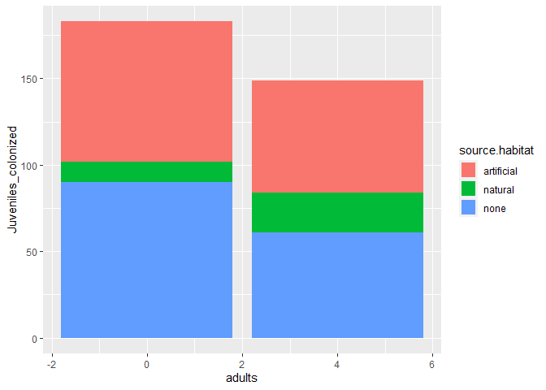
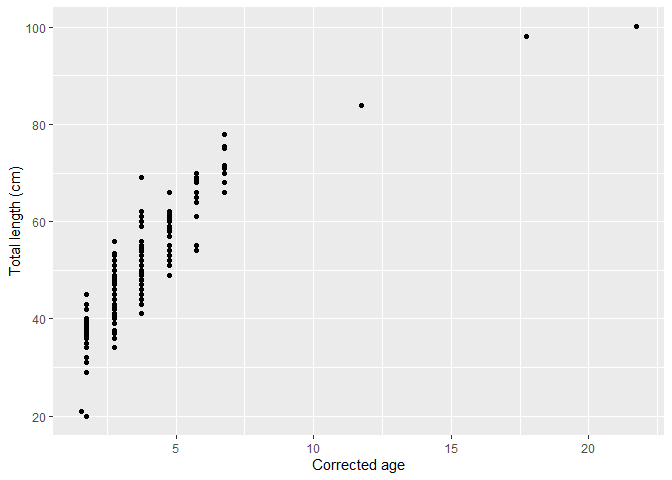
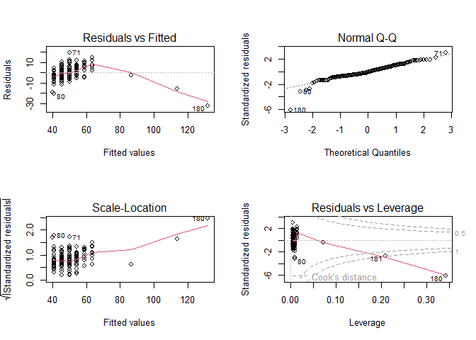

# Instructions! Read this first.

The exam is open note, open course website, open class-related code repositories 
(mine and those you produced in class). However, you may not get external help (
from other students, directed internet searches, etc.).  Please update the statement
below to acknowledge these instructions (and that you can use git).

I, INSERT YOUR NAME HERE, promise to not seek external help on the exam. I 
understand any academic issues will result in a D or F on the exam or in the class
and be reported to the Dean of Students. 

Good luck!

# Amphipods!

Following up on #1 - 3 from class. As a reminder/intro:

>A colleague studying reef organisms wanted to consider if the willingness of 
juvenile amphipods to disperse to a novel algal habitat is impacted by the current 
habitat they inhabit or presence of adult amphipods on the novel habitat.  In a lab
study, they stocked portions of aquariums with pieces of algal (the novel piece of 
algae, below).  Half the algae pieces had adult residents (4 total; the species 
builds tubes to live on algae) while the other half had no adult residents.  
Juvenile amphods (16 total) were then added to the aquarium. Juveniles were placed on 
one of 3 habitats (natural substrate, artificial substrate, or bare (no substrate). 
The experiment had 6  replicates for each habitat-adult combination. After 
24 hours your colleague counted the number of juveniles that had moved to the
novel piece of algae.  

>Their PI helped them design the study, but they lost the notes from the initial
meetings.  They ask for  your help in determining how they should analyze the data.


## 1

1. Data can be downloaded using


```r
juvenile <- read.csv ("https://raw.githubusercontent.com/jsgosnell/CUNY-BioStats/master/datasets/juvenile_colonizer.csv", stringsAsFactors = T)
```

Help them analyze it correctly (maybe like you recommended in class, or not!). 
Make sure you include

* null hypothesis (1 pt)
* alternative hypothesis (1 pt)
* explanation for test you will use (1 pt)
* results from statistical test (1 pt)
* clear explanation of how results relate to your stated hypotheses (2 pt)


## 2 

2. As a reminder/intro (from 78001 exam), your friend shared this graph with you
from the data:


```r
library(ggplot2)
ggplot(juvenile, aes(x=adults, y=Juveniles_colonized, fill = source.habitat)) +
         geom_col(size = 3)
```

```
## Warning: Using `size` aesthetic for lines was deprecated in ggplot2 3.4.0.
## ℹ Please use `linewidth` instead.
## This warning is displayed once every 8 hours.
## Call `lifecycle::last_lifecycle_warnings()` to see where this warning was
## generated.
```

<!-- -->

Update the graph to better display the data.

# Twitter

## 3


3. Following up on the class question where you designed a study to see if 
Twitter impacts citations - someone actually did this!

Authors collected Twitter activity (defined here to include three metrics: number 
of tweets, number of users, Twitter reach) and citation data on articles (from
Web of Science) 
from twenty journals that publish only ecological research. They randomly 
selected 
three articles from each issue of each journal.  They also have info
on when article was published, when twitter activty was collected (Collection.date),
and other columns (ask if needed!).   They selected
journals to represent a range of impact factors (identified from 
Thompson-Reuters 2014 Journal Citation Reports1 database). Data is available @ 


```r
twitter <- read.csv("https://raw.githubusercontent.com/jsgosnell/CUNY-BioStats/master/datasets/S1Dataset.CSV")
str(twitter)
```

```
## 'data.frame':	1599 obs. of  12 variables:
##  $ Journal.identity                  : chr  "Ecology Letters" "Ecology Letters" "Ecology Letters" "Ecology Letters" ...
##  $ X5.year.journal.impact.factor     : num  16.7 16.7 16.7 16.7 16.7 16.7 16.7 16.7 16.7 16.7 ...
##  $ Year.published                    : int  2014 2014 2014 2014 2014 2014 2014 2014 2014 2014 ...
##  $ Volume                            : int  17 17 17 17 17 17 17 17 17 17 ...
##  $ Issue                             : chr  "12" "12" "12" "11" ...
##  $ Authors                           : chr  "Morin et al" "Jucker et al" "Calcagno et al" "Segre et al" ...
##  $ Collection.date                   : chr  "2/1/2016" "2/1/2016" "2/1/2016" "2/1/2016" ...
##  $ Publication.date                  : chr  "9/16/2014" "10/13/2014" "10/21/2014" "8/28/2014" ...
##  $ Number.of.tweets                  : int  18 15 5 9 3 27 6 19 26 44 ...
##  $ Number.of.users                   : int  16 12 4 8 3 23 6 18 23 42 ...
##  $ Twitter.reach                     : int  29877 5997 1667 3482 1329 41906 12223 22020 23003 131788 ...
##  $ Number.of.Web.of.Science.citations: int  3 8 1 2 1 9 6 9 5 4 ...
```

How would you analyze the data? If it helps, note you change the Collection and 
Publication Date columns


```r
twitter$Publication.date <- as.Date(twitter$Publication.date, format =c("%m/%d/%Y"))
twitter$Collection.date <- as.Date(twitter$Collection.date, format =c("%m/%d/%Y"))
```

and that any math done on those columns returnds difference in days by default.

As appropriate, include

* null hypothesis 
* alternative hypothesis 
* explanation for test/procedure you will use 
* results from statistical test/procedure
* clear explanation of how results relate to your stated hypotheses 

# Reef fish

As a reminder/intro (from class exam) - **Note change in parameters!**

>Your colleague returns to you with another reef question. This time they are
trying to see how length impacts weight in a fish species. They collected and 
measured fish. They bring you this plot 

<!-- -->

> They also state they fit a “line R model” to the data. They made some graphs 
using code they found online..


<!-- -->

>And were very excited to get output using similarly borrowed code


```r
summary(bacalao_fit_lm)
```

```
## 
## Call:
## lm(formula = TL ~ age_corr, data = bacalao)
## 
## Residuals:
##     Min      1Q  Median      3Q     Max 
## -31.961  -3.790  -0.504   4.324  19.210 
## 
## Coefficients:
##             Estimate Std. Error t value Pr(>|t|)    
## (Intercept)  32.6498     0.9178   35.57   <2e-16 ***
## age_corr      4.5706     0.2108   21.69   <2e-16 ***
## ---
## Signif. codes:  0 '***' 0.001 '**' 0.01 '*' 0.05 '.' 0.1 ' ' 1
## 
## Residual standard error: 6.519 on 196 degrees of freedom
## Multiple R-squared:  0.7058,	Adjusted R-squared:  0.7043 
## F-statistic: 470.3 on 1 and 196 DF,  p-value: < 2.2e-16
```

>They are trying to write up the manuscript now, but are a little lost.  
Can you help them?

Anohter friend provided them with the following code


```r
bacalao_fit_nls <- nls(TL ~ Linf*(1-exp(-1*k*(age_corr-agezero))), bacalao, 
                       start = list(Linf = 110, k= .1, agezero = -1.7) )
```

which fits a von Bertannfy growth curve to the data.  Now they are even more 
confused.

## 4 

4. Explain (only words needed here) the difference among these models/functions.


## 5 

5. Can you compare the two approaches? Feel free to add another approach if you 
want (not required!).  Data can be imported using 


```r
bacalao <- read.csv("https://raw.githubusercontent.com/jsgosnell/CUNY-BioStats/master/datasets/bacalao.csv", header = T)
```

