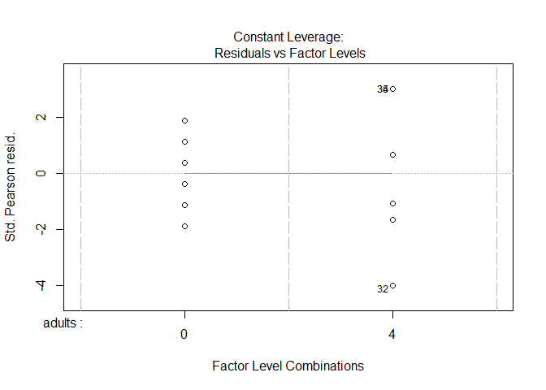
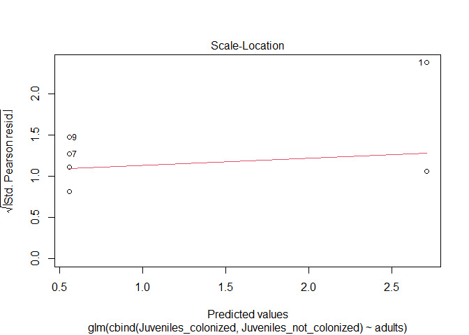

#Read this first.

These answers are meant for review **and** learning. In using real data I often
find methods we did not cover in class. They are demonstrated here but not required
for credit on exams.  Also, my final answers may not match what was in the 
inspiring/provided papers. This may be due to missing data or mistakes (or my part
most likely!), but it illustrates the benefits of sharing code!

# Amphipods!

Following up on #1 - 3 from class. As a reminder/intro:

>A colleague studying reef organisms wanted to consider if the willingness of 
juvenile amphipods to disperse to a novel algal habitat is impacted by the current 
habitat they inhabit or presence of adult amphipods on the novel habitat.  In a lab
study, they stocked portions of aquariums with pieces of algal (the novel piece of 
algae, below).  Half the algae pieces had adult residents (4 total; the species 
builds tubes to live on algae) while the other half had no adult residents.  
Juvenile amphods (16 total) were then added to the aquarium. Juveniles were placed on 
one of 3 habitats (natural substrate, artificial substrate, or bare (no substrate). 
The experiment had 6  replicates for each habitat-adult combination. After 
24 hours your colleague counted the number of juveniles that had moved to the
novel piece of algae.  

>Their PI helped them design the study, but they lost the notes from the initial
meetings.  They ask for  your help in determining how they should analyze the data.

## 1

1. Data can be downloaded using


```r
juvenile <- read.csv ("https://raw.githubusercontent.com/jsgosnell/CUNY-BioStats/master/datasets/juvenile_colonizer.csv", stringsAsFactors = T)
```

Help them analyze it correctly (maybe like you recommended in class, or not!). 
Make sure you include

* null hypothesis (1 pt)
* alternative hypothesis (1 pt)
* explanation for test/procedure you will use (1 pt)
* results from statistical test/procedure (1 pt)
* clear explanation of how results relate to your stated hypotheses (2 pt)

### Answer

Based on

Bueno M, Machado GBO, Leite FPP (2020) Colonization of novel algal habitats by 
juveniles of a marine tube-dwelling amphipod. PeerJ 8:e10188. https://doi.org/10.7717/peerj.10188

Data was in Supplement, focused on 
Presence_of_adults_lab tab.  I had to estimate raw numbers before 
uploading since proportion given and total ranged from 14-18; assumed 16 for all 
and multiplied by proportion (done in excel befoe uploading; also removed other 
odd info)

This is an example of a factorial-design, but the outcome is a proportion. For this
reason we will use a generalized linear model to analyze the data.  

* null hypothesis (1 pt)
  * H~O~: There is no impact on the habitat type juveniles start in on their 
  likelihood to move
  * H~O~: There is no impact on adult presence in the new habitat on the 
  likelihood of juveniles to move
  * H~O~:  There is no interaction between the impacts of the  habitat type 
  juveniles start in and  adult presence in the new habitat on the 
  likelihood of juveniles to move
* alternative hypothesis (1 pt)
  * H~A~: There is an impact on the habitat type juveniles start in on their 
  likelihood to move
  * H~A~: There is an impact on adult presence in the new habitat on the 
  likelihood of juveniles to move
  * H~A~:  There is an interaction between the impacts of the  habitat type 
  juveniles start in and  adult presence in the new habitat on the 
  likelihood of juveniles to move
* explanation for test you will use (1 pt)
  * As noted above, this is an example of a factorial-design, but the outcome is 
  a proportion. For thisreason we will use a generalized linear model to analyze the data. 
  

```r
str(juvenile)
```

```
## 'data.frame':	36 obs. of  5 variables:
##  $ source.habitat         : Factor w/ 3 levels "artificial","natural",..: 3 3 3 3 3 3 3 3 3 3 ...
##  $ adults                 : int  0 0 0 0 0 0 4 4 4 4 ...
##  $ replicate              : int  1 2 3 4 5 6 1 2 3 4 ...
##  $ Juveniles_colonized    : int  10 16 16 16 16 16 13 9 14 8 ...
##  $ Juveniles_not_colonized: int  6 0 0 0 0 0 3 7 2 8 ...
```
  
Let's make adults a factor  
  

```r
juvenile$adults <- factor(juvenile$adults)
```

and fit a glm using the binomial family.


```r
juvenile_fit_glm <- glm(cbind(Juveniles_colonized, Juveniles_not_colonized) ~ adults*source.habitat, 
    juvenile, family = "binomial")
```

Check assumptions

```r
plot(juvenile_fit_glm)
```

<!-- --><!-- --><!-- --><!-- -->

```r
summary(juvenile_fit_glm)
```

```
## 
## Call:
## glm(formula = cbind(Juveniles_colonized, Juveniles_not_colonized) ~ 
##     adults * source.habitat, family = "binomial", data = juvenile)
## 
## Deviance Residuals: 
##     Min       1Q   Median       3Q      Max  
## -3.6595  -0.9587   0.2259   1.4371   3.5325  
## 
## Coefficients:
##                               Estimate Std. Error z value Pr(>|z|)    
## (Intercept)                     1.6864     0.2811   5.999 1.98e-09 ***
## adults4                        -0.9460     0.3559  -2.658  0.00786 ** 
## source.habitatnatural          -3.6323     0.4174  -8.702  < 2e-16 ***
## source.habitatnone              1.0217     0.5067   2.016  0.04379 *  
## adults4:source.habitatnatural   1.7369     0.5283   3.288  0.00101 ** 
## adults4:source.habitatnone     -1.2065     0.5911  -2.041  0.04123 *  
## ---
## Signif. codes:  0 '***' 0.001 '**' 0.01 '*' 0.05 '.' 0.1 ' ' 1
## 
## (Dispersion parameter for binomial family taken to be 1)
## 
##     Null deviance: 326.754  on 35  degrees of freedom
## Residual deviance:  94.633  on 30  degrees of freedom
## AIC: 185.06
## 
## Number of Fisher Scoring iterations: 5
```
Plots look fine. Dispersion is a little high (~90/30, so ~3), so you may want to
use a quasi-binomial, but not required


```r
library(car)
```

```
## Loading required package: carData
```

```r
Anova(juvenile_fit_glm, type = "III")
```

```
## Analysis of Deviance Table (Type III tests)
## 
## Response: cbind(Juveniles_colonized, Juveniles_not_colonized)
##                       LR Chisq Df Pr(>Chisq)    
## adults                   7.440  1   0.006378 ** 
## source.habitat         177.421  2  < 2.2e-16 ***
## adults:source.habitat   27.842  2      9e-07 ***
## ---
## Signif. codes:  0 '***' 0.001 '**' 0.01 '*' 0.05 '.' 0.1 ' ' 1
```

Interaction is significant, so we should divide the data.  Before we do that, let's 
compare the various fits (not required for test) (**Note**: I'm not sure this is 
valid - can we use AIC to compare different likelihood methods given different outcomes?)


```r
juvenile_fit_lm <- lm(Juveniles_colonized ~ adults*source.habitat, 
    juvenile)
juvenile_fit_quasi <- glm(cbind(Juveniles_colonized, Juveniles_not_colonized) ~ adults*source.habitat, 
    juvenile, family = "quasibinomial")
AIC(juvenile_fit_lm, juvenile_fit_glm, juvenile_fit_quasi)
```

```
##                    df      AIC
## juvenile_fit_lm     7 180.9987
## juvenile_fit_glm    6 185.0645
## juvenile_fit_quasi  6       NA
```

Note we can't compare the quasi fit!  But in general


```r
summary(juvenile_fit_quasi)
```

```
## 
## Call:
## glm(formula = cbind(Juveniles_colonized, Juveniles_not_colonized) ~ 
##     adults * source.habitat, family = "quasibinomial", data = juvenile)
## 
## Deviance Residuals: 
##     Min       1Q   Median       3Q      Max  
## -3.6595  -0.9587   0.2259   1.4371   3.5325  
## 
## Coefficients:
##                               Estimate Std. Error t value Pr(>|t|)    
## (Intercept)                     1.6864     0.4887   3.450  0.00168 ** 
## adults4                        -0.9460     0.6188  -1.529  0.13679    
## source.habitatnatural          -3.6323     0.7258  -5.005  2.3e-05 ***
## source.habitatnone              1.0217     0.8811   1.160  0.25538    
## adults4:source.habitatnatural   1.7369     0.9185   1.891  0.06831 .  
## adults4:source.habitatnone     -1.2065     1.0278  -1.174  0.24965    
## ---
## Signif. codes:  0 '***' 0.001 '**' 0.01 '*' 0.05 '.' 0.1 ' ' 1
## 
## (Dispersion parameter for quasibinomial family taken to be 3.023202)
## 
##     Null deviance: 326.754  on 35  degrees of freedom
## Residual deviance:  94.633  on 30  degrees of freedom
## AIC: NA
## 
## Number of Fisher Scoring iterations: 5
```

```r
Anova(juvenile_fit_quasi, type = "III")
```

```
## Analysis of Deviance Table (Type III tests)
## 
## Response: cbind(Juveniles_colonized, Juveniles_not_colonized)
##                       LR Chisq Df Pr(>Chisq)    
## adults                   2.461  1     0.1167    
## source.habitat          58.687  2  1.805e-13 ***
## adults:source.habitat    9.209  2     0.0100 *  
## ---
## Signif. codes:  0 '***' 0.001 '**' 0.01 '*' 0.05 '.' 0.1 ' ' 1
```

Similar results. Showing outcome with binomial fit below for each habitat type

Artificial


```r
juvenile_fit_art <- glm(cbind(Juveniles_colonized, Juveniles_not_colonized) ~ adults, 
    juvenile[juvenile$source.habitat == "artificial",], family = "binomial")
plot(juvenile_fit_art)
```

<!-- --><!-- --><!-- --><!-- -->

```r
summary(juvenile_fit_art)
```

```
## 
## Call:
## glm(formula = cbind(Juveniles_colonized, Juveniles_not_colonized) ~ 
##     adults, family = "binomial", data = juvenile[juvenile$source.habitat == 
##     "artificial", ])
## 
## Deviance Residuals: 
##     Min       1Q   Median       3Q      Max  
## -3.5005  -1.0906   0.0094   1.4473   3.5325  
## 
## Coefficients:
##             Estimate Std. Error z value Pr(>|z|)    
## (Intercept)   1.6864     0.2811   6.000 1.98e-09 ***
## adults4      -0.9460     0.3559  -2.658  0.00786 ** 
## ---
## Signif. codes:  0 '***' 0.001 '**' 0.01 '*' 0.05 '.' 0.1 ' ' 1
## 
## (Dispersion parameter for binomial family taken to be 1)
## 
##     Null deviance: 58.48  on 11  degrees of freedom
## Residual deviance: 51.04  on 10  degrees of freedom
## AIC: 80.795
## 
## Number of Fisher Scoring iterations: 4
```

```r
Anova(juvenile_fit_art, type = "III")
```

```
## Analysis of Deviance Table (Type III tests)
## 
## Response: cbind(Juveniles_colonized, Juveniles_not_colonized)
##        LR Chisq Df Pr(>Chisq)   
## adults   7.4402  1   0.006378 **
## ---
## Signif. codes:  0 '***' 0.001 '**' 0.01 '*' 0.05 '.' 0.1 ' ' 1
```


```r
juvenile_fit_nat <- glm(cbind(Juveniles_colonized, Juveniles_not_colonized) ~ adults, 
    juvenile[juvenile$source.habitat == "natural",], family = "binomial")
plot(juvenile_fit_nat)
```

<!-- --><!-- --><!-- --><!-- -->

```r
summary(juvenile_fit_nat)
```

```
## 
## Call:
## glm(formula = cbind(Juveniles_colonized, Juveniles_not_colonized) ~ 
##     adults, family = "binomial", data = juvenile[juvenile$source.habitat == 
##     "natural", ])
## 
## Deviance Residuals: 
##      Min        1Q    Median        3Q       Max  
## -1.89553  -0.82674   0.04857   0.67495   1.20582  
## 
## Coefficients:
##             Estimate Std. Error z value Pr(>|z|)    
## (Intercept)  -1.9459     0.3086  -6.305 2.87e-10 ***
## adults4       0.7909     0.3904   2.026   0.0428 *  
## ---
## Signif. codes:  0 '***' 0.001 '**' 0.01 '*' 0.05 '.' 0.1 ' ' 1
## 
## (Dispersion parameter for binomial family taken to be 1)
## 
##     Null deviance: 13.9295  on 11  degrees of freedom
## Residual deviance:  9.6417  on 10  degrees of freedom
## AIC: 44.865
## 
## Number of Fisher Scoring iterations: 4
```

```r
Anova(juvenile_fit_nat, type = "III")
```

```
## Analysis of Deviance Table (Type III tests)
## 
## Response: cbind(Juveniles_colonized, Juveniles_not_colonized)
##        LR Chisq Df Pr(>Chisq)  
## adults   4.2878  1    0.03839 *
## ---
## Signif. codes:  0 '***' 0.001 '**' 0.01 '*' 0.05 '.' 0.1 ' ' 1
```

None


```r
juvenile_fit_none <- glm(cbind(Juveniles_colonized, Juveniles_not_colonized) ~ adults, 
    juvenile[juvenile$source.habitat == "none",], family = "binomial")
plot(juvenile_fit_none)
```

<!-- --><!-- --><!-- --><!-- -->

```r
summary(juvenile_fit_none)
```

```
## 
## Call:
## glm(formula = cbind(Juveniles_colonized, Juveniles_not_colonized) ~ 
##     adults, family = "binomial", data = juvenile[juvenile$source.habitat == 
##     "none", ])
## 
## Deviance Residuals: 
##     Min       1Q   Median       3Q      Max  
## -3.6595  -0.7251   1.4371   1.4371   2.1626  
## 
## Coefficients:
##             Estimate Std. Error z value Pr(>|z|)    
## (Intercept)   2.7081     0.4216   6.423 1.34e-10 ***
## adults4      -2.1525     0.4719  -4.561 5.09e-06 ***
## ---
## Signif. codes:  0 '***' 0.001 '**' 0.01 '*' 0.05 '.' 0.1 ' ' 1
## 
## (Dispersion parameter for binomial family taken to be 1)
## 
##     Null deviance: 62.256  on 11  degrees of freedom
## Residual deviance: 33.951  on 10  degrees of freedom
## AIC: 59.405
## 
## Number of Fisher Scoring iterations: 5
```

```r
Anova(juvenile_fit_none, type = "III")
```

```
## Analysis of Deviance Table (Type III tests)
## 
## Response: cbind(Juveniles_colonized, Juveniles_not_colonized)
##        LR Chisq Df Pr(>Chisq)    
## adults   28.305  1  1.036e-07 ***
## ---
## Signif. codes:  0 '***' 0.001 '**' 0.01 '*' 0.05 '.' 0.1 ' ' 1
```

* results from statistical test (1 pt) and 
* clear explanation of how results relate to your stated hypotheses (2 pt)

We have a significant interaction between habitat type and adult presence 
($\chi$^2 = 27.8, p<.001).  Analysis of each habitat type indicates adults always
influence movement, but in different ways.  Adults reduce movement from artificial and none substrate but increase it from natural
To interpret the coefficients in odds ratios (or see them) note


```r
coef(juvenile_fit_art)[2]
```

```
##    adults4 
## -0.9459989
```

```r
exp(coef(juvenile_fit_art)[2])
```

```
##   adults4 
## 0.3882915
```

```r
coef(juvenile_fit_none)[2]
```

```
##   adults4 
## -2.152524
```

```r
exp(coef(juvenile_fit_none)[2])
```

```
##   adults4 
## 0.1161905
```

```r
coef(juvenile_fit_nat)[2]
```

```
##   adults4 
## 0.7909449
```

```r
exp(coef(juvenile_fit_nat)[2])
```

```
##  adults4 
## 2.205479
```

A common question is comparing these. Though difficult with interactions, I would note the confidence intervals don't overlap (again, not required!).

## 2 

2. As a reminder/intro (from 78001 exam), your friend shared this graph with you
from the data:


```r
library(ggplot2)
ggplot(juvenile, aes(x=adults, y=Juveniles_colonized, fill = source.habitat)) +
         geom_col(size = 3)
```

```
## Warning: Using `size` aesthetic for lines was deprecated in ggplot2 3.4.0.
## ℹ Please use `linewidth` instead.
## This warning is displayed once every 8 hours.
## Call `lifecycle::last_lifecycle_warnings()` to see where this warning was
## generated.
```

<!-- -->

Update the graph to better display the data.

### Answer

Lots of options here. We can make a proportion column (most common and what
auhors did):


```r
juvenile$proportion <- juvenile$Juveniles_colonized/16

library(ggplot2)
ggplot(juvenile, aes(x=source.habitat, y=proportion, fill = adults)) +
  geom_boxplot()
```

<!-- -->

```r
library(Rmisc)
```

```
## Loading required package: lattice
```

```
## Loading required package: plyr
```

```r
summary_juvenile <- summarySE(juvenile, measurevar = "proportion",
                              groupvars = c("adults", "source.habitat"))
ggplot(summary_juvenile, aes(x=source.habitat, y=proportion, fill = adults)) +
         geom_col(size = 3, position = "dodge") +
  geom_errorbar(aes(ymin=proportion-ci, ymax=proportion+ci), size=1.5, position = "dodge")
```

<!-- -->

# Twitter

## 3


3. Following up on the class question where you designed a study to see if 
Twitter impacts citations - someone actually did this!

Authors collected Twitter activity (defined here to include three metrics: number 
of tweets, number of users, Twitter reach) and citation data on articles (from
Web of Science) 
from twenty journals that publish only ecological research. They randomly 
selected 
three articles from each issue of each journal.  They also have info
on when article was published, when twitter activty was collected (Collection.date),
and other columns (ask if needed!).   They selected
journals to represent a range of impact factors (identified from 
Thompson-Reuters 2014 Journal Citation Reports1 database). Data is available @ 


```r
twitter <- read.csv("https://raw.githubusercontent.com/jsgosnell/CUNY-BioStats/master/datasets/S1Dataset.CSV")
str(twitter)
```

```
## 'data.frame':	1599 obs. of  12 variables:
##  $ Journal.identity                  : chr  "Ecology Letters" "Ecology Letters" "Ecology Letters" "Ecology Letters" ...
##  $ X5.year.journal.impact.factor     : num  16.7 16.7 16.7 16.7 16.7 16.7 16.7 16.7 16.7 16.7 ...
##  $ Year.published                    : int  2014 2014 2014 2014 2014 2014 2014 2014 2014 2014 ...
##  $ Volume                            : int  17 17 17 17 17 17 17 17 17 17 ...
##  $ Issue                             : chr  "12" "12" "12" "11" ...
##  $ Authors                           : chr  "Morin et al" "Jucker et al" "Calcagno et al" "Segre et al" ...
##  $ Collection.date                   : chr  "2/1/2016" "2/1/2016" "2/1/2016" "2/1/2016" ...
##  $ Publication.date                  : chr  "9/16/2014" "10/13/2014" "10/21/2014" "8/28/2014" ...
##  $ Number.of.tweets                  : int  18 15 5 9 3 27 6 19 26 44 ...
##  $ Number.of.users                   : int  16 12 4 8 3 23 6 18 23 42 ...
##  $ Twitter.reach                     : int  29877 5997 1667 3482 1329 41906 12223 22020 23003 131788 ...
##  $ Number.of.Web.of.Science.citations: int  3 8 1 2 1 9 6 9 5 4 ...
```

How would you analyze the data? If it helps, note you change the Collection and 
Publication Date columns


```r
twitter$Publication.date <- as.Date(twitter$Publication.date, format =c("%m/%d/%Y"))
twitter$Collection.date <- as.Date(twitter$Collection.date, format =c("%m/%d/%Y"))
```

and that any math done on those columns returnds difference in days by default.

As appropriate, include

* null hypothesis 
* alternative hypothesis 
* explanation for test/procedure you will use 
* results from statistical test/procedure
* clear explanation of how results relate to your stated hypotheses 

### Answer

Based on 

Peoples BK, Midway SR, Sackett D, et al (2016) Twitter Predicts Citation Rates of Ecological Research. PLOS ONE 11:e0166570. https://doi.org/10.1371/journal.pone.0166570

There are many ways to answer this. Below I try to recreate their approach and 
give general thoughts.

Most important, you need to note Journal is a random effect (or explain why you
only care about those 20!).  You also may want to control for how long an article
was live before data was collected.


```r
twitter$days_since_published <- twitter$Collection.date - twitter$Publication.date
head(twitter$days_since_published)
```

```
## Time differences in days
## [1] 503 476 468 522 522 554
```

If you want to use a large model approach, you should probably consider correlation 
among variables. Their method


```r
library(ggplot2)
library(GGally)
```

```
## Warning: package 'GGally' was built under R version 4.2.3
```

```
## Registered S3 method overwritten by 'GGally':
##   method from   
##   +.gg   ggplot2
```

```r
twitter$days_since_published <- as.numeric(twitter$days_since_published)
ggpairs(twitter[,names(twitter) %in% c("Number.of.Web.of.Science.citations", 
                                       "X5.year.journal.impact.factor",
                                      "Number.of.tweets", "Number.of.users",
                                      "Twitter.reach", "days_since_published")],
        progress = F)
```

<!-- -->

```r
ggcorr(twitter[,names(twitter) %in% c("Number.of.Web.of.Science.citations", 
                                       "X5.year.journal.impact.factor",
                                      "Number.of.tweets", "Number.of.users",
                                      "Twitter.reach", "days_since_published")],
       palette = "RdBu", label = TRUE)
```

<!-- -->

Number of users and Number of tweets is highly correlated, so just pick one (they
used number of tweets) and used *dredge* to consider all models.


```r
library(lme4)
```

```
## Warning: package 'lme4' was built under R version 4.2.3
```

```
## Loading required package: Matrix
```

```
## Warning: package 'Matrix' was built under R version 4.2.3
```

```r
twitter_fit_full <- lmer(Number.of.Web.of.Science.citations ~ 
                           Number.of.tweets + Twitter.reach + #twitter activity
                       X5.year.journal.impact.factor + days_since_published +  #things to control for
                     (1|Journal.identity), # random portion
                     twitter)
```

```
## Warning: Some predictor variables are on very different scales: consider
## rescaling
```

```r
library(MuMIn)
options(na.action = "na.fail")
twitter_fit_full_output <- dredge(twitter_fit_full)
```

```
## Warning in dredge(twitter_fit_full): comparing models fitted by REML
```

```
## Fixed term is "(Intercept)"
```

```
## Warning: Some predictor variables are on very different scales: consider
## rescaling
```

```
## Warning: Some predictor variables are on very different scales: consider
## rescaling

## Warning: Some predictor variables are on very different scales: consider
## rescaling

## Warning: Some predictor variables are on very different scales: consider
## rescaling

## Warning: Some predictor variables are on very different scales: consider
## rescaling

## Warning: Some predictor variables are on very different scales: consider
## rescaling

## Warning: Some predictor variables are on very different scales: consider
## rescaling

## Warning: Some predictor variables are on very different scales: consider
## rescaling
```

```r
#model.avg for output. can decide how far delta can go. look at dredge output
head(twitter_fit_full_output)
```

```
## Global model call: lmer(formula = Number.of.Web.of.Science.citations ~ Number.of.tweets + 
##     Twitter.reach + X5.year.journal.impact.factor + days_since_published + 
##     (1 | Journal.identity), data = twitter)
## ---
## Model selection table 
##      (Int) dys_snc_pbl Nmb.of.twt   Twt.rch X5.yer.jrn.imp.fct df    logLik
## 12 -12.490     0.01534    0.07070                        1.045  6 -6104.215
## 10 -11.750     0.01475                                   1.094  5 -6107.219
## 4   -5.906     0.01536    0.07442                               5 -6109.078
## 2   -4.791     0.01474                                          4 -6112.734
## 14 -12.100     0.01502            1.553e-05              1.065  6 -6113.820
## 16 -12.460     0.01531    0.05195 7.309e-06              1.045  7 -6114.611
##       AICc delta weight
## 12 12220.5  0.00  0.863
## 10 12224.5  3.99  0.117
## 4  12228.2  7.71  0.018
## 2  12233.5 13.01  0.001
## 14 12239.7 19.21  0.000
## 16 12243.3 22.81  0.000
## Models ranked by AICc(x) 
## Random terms (all models): 
##   1 | Journal.identity
```

```r
#can average top models
model.avg(twitter_fit_full_output, subset = weight > 0) #using weight, which they used
```

```
## 
## Call:
## model.avg(object = twitter_fit_full_output, subset = weight > 
##     0)
## 
## Component models: 
## '124'    '14'     '12'     '1'      '134'    '1234'   '13'     '123'    
## '4'      '(Null)' '24'     '2'      '34'     '234'    '3'      '23'    
## 
## Coefficients: 
##        (Intercept) days_since_published Number.of.tweets
## full      -12.2746           0.01526665       0.06238124
## subset    -12.2746           0.01526665       0.07077305
##        X5.year.journal.impact.factor Twitter.reach
## full                        1.030768  9.899436e-10
## subset                      1.051335  1.436488e-05
```

```r
#to get the top 1
top_model <- get.models(twitter_fit_full_output, subset = 1)[[1]]
top_model
```

```
## Linear mixed model fit by REML ['lmerMod']
## Formula: 
## Number.of.Web.of.Science.citations ~ days_since_published + Number.of.tweets +  
##     X5.year.journal.impact.factor + (1 | Journal.identity)
##    Data: twitter
## REML criterion at convergence: 12208.43
## Random effects:
##  Groups           Name        Std.Dev.
##  Journal.identity (Intercept)  3.361  
##  Residual                     10.818  
## Number of obs: 1599, groups:  Journal.identity, 20
## Fixed Effects:
##                   (Intercept)           days_since_published  
##                     -12.49239                        0.01534  
##              Number.of.tweets  X5.year.journal.impact.factor  
##                       0.07070                        1.04549
```

We find a top model that only includes Number of tweets (in addition to days
since published and IF), but we also have strong support for including Twitter reach

We also get a scaling warning.  What if we scale (not done in class!)?


```r
twitter_scaled <- twitter
twitter_scaled[,names(twitter_scaled) %in% c( 
                                       "X5.year.journal.impact.factor",
                                      "Number.of.tweets", "Number.of.users",
                                      "Twitter.reach", "days_since_published")] <-
  scale(twitter_scaled[,names(twitter_scaled) %in% c( 
                                       "X5.year.journal.impact.factor",
                                      "Number.of.tweets", "Number.of.users",
                                      "Twitter.reach", "days_since_published")])
summary(twitter_scaled)
```

```
##  Journal.identity   X5.year.journal.impact.factor Year.published
##  Length:1599        Min.   :-1.1306               Min.   :2012  
##  Class :character   1st Qu.:-0.5748               1st Qu.:2012  
##  Mode  :character   Median :-0.2373               Median :2013  
##                     Mean   : 0.0000               Mean   :2013  
##                     3rd Qu.: 0.2430               3rd Qu.:2014  
##                     Max.   : 3.2962               Max.   :2014  
##      Volume         Issue             Authors          Collection.date     
##  Min.   :  3.0   Length:1599        Length:1599        Min.   :2016-02-01  
##  1st Qu.: 16.0   Class :character   Class :character   1st Qu.:2016-02-26  
##  Median : 22.0   Mode  :character   Mode  :character   Median :2016-03-11  
##  Mean   : 47.9                                         Mean   :2016-03-10  
##  3rd Qu.: 66.0                                         3rd Qu.:2016-03-21  
##  Max.   :204.0                                         Max.   :2016-04-05  
##  Publication.date     Number.of.tweets   Number.of.users     Twitter.reach     
##  Min.   :2011-01-11   Min.   :-0.39748   Min.   :-0.459055   Min.   :-0.27055  
##  1st Qu.:2012-06-08   1st Qu.:-0.39748   1st Qu.:-0.459055   1st Qu.:-0.27055  
##  Median :2013-03-20   Median :-0.25696   Median :-0.276846   Median :-0.23225  
##  Mean   :2013-03-17   Mean   : 0.00000   Mean   : 0.000000   Mean   : 0.00000  
##  3rd Qu.:2014-01-03   3rd Qu.: 0.02408   3rd Qu.:-0.003533   3rd Qu.:-0.06802  
##  Max.   :2015-10-25   Max.   :23.70166   Max.   :16.213061   Max.   :12.36029  
##  Number.of.Web.of.Science.citations days_since_published
##  Min.   :  0.00                     Min.   :-2.849837   
##  1st Qu.:  4.00                     1st Qu.:-0.858275   
##  Median :  8.00                     Median :-0.008976   
##  Mean   : 11.88                     Mean   : 0.000000   
##  3rd Qu.: 15.00                     3rd Qu.: 0.862518   
##  Max.   :154.00                     Max.   : 2.411675
```

**Aside**: Notice scaling does not impact correlation! 


```r
ggpairs(twitter_scaled[,names(twitter_scaled) %in% c("Number.of.Web.of.Science.citations", 
                                       "X5.year.journal.impact.factor",
                                      "Number.of.tweets", "Number.of.users",
                                      "Twitter.reach", "days_since_published")],
        progress = F)
```

<!-- -->

```r
ggcorr(twitter_scaled[,names(twitter_scaled) %in% c("Number.of.Web.of.Science.citations", 
                                       "X5.year.journal.impact.factor",
                                      "Number.of.tweets", "Number.of.users",
                                      "Twitter.reach", "days_since_published")],
       palette = "RdBu", label = TRUE)
```

<!-- -->


```r
twitter_scaled_fit_full <- lmer(Number.of.Web.of.Science.citations ~ 
                           Number.of.tweets + Twitter.reach + #twitter_scaled activity
                       X5.year.journal.impact.factor + days_since_published +  #things to control for
                     (1|Journal.identity), # random portion
                     twitter_scaled)
options(na.action = "na.fail")
auto <- dredge(twitter_scaled_fit_full)
```

```
## Warning in dredge(twitter_scaled_fit_full): comparing models fitted by REML
```

```
## Fixed term is "(Intercept)"
```

```r
write.csv(auto, "dredge_output_scaled.csv", row.names = F)
```

```
## Warning in !is.null(modif) && modif %in% type2colname(column.types,
## protectedcoltypes): 'length(x) = 10 > 1' in coercion to 'logical(1)'
```

```r
#model.avg for output. can decide how far delta can go. look at dredge output
head(auto)
```

```
## Global model call: lmer(formula = Number.of.Web.of.Science.citations ~ Number.of.tweets + 
##     Twitter.reach + X5.year.journal.impact.factor + days_since_published + 
##     (1 | Journal.identity), data = twitter_scaled)
## ---
## Model selection table 
##    (Int) dys_snc_pbl Nmb.of.twt Twt.rch X5.yer.jrn.imp.fct df    logLik    AICc
## 12 11.56       5.182     1.0060                      3.187  6 -6094.622 12201.3
## 16 11.56       5.174     0.7394  0.4027              3.184  7 -6094.101 12202.3
## 14 11.58       5.077             0.8556              3.247  6 -6095.966 12204.0
## 10 11.60       4.984                                 3.336  5 -6100.282 12210.6
## 4  11.24       5.190     1.0590                             5 -6100.600 12211.2
## 8  11.24       5.181     0.7916  0.4037                     6 -6100.075 12212.2
##    delta weight
## 12  0.00  0.527
## 16  0.97  0.324
## 14  2.69  0.138
## 10  9.30  0.005
## 4   9.94  0.004
## 8  10.91  0.002
## Models ranked by AICc(x) 
## Random terms (all models): 
##   1 | Journal.identity
```

```r
#can average top models
model.avg(auto, subset = weight > 0) 
```

```
## 
## Call:
## model.avg(object = auto, subset = weight > 0)
## 
## Component models: 
## '124'    '1234'   '134'    '14'     '12'     '123'    '13'     '1'      
## '4'      '34'     '234'    '24'     '(Null)' '3'      '23'     '2'     
## 
## Coefficients: 
##        (Intercept) days_since_published Number.of.tweets
## full      11.56271             5.164015        0.7754020
## subset    11.56271             5.164015        0.9050436
##        X5.year.journal.impact.factor Twitter.reach
## full                        3.173886     0.2495532
## subset                      3.195161     0.5375908
```

```r
#to get the top 1
top_model <- get.models(auto, subset = 1)[[1]]
top_model
```

```
## Linear mixed model fit by REML ['lmerMod']
## Formula: 
## Number.of.Web.of.Science.citations ~ days_since_published + Number.of.tweets +  
##     X5.year.journal.impact.factor + (1 | Journal.identity)
##    Data: twitter_scaled
## REML criterion at convergence: 12189.24
## Random effects:
##  Groups           Name        Std.Dev.
##  Journal.identity (Intercept)  3.361  
##  Residual                     10.818  
## Number of obs: 1599, groups:  Journal.identity, 20
## Fixed Effects:
##                   (Intercept)           days_since_published  
##                        11.564                          5.182  
##              Number.of.tweets  X5.year.journal.impact.factor  
##                         1.006                          3.187
```

We get similar resuls (but not exactly what they found). Note they also considered
model importance (we did cover!), which compares the weight of each model that 
contains each variable


```r
sw(auto)
```

```
##                      days_since_published X5.year.journal.impact.factor
## Sum of weights:      1.00                 0.99                         
## N containing models:    8                    8                         
##                      Number.of.tweets Twitter.reach
## Sum of weights:      0.86             0.46         
## N containing models:    8                8
```

and effect sizes (not shown here, maybe add later!)

Other (simpler) options include just controlling for journal or other factors.
Some examples below.


```r
twitter_fit1 <- lmer(Number.of.Web.of.Science.citations ~ Number.of.tweets + 
                     (1|Journal.identity), twitter)
twitter_fit2 <- lmer(Number.of.Web.of.Science.citations ~ Number.of.tweets + 
                       X5.year.journal.impact.factor + days_since_published +
                       
                     (1|Journal.identity), twitter)
```

# Reef fish

As a reminder/intro (from class exam) - **Note change in parameters!**

>Your colleague returns to you with another reef question. This time they are
trying to see how length impacts weight in a fish species. They collected and 
measured fish. They bring you this plot 

<!-- -->

> They also state they fit a “line R model” to the data. They made some graphs 
using code they found online..


<!-- -->

>And were very excited to get output using similarly borrowed code


```r
summary(bacalao_fit_lm)
```

```
## 
## Call:
## lm(formula = TL ~ age_corr, data = bacalao)
## 
## Residuals:
##     Min      1Q  Median      3Q     Max 
## -31.961  -3.790  -0.504   4.324  19.210 
## 
## Coefficients:
##             Estimate Std. Error t value Pr(>|t|)    
## (Intercept)  32.6498     0.9178   35.57   <2e-16 ***
## age_corr      4.5706     0.2108   21.69   <2e-16 ***
## ---
## Signif. codes:  0 '***' 0.001 '**' 0.01 '*' 0.05 '.' 0.1 ' ' 1
## 
## Residual standard error: 6.519 on 196 degrees of freedom
## Multiple R-squared:  0.7058,	Adjusted R-squared:  0.7043 
## F-statistic: 470.3 on 1 and 196 DF,  p-value: < 2.2e-16
```

>They are trying to write up the manuscript now, but are a little lost.  
Can you help them?

Anohter friend provided them with the following code


```r
bacalao_fit_nls <- nls(TL ~ Linf*(1-exp(-1*k*(age_corr-agezero))), bacalao, 
                       start = list(Linf = 110, k= .1, agezero = -1.7) )
```

which fits a von Bertannfy growth curve to the data.  Now they are even more 
confused.

## 4 

4. Explain (only words needed here) the difference among these models/functions.


## 5 

5. Can you compare the two approaches? Feel free to add another approach if you 
want (not required!).  Data can be imported using 


```r
bacalao <- read.csv("https://raw.githubusercontent.com/jsgosnell/CUNY-BioStats/master/datasets/bacalao.csv", header = T)
```


### Answer and explanation

Based on

Usseglio P, Friedlander AM, DeMartini EE, et al (2015) Improved estimates of age, growth and reproduction for the regionally endemic Galapagos sailfin grouper Mycteroperca olfax (Jenyns, 1840). PeerJ 3:e1270. https://doi.org/10.7717/peerj.1270

I almost made you fit the curve, then decided against it.  The code I provided
fits the data using the 
von Bertallanfy equation, where

$$
L = L_\infty(1-e^{-k(t - t_O)}))
$$
L stands for length, L infinity is length at infinity,t stands for time since birth(age!) and time zero means length at birth.  
Parameters of interest can be found at 

, 

I would compare a linear and non-linear fit here AIC.


```r
AIC(bacalao_fit_lm, bacalao_fit_nls)
```

```
##                 df      AIC
## bacalao_fit_lm   3 1308.303
## bacalao_fit_nls  4 1222.396
```

I could also add a generalized additive model approach.


```r
library(mgcv)
```

```
## Loading required package: nlme
```

```
## 
## Attaching package: 'nlme'
```

```
## The following object is masked from 'package:lme4':
## 
##     lmList
```

```
## This is mgcv 1.8-41. For overview type 'help("mgcv-package")'.
```

```r
bacalao_fit_gam <- gam(TL~s(age_corr), data = bacalao)
summary(bacalao_fit_gam)
```

```
## 
## Family: gaussian 
## Link function: identity 
## 
## Formula:
## TL ~ s(age_corr)
## 
## Parametric coefficients:
##             Estimate Std. Error t value Pr(>|t|)    
## (Intercept)  49.8313     0.3674   135.6   <2e-16 ***
## ---
## Signif. codes:  0 '***' 0.001 '**' 0.01 '*' 0.05 '.' 0.1 ' ' 1
## 
## Approximate significance of smooth terms:
##               edf Ref.df     F p-value    
## s(age_corr) 4.658  5.653 152.7  <2e-16 ***
## ---
## Signif. codes:  0 '***' 0.001 '**' 0.01 '*' 0.05 '.' 0.1 ' ' 1
## 
## R-sq.(adj) =  0.814   Deviance explained = 81.8%
## GCV = 27.518  Scale est. = 26.731    n = 198
```

```r
AIC(bacalao_fit_lm, bacalao_fit_nls, bacalao_fit_gam)
```

```
##                      df      AIC
## bacalao_fit_lm  3.00000 1308.303
## bacalao_fit_nls 4.00000 1222.396
## bacalao_fit_gam 6.65815 1220.072
```
 You can also plot them
 

```r
ggplot(bacalao, aes(x=age_corr, y = TL))+
  geom_point()+
  labs(x="Corrected age", y  = "Total length (cm)") +
  geom_smooth(method = "lm", se = FALSE, size = 1.5, color = "orange")+ 
  geom_smooth(method="nls", 
              # look at whelk_power$call
              formula = y ~ Linf*(1-exp(-1*k*(x-agezero))), 
              method.args = list(start = list(Linf = 110, k= .1, agezero = -1.7)), 
              se=FALSE, size = 1.5, color = "blue") + 
  geom_smooth(stat= "smooth", method = "gam", formula = y ~ s(x), 
                         color = "yellow")
```

```
## `geom_smooth()` using formula = 'y ~ x'
```

<!-- -->
 


