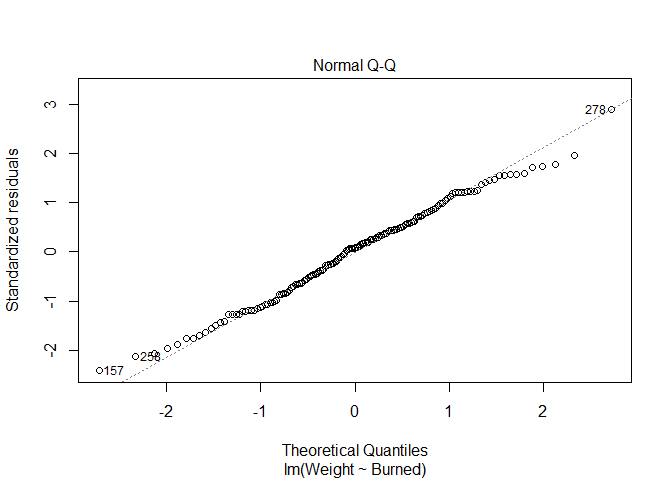

# Instructions! Read this first.

The exam is open note, open course website, open class-related code repositories 
(mine and those you produced in class). However, you may not get external help (
from other students, directed internet searches, etc.).  Please update the statement
below to acknowledge these instructions (and that you can use git).

I, INSERT YOUR NAME HERE, promise to not seek external help on the exam. I 
understand any academic issues will result in a D or F on the exam or in the class
and be reported to the Dean of Students.  Infractions will also result in me 
being unable to obtain a letter of recommendation from the department for 
professional school applications.

**I highly recommend reading entire exam and doing what you can without R before
jumping into the code**. You can earn a C or higher without opening R, just answer
questions and make assumptions (that you state!) as needed.  **Good luck!**

# Sage Grouse

In the following datasets, scientists investigated the 
impact of a large fires in Nevada on sage grouses (*Centrocercus urophasianus*),
a ground-nesting bird found in sagebrush (a plant) habitat in the interior of North 
America.  Sage grouses are
considered threatened due to habitat loss.  A related issue is that
wildfires may lead to native sagebrush plants (*Artemisia* spp.), upon which 
the grouses depend, being replaced by invasive plants.  


Data was collected before and after a large fire.  

## 1

Idea from (but all data made up for ease/application!)

Dudley, Ian F., Peter S. Coates, Brian G. Prochazka, Dawn M. Davis, Scott C. Gardner, and David J. Delehanty. “Maladaptive Nest-Site Selection and Reduced Nest Survival in Female Sage-Grouse Following Wildfire.” Ecosphere 13, no. 12 (2022): e4282. https://doi.org/10.1002/ecs2.4282.

1. Data from before the fires suggested that grouse nests succeeded (hatched at
least one egg) 63% of the time.  After the fire, 118 nests were tagged and followed
for outcomes.  53 of those produced at least one hatchling, while the rest 
failed to do so. Is there any evidence the fires impacted nest success?  

Make sure you include (6 pts)

* null hypothesis
* alternative hypothesis
* explanation for test you will use 
* results from statistical test
* clear explanation of how results relate to your stated hypotheses

### Answer

*H~0~= The fires did not impact the nests success rates, so success rate is still 63%; p = .63*

*HA= The fires did impact the nests success rates, so 
success rate is not still 63%; p  $\neq$ .63*

*I will use a binomial test to compare the proportion of successful nests after
the fire to the set proportion of successful nests, 0.63, before the fire. This 
is because the data is discrete with 2 outcomes: success (hatch at least 1 egg)
or failure (do not hatch at least 1 egg). Since the question only asks if there
is an impact (as opposed to a decrease), I will do a two-sided binomial test.*


```r
binom.test(53, 118, p=.63)
```

```
## 
## 	Exact binomial test
## 
## data:  53 and 118
## number of successes = 53, number of trials = 118, p-value = 7.818e-05
## alternative hypothesis: true probability of success is not equal to 0.63
## 95 percent confidence interval:
##  0.3574870 0.5434315
## sample estimates:
## probability of success 
##              0.4491525
```
*The p-value, 7.818e-05, is less than 0.05, so we reject the null hypothesis.*

*We reject the null hypothesis, so the fire does have an impact on nest success.
The proportion of grouse nests that succeed (hatch at least one egg) is not equal
to 0.63. According to the sample estimate, the proportion of grouse nests that
succeed appears to decrease after the fire.*

Not required, but if you added a confidence interval


```r
library(binom)
binom.confint(53,118)
```

```
##           method  x   n      mean     lower     upper
## 1  agresti-coull 53 118 0.4491525 0.3624062 0.5391051
## 2     asymptotic 53 118 0.4491525 0.3594056 0.5388995
## 3          bayes 53 118 0.4495798 0.3609818 0.5386493
## 4        cloglog 53 118 0.4491525 0.3579508 0.5360285
## 5          exact 53 118 0.4491525 0.3574870 0.5434315
## 6          logit 53 118 0.4491525 0.3619676 0.5395780
## 7         probit 53 118 0.4491525 0.3614410 0.5394325
## 8        profile 53 118 0.4491525 0.3612214 0.5392696
## 9            lrt 53 118 0.4491525 0.3612147 0.5392813
## 10     prop.test 53 118 0.4491525 0.3583942 0.5432661
## 11        wilson 53 118 0.4491525 0.3624203 0.5390911
```

*According to the Agresti-Coull method, the 95% confidence interval states  that 
a proportion of about 0.36 (36%) to 0.54 (54%) sage grouses have a successful 
nest. Since the proportion of nests that succeeded before the fire was 0.63 (63%),
and it is not included in this confidence interval, we can say that there is reason 
to be concerned as it appears the proportion of successful nests is decreasing. 
This suggests a negative impact of the fires on sage house birds's nest success
(hatching), which makes sense.*

## 2

Make the data


```r
set.seed(24)
grouse_weight <- data.frame(Gender = c(rep("M", 150), rep("F", 150)), 
                     Burned = rep(c(rep("Recent", 50), rep("Five_years_ago", 50), 
                                   rep("Not_past_20", 50)),2),
                     Weight = rnorm(300, 1.9, .05)+ # no impact, just measured weight
                       c(rep(0,150), rnorm(150,-.2,.1))+ # impact on F 
                       c(rep(0,250),rnorm(50, -.2,.05))) #impact of older burns

write.csv(grouse_weight, "grouse_weight.csv", row.names = F)
```

2. Another potential impact of fires is the change they produce in available food levels.
Sage grouses eat sagebrush in the winter, and invasive plants could offer less 
food. To consider this, scientists weighed male and female grouse from recently burned plots,
those burned 5 years ago, and those not burned in the past 20 years.  Weight is 
provided in grams.  Data can 
be imported using


```r
grouse_weight <- read.csv("https://raw.githubusercontent.com/jsgosnell/CUNY-BioStats/master/datasets/grouse_weight.csv", stringsAsFactors = T)
```

Is there any evidence the fires impacted nest success?  

Make sure you include (6 pts)

* null hypothesis
* alternative hypothesis
* explanation for test you will use 
* results from statistical test
* clear explanation of how results relate to your stated hypotheses

### Answer

*H~01~:The fire timing ("Burned") does not have an impact on grouse weight.*
*H~02~:Gender does not have an impact on grouse weight.*
*H~03~:Fire timing ("Burned") and gender do not interact together to impact grouse weight.*


*H~A1~:The fire timing ("Burned") does  have an impact on grouse weight.*
*H~A2~:Gender does  have an impact on grouse weight.*
*H~A3~:Fire timing ("Burned") and gender do  interact together to impact grouse weight.*

* The data is factorial in design, so I will use an 2-way ANOVA test including 
interactions to compare the difference in grouse weight means
across the 3 different groups of fire timing -recent, 5 years ago, and not burned 
in the past 20 years - and grouse gender. This is because there is 1 continuous response 
variable - weight - and 2 categorical predictor variables (fire timing with 3 groups: 
recent, 5 years ago, and not burned in past 20 years; gender with 2 groups: male, 
female). I will start by constructing a linear model and checking for linear
model assumptions being met, and checking to see if gender (categorical explanatory 
variable) has an interaction with fire timing, the other  categorical explanatory variable.*


```r
grouse_weight_lm <- lm(Weight ~ Gender*Burned, grouse_weight)
plot(grouse_weight_lm)
```

<!-- --><!-- --><!-- --><!-- -->


*Assumptions of linear model appear to be met. Residuals are relatively
normally and identically distributed, and there are no high leverage 
points outside the Cook's distance lines.*


```r
library(car)
```

```
## Loading required package: carData
```

```r
Anova(grouse_weight_lm, type = "III")
```

```
## Anova Table (Type III tests)
## 
## Response: Weight
##                Sum Sq  Df   F value    Pr(>F)    
## (Intercept)   140.699   1 16161.071 < 2.2e-16 ***
## Gender          1.210   1   139.008 < 2.2e-16 ***
## Burned          1.057   2    60.703 < 2.2e-16 ***
## Gender:Burned   0.533   2    30.611 8.384e-13 ***
## Residuals       2.560 294                        
## ---
## Signif. codes:  0 '***' 0.001 '**' 0.01 '*' 0.05 '.' 0.1 ' ' 1
```
*According to the ANOVA test results, the interaction is significant (F~2,294~ = 
30.61, p < .001),  This means that the interaction between the timing of when the sage
grouse habitats were burned and their genders is significant. So, we reject the 
null hypothesis. Fire timing ("Burned") and gender interact together to impact grouse weight.*

*This means the variables involved do not have a consistent effect (effect varies 
based on level), so we need to break this 2-way ANOVA down into 1-way ANOVAs. 
We will subset the data and consider the main effects for each gender. First, consider
the males.*


```r
grouse_weight_lm_m <- lm(Weight ~ Burned, grouse_weight[grouse_weight$Gender == "M",])
plot(grouse_weight_lm_m)
```

<!-- --><!-- --><!-- --><!-- -->

```r
Anova(grouse_weight_lm_m, type = "III")
```

```
## Anova Table (Type III tests)
## 
## Response: Weight
##              Sum Sq  Df    F value Pr(>F)    
## (Intercept) 180.027   1 77007.0385 <2e-16 ***
## Burned        0.001   2     0.2932 0.7463    
## Residuals     0.344 147                      
## ---
## Signif. codes:  0 '***' 0.001 '**' 0.01 '*' 0.05 '.' 0.1 ' ' 1
```

*Assumptions appear valid, and there is no evidence burn status impacts weight 
(F~2,147~=.293, p=.746).*

*For the females,*


```r
grouse_weight_lm_f <- lm(Weight ~ Burned, grouse_weight[grouse_weight$Gender == "F",])
plot(grouse_weight_lm_f)
```

<!-- --><!-- --><!-- --><!-- -->

```r
Anova(grouse_weight_lm_f, type = "III")
```

```
## Anova Table (Type III tests)
## 
## Response: Weight
##              Sum Sq  Df  F value    Pr(>F)    
## (Intercept) 140.699   1 9333.710 < 2.2e-16 ***
## Burned        1.057   2   35.059 3.554e-13 ***
## Residuals     2.216 147                       
## ---
## Signif. codes:  0 '***' 0.001 '**' 0.01 '*' 0.05 '.' 0.1 ' ' 1
```

*Assumptions appear valid, and there is no evidence burn status impacts weight 
(F~2,147~=.35.059, p < .001). I used a post-hoc Tukey test to compare groups
while controlling for the family-wise error rate.* 


```r
library(multcomp)
```

```
## Loading required package: mvtnorm
```

```
## Loading required package: survival
```

```
## Loading required package: TH.data
```

```
## Loading required package: MASS
```

```
## 
## Attaching package: 'TH.data'
```

```
## The following object is masked from 'package:MASS':
## 
##     geyser
```

```r
compare <- glht(grouse_weight_lm_f, linfct = mcp(Burned = "Tukey"))
summary(compare)
```

```
## 
## 	 Simultaneous Tests for General Linear Hypotheses
## 
## Multiple Comparisons of Means: Tukey Contrasts
## 
## 
## Fit: lm(formula = Weight ~ Burned, data = grouse_weight[grouse_weight$Gender == 
##     "F", ])
## 
## Linear Hypotheses:
##                                   Estimate Std. Error t value Pr(>|t|)    
## Not_past_20 - Five_years_ago == 0 -0.16631    0.02456  -6.773   <1e-04 ***
## Recent - Five_years_ago == 0       0.02155    0.02456   0.878    0.655    
## Recent - Not_past_20 == 0          0.18787    0.02456   7.651   <1e-04 ***
## ---
## Signif. codes:  0 '***' 0.001 '**' 0.01 '*' 0.05 '.' 0.1 ' ' 1
## (Adjusted p values reported -- single-step method)
```

*Results indicate there is no difference in weight if habitat was burned recently
or in past 5 years, but older burns/not burned areas are different.*
Notice difference if you don't consider both variables.*


```r
summary(grouse_weight_lm_f)
```

```
## 
## Call:
## lm(formula = Weight ~ Burned, data = grouse_weight[grouse_weight$Gender == 
##     "F", ])
## 
## Residuals:
##      Min       1Q   Median       3Q      Max 
## -0.29373 -0.08836  0.01003  0.08660  0.35099 
## 
## Coefficients:
##                   Estimate Std. Error t value Pr(>|t|)    
## (Intercept)        1.67749    0.01736  96.611  < 2e-16 ***
## BurnedNot_past_20 -0.16631    0.02456  -6.773 2.82e-10 ***
## BurnedRecent       0.02155    0.02456   0.878    0.382    
## ---
## Signif. codes:  0 '***' 0.001 '**' 0.01 '*' 0.05 '.' 0.1 ' ' 1
## 
## Residual standard error: 0.1228 on 147 degrees of freedom
## Multiple R-squared:  0.3229,	Adjusted R-squared:  0.3137 
## F-statistic: 35.06 on 2 and 147 DF,  p-value: 3.554e-13
```

*Surprising, the more recently burned areas seemed to have higher weights.*


```r
grouse_weight_lm_burned <- lm(Weight ~ Burned, grouse_weight)
plot(grouse_weight_lm_burned)
```

<!-- --><!-- --><!-- --><!-- -->

```r
library(car)
Anova(grouse_weight_lm_burned, type = "III")
```

```
## Anova Table (Type III tests)
## 
## Response: Weight
##             Sum Sq  Df    F value    Pr(>F)    
## (Intercept) 319.52   1 11375.6740 < 2.2e-16 ***
## Burned        0.53   2     9.3516 0.0001152 ***
## Residuals     8.34 297                         
## ---
## Signif. codes:  0 '***' 0.001 '**' 0.01 '*' 0.05 '.' 0.1 ' ' 1
```


```r
compare <- glht(grouse_weight_lm_burned, linfct = mcp(Burned = "Tukey"))
summary(compare)
```

```
## 
## 	 Simultaneous Tests for General Linear Hypotheses
## 
## Multiple Comparisons of Means: Tukey Contrasts
## 
## 
## Fit: lm(formula = Weight ~ Burned, data = grouse_weight)
## 
## Linear Hypotheses:
##                                    Estimate Std. Error t value Pr(>|t|)    
## Not_past_20 - Five_years_ago == 0 -0.085021   0.023701  -3.587 0.001107 ** 
## Recent - Five_years_ago == 0       0.007074   0.023701   0.298 0.952093    
## Recent - Not_past_20 == 0          0.092094   0.023701   3.886 0.000353 ***
## ---
## Signif. codes:  0 '***' 0.001 '**' 0.01 '*' 0.05 '.' 0.1 ' ' 1
## (Adjusted p values reported -- single-step method)
```

You miss fact one group (males) is not impacted!

## 3

Make the data


```r
nest_approach <- data.frame(nest_diameter = runif(50, 8, 15))
nest_approach$grouse_weight <- nest_approach$nest_diameter*.16 + rnorm(50,0,.05)
write.csv(nest_approach, "nest_approach.csv", row.names = F)
```
                            
                            
3. Sometimes capturing grouses is hard. One student working on the project proposed
using nest diamter to estimate grouse weight  To consider this, 50 birds were weighed (in grams),
and the diameter of their nest (in cm) was measured. Is there evidence nest diameter is a good
predictor of grouse mass?  Data can be imported using

Make sure you include (6 pts)


```r
nest_approach <- read.csv("https://raw.githubusercontent.com/jsgosnell/CUNY-BioStats/master/datasets/nest_approach.csv", stringsAsFactors = T)
```

* null hypothesis
* alternative hypothesis
* explanation for test you will use 
* results from statistical test
* clear explanation of how results relate to your stated hypotheses

### Answer

*H~O~:  There is no relationship between nest diameter and grouse weight.*
*H~A~:  There is a relationship between nest diameter and grouse weight.*


```r
nest <- lm(grouse_weight~nest_diameter,nest_approach)
plot(nest)
```

<!-- --><!-- --><!-- --><!-- -->

*Assumptions of linear model appear to be met. Residuals are relatively normally and identically distributed, and there are no high leverage points outside the Cook's distance lines.*


```r
Anova(nest, type = "III")
```

```
## Anova Table (Type III tests)
## 
## Response: grouse_weight
##               Sum Sq Df   F value Pr(>F)    
## (Intercept)   0.0001  1    0.0634 0.8022    
## nest_diameter 6.5321  1 2955.9776 <2e-16 ***
## Residuals     0.1061 48                     
## ---
## Signif. codes:  0 '***' 0.001 '**' 0.01 '*' 0.05 '.' 0.1 ' ' 1
```

```r
summary(nest)
```

```
## 
## Call:
## lm(formula = grouse_weight ~ nest_diameter, data = nest_approach)
## 
## Residuals:
##       Min        1Q    Median        3Q       Max 
## -0.086789 -0.034956  0.001138  0.031432  0.140758 
## 
## Coefficients:
##               Estimate Std. Error t value Pr(>|t|)    
## (Intercept)   0.008320   0.033038   0.252    0.802    
## nest_diameter 0.158960   0.002924  54.369   <2e-16 ***
## ---
## Signif. codes:  0 '***' 0.001 '**' 0.01 '*' 0.05 '.' 0.1 ' ' 1
## 
## Residual standard error: 0.04701 on 48 degrees of freedom
## Multiple R-squared:  0.984,	Adjusted R-squared:  0.9837 
## F-statistic:  2956 on 1 and 48 DF,  p-value: < 2.2e-16
```

*According to the  test results, the relationship significant (F~1,48~ = 
2955, p < .001). Coefficients suggest larger nests house larger grouse, and grouse
nest diameter explains over 98% of variation in grouse weight (thus it is a 
useful predictor).*

*or*


```r
cor.test(~nest_diameter+grouse_weight, nest_approach)
```

```
## 
## 	Pearson's product-moment correlation
## 
## data:  nest_diameter and grouse_weight
## t = 54.369, df = 48, p-value < 2.2e-16
## alternative hypothesis: true correlation is not equal to 0
## 95 percent confidence interval:
##  0.9858343 0.9954637
## sample estimates:
##       cor 
## 0.9919784
```


## 4 

4. Plot the data from question 3.

### Answer


```r
library(ggplot2)
ggplot(nest_approach, aes(x=nest_diameter, y=grouse_weight)) +
  geom_point() +
  labs(title = "Grouse weight is closely aligned with nest diameter",
       subtitle = "Nest diameter explains 98% of variation grouse weight") +
       xlab("Nest diameter (cm)") +
       ylab("Grouse weight (g)")
```

<!-- -->

