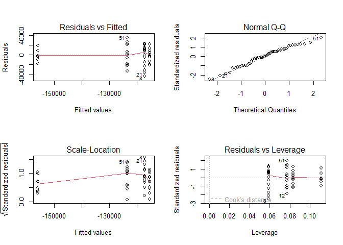
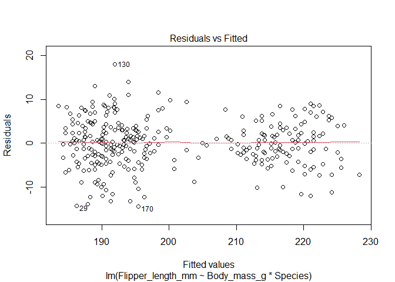
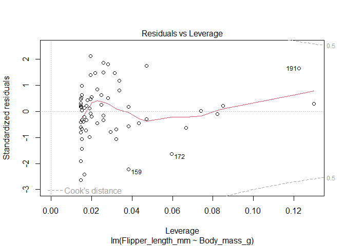
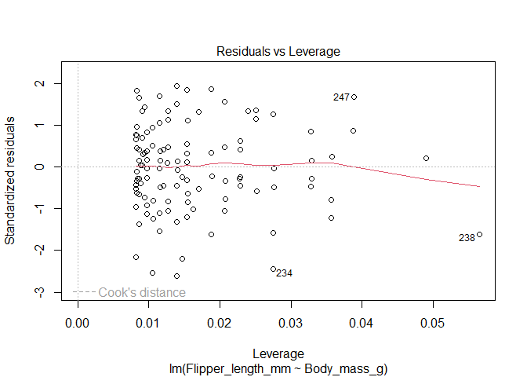
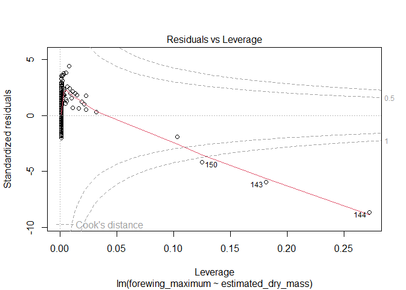

# Instructions! Read this first.

The exam is open note, open course website, open class-related code repositories 
(mine and those you produced in class). However, you may not get external help (
from other students, directed internet searches, etc.).  Please update the statement
below to acknowledge these instructions (and that you can use git).

I, INSERT YOUR NAME HERE, promise to not seek external help on the exam. I 
understand any academic issues will result in a D or F on the exam or in the class
and be reported to the Dean of Students.  Infractions will also result in me 
being unable to obtain a letter of recommendation from the department for 
professional school applications.

Note some questions are based on pretend surveys, etc, for teaching purposes.

Good luck!


## Making the data for # 4 (not in student version)

Real data from:  

* https://covid.cdc.gov/covid-data-tracker/#vaccinations_vacc-people-onedose-pop-5yr
* https://www2.census.gov/geo/pdfs/maps-data/maps/reference/us_regdiv.pdf


```r
regions <- read.csv("https://docs.google.com/spreadsheets/d/e/2PACX-1vSHjDv2eSCOtuux9E6JIoEx2F4cOyU6jX6mXUr_FQDtTjpQxroh-IP_3D1z_qcSDr-9lQRQG_CRMZXY/pub?gid=0&single=true&output=csv",
                    stringsAsFactors = T)
ratestotal <- read.csv("https://docs.google.com/spreadsheets/d/e/2PACX-1vTSY3PjqxOgUcMtx15Dzh1Z_TelhY6lsRloAyV65vKhqaPEahv5ojY_y7IOstTuUokyHtAYarkb6qqo/pub?gid=993160825&single=true&output=csv",
                   stringsAsFactors =T)
str(regions)
```

```
## 'data.frame':	51 obs. of  4 variables:
##  $ State     : Factor w/ 51 levels "Alabama","Alaska",..: 2 1 4 3 5 6 7 9 8 10 ...
##  $ State.Code: Factor w/ 51 levels "AK","AL","AR",..: 1 2 3 4 5 6 7 8 9 10 ...
##  $ Region    : Factor w/ 4 levels "Midwest","Northeast",..: 4 3 3 4 4 4 2 3 3 3 ...
##  $ Division  : Factor w/ 9 levels "East North Central",..: 6 2 9 4 6 4 5 7 7 7 ...
```

```r
str(ratestotal)
```

```
## 'data.frame':	29912 obs. of  82 variables:
##  $ Date                                  : Factor w/ 464 levels "01/01/2021","01/01/2022",..: 160 160 160 160 160 160 160 160 160 160 ...
##  $ MMWR_week                             : int  12 12 12 12 12 12 12 12 12 12 ...
##  $ Location                              : Factor w/ 66 levels "AK","AL","AR",..: 15 45 60 4 9 38 5 20 33 35 ...
##  $ Distributed                           : int  20899995 22225655 7815820 114610 8399135 1318400 14238520 2821495 11183505 5358615 ...
##  $ Distributed_Janssen                   : int  822000 973600 626100 600 341300 52400 605500 105800 424000 225100 ...
##  $ Distributed_Moderna                   : int  8141640 8361440 3806980 23500 3233060 504020 5454920 1255180 4243260 2159660 ...
##  $ Distributed_Pfizer                    : int  11936355 12890615 3382740 90510 4824775 761980 8178100 1460515 6516245 2973855 ...
##  $ Distributed_Unk_Manuf                 : int  0 0 0 0 0 0 0 0 0 0 ...
##  $ Dist_Per_100K                         : int  196846 190140 0 241834 235581 173004 195619 135466 182218 180052 ...
##  $ Distributed_Per_100k_12Plus           : int  232530 222241 0 310453 270421 206890 229429 0 213600 212523 ...
##  $ Distributed_Per_100k_18Plus           : int  257594 243941 0 365757 295969 226572 252524 0 234610 235278 ...
##  $ Distributed_Per_100k_65Plus           : int  1377760 1086130 0 3496340 1332680 1100090 1088050 0 1053020 1101030 ...
##  $ Administered                          : int  14503611 17361040 7245185 100375 7363698 1066461 11685668 2189241 8722200 3792788 ...
##  $ Administered_12Plus                   : int  14143397 16880345 7244991 88864 7109494 1032059 11316175 2110146 8489030 3721167 ...
##  $ Administered_18Plus                   : int  13262265 15950067 7241668 74398 6603068 979845 10532821 1931517 8005613 3511528 ...
##  $ Administered_65Plus                   : int  3442209 5008768 3821196 7666 1777307 291503 3271290 386049 2478106 1104243 ...
##  $ Administered_Janssen                  : int  337318 621434 255259 564 248019 39598 365210 40365 249488 92396 ...
##  $ Administered_Moderna                  : int  5630601 6591394 3735410 23640 2779504 404057 4591749 1026039 3149837 1521765 ...
##  $ Administered_Pfizer                   : int  8496538 10127511 3254219 75626 4334951 622481 6702099 1122666 5320554 2175790 ...
##  $ Administered_Unk_Manuf                : int  39154 20701 297 545 1224 325 26610 171 2321 2837 ...
##  $ Admin_Per_100K                        : int  136602 148523 0 211797 206539 139944 160546 105110 142115 127439 ...
##  $ Admin_Per_100k_12Plus                 : int  157357 168792 0 240713 228899 161956 182341 0 162137 147582 ...
##  $ Admin_Per_100k_18Plus                 : int  163458 175062 0 237428 232679 168390 186802 0 167944 154179 ...
##  $ Admin_Per_100k_65Plus                 : int  226916 244770 0 233862 282003 243233 249978 0 233335 226887 ...
##  $ Recip_Administered                    : int  14608567 17263512 7245185 100788 7390416 1044850 11441311 2189241 8684905 3828498 ...
##  $ Administered_Dose1_Recip              : int  6872352 7380368 3415269 44359 3366552 492196 5239601 1084262 4029408 1759004 ...
##  $ Administered_Dose1_Pop_Pct            : num  64.7 63.1 0 93.6 94.4 64.6 72 52.1 65.7 59.1 ...
##  $ Administered_Dose1_Recip_12Plus       : int  6668124 7125926 3415149 38280 3227892 474826 5026146 1038792 3897129 1718582 ...
##  $ Administered_Dose1_Recip_12PlusPop_Pct: num  74.2 71.3 0 95 95 74.5 81 0 74.4 68.2 ...
##  $ Administered_Dose1_Recip_18Plus       : int  6208449 6691667 3413252 31670 2986080 448268 4638581 946722 3656333 1607966 ...
##  $ Administered_Dose1_Recip_18PlusPop_Pct: num  76.5 73.4 0 95 95 77 82.3 0 76.7 70.6 ...
##  $ Administered_Dose1_Recip_65Plus       : int  1434235 1890519 1668121 3107 730710 120585 1284416 176854 1013665 444209 ...
##  $ Administered_Dose1_Recip_65PlusPop_Pct: num  94.5 92.4 0 94.8 95 95 95 0 95 91.3 ...
##  $ Series_Complete_Yes                   : int  5738949 6772329 2934633 39840 2789450 415965 4412032 860511 3403652 1527249 ...
##  $ Series_Complete_Pop_Pct               : num  54.1 57.9 0 84.1 78.2 54.6 60.6 41.3 55.5 51.3 ...
##  $ Series_Complete_12Plus                : int  5594330 6552007 2934558 34481 2675509 402183 4265728 826992 3302642 1496255 ...
##  $ Series_Complete_12PlusPop_Pct         : num  62.2 65.5 0 93.4 86.1 63.1 68.7 0 63.1 59.3 ...
##  $ Series_Complete_18Plus                : int  5226627 6160134 2933161 28387 2470835 379722 3951185 752281 3098166 1404456 ...
##  $ Series_Complete_18PlusPop_Pct         : num  64.4 67.6 0 90.6 87.1 65.3 70.1 0 65 61.7 ...
##  $ Series_Complete_65Plus                : int  1251042 1783540 1494336 2836 601776 102114 1113818 138468 885144 406068 ...
##  $ Series_Complete_65PlusPop_Pct         : num  82.5 87.2 0 86.5 95 85.2 85.1 0 83.3 83.4 ...
##  $ Series_Complete_Janssen               : int  316896 549296 233318 576 230083 36459 330459 38207 236260 85381 ...
##  $ Series_Complete_Moderna               : int  2124731 2379158 1438619 9271 941526 144897 1623829 390262 1157322 581805 ...
##  $ Series_Complete_Pfizer                : int  3285674 3838529 1262683 29721 1617392 234599 2450631 432036 2009343 858910 ...
##  $ Series_Complete_Unk_Manuf             : int  11648 5346 13 272 449 10 7113 6 727 1153 ...
##  $ Series_Complete_Janssen_12Plus        : int  316757 549281 233311 576 229999 36452 330212 38181 236228 85364 ...
##  $ Series_Complete_Moderna_12Plus        : int  2124651 2379134 1438597 9270 941196 144891 1623775 390174 1157299 581788 ...
##  $ Series_Complete_Pfizer_12Plus         : int  3141386 3618261 1262637 24363 1503868 220830 2304654 398631 1908426 827952 ...
##  $ Series_Complete_Unk_Manuf_12Plus      : int  11536 5331 13 272 446 10 7087 6 689 1151 ...
##  $ Series_Complete_Janssen_18Plus        : int  316396 549029 233276 575 229893 36305 329988 38136 235987 85281 ...
##  $ Series_Complete_Moderna_18Plus        : int  2123655 2378513 1438558 9250 940989 144684 1623081 389912 1156816 581442 ...
##  $ Series_Complete_Pfizer_18Plus         : int  2776210 3227383 1261314 18292 1299610 198723 1991131 324227 1704881 736616 ...
##  $ Series_Complete_Unk_Manuf_18Plus      : int  10366 5209 13 270 343 10 6985 6 482 1117 ...
##  $ Series_Complete_Janssen_65Plus        : int  35221 91313 76592 27 22717 4371 50538 3476 40056 17713 ...
##  $ Series_Complete_Moderna_65Plus        : int  681336 804810 816216 1174 236535 48129 542560 78142 403367 206021 ...
##  $ Series_Complete_Pfizer_65Plus         : int  531855 884860 601526 1630 342422 49611 516940 56849 441548 181806 ...
##  $ Series_Complete_Unk_Manuf_65Plus      : int  2630 2557 2 5 102 3 3780 1 173 528 ...
##  $ Additional_Doses                      : int  2049483 3452346 1111732 16786 1409769 167570 1780160 260003 1410499 554608 ...
##  $ Additional_Doses_Vax_Pct              : num  35.7 51 37.9 42.1 50.5 40.3 40.3 30.2 41.4 36.3 ...
##  $ Additional_Doses_12Plus               : int  2048885 3451561 1111726 16778 1409609 167553 1779507 259949 1410305 554529 ...
##  $ Additional_Doses_12Plus_Vax_Pct       : num  36.6 52.7 37.9 48.7 52.7 41.7 41.7 31.4 42.7 37.1 ...
##  $ Additional_Doses_18Plus               : int  1996259 3353915 1111673 15048 1352672 165800 1715349 248448 1372011 545141 ...
##  $ Additional_Doses_18Plus_Vax_Pct       : num  38.2 54.4 37.9 53 54.7 43.7 43.4 33 44.3 38.8 ...
##  $ Additional_Doses_50Plus               : int  1299727 2280463 1008347 6423 860507 113871 1130823 149693 953740 415878 ...
##  $ Additional_Doses_50Plus_Vax_Pct       : num  48.2 65.4 43.7 63 66.3 57.7 53.8 41.5 55.4 51.6 ...
##  $ Additional_Doses_65Plus               : int  690738 1318988 726050 1848 445755 69334 663404 67691 575217 249143 ...
##  $ Additional_Doses_65Plus_Vax_Pct       : num  55.2 74 48.6 65.2 74.1 67.9 59.6 48.9 65 61.4 ...
##  $ Additional_Doses_Moderna              : int  911701 1470195 587800 4109 645533 76636 783398 124992 577456 258587 ...
##  $ Additional_Doses_Pfizer               : int  1112028 1923294 502970 12677 746932 88427 972354 132879 815718 287428 ...
##  $ Additional_Doses_Janssen              : int  24221 58038 20958 0 17279 2500 23070 2013 17255 7997 ...
##  $ Additional_Doses_Unk_Manuf            : int  1533 819 4 0 25 7 1338 119 70 596 ...
##  $ Administered_Dose1_Recip_5Plus        : int  6870485 7379924 3415165 44351 3365056 491941 5238624 1083893 4028995 1758841 ...
##  $ Administered_Dose1_Recip_5PlusPop_Pct : num  69 67.1 0 95 95 69.5 76.5 0 69.8 63 ...
##  $ Series_Complete_5Plus                 : int  5738657 6772286 2934563 39840 2789005 415869 4411724 860353 3403607 1527217 ...
##  $ Series_Complete_5PlusPop_Pct          : num  57.6 61.6 0 92.4 82.4 58.7 64.4 0 59 54.7 ...
##  $ Administered_5Plus                    : int  14501520 17360588 7245012 100367 7361791 1066097 11684539 2188687 8721787 3792609 ...
##  $ Admin_Per_100k_5Plus                  : int  145585 157848 0 232816 217574 150587 170604 0 151175 135806 ...
##  $ Distributed_Per_100k_5Plus            : int  209821 202083 0 265855 248232 186225 207894 0 193843 191881 ...
##  $ Series_Complete_Moderna_5Plus         : int  2124685 2379150 1438597 9271 941318 144893 1623812 390188 1157309 581797 ...
##  $ Series_Complete_Pfizer_5Plus          : int  3285535 3838502 1262641 29721 1617236 234512 2450578 431977 2009330 858898 ...
##  $ Series_Complete_Janssen_5Plus         : int  316795 549288 233312 576 230003 36454 330221 38182 236244 85369 ...
##  $ Series_Complete_Unk_Manuf_5Plus       : int  11642 5346 13 272 448 10 7113 6 724 1153 ...
```
separate only some dates for rates


```r
rates_focal <- ratestotal[ratestotal$Date %in% c("03/22/2021","03/21/2022"),c("Date","Location","Admin_Per_100K")]
library(reshape2)
rates_wide <- dcast(rates_focal, Location ~ Date, value = "Admin_Per_100k" )
```

```
## Using Admin_Per_100K as value column: use value.var to override.
```
merge


```r
names(rates_wide)[names(rates_wide) == "Location"] = "State.Code"
covid_regions_wide <- merge(rates_wide, regions, all.x = F, all.y = T)
names(covid_regions_wide)[2:3] <- c("early", "late")
covid_regions_wide$change <- covid_regions_wide$late - covid_regions_wide$early
covid_regions_wide <- covid_regions_wide[,c("State", "early", "late","Region", "change")]
#covid_regions_wide_south <- covid_regions_wide[covid_regions_wide$Region %in% c("South"),]
#covid_regions_wide_ne <- covid_regions_wide[covid_regions_wide$Region %in% c("Northeast"),]
#write.csv(covid_regions_wide_south, "covid_regions_wide_south.csv", row.names = F)
write.csv(covid_regions_wide, "covid_regions_wide.csv", row.names = F)
```

## COVID impacts

### 1. 

Investigators want to know if the rates of vaccination has changed at different
paces across the country. Data on change (column in dataset) in rates (number administered in March 
2022 (late)
minus number administered in March 2021(early) ) are available @


```r
covid_rates_over_year <- read.csv("https://docs.google.com/spreadsheets/d/e/2PACX-1vRLp3znA4ARXCNLlVHj4VSFPHyE7qCTHcs1xWDULfYxUux_6Fia_ugbVnHu8cURowahXWLz5yT7JFf1/pub?gid=1458185696&single=true&output=csv",
                                  stringsAsFactors = T)
```

Investigate the question. Make sure you include (6 pts)

* null hypothesis
  * *H~0~: Regions do not differ in rates of changes in vaccination*
* alternative hypothesis
  * *H~A~: Regions do not differ in rates of changes in vaccination*
* explanation for test you will use 
  * I will use an ANOVA (form of linear model) since we have a continous outcome
  variable and a categorical predictor with more than 2 levels (else it would be
  a t-test)
* results from statistical test


```r
vaccine_lm <- lm(change~Region, covid_rates_over_year)
par(mfrow=c(2,2))
plot(vaccine_lm)
```

<!-- -->


```r
summary(vaccine_lm)
```

```
## 
## Call:
## lm(formula = change ~ Region, data = covid_rates_over_year)
## 
## Residuals:
##    Min     1Q Median     3Q    Max 
## -43364 -13754    135  12714  34659 
## 
## Coefficients:
##                 Estimate Std. Error t value Pr(>|t|)    
## (Intercept)      -115274       5277 -21.846  < 2e-16 ***
## RegionNortheast   -40778       8060  -5.059 6.89e-06 ***
## RegionSouth        -1935       6892  -0.281    0.780    
## RegionWest         -8290       7318  -1.133    0.263    
## ---
## Signif. codes:  0 '***' 0.001 '**' 0.01 '*' 0.05 '.' 0.1 ' ' 1
## 
## Residual standard error: 18280 on 47 degrees of freedom
## Multiple R-squared:  0.409,	Adjusted R-squared:  0.3713 
## F-statistic: 10.84 on 3 and 47 DF,  p-value: 1.566e-05
```

```r
library(car)
```

```
## Loading required package: carData
```

```r
Anova(vaccine_lm, type="III")
```

```
## Anova Table (Type III tests)
## 
## Response: change
##                 Sum Sq Df F value    Pr(>F)    
## (Intercept) 1.5946e+11  1 477.235 < 2.2e-16 ***
## Region      1.0869e+10  3  10.843 1.566e-05 ***
## Residuals   1.5704e+10 47                      
## ---
## Signif. codes:  0 '***' 0.001 '**' 0.01 '*' 0.05 '.' 0.1 ' ' 1
```


```r
library(multcomp)
```

```
## Loading required package: mvtnorm
```

```
## Loading required package: survival
```

```
## Loading required package: TH.data
```

```
## Loading required package: MASS
```

```
## 
## Attaching package: 'TH.data'
```

```
## The following object is masked from 'package:MASS':
## 
##     geyser
```

```r
region_compare <-   glht(vaccine_lm, linfct = mcp(Region = "Tukey"))
summary(region_compare)
```

```
## 
## 	 Simultaneous Tests for General Linear Hypotheses
## 
## Multiple Comparisons of Means: Tukey Contrasts
## 
## 
## Fit: lm(formula = change ~ Region, data = covid_rates_over_year)
## 
## Linear Hypotheses:
##                          Estimate Std. Error t value Pr(>|t|)    
## Northeast - Midwest == 0   -40778       8060  -5.059   <0.001 ***
## South - Midwest == 0        -1935       6892  -0.281    0.992    
## West - Midwest == 0         -8290       7318  -1.133    0.670    
## South - Northeast == 0      38843       7535   5.155   <0.001 ***
## West - Northeast == 0       32488       7926   4.099   <0.001 ***
## West - South == 0           -6355       6735  -0.944    0.781    
## ---
## Signif. codes:  0 '***' 0.001 '**' 0.01 '*' 0.05 '.' 0.1 ' ' 1
## (Adjusted p values reported -- single-step method)
```
* clear explanation of how results relate to your stated hypotheses
  * Test assumptions appear to be met (no patterns in residuals, which are also
  normally distributed and homogeneous). ANOVA results indicate significant differences
  among regions (F~3,47~=10.843, p<.001), so I reject my null hypothesis. 
  Given these results, I used a Tukey post
  hoc test to control FWER while also seeing how each region compares to others. 
  Results indicate significant differences between the NE-MW, S-NE,  and W-NE 
  (so the NE differs from all other regions!).


### 2.  

There has been concern that the COVID pandemic may differentially influence 
male and female fetuses and thus alter the regional sex ratios
of newborn children (Abdoli 2020).  When comparing biological males and females at 
birth, males have historically represented approximately 50% of births. A hospital 
in New York City recorded 55 male and 45 female births in 2021 (in the middle of
the COVID pandemic).  Use this data to investigate if sex ratios have changed. 

Make sure you include (6 pts)

* null hypothesis
  * *H~0~: the sex ratio in 2021 is 50/50 (the historical average)*
* alternative hypothesis
  * *H~A~: the sex ratio in 2021 is not 50/50 (the historical average)*
* explanation for test you will use 
  * *I will use a binomial test since we have 2 outcomes (male/female) and a 
  historical proportion to compare to.
* results from statistical test

```r
binom.test(55,100)
```

```
## 
## 	Exact binomial test
## 
## data:  55 and 100
## number of successes = 55, number of trials = 100, p-value = 0.3682
## alternative hypothesis: true probability of success is not equal to 0.5
## 95 percent confidence interval:
##  0.4472802 0.6496798
## sample estimates:
## probability of success 
##                   0.55
```
* clear explanation of how results relate to your stated hypotheses
  * *Results indicate a p-value of .3682, so I fail to reject the null hypothesis.
  There is not evidence that COVID led to a change in sex ratios at birth.*

## To a happier place - Penguins!

3. 3 species of penguins (Gentoo, Chinstrap, Adelie) were measured for various 
morphological traits. Using the provided data, consider the impact of species(Species)
and body mass (Body_mass_g)
on flipper length (Flipper_length_mm). (6 pts)


```r
penguin <- read.csv("https://docs.google.com/spreadsheets/d/e/2PACX-1vQEyo_2bjGK6yEj5gj3SKP_VsqDxsqer4PRqTqqV_FRw9m0OM3u7SgbaT9OF4whgEb1Nx0z2QNU8ovd/pub?gid=836786692&single=true&output=csv", stringsAsFactors = T)
```

Make sure you include (6 pts)

* null hypothesis
* alternative hypothesis
* explanation for test you will use 
* results from statistical test

```r
penguin_lm_int <- lm(Flipper_length_mm~Body_mass_g*Species, penguin)
plot(penguin_lm_int)
```

<!-- --><!-- --><!-- --><!-- -->

```r
summary(penguin_lm_int)
```

```
## 
## Call:
## lm(formula = Flipper_length_mm ~ Body_mass_g * Species, data = penguin)
## 
## Residuals:
##      Min       1Q   Median       3Q      Max 
## -14.4296  -3.3494   0.1719   3.3428  18.0477 
## 
## Coefficients:
##                                Estimate Std. Error t value Pr(>|t|)    
## (Intercept)                   1.652e+02  3.551e+00  46.536  < 2e-16 ***
## Body_mass_g                   6.677e-03  9.523e-04   7.011  1.3e-11 ***
## SpeciesChinstrap             -1.386e+01  7.301e+00  -1.899  0.05844 .  
## SpeciesGentoo                 6.059e+00  6.051e+00   1.001  0.31735    
## Body_mass_g:SpeciesChinstrap  5.228e-03  1.949e-03   2.683  0.00766 ** 
## Body_mass_g:SpeciesGentoo     2.362e-03  1.353e-03   1.746  0.08164 .  
## ---
## Signif. codes:  0 '***' 0.001 '**' 0.01 '*' 0.05 '.' 0.1 ' ' 1
## 
## Residual standard error: 5.348 on 336 degrees of freedom
##   (2 observations deleted due to missingness)
## Multiple R-squared:  0.8575,	Adjusted R-squared:  0.8553 
## F-statistic: 404.2 on 5 and 336 DF,  p-value: < 2.2e-16
```

```r
Anova(penguin_lm_int, type = "III")
```

```
## Anova Table (Type III tests)
## 
## Response: Flipper_length_mm
##                     Sum Sq  Df   F value    Pr(>F)    
## (Intercept)          61947   1 2165.6129 < 2.2e-16 ***
## Body_mass_g           1406   1   49.1591 1.302e-11 ***
## Species                177   2    3.0994   0.04637 *  
## Body_mass_g:Species    228   2    3.9837   0.01950 *  
## Residuals             9611 336                        
## ---
## Signif. codes:  0 '***' 0.001 '**' 0.01 '*' 0.05 '.' 0.1 ' ' 1
```

interaction is significant, so complete for each


```r
chinstrap <- lm(Flipper_length_mm~Body_mass_g, penguin[penguin$Species == "Chinstrap",])
plot(chinstrap)
```

<!-- --><!-- --><!-- --><!-- -->

```r
summary(chinstrap)
```

```
## 
## Call:
## lm(formula = Flipper_length_mm ~ Body_mass_g, data = penguin[penguin$Species == 
##     "Chinstrap", ])
## 
## Residuals:
##      Min       1Q   Median       3Q      Max 
## -14.4296  -3.3315   0.4097   2.8889  11.5941 
## 
## Coefficients:
##              Estimate Std. Error t value Pr(>|t|)    
## (Intercept) 1.514e+02  6.575e+00  23.024  < 2e-16 ***
## Body_mass_g 1.191e-02  1.752e-03   6.795 3.75e-09 ***
## ---
## Signif. codes:  0 '***' 0.001 '**' 0.01 '*' 0.05 '.' 0.1 ' ' 1
## 
## Residual standard error: 5.512 on 66 degrees of freedom
## Multiple R-squared:  0.4116,	Adjusted R-squared:  0.4027 
## F-statistic: 46.17 on 1 and 66 DF,  p-value: 3.748e-09
```

```r
Anova(chinstrap, type = "III")
```

```
## Anova Table (Type III tests)
## 
## Response: Flipper_length_mm
##              Sum Sq Df F value    Pr(>F)    
## (Intercept) 16106.0  1 530.120 < 2.2e-16 ***
## Body_mass_g  1402.7  1  46.168 3.748e-09 ***
## Residuals    2005.2 66                      
## ---
## Signif. codes:  0 '***' 0.001 '**' 0.01 '*' 0.05 '.' 0.1 ' ' 1
```


```r
Gentoo <- lm(Flipper_length_mm~Body_mass_g, penguin[penguin$Species == "Gentoo",])
plot(Gentoo)
```

<!-- --><!-- --><!-- --><!-- -->

```r
summary(Gentoo)
```

```
## 
## Call:
## lm(formula = Flipper_length_mm ~ Body_mass_g, data = penguin[penguin$Species == 
##     "Gentoo", ])
## 
## Residuals:
##      Min       1Q   Median       3Q      Max 
## -12.0194  -2.7401   0.1781   2.9859   8.9806 
## 
## Coefficients:
##              Estimate Std. Error t value Pr(>|t|)    
## (Intercept) 1.713e+02  4.244e+00   40.36   <2e-16 ***
## Body_mass_g 9.039e-03  8.321e-04   10.86   <2e-16 ***
## ---
## Signif. codes:  0 '***' 0.001 '**' 0.01 '*' 0.05 '.' 0.1 ' ' 1
## 
## Residual standard error: 4.633 on 121 degrees of freedom
##   (1 observation deleted due to missingness)
## Multiple R-squared:  0.4937,	Adjusted R-squared:  0.4896 
## F-statistic:   118 on 1 and 121 DF,  p-value: < 2.2e-16
```

```r
Anova(Gentoo, type = "III")
```

```
## Anova Table (Type III tests)
## 
## Response: Flipper_length_mm
##             Sum Sq  Df F value    Pr(>F)    
## (Intercept)  34969   1 1628.99 < 2.2e-16 ***
## Body_mass_g   2533   1  118.01 < 2.2e-16 ***
## Residuals     2597 121                      
## ---
## Signif. codes:  0 '***' 0.001 '**' 0.01 '*' 0.05 '.' 0.1 ' ' 1
```


```r
Adelie <- lm(Flipper_length_mm~Body_mass_g, penguin[penguin$Species == "Adelie",])
plot(Adelie)
```

<!-- --><!-- --><!-- --><!-- -->

```r
summary(Adelie)
```

```
## 
## Call:
## lm(formula = Flipper_length_mm ~ Body_mass_g, data = penguin[penguin$Species == 
##     "Adelie", ])
## 
## Residuals:
##      Min       1Q   Median       3Q      Max 
## -14.2769  -3.6192   0.0569   3.4696  18.0477 
## 
## Coefficients:
##              Estimate Std. Error t value Pr(>|t|)    
## (Intercept) 1.652e+02  3.849e+00  42.929  < 2e-16 ***
## Body_mass_g 6.677e-03  1.032e-03   6.468 1.34e-09 ***
## ---
## Signif. codes:  0 '***' 0.001 '**' 0.01 '*' 0.05 '.' 0.1 ' ' 1
## 
## Residual standard error: 5.798 on 149 degrees of freedom
##   (1 observation deleted due to missingness)
## Multiple R-squared:  0.2192,	Adjusted R-squared:  0.214 
## F-statistic: 41.83 on 1 and 149 DF,  p-value: 1.343e-09
```

```r
Anova(Adelie, type = "III")
```

```
## Anova Table (Type III tests)
## 
## Response: Flipper_length_mm
##             Sum Sq  Df  F value    Pr(>F)    
## (Intercept)  61947   1 1842.878 < 2.2e-16 ***
## Body_mass_g   1406   1   41.833 1.343e-09 ***
## Residuals     5008 149                       
## ---
## Signif. codes:  0 '***' 0.001 '**' 0.01 '*' 0.05 '.' 0.1 ' ' 1
```

* clear explanation of how results relate to your stated hypotheses


4. Create a properly-labelled plot of the data. There are many options here, but
make sure you show trends and patterns that match your analysis. (5 pts)


```r
library(ggplot2)
ggplot(penguin, aes(x=Body_mass_g, y=Flipper_length_mm, color= Species, 
                                   shape = Species)) +
  geom_point(size = 3) +
  geom_line(aes(group=Species, linetype =Species), size=2) +
  geom_smooth(method = "lm")+
  ylab("Flipper Length (mm)")+ 
  xlab("Body mass (g)") + 
  scale_shape_discrete(guide="none")+
  scale_linetype_discrete(guide="none")+
  ggtitle("The relationship between flipper length and body mass differs among 
          penguin species")+
  theme(axis.title.x = element_text(face="bold", size=28), 
        axis.title.y = element_text(face="bold", size=28), 
        axis.text.y  = element_text(size=20),
        axis.text.x  = element_text(size=20), 
        legend.text =element_text(size=20),
        legend.title = element_text(size=20, face="bold"),
        plot.title = element_text(hjust = 0.5, face="bold", size=32))
```

```
## `geom_smooth()` using formula 'y ~ x'
```

```
## Warning: Removed 2 rows containing non-finite values (stat_smooth).
```

```
## Warning: Removed 2 rows containing missing values (geom_point).
```

```
## Warning: Removed 2 row(s) containing missing values (geom_path).
```

<!-- -->

5. Based on your plot and results (answers to questions 3 and 4), clearly explain 
what your results mean.(4 pts)

*The significant interaction means species differ in the relationship between
body mass and flipper length. However, all are positive and significant.*

6. Upon reviewing the data, the researchers are concerned that the male-female
ratio may be different on various islands. Some of their initial analysis is 
provided below.


```r
penguin_not_missing <- penguin[penguin$Sex %in% c("MALE", "FEMALE"),]
penguin_not_missing$Sex <- factor(penguin_not_missing$Sex)
table(penguin_not_missing$Sex,penguin_not_missing$Island)
```

```
##         
##          Biscoe Dream Torgersen
##   FEMALE     80    61        24
##   MALE       83    62        23
```
Use this data to investigate if sex ratios differ among islands. (6 pts)

Make sure you include

* null hypothesis
* alternative hypothesis
* explanation for test you will use 
* results from statistical test
* clear explanation of how results relate to your stated hypotheses


```r
island_impacts <-matrix(c(80,61,24,83,62,23), nrow = 2, byrow = T)
rownames(island_impacts) <- c("Male", "Female")
colnames(island_impacts) <- c("Biscoe", "Dream", "Torgersen")
chisq.test(island_impacts)
```

```
## 
## 	Pearson's Chi-squared test
## 
## data:  island_impacts
## X-squared = 0.057599, df = 2, p-value = 0.9716
```

```r
#or
chisq.test(table(penguin_not_missing$Sex,penguin_not_missing$Island))
```

```
## 
## 	Pearson's Chi-squared test
## 
## data:  table(penguin_not_missing$Sex, penguin_not_missing$Island)
## X-squared = 0.057599, df = 2, p-value = 0.9716
```


## Butterflies  

7.Data on butterflies from the United Kingdom is available @


```r
butterflies <- read.csv("https://docs.google.com/spreadsheets/d/e/2PACX-1vTGEITZzcvnfDMwdXGScOaAtzMQDtIKaFJXw7220J_efxvvPNrPLIt1qG1UP2bHiNZ2uJDZInOsZJTg/pub?gid=987706272&single=true&output=csv",
                        stringsAsFactors = T)
```

Use this data to investigate if there is a relationship between dry mass 
(estimated_dry_mass) and the maximum wing size (forewing_maximum) observed in 
species. 

Make sure you include (6 pts)

* null hypothesis
* alternative hypothesis
* explanation for test you will use 
* results from statistical test
* clear explanation of how results relate to your stated hypotheses


```r
butterfly_lm <- lm(forewing_maximum ~estimated_dry_mass, butterflies)
plot(butterfly_lm)
```

<!-- --><!-- --><!-- --><!-- -->

```r
summary(butterfly_lm)
```

```
## 
## Call:
## lm(formula = forewing_maximum ~ estimated_dry_mass, data = butterflies)
## 
## Residuals:
##      Min       1Q   Median       3Q      Max 
## -30.4700  -2.4995  -0.2644   2.0810  18.1096 
## 
## Coefficients:
##                     Estimate Std. Error t value Pr(>|t|)    
## (Intercept)        16.149434   0.152091  106.18   <2e-16 ***
## estimated_dry_mass  0.050911   0.001516   33.58   <2e-16 ***
## ---
## Signif. codes:  0 '***' 0.001 '**' 0.01 '*' 0.05 '.' 0.1 ' ' 1
## 
## Residual standard error: 4.129 on 890 degrees of freedom
##   (76 observations deleted due to missingness)
## Multiple R-squared:  0.5589,	Adjusted R-squared:  0.5584 
## F-statistic:  1128 on 1 and 890 DF,  p-value: < 2.2e-16
```

```r
Anova(butterfly_lm, type = "III")
```

```
## Anova Table (Type III tests)
## 
## Response: forewing_maximum
##                    Sum Sq  Df F value    Pr(>F)    
## (Intercept)        192193   1 11274.7 < 2.2e-16 ***
## estimated_dry_mass  19226   1  1127.9 < 2.2e-16 ***
## Residuals           15171 890                      
## ---
## Signif. codes:  0 '***' 0.001 '**' 0.01 '*' 0.05 '.' 0.1 ' ' 1
```


