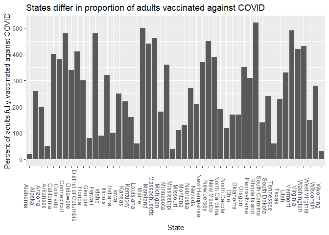

# Instructions! Read this first.

The exam is open note, open course website, open class-related code repositories 
(mine and those you produced in class). However, you may not get external help (
from other students, directed internet searches, etc.).  Please update the statement
below to acknowledge these instructions (and that you can use git).

I, INSERT YOUR NAME HERE, promise to not seek external help on the exam. I 
understand any academic issues will result in a D or F on the exam or in the class
and be reported to the Dean of Students.

Good luck!

COVID-19 vaccines are a key part of the country's response to the pandemic, but 
they only work if people take them.  Real data from:  
* https://covid.cdc.gov/covid-data-tracker/#vaccinations_vacc-people-onedose-pop-5yr
* https://www2.census.gov/geo/pdfs/maps-data/maps/reference/us_regdiv.pdf
* https://www.census.gov/library/stories/2021/04/how-do-covid-19-vaccination-and-vaccine-hesitancy-rates-vary-over-time.html

Note some questions are based on pretend surveys, etc, for teaching purposes.

# #1

1. The first national survey of vaccine hesitancy carried out in January 2021 
(https://www.census.gov/library/stories/2021/04/how-do-covid-19-vaccination-and-vaccine-hesitancy-rates-vary-over-time.html)
by the US Census Bureau showed 21.6% of the population was hesitant about getting 
the vaccine.  A random sample of 2500 people in March 2022 shows that 548 are still hesitant
about the vaccine. Is there evidence that vaccine hesitancy has changed 
over time?

Investigate the question. Make sure you include

* null hypothesis
  * *H~0~: vaccine hesitancy rate has not changed over time/ proportion hesitant
  about vaccines is .216*
* alternative hypothesis
  * *H~A~: vaccine hesitancy rate has  changed over time/ proportion hesitant
  about vaccines is not .216*
* explanation for test you will use 
  * *I will use a binomial test to compare the calculated success rate to a 
  a given value.*
* results from statistical test

```r
binom.test(548,2500, .216)
```

```
## 
## 	Exact binomial test
## 
## data:  548 and 2500
## number of successes = 548, number of trials = 2500, p-value = 0.6974
## alternative hypothesis: true probability of success is not equal to 0.216
## 95 percent confidence interval:
##  0.2031194 0.2359410
## sample estimates:
## probability of success 
##                 0.2192
```

* clear explanation of how results relate to your stated hypotheses
  * *I found a p-value of .6974, so I **fail** to reject the null hypothesis.*


# #2


2.  What is the confidence interval for proportion of people who are vaccine
hesitant? Calculate it and state what a confidence interval means.


```r
library(binom)
binom.confint(548,2500)
```

```
##           method   x    n      mean     lower     upper
## 1  agresti-coull 548 2500 0.2192000 0.2034149 0.2358467
## 2     asymptotic 548 2500 0.2192000 0.2029831 0.2354169
## 3          bayes 548 2500 0.2193123 0.2031669 0.2355836
## 4        cloglog 548 2500 0.2192000 0.2031957 0.2356135
## 5          exact 548 2500 0.2192000 0.2031194 0.2359410
## 6          logit 548 2500 0.2192000 0.2034149 0.2358474
## 7         probit 548 2500 0.2192000 0.2033310 0.2357583
## 8        profile 548 2500 0.2192000 0.2032756 0.2356995
## 9            lrt 548 2500 0.2192000 0.2032778 0.2357173
## 10     prop.test 548 2500 0.2192000 0.2032262 0.2360460
## 11        wilson 548 2500 0.2192000 0.2034206 0.2358410
```
*The 95% confidence interval is .203-.235 using the Agresti-Coull method. A 
95% confidence interval means if we sampled the population many times and 
constructed confidence intervals for each sample, 95% of the time the interval 
would contain the true population parameter.*

# #3

3. Note the signal in the data was 0.2192. This is  not equal to .216. Explain
why this simple fact is or isn't enough to use for a comparision. Make sure you
use the term sampling error.

* *Since we are sampling the population to produce a statistic (a proportion in 
this case), we know that every time we sample we are likely to find a different
outcome due to sampling error.  Although large sample sizes help this, they do 
not remove it. Given this we need to compare the signal we found in our data to
the distribution of signals we would expect from similarly-sized samples
if the null was true.*

# making data for # 4 


```r
regions <- read.csv("https://docs.google.com/spreadsheets/d/e/2PACX-1vSHjDv2eSCOtuux9E6JIoEx2F4cOyU6jX6mXUr_FQDtTjpQxroh-IP_3D1z_qcSDr-9lQRQG_CRMZXY/pub?gid=0&single=true&output=csv",
                    stringsAsFactors = T)
rates <- read.csv("https://docs.google.com/spreadsheets/d/e/2PACX-1vT6WmtWdZSUo--2i2nMCWUIMx6BjdJJHKH42oJBzdIZFlAxLH1XztcMI8na-4QKU8ySMHf2-41JwR1y/pub?gid=418071752&single=true&output=csv",
                   stringsAsFactors =T)
```
merge


```r
names(rates)[names(rates) == "State.Territory.Federal.Entity"] = "State"
covid_proportion <- merge(rates, regions, all.x = F, all.y = T)
covid_proportion <- covid_proportion[,c("State", "Percent.of.18..Pop.Fully.Vaccinated.by.State.of.Residence")]
#change to per 100k to remove proportion and help students
covid_proportion <- na.omit(covid_proportion)
covid_proportion$Percent.of.18..Pop.Fully.Vaccinated.by.State.of.Residence <-
  as.numeric(covid_proportion$Percent.of.18..Pop.Fully.Vaccinated.by.State.of.Residence)
covid_proportion$Adults_vaccinated_per_1000 <- covid_proportion$Percent.of.18..Pop.Fully.Vaccinated.by.State.of.Residence*10
write.csv(covid_proportion[,c(1,3)], "covid_proportion.csv", row.names = F)
```

# #4


4. Nationally 443 adults per 1000 are vaccinated against the flu. Data on the 
number
of adults per 1000 vaccinated against COVID (as of 3/2022) in each state is available @


```r
covid <- read.csv("https://docs.google.com/spreadsheets/d/e/2PACX-1vQvZOcUlQy3dV3tqS65mwA2gUAI7a-bPW_AIdZX2I0vWWIjVwasoJ9QjtfR53MkxmSoyae3UVL9IFHS/pub?gid=1461643787&single=true&output=csv",
                             stringsAsFactors = T)
```

in the **Adults_vaccinated_per_1000** column.  Is
there evidence the number of adults vaccinated against COVID differs from that 
of those vaccinated against flu?

Investigate the question. Make sure you include

* null hypothesis
  * *H~0~: the number of people per 1000 vaccinated against COVID does not differ from
  the number that are vaccinated against flu (443)*
* alternative hypothesis
  * *H~0~: the number of people per 1000 vaccinated against COVID does differ from
  the number that are vaccinated against flu (443).*  
* explanation for test you will use 
  * *I will use a t-test since we are given multiple samples to compare to a given 
  value. I assume normality given the large sample size.*
* results from statistical test

```r
t.test(covid$Adults_vaccinated_per_1000, mu = 443)
```

```
## 
## 	One Sample t-test
## 
## data:  covid$Adults_vaccinated_per_1000
## t = -8.6527, df = 49, p-value = 1.953e-11
## alternative hypothesis: true mean is not equal to 443
## 95 percent confidence interval:
##  220.9488 304.6512
## sample estimates:
## mean of x 
##     262.8
```
* clear explanation of how results relate to your stated hypotheses
  * *A t-test returned t~49~= -8.6527, p <.001, so  reject the null hypothesis.*


# #5


5. Graph the data used in question 3 in a way that shows variability in the 
number of adults vaccinated for COVID among states (several options here!)

* Using histograms (like the quiz)

```r
library(ggplot2)
ggplot(covid, aes(x=Adults_vaccinated_per_1000)) +
  geom_histogram()+
  xlab("Number adults per 1000 fully vaccinated against COVID")+
  ggtitle("States differ in proportion of adults vaccinated against COVID")
```

```
## `stat_bin()` using `bins = 30`. Pick better value with `binwidth`.
```

<!-- -->

  * Using boxplots.  Another example (not something you've seen...)


```r
ggplot(covid, aes(y=Adults_vaccinated_per_1000)) +
  geom_boxplot(width = 1)+
  xlim(-1.5,1.5)+ ylim(0,100)+
  ylab("Number of adults per 1000 fully vaccinated against COVID")+
  ggtitle("States differ in proportion of adults vaccinated against COVID")+
  theme(axis.title.x=element_blank(),
        axis.text.x=element_blank(),
        axis.ticks.x=element_blank())
```

```
## Warning: Removed 41 rows containing non-finite values (stat_boxplot).
```

<!-- -->

  * using confidence intervals


```r
library(Rmisc)
```

```
## Loading required package: lattice
```

```
## Loading required package: plyr
```

```r
proportion_summary <- summarySE(covid, 
                                measurevar = "Adults_vaccinated_per_1000", na.rm = T)
ggplot(proportion_summary, aes( y=Adults_vaccinated_per_1000))+
  geom_col(aes(x=1)) +
  ylim(0,1000)+
  xlim(0,2)+
  ylab("Percent of adults fully vaccinated against COVID")+
  ggtitle("States differ in proportion of adults vaccinated against COVID")+
  geom_errorbar(aes(ymin=Adults_vaccinated_per_1000-ci, ymax=Adults_vaccinated_per_1000+ci, x = 1), color =
                  "orange")+
  theme(axis.title.x=element_blank(),
        axis.text.x=element_blank(),
        axis.ticks.x=element_blank())
```

<!-- -->

* using bar charts


```r
ggplot(covid, aes(y=Adults_vaccinated_per_1000,
                             x=State)) +
  geom_col()+
  ylab("Percent of adults fully vaccinated against COVID")+
  ggtitle("States differ in proportion of adults vaccinated against COVID")+
  theme(axis.text.x=element_text(angle = -90))
```

<!-- -->

or

```r
ggplot(covid, aes(x=Adults_vaccinated_per_1000,
                             y=State)) +
  geom_col()+
  xlab("Percent of adults fully vaccinated against COVID")+
  ggtitle("States differ in proportion of adults vaccinated against COVID")
```

<!-- -->


or with code from lecture


```r
label_size <- 2
title_size <- 2.5
par(las=2)
barplot(covid$Adults_vaccinated_per_1000,
        names.arg = covid$State,
        cex.lab=label_size, cex.axis=label_size, 
     cex.main=title_size, cex.sub=label_size, col = "blue", main = "States differ in proportion of adults vaccinated against COVID")
```

<!-- -->


```r
plot(covid$State, covid$Adults_vaccinated_per_1000, type="l", 
      ylab="Number of adults per 1000 fully vaccinated against COVID",
  main="States differ in proportion of adults vaccinated against COVID",
       xlab = "State")     
```

<!-- -->

# #6


6. A new booster is developed to aid against future strains. In testing, 25 
individuals who get the new booster develop COVID out of a sample of 1000. This 
is compared to a group who received the current boosters, where 42 individuals out 
of 1000 developed COVID.  Is there evidence the boosters differ in effectiveness?
Investigate the question. Make sure you include

* null hypothesis
  * *H~0~: the proportion of people developing COVID is the same for both boosters*
* alternative hypothesis
  * *H~A~: the proportion of people developing COVID is not the same for both boosters*
* explanation for test you will use 
  * *I will attempt to use a $\chi^2$ test to compare proportions for the 2 
  groups.*
* results from statistical test

```r
#note ether way works
chisq.test(matrix(c(25,1000-25, 42, 1000-42), 2, 2, byrow = T))
```

```
## 
## 	Pearson's Chi-squared test with Yates' continuity correction
## 
## data:  matrix(c(25, 1000 - 25, 42, 1000 - 42), 2, 2, byrow = T)
## X-squared = 3.9533, df = 1, p-value = 0.04678
```

```r
chisq.test(matrix(c(25,42,1000-25,  1000-42), 2, 2, byrow = T))
```

```
## 
## 	Pearson's Chi-squared test with Yates' continuity correction
## 
## data:  matrix(c(25, 42, 1000 - 25, 1000 - 42), 2, 2, byrow = T)
## X-squared = 3.9533, df = 1, p-value = 0.04678
```
* clear explanation of how results relate to your stated hypotheses
  * *The test returned $\chi^2~1~ = 3.95, p = .047, so I reject the null 
  hypothesis.*


# #7


7. Explain what the p-value you provided in question 6 means (what is a p-value)?
Given what you found, what would you recommend regarding the booster and/or future work?
* *A p-value is the probability you would see the signal you saw or something
more extreme if the null hypothesis was true and you repeated the test many times.
Given this value, I would note individuals should take the new booster since it 
is different and appears to be better at preventing infection.*


