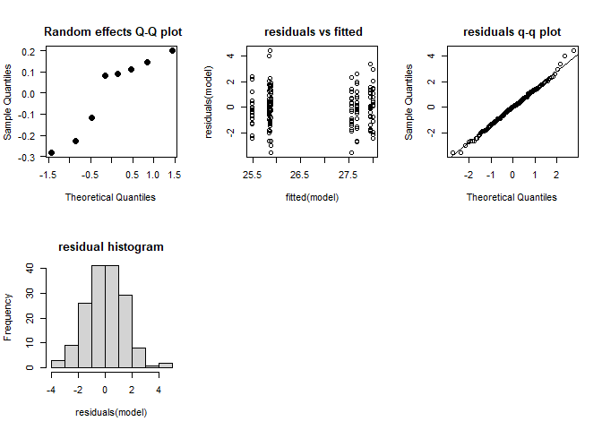
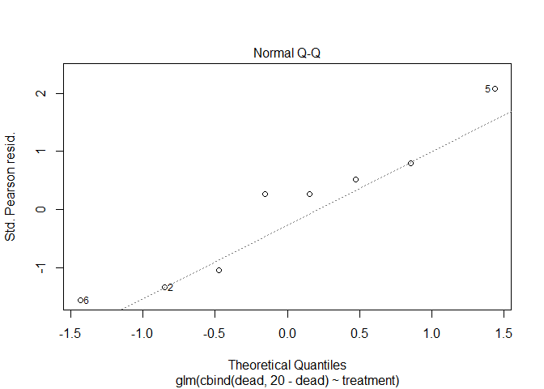
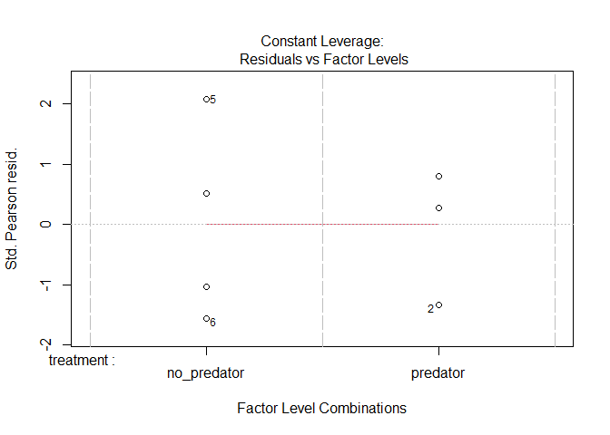
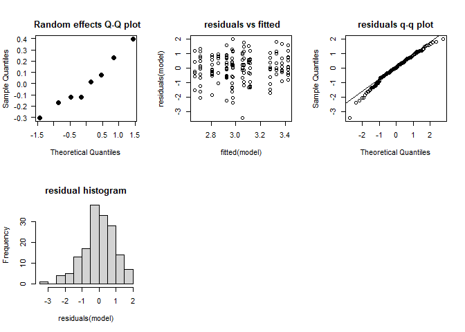
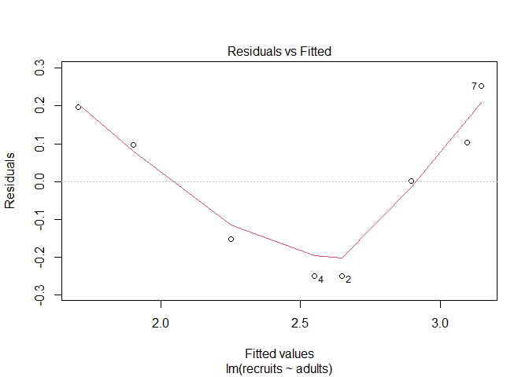
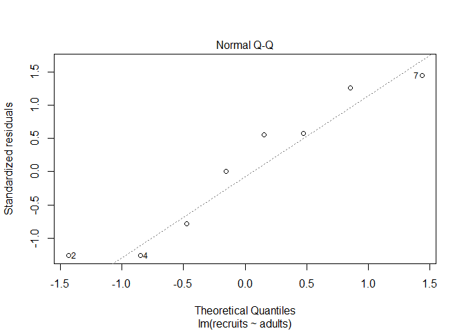
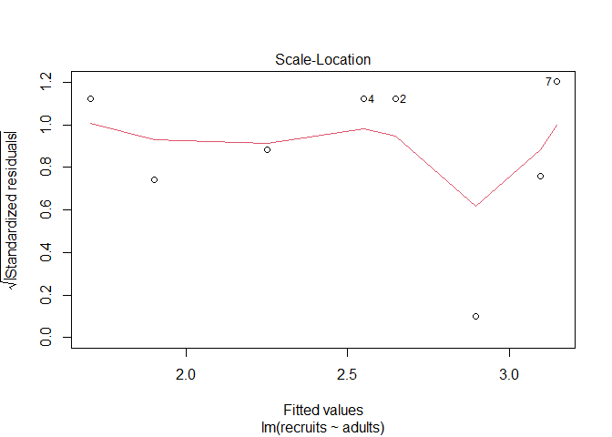
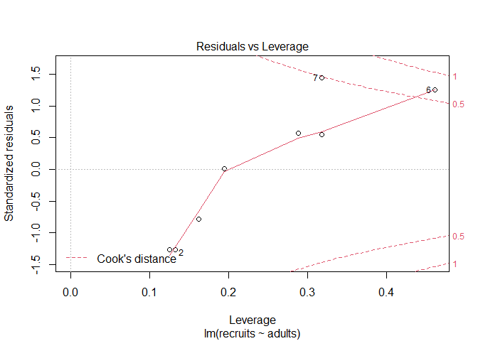

# Instructions! Read this first.

The exam is open note, open course website, open class-related code repositories 
(mine and those you produced in class). However, you may not get external help (
from other students, directed internet searches, etc.).  Please update the statement
below to acknowledge these instructions (and that you can use git).

I, INSERT YOUR NAME HERE, promise to not seek external help on the exam. I 
understand any academic issues will result in a D or F on the exam or in the class
and be reported to the Dean of Students.

The exam is due by 12 PM on Monday, 5/16/2022.

As often happens, your excellent statistical advice (provided via the 78001 exam) 
has led to more calls for help (or just being given the data to anlayze). 
The below questions build on the earlier exam.

# Fear effects

Following your advice, your colleague asked you to help analye the data. 
As a reminder:

Prey (tadpoles) were housed in tanks (20 per tank).  Prey in each tank were 
exposed to one of two treatments. Predator treatment tanks also housed a 
dragonfly naiad (a major predator of tadpoles)  in a small cylinder with mesh 
(so water was shared but the predator could not consume the tadpoles).  No 
predator treatment tanks housed an empty cylinder. The colleague measured the 
**length of each tadpole** and the **number of dead tadpoles** in each tank.   

## 1.  

Your colleagues tadpole length data is found below.  Help them analyze the data.

### Data creation for example


```r
fear <- data.frame(treatment = c(rep("predator", 80), rep("no_predator",80)),
                   container = rep(letters[1:8],each=20))
fear$length <- c(rnorm(80,2,1),rnorm(80,0,1))+25 +
 c(rnorm(20,runif(1), 1),rnorm(20,runif(1), 1),
   rnorm(20,runif(1), 1),rnorm(20,runif(1), 1),
   rnorm(20,runif(1), 1),rnorm(20,runif(1), 1),
    rnorm(20,runif(1), 1),rnorm(20,runif(1), 1))
write.csv(fear, "fear_final.csv", row.names = F)
```


```r
fear <- read.csv("https://docs.google.com/spreadsheets/d/e/2PACX-1vSybsT7VO2rv24Rhi_WD5MBB3ww5RKXnqM2BveSP848vnldhPeFigBWPjxcY_WpvB1f1cd1PKQe1v3v/pub?gid=1960907558&single=true&output=csv",
                 stringsAsFactors = T)
```

Make sure you include

* null hypothesis
  * *H~0~: Treatment did not impact tadpole length*
* alternative hypothesis
  * *H~A~: Treatment did impact tadpole length*
* explanation for test you will use 
  * *I will use a linear mixed-effects model. The response (length) is continuous,
  the explanatory variable (treatment) is categorical, and I need to add a random
  effect to account for the fact tadpoles within each tank are not fully 
  independent.*
* results from statistical test


```r
library(lme4)
```

```
## Loading required package: Matrix
```

```r
fear_lmer <- lmer(length~treatment + (1|container), fear)
check_mixed_model <- function (model, model_name = NULL) {
  #collection of things you might check for mixed model
  par(mfrow = c(2,3))
  #not sure what this does with mutliple random effects, so stop with 1 for now
  if(length(names(ranef(model))<2)){
    qqnorm(ranef(model, drop = T)[[1]], pch = 19, las = 1, cex = 1.4, main= paste(model_name, 
                                                                                  "\n Random effects Q-Q plot"))
  }
  plot(fitted(model),residuals(model), main = paste(model_name, 
                                                    "\n residuals vs fitted"))
  qqnorm(residuals(model), main =paste(model_name, 
                                       "\nresiduals q-q plot"))
  qqline(residuals(model))
  hist(residuals(model), main = paste(model_name, 
                                      "\nresidual histogram"))
}
check_mixed_model(fear_lmer)
summary(fear_lmer)
```

```
## Linear mixed model fit by REML ['lmerMod']
## Formula: length ~ treatment + (1 | container)
##    Data: fear
## 
## REML criterion at convergence: 577.3
## 
## Scaled residuals: 
##      Min       1Q   Median       3Q      Max 
## -2.48507 -0.63990  0.02658  0.66612  3.07443 
## 
## Random effects:
##  Groups    Name        Variance Std.Dev.
##  container (Intercept) 0.08655  0.2942  
##  Residual              2.09104  1.4460  
## Number of obs: 160, groups:  container, 8
## 
## Fixed effects:
##                   Estimate Std. Error t value
## (Intercept)        25.7692     0.2186 117.897
## treatmentpredator   2.0236     0.3091   6.546
## 
## Correlation of Fixed Effects:
##             (Intr)
## trtmntprdtr -0.707
```

```r
library(car)
```

```
## Loading required package: carData
```

```r
Anova(fear_lmer, type = "III")
```

```
## Analysis of Deviance Table (Type III Wald chisquare tests)
## 
## Response: length
##                 Chisq Df Pr(>Chisq)    
## (Intercept) 13899.645  1  < 2.2e-16 ***
## treatment      42.855  1  5.895e-11 ***
## ---
## Signif. codes:  0 '***' 0.001 '**' 0.01 '*' 0.05 '.' 0.1 ' ' 1
```

<!-- -->

* clear explanation of how results relate to your stated hypotheses

Assumptions appear to be met. We  note a significant impact of treatment using 
likelihood ($\chi^2$)-based tests
($\chi^2_1$ = 42.86, p < 0.01). Analysis indicates tadpoles actually grew more 
in the predator treatment.

## 2. 

Create a properly-labelled plot of the data. There are many options here, but
make sure you show trends and patterns that match your analysis.


```r
library(Rmisc)
```

```
## Loading required package: lattice
```

```
## Loading required package: plyr
```

```r
fear_graph <- summarySE(fear, measurevar = "length", groupvars = "treatment")
levels(fear_graph$treatment) = c("Control" , "Predator")

library(ggplot2)
ggplot(fear_graph, 
                                     aes_string(x="treatment", 
                                                y = "length", color = "treatment",
                                                shape = "treatment")) +
  geom_point(size = 2) + 
  geom_errorbar(aes(ymin = length - ci, 
                    ymax = length + ci), size = 1,
                width = .75)+
  xlab("Treatment")+
  ylab("length (mm)")+
  theme(axis.title.x = element_text(face="bold", size=15), 
        axis.title.y = element_text(face="bold", size=15), 
        axis.text.y  = element_text(size=10),
        axis.text.x  = element_text(size=10), 
        legend.text =element_text(size=10),
        legend.title = element_text(size=10, face="bold"),
        plot.title = element_text(hjust = 0.5, face="bold", size=20))+
  ylim(c(0,30))+
  guides(shape="none", color= "none")+
  ggtitle("Tadpoles grow more in presence of predator")
```

<!-- -->


## 3. 

Your colleague provided you the data on tadpole mortality too.  

### Data creation


```r
fear_mortality <- data.frame(treatment = c(rep("predator", 4), rep("no_predator",4)),
                   container = letters[1:8], 
                   dead = c(rbinom(4, 20, .7), rbinom(4, 20, .5)))
write.csv(fear_mortality, "fear_mortality.csv", row.names = F)
```


```r
fear_mortality <- read.csv("https://docs.google.com/spreadsheets/d/e/2PACX-1vQHLgiC6o2ezJPbEEcaU4Cb7Mz7F1-NMc8t5gMyEIMbLiPSDzslclIgRD51GefIBEl9gH7Fpylfbws5/pub?gid=2111555168&single=true&output=csv", stringsAsFactors = T)
```

Help them analyze the data. Make sure you include

* null hypothesis
  * *H~0~: Treatment did not impact tadpole mortality*
* alternative hypothesis
  * *H~A~: Treatment did impact tadpole mortality*
* explanation for test you will use 
  * *I will use a generalized linear model. The response (mortality 
  per tank) consists of success and failures, so I will use a model utilizing a b
  binomial response.  The explanatory variable (treatment) is categorical. I do 
  not need to add a random
  effect since the data is taken at tank-level*
* results from statistical test


```r
fear_mortality
```

```
##     treatment container dead
## 1    predator         a   13
## 2    predator         b   10
## 3    predator         c   14
## 4    predator         d   13
## 5 no_predator         e   13
## 6 no_predator         f    6
## 7 no_predator         g   10
## 8 no_predator         h    7
```

```r
mortality_glm <- glm(cbind(dead, 20-dead)~treatment, fear_mortality, 
                     family = "binomial")
plot(mortality_glm)
```

<!-- --><!-- --><!-- --><!-- -->

```r
summary(mortality_glm)
```

```
## 
## Call:
## glm(formula = cbind(dead, 20 - dead) ~ treatment, family = "binomial", 
##     data = fear_mortality)
## 
## Deviance Residuals: 
##     Min       1Q   Median       3Q      Max  
## -1.3737  -0.9653   0.2320   0.5122   1.7981  
## 
## Coefficients:
##                   Estimate Std. Error z value Pr(>|z|)  
## (Intercept)        -0.2007     0.2247  -0.893   0.3719  
## treatmentpredator   0.7115     0.3222   2.208   0.0272 *
## ---
## Signif. codes:  0 '***' 0.001 '**' 0.01 '*' 0.05 '.' 0.1 ' ' 1
## 
## (Dispersion parameter for binomial family taken to be 1)
## 
##     Null deviance: 12.9939  on 7  degrees of freedom
## Residual deviance:  8.0399  on 6  degrees of freedom
## AIC: 39.118
## 
## Number of Fisher Scoring iterations: 3
```

```r
Anova(mortality_glm, type= "III")
```

```
## Analysis of Deviance Table (Type III tests)
## 
## Response: cbind(dead, 20 - dead)
##           LR Chisq Df Pr(>Chisq)  
## treatment   4.9539  1    0.02603 *
## ---
## Signif. codes:  0 '***' 0.001 '**' 0.01 '*' 0.05 '.' 0.1 ' ' 1
```

* clear explanation of how results relate to your stated hypotheses
  * *The model appears to fit the data appropriately (residual deviance divided
  by df is ~ 1).  Results indicate a significant impact of treatment on mortality
  ($\chi^2_1$ = 4.95, p = 02).  Results indicate that tadpoles are more likely 
  to die in predator treatments.

## 4. 

You are also given data from the followup study where length and width were 
analyzed in response to fear. The setup was the same (4 tanks for each treatment,
20 tadpoles per tank), but this time they recorded length and width of each 
tadpole. However, **they realized at the end of their work they were dealing with
a cryptic species!**, meaning half the tadpoles belong to species A and half to 
species B. They are not sure if this matters.

Data is shared below.  Help them analyze it.

### Data creation


```r
fear_lw <- data.frame(treatment = c(rep("predator", 80), rep("no_predator",80)),
                   container = rep(letters[1:8],each=20))
fear_lw$length <- c(rnorm(80,2,1),rnorm(80,0,1))+25 +
 c(rnorm(20,runif(1), 1),rnorm(20,runif(1), 1),
   rnorm(20,runif(1), 1),rnorm(20,runif(1), 1),
   rnorm(20,runif(1), 1),rnorm(20,runif(1), 1),
    rnorm(20,runif(1), 1),rnorm(20,runif(1), 1))
fear_lw$width <- fear_lw$length*.1 +
 c(rnorm(20,runif(1), 1),rnorm(20,runif(1), 1),
   rnorm(20,runif(1), 1),rnorm(20,runif(1), 1),
   rnorm(20,runif(1), 1),rnorm(20,runif(1), 1),
    rnorm(20,runif(1), 1),rnorm(20,runif(1), 1))
fear_lw$species <- factor(sample(c("A", "B"), nrow(fear_lw), prob = c(0.5, 0.5), replace = TRUE))
write.csv(fear_lw, "fear_length_width.csv", row.names = F)
```


```r
fear_lw <- read.csv("https://docs.google.com/spreadsheets/d/e/2PACX-1vSataGluosvnurZ4qOn_UTyHod85nbPTC-V9g5FkMZjKO6CEeRCn6CTAClrMf3Suxo_3kM8k-N2AQVD/pub?gid=1237391888&single=true&output=csv",
                    stringsAsFactors = T)
```

*Several options exist here (as is not uncommon for multivariate analysis). 

### Use a manova

* null hypothesis
  * *H~0~: There is no impact of treatment on mean outcome*
  * *H~0~: There is no impact of species on mean outcome*
  * *H~0~: There is no interaction between species and treatment on mean outcome*
* alternative hypothesis
  * *H~A~: There is an impact of treatment on mean outcome*
  * *H~A~: There is an impact of species on mean outcome*
  * *H~A~: There is an interaction between species and treatment on mean outcome*
* explanation for test you will use 
  * *I will use a MANOVA to consider if the means for each variable are impacted 
  by treatment and species while noting potential (and likely) correlation among 
  these  outcomes. Note*
  

```r
cor.test(fear_lw$length, fear_lw$width)
```

```
## 
## 	Pearson's product-moment correlation
## 
## data:  fear_lw$length and fear_lw$width
## t = 1.6676, df = 158, p-value = 0.09738
## alternative hypothesis: true correlation is not equal to 0
## 95 percent confidence interval:
##  -0.02413708  0.28094019
## sample estimates:
##       cor 
## 0.1315142
```
  
  *This suggests the outcomes are related. Note for a MANOVA we could not include
  random effects as presented in class, so I added as a blocking factor* 
  

```r
  fear_manova <- manova(cbind(length, width)~species*treatment+container, fear_lw)
summary(fear_manova)
```

```
##                    Df  Pillai approx F num Df den Df  Pr(>F)    
## species             1 0.00580    0.434      2    149 0.64852    
## treatment           1 0.41314   52.447      2    149 < 2e-16 ***
## container           6 0.14387    1.938     12    300 0.02978 *  
## species:treatment   1 0.00350    0.261      2    149 0.77038    
## Residuals         150                                           
## ---
## Signif. codes:  0 '***' 0.001 '**' 0.01 '*' 0.05 '.' 0.1 ' ' 1
```
  
No interaction, so drop


```r
  fear_manova <- manova(cbind(length, width)~species+treatment+container, fear_lw)
summary(fear_manova)
```

```
##            Df  Pillai approx F num Df den Df  Pr(>F)    
## species     1 0.00580    0.437      2    150 0.64668    
## treatment   1 0.41314   52.799      2    150 < 2e-16 ***
## container   6 0.14355    1.946     12    302 0.02893 *  
## Residuals 151                                           
## ---
## Signif. codes:  0 '***' 0.001 '**' 0.01 '*' 0.05 '.' 0.1 ' ' 1
```

```r
summary.aov(fear_manova)
```

```
##  Response length :
##              Df Sum Sq Mean Sq F value Pr(>F)    
## species       1   1.87   1.871  0.8797 0.3498    
## treatment     1 208.93 208.927 98.2256 <2e-16 ***
## container     6   7.30   1.217  0.5722 0.7520    
## Residuals   151 321.18   2.127                   
## ---
## Signif. codes:  0 '***' 0.001 '**' 0.01 '*' 0.05 '.' 0.1 ' ' 1
## 
##  Response width :
##              Df  Sum Sq Mean Sq F value  Pr(>F)   
## species       1   0.033 0.03254  0.0374 0.84696   
## treatment     1   0.210 0.21020  0.2414 0.62388   
## container     6  16.108 2.68460  3.0837 0.00708 **
## Residuals   151 131.457 0.87057                   
## ---
## Signif. codes:  0 '***' 0.001 '**' 0.01 '*' 0.05 '.' 0.1 ' ' 1
```

* results from statistical test
  * *Results indicate treatment impacts length but not width (this is likely due to 
the noise from each container (look at data creation)).  

### Using mixed models 

Another option is to code the outcome (length/width) into a mixed model framework
using dummy variables (not shown in class) or ignore relationships and do mixed 
model for each that includes species, eg


```r
fear_lmer_l <- lmer(length~treatment*species + (1|container), fear_lw)
```

```
## boundary (singular) fit: see help('isSingular')
```

```r
check_mixed_model(fear_lmer_l)
Anova(fear_lmer_l, type = "III")
```

```
## Analysis of Deviance Table (Type III Wald chisquare tests)
## 
## Response: length
##                        Chisq Df Pr(>Chisq)    
## (Intercept)       13158.7017  1  < 2.2e-16 ***
## treatment            49.0898  1  2.445e-12 ***
## species               0.0203  1     0.8866    
## treatment:species     0.0135  1     0.9075    
## ---
## Signif. codes:  0 '***' 0.001 '**' 0.01 '*' 0.05 '.' 0.1 ' ' 1
```

```r
fear_lmer_l <- lmer(length~treatment+species + (1|container), fear_lw)
```

```
## boundary (singular) fit: see help('isSingular')
```

```r
check_mixed_model(fear_lmer_l)
```

<!-- -->

```r
Anova(fear_lmer_l, type = "III")
```

```
## Analysis of Deviance Table (Type III Wald chisquare tests)
## 
## Response: length
##                  Chisq Df Pr(>Chisq)    
## (Intercept) 17216.5815  1     <2e-16 ***
## treatment      99.8582  1     <2e-16 ***
## species         0.1019  1     0.7496    
## ---
## Signif. codes:  0 '***' 0.001 '**' 0.01 '*' 0.05 '.' 0.1 ' ' 1
```

<!-- -->


```r
fear_lmer_w <- lmer(width~treatment*species + (1|container), fear_lw)
check_mixed_model(fear_lmer_l)
Anova(fear_lmer_l,type = "III")
```

```
## Analysis of Deviance Table (Type III Wald chisquare tests)
## 
## Response: length
##                  Chisq Df Pr(>Chisq)    
## (Intercept) 17216.5815  1     <2e-16 ***
## treatment      99.8582  1     <2e-16 ***
## species         0.1019  1     0.7496    
## ---
## Signif. codes:  0 '***' 0.001 '**' 0.01 '*' 0.05 '.' 0.1 ' ' 1
```

```r
fear_lmer_l <- lmer(width~treatment+species + (1|container), fear_lw)
check_mixed_model(fear_lmer_l)
```

<!-- -->

```r
Anova(fear_lmer_l, type = "III")
```

```
## Analysis of Deviance Table (Type III Wald chisquare tests)
## 
## Response: width
##                Chisq Df Pr(>Chisq)    
## (Intercept) 241.8374  1     <2e-16 ***
## treatment     0.0803  1     0.7768    
## species       0.1027  1     0.7486    
## ---
## Signif. codes:  0 '***' 0.001 '**' 0.01 '*' 0.05 '.' 0.1 ' ' 1
```

<!-- -->


# Recruits

## 5.

The data on recruits is found below. As a reminder: 

The paper focused on predicting the number of new deer (fawns, density per km^2) produced at a 
nature reserve each season.  Potential covariates include adult abundance the 
previous season (density per km^2), rain the previous year (inches), and 
winter harshness (
ranked 1-5, least to most severe) were monitored over 8 years. 


```r
recruits <- read.csv("https://docs.google.com/spreadsheets/d/e/2PACX-1vT4tICnyqUNSfWo4P3cMQ2DWxqe602IzdodBu5xoPKq43x5-u6vGpSDB_eXTvjFbHKQWwHHK9tkiJdL/pub?gid=1345393421&single=true&output=csv",
                     stringsAsFactors = T)
```

Analyze the data. Make sure you include

* null hypothesis
* alternative hypothesis
* explanation for test you will use 
* results from statistical test
* clear explanation of how results relate to your stated hypotheses

A few options exist here. If we consider this as a chance for multiple regression,
we want to identify best subset of variables for explaining recruits. We can do this
using bottom up/top-down/nested/other approaches. A few are shown below.

### Dredge using AIC


```r
library(MuMIn)
recruits_lm <- lm(recruits ~., recruits)
options(na.action = "na.fail")
write.csv(dredge(recruits_lm), "dredge_output.csv", row.names = F)
```

```
## Fixed term is "(Intercept)"
```

Results indicate adult alone best explains recruits. WE can check this model


```r
adults_only <- lm(recruits ~ adults, recruits)
plot(adults_only)
```

<!-- --><!-- --><!-- --><!-- -->

```r
summary(adults_only)
```

```
## 
## Call:
## lm(formula = recruits ~ adults, data = recruits)
## 
## Residuals:
##      Min       1Q   Median       3Q      Max 
## -0.24988 -0.17586  0.04938  0.12611  0.25309 
## 
## Coefficients:
##             Estimate Std. Error t value Pr(>|t|)    
## (Intercept) -1.67914    0.63422  -2.648 0.038152 *  
## adults       0.49753    0.07453   6.676 0.000547 ***
## ---
## Signif. codes:  0 '***' 0.001 '**' 0.01 '*' 0.05 '.' 0.1 ' ' 1
## 
## Residual standard error: 0.2121 on 6 degrees of freedom
## Multiple R-squared:  0.8813,	Adjusted R-squared:  0.8616 
## F-statistic: 44.56 on 1 and 6 DF,  p-value: 0.0005471
```

Obviously some fit issues with aassumptions, but given low sample size there are 
only so  many options here. Note scale of residuals are very small to compared to
outcomes.

